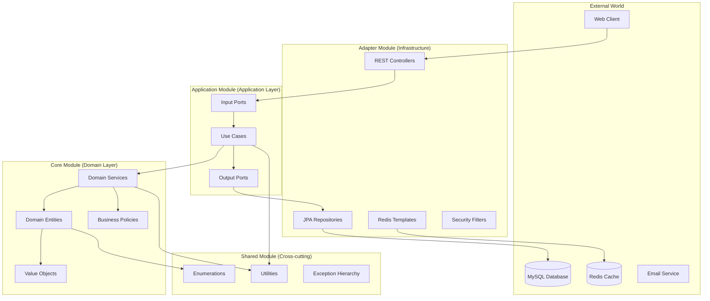
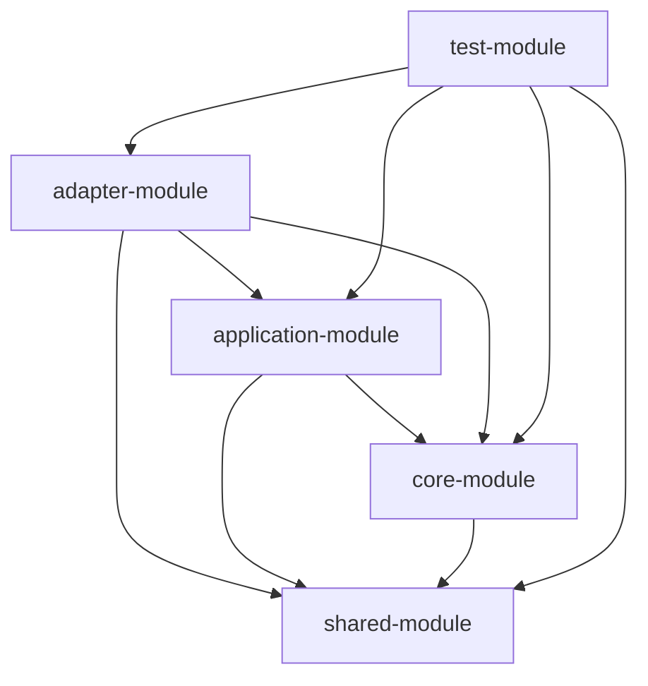
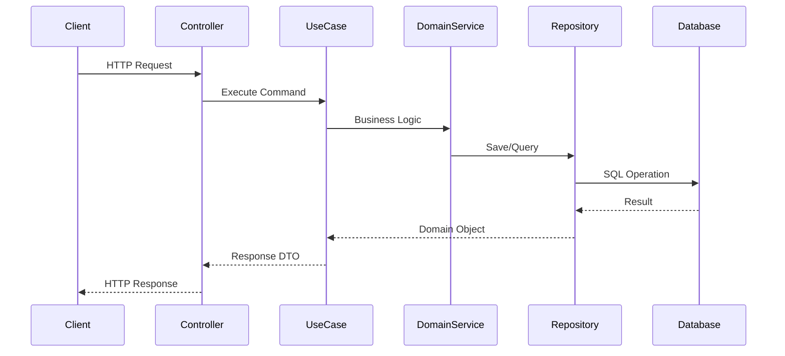

# 🏗️ Architecture Guide

**Project**: Prototype Reservation System  
**Architecture Pattern**: Hexagonal Architecture + Domain-Driven Design  
**Language**: Kotlin  
**Framework**: Spring Boot 3.4.5  

## Table of Contents

1. [Architecture Overview](#architecture-overview)
2. [Module Structure](#module-structure)
3. [Hexagonal Architecture Implementation](#hexagonal-architecture-implementation)
4. [Domain-Driven Design Patterns](#domain-driven-design-patterns)
5. [Dependency Management](#dependency-management)
6. [Data Flow](#data-flow)
7. [Design Patterns](#design-patterns)
8. [Best Practices](#best-practices)

---

## Architecture Overview

This project implements a **Hexagonal Architecture** (Ports and Adapters) combined with **Domain-Driven Design** principles to create a maintainable, testable, and flexible system.

### Core Principles
- **Domain-centric**: Business logic isolated in the core domain
- **Dependency Inversion**: Dependencies point inward toward the domain
- **Clean Boundaries**: Clear separation between layers
- **Testability**: Each layer can be tested independently
- **Technology Agnostic**: Core business logic independent of frameworks

### Architecture Diagram


---

## Module Structure

### 1. Core Module (Domain Layer)
**Purpose**: Contains pure business logic and domain models  
**Dependencies**: Only shared-module (no external frameworks)  

```
core-module/
├── authenticate/           # Authentication domain
│   ├── policy/            # Authentication policies  
│   └── vo/                # Value objects
├── user/                  # User domain
│   ├── self/              # User entity
│   ├── policy/            # User business rules
│   ├── shared/            # Shared user components
│   └── resign/            # User resignation logic
├── restaurant/            # Restaurant domain
│   ├── vo/                # Restaurant value objects
│   ├── service/           # Domain services
│   └── snapshot/          # Domain snapshots
└── company/               # Company domain
```

**Key Components**:
- **Domain Entities**: Rich objects with behavior (`User`, `Restaurant`)
- **Value Objects**: Immutable objects for data validation
- **Domain Services**: Complex business logic spanning multiple entities
- **Policies**: Business rules and validation logic

### 2. Application Module (Application Layer)
**Purpose**: Orchestrates use cases and coordinates between domain and infrastructure  
**Dependencies**: core-module, shared-module  

```
application-module/
├── authenticate/          # Authentication use cases
├── user/                 # User management use cases
├── restaurant/           # Restaurant management use cases
├── category/             # Category management use cases
└── company/              # Company management use cases
```

**Key Components**:
- **Use Cases**: Application services implementing business workflows
- **Input Ports**: Interfaces for inbound operations
- **Output Ports**: Interfaces for outbound operations
- **Commands/Queries**: Data transfer objects

### 3. Adapter Module (Infrastructure Layer)
**Purpose**: Implements technical concerns and external integrations  
**Dependencies**: application-module, core-module, shared-module  

```
adapter-module/
├── config/               # Configuration classes
│   ├── security/         # Security configuration
│   ├── persistence/      # Database configuration
│   └── i18n/            # Internationalization
├── rest/                # REST API controllers
├── persistence/         # JPA repositories and entities
├── redis/               # Redis templates and configuration
└── infrastructure/      # External service integrations
```

**Key Components**:
- **Controllers**: REST API endpoints
- **Repository Adapters**: Database access implementations
- **Security Filters**: Authentication and authorization
- **Configuration**: Framework and infrastructure setup

### 4. Shared Module (Cross-cutting Concerns)
**Purpose**: Common utilities and cross-cutting concerns  
**Dependencies**: None (pure Kotlin/Java)  

```
shared-module/
├── enumeration/         # Business enumerations
├── exceptions/          # Exception hierarchy
└── utilities/           # Common utilities
    ├── encrypt/         # Encryption utilities
    ├── generator/       # ID and password generators
    └── provider/        # Token providers
```

### 5. Test Module (Testing Utilities)
**Purpose**: Common testing utilities and fixtures  
**Dependencies**: All modules (test scope)  

---

## Hexagonal Architecture Implementation

### Ports and Adapters Pattern

**Input Ports (Driving Adapters)**:
```kotlin
// Input Port Interface (Application Layer)
interface CreateGeneralUserUseCase {
    fun execute(command: CreateGeneralUserCommand): Boolean
}

// Adapter Implementation (Adapter Layer)
@RestController
class GeneralUserSignUpController(
    private val createGeneralUserUseCase: CreateGeneralUserUseCase
) {
    @PostMapping("/api/v1/user/general/sign-up")
    fun signUp(@Valid @RequestBody request: GeneralUserSignUpRequest): BooleanResponse =
        BooleanResponse.created(createGeneralUserUseCase.execute(request.toCommand()))
}
```

**Output Ports (Driven Adapters)**:
```kotlin
// Output Port Interface (Application Layer)
interface CreateGeneralUser {
    fun command(request: CreateGeneralUserInquiry): Boolean
}

// Adapter Implementation (Adapter Layer)
@Component
class CreateGeneralUserAdapter(
    private val userJpaRepository: UserJpaRepository
) : CreateGeneralUser {
    override fun command(request: CreateGeneralUserInquiry): Boolean {
        // Database implementation
    }
}
```

### Dependency Inversion
- **High-level modules** (Use Cases) don't depend on low-level modules (Adapters)
- Both depend on **abstractions** (Ports)
- Adapters implement port interfaces
- Spring dependency injection wires implementations

---

## Domain-Driven Design Patterns

### 1. Rich Domain Models
**Domain entities contain behavior, not just data**:

```kotlin
class User(
    private val id: String?,
    private val loginId: LoginId,
    private var password: Password,
    private var personalAttributes: PersonalAttributes,
    nickname: String
) : ServiceUser {
    
    // Business behavior in the domain
    fun changePassword(newPassword: Password) {
        // Business rule: Can't use same password
        if (password == newPassword) {
            throw UseSamePasswordAsBeforeException()
        }
        this.password = newPassword
    }
    
    fun resign(encryptedAttributes: EncryptedAttributes): ResignedUser {
        if (id == null) throw ResignWithoutIdException()
        return ResignedUser(id, loginId, encryptedAttributes, LocalDateTime.now())
    }
}
```

### 2. Value Objects
**Immutable objects that validate their own state**:

```kotlin
class LoginId(val loginId: String) {
    init {
        LoginIdValidationPolicy().validate(loginId)
    }
}

class Password(
    val encodedPassword: String,
    val oldEncodedPassword: String? = null,
    val changedDateTime: LocalDateTime? = null
) {
    // Value object behavior
    fun isExpired(): Boolean = 
        changedDateTime?.isBefore(LocalDateTime.now().minusDays(90)) ?: false
}
```

### 3. Domain Services
**Complex business logic that doesn't belong to a single entity**:

```kotlin
@Service
class CreateGeneralUserDomainService(
    private val passwordEncoder: PasswordEncoder
) {
    fun createGeneralUser(form: CreateGeneralUserForm): User {
        // Coordinate multiple domain objects
        val validatedForm = UserUnifiedValidationPolicy.validate(form)
        val encodedPassword = passwordEncoder.encode(form.password)
        
        return User(
            loginId = LoginId(validatedForm.loginId),
            password = Password(encodedPassword),
            personalAttributes = PersonalAttributes(form.email, form.mobile),
            nickname = validatedForm.nickname
        )
    }
}
```

### 4. Aggregates and Repositories
**Aggregate roots manage consistency boundaries**:

```kotlin
class Restaurant(
    private val id: String?,
    private val companyId: String,
    private val userId: String,
    private var introduce: RestaurantDescription,
    private var contact: RestaurantContact,
    private var address: RestaurantAddress
) {
    // Internal collections managed by aggregate
    private val routine = RestaurantRoutine()
    private val photos = RestaurantPhotoBook()
    private val tags = RestaurantTags()
    
    // Controlled access to internal state
    fun manipulateRoutine(block: (RestaurantRoutine) -> Unit) = routine.apply(block)
    fun manipulatePhoto(block: (RestaurantPhotoBook) -> Unit) = photos.apply(block)
    
    // Create snapshot for persistence
    fun snapshot(): RestaurantSnapshot = RestaurantSnapshot(...)
}
```

### 5. Domain Events (Future Enhancement)
**Capture domain events for eventual consistency**:

```kotlin
// Future implementation example
sealed class DomainEvent {
    abstract val occurredOn: LocalDateTime
}

data class UserRegistered(
    val userId: String,
    val email: String,
    override val occurredOn: LocalDateTime = LocalDateTime.now()
) : DomainEvent()
```

---

## Dependency Management

### Dependency Direction Rules


**Rules**:
1. **Core module**: No external dependencies (pure business logic)
2. **Application module**: Depends only on core and shared modules
3. **Adapter module**: Can depend on all other modules
4. **Shared module**: No dependencies (utilities only)
5. **Test module**: Can depend on all modules (test scope)

### Spring Boot Configuration
**Module-specific Spring configurations**:

```kotlin
// Application Module - Use Case Configuration
@UseCase // Custom annotation
class CreateGeneralUserService(
    private val createGeneralUserDomainService: CreateGeneralUserDomainService,
    private val createGeneralUser: CreateGeneralUser
) : CreateGeneralUserUseCase

// Adapter Module - Infrastructure Configuration
@Component
class CreateGeneralUserAdapter : CreateGeneralUser

@RestController  
class GeneralUserSignUpController
```

---

## Data Flow

### Request Processing Flow


### 1. Inbound Flow (HTTP → Domain)
1. **Controller** receives HTTP request
2. **Request DTO** validated and converted to Command
3. **Use Case** coordinates business operation
4. **Domain Service** applies business rules
5. **Domain Entity** encapsulates business logic
6. **Repository** persists changes

### 2. Outbound Flow (Domain → HTTP)
1. **Domain Entity** returns result
2. **Use Case** maps to response format
3. **Response DTO** returned to controller
4. **Controller** returns HTTP response

---

## Design Patterns

### 1. Strategy Pattern
**Policy-based validation**:
```kotlin
interface PasswordValidationPolicy {
    fun validate(password: String): Boolean
    val reason: String
}

class PasswordComplexityValidationPolicy : PasswordValidationPolicy {
    override fun validate(password: String): Boolean = 
        PASSWORD_COMPLEXITY_REG_EXP.matches(password)
}
```

### 2. Factory Pattern
**Service creation and configuration**:
```kotlin
@Configuration
class GeneralUserServiceFactory {
    @Bean
    fun createGeneralUserDomainService(): CreateGeneralUserDomainService = 
        CreateGeneralUserDomainService(passwordEncoder())
}
```

### 3. Builder Pattern (Future Enhancement)
**Complex object construction**:
```kotlin
// Future implementation example
class RestaurantBuilder {
    fun withBasicInfo(name: String, phone: String): RestaurantBuilder
    fun withLocation(address: RestaurantAddress): RestaurantBuilder
    fun withWorkingHours(routine: RestaurantRoutine): RestaurantBuilder
    fun build(): Restaurant
}
```

### 4. Specification Pattern (Future Enhancement)
**Complex business rules**:
```kotlin
// Future implementation example
interface Specification<T> {
    fun isSatisfiedBy(candidate: T): Boolean
}

class UserEligibilitySpecification : Specification<User> {
    override fun isSatisfiedBy(user: User): Boolean {
        return user.isActive() && user.isVerified()
    }
}
```

---

## Best Practices

### 1. Domain Modeling
- **Rich domain models** with behavior, not anemic data containers
- **Value objects** for data validation and immutability
- **Domain services** for complex business logic
- **Aggregate boundaries** to maintain consistency

### 2. Dependency Management
- **No external dependencies** in core module
- **Interface segregation** for ports
- **Dependency inversion** through Spring DI
- **Module boundaries** strictly enforced

### 3. Error Handling
- **Domain exceptions** for business rule violations
- **Global exception handling** at adapter layer
- **Fail-fast** principle for validation
- **Meaningful error messages** with i18n support

### 4. Testing Strategy
- **Unit tests** for domain logic (core module)
- **Integration tests** for use cases (application module)
- **Slice tests** for controllers (adapter module)
- **End-to-end tests** with Testcontainers

### 5. Security
- **Authentication** handled at adapter layer
- **Authorization** enforced in use cases
- **Input validation** at multiple layers
- **Sensitive data encryption** in shared utilities

### 6. Performance
- **QueryDSL** for efficient database queries
- **Projection queries** to reduce data transfer
- **Redis caching** for session management
- **Connection pooling** configuration

---

## Evolution and Future Enhancements

### Short-term Improvements
1. **Event-driven architecture** for cross-aggregate communication
2. **CQRS implementation** for read/write separation
3. **Domain events** for eventual consistency
4. **Specification pattern** for complex business rules

### Long-term Considerations
1. **Microservices decomposition** by bounded context
2. **Event sourcing** for audit trails
3. **Distributed caching** for scalability
4. **API versioning** strategy

### Refactoring Guidelines
1. **Extract domain services** when entities become too complex
2. **Split aggregates** when consistency boundaries change
3. **Introduce events** when synchronous calls become problematic
4. **Consider CQRS** when read/write patterns diverge significantly

---

## Conclusion

This architecture provides:
- **Maintainability**: Clear separation of concerns
- **Testability**: Independent testing of each layer
- **Flexibility**: Easy to change implementations
- **Scalability**: Prepared for future growth
- **Quality**: Enforced through automated tools

The combination of Hexagonal Architecture and Domain-Driven Design creates a robust foundation for building complex business applications while maintaining code quality and architectural integrity.