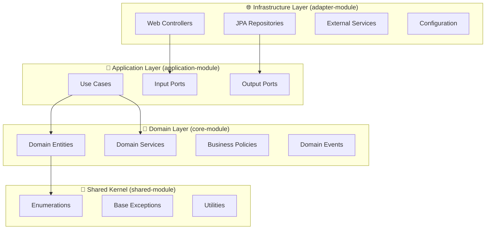

# 🏗️ 전체 아키텍처 및 코드 스타일 가이드

**Prototype Reservation System - 상세 아키텍처 및 코드 컨벤션 문서**

## 📋 목차

1. [아키텍처 개요](#-아키텍처-개요)
2. [헥사고날 아키텍처 구현](#-헥사고날-아키텍처-구현)
3. [모듈별 아키텍처 패턴](#-모듈별-아키텍처-패턴)
4. [코드 스타일 및 컨벤션](#-코드-스타일-및-컨벤션)
5. [도메인 주도 설계 패턴](#-도메인-주도-설계-패턴)
6. [데이터베이스 설계 패턴](#-데이터베이스-설계-패턴)
7. [보안 아키텍처 패턴](#-보안-아키텍처-패턴)
8. [테스팅 아키텍처](#-테스팅-아키텍처)

---

## 🎯 아키텍처 개요

### 핵심 설계 원칙

**Clean Architecture + Hexagonal Architecture + Domain-Driven Design**



### 아키텍처 특징

- **의존성 역전**: 인프라스트럭처가 도메인에 의존, 그 반대가 아님
- **포트-어댑터 패턴**: 레이어 간 명확한 인터페이스 정의
- **도메인 순수성**: 코어 모듈은 외부 프레임워크 의존성 없음
- **단방향 의존성**: 내부 레이어는 외부 레이어를 알지 못함

---

## 🏗️ 헥사고날 아키텍처 구현

### 모듈 의존성 매트릭스

| 모듈 | 의존성 | 역할 | 특징 |
|------|--------|------|------|
| **adapter-module** | `application-module`, `shared-module` | 인프라스트럭처 & REST API | - Spring Boot 실행 가능한 JAR<br>- 외부 시스템과의 통합<br>- HTTP, DB, Redis 연동 |
| **application-module** | `core-module`, `shared-module` | 유스케이스 & 포트 정의 | - 비즈니스 플로우 조율<br>- 인터페이스 정의<br>- 트랜잭션 관리 |
| **core-module** | `shared-module` | 도메인 로직 | - 순수 Kotlin 코드<br>- 비즈니스 규칙<br>- 도메인 엔티티 |
| **shared-module** | 없음 | 공통 유틸리티 | - 열거형, 예외<br>- 공통 기능 |

### 레이어별 책임 분리

#### 1. Infrastructure Layer (adapter-module)
**역할**: 외부 세계와의 인터페이스 제공

```kotlin
// REST Controller 패턴
@RestController
class GeneralUserSignUpController(
    private val createGeneralUserUseCase: CreateGeneralUserUseCase, // 포트 주입
) {
    @PostMapping(GeneralUserUrl.USER_SIGN_UP)
    fun signUp(@Valid @RequestBody request: GeneralUserSignUpRequest): BooleanResponse =
        BooleanResponse.created(createGeneralUserUseCase.execute(request.toCommand()))
}
```

**특징**:
- Spring Boot 어노테이션 사용
- HTTP 요청/응답 처리
- 유스케이스 포트 의존성 주입
- 도메인 모델을 직접 노출하지 않음

#### 2. Application Layer (application-module)
**역할**: 비즈니스 플로우 조율 및 포트 정의

```kotlin
@UseCase // 커스텀 스테레오타입 어노테이션
class CreateGeneralUserService(
    private val createGeneralUserDomainService: CreateGeneralUserDomainService, // 도메인 서비스
    private val createGeneralUser: CreateGeneralUser, // Output Port
    private val checkGeneralUserDuplicated: CheckGeneralUserLoginIdDuplicated, // Output Port
) : CreateGeneralUserUseCase { // Input Port 구현
    
    @Transactional
    override fun execute(command: CreateGeneralUserCommand): Boolean {
        // 1. 도메인 서비스 호출
        val user = createGeneralUserDomainService.createGeneralUser(/*...*/)
        
        // 2. 비즈니스 규칙 검증
        if (checkGeneralUserDuplicated.query(/*...*/)) {
            throw AlreadyPersistedException()
        }
        
        // 3. 영속화 위임
        return createGeneralUser.command(/*...*/)
    }
}
```

**특징**:
- 도메인 서비스와 인프라스트럭처 포트 조율
- 트랜잭션 경계 정의
- 비즈니스 예외 처리
- 포트 인터페이스 구현

#### 3. Domain Layer (core-module)
**역할**: 순수한 비즈니스 로직과 도메인 규칙

```kotlin
/**
 * 일반 사용자를 표현합니다.
 */
class User(
    private val id: String? = null,
    private val loginId: LoginId, // Value Object
    private var password: Password, // Value Object
    private var personalAttributes: PersonalAttributes, // Value Object
    nickname: String,
) : ServiceUser {
    private var userAttributes: UserAttribute = UserAttribute(nickname, USER)
    
    // 도메인 규칙: ID 없이는 탈퇴 불가
    override fun resign(encryptedAttributes: EncryptedAttributes): ResignedUser {
        if (id == null) {
            throw ResignWithoutIdException() // 도메인 예외
        }
        return ResignedUser(id, loginId, encryptedAttributes, LocalDateTime.now())
    }
    
    // 도메인 동작: 비밀번호 변경
    override fun changePassword(password: Password) {
        this.password = password
    }
}
```

**특징**:
- 프레임워크 의존성 없음
- 풍부한 도메인 모델 (Rich Domain Model)
- Value Object 활용
- 도메인 예외 정의
- 비즈니스 불변조건 보장

---

## 🎨 모듈별 아키텍처 패턴

### Infrastructure Layer 패턴

#### 1. Controller 패턴
```kotlin
// URL 상수 분리
object GeneralUserUrl {
    const val USER_SIGN_UP = "/api/users/general/sign/sign-up"
}

// 단일 책임 컨트롤러
@RestController
class GeneralUserSignUpController(
    private val createGeneralUserUseCase: CreateGeneralUserUseCase,
) {
    @PostMapping(GeneralUserUrl.USER_SIGN_UP)
    fun signUp(@Valid @RequestBody request: GeneralUserSignUpRequest): BooleanResponse
}
```

#### 2. Entity 매핑 패턴
```kotlin
@Entity
@Table(
    catalog = "prototype_reservation",
    name = "user",
    indexes = [Index(name = "index_login_id_and_role", columnList = "login_id, role")]
)
class UserEntity(
    loginId: String,
    password: String,
    // 생성자 매개변수는 val/var 키워드 없이
) : TimeBasedPrimaryKey() {
    
    // 프로퍼티는 명시적으로 선언
    @Column(name = "login_id", columnDefinition = "VARCHAR(32)", nullable = false, updatable = false)
    @Comment("식별키")
    val loginId: String = loginId
    
    @Column(name = "password", columnDefinition = "VARCHAR(256)")
    @Comment("사용자 비밀번호")
    var password: String = password
        protected set // 캡슐화를 위한 protected setter
    
    // 도메인 동작을 JPA 엔티티에서도 제공
    fun changePassword(password: String, oldPassword: String, /*...*/) {
        this.password = password
        this.oldPassword = oldPassword
        // ...
    }
}
```

### Application Layer 패턴

#### 1. Use Case 패턴
```kotlin
// 포트 인터페이스
interface CreateGeneralUserUseCase {
    fun execute(command: CreateGeneralUserCommand): Boolean
}

// 구현체는 도메인 서비스와 포트를 조율
@UseCase
class CreateGeneralUserService(
    private val domainService: CreateGeneralUserDomainService,
    private val outputPort: CreateGeneralUser,
) : CreateGeneralUserUseCase
```

#### 2. 포트 정의 패턴
```kotlin
// Input Port (Use Case Interface)
interface CreateGeneralUserUseCase {
    fun execute(command: CreateGeneralUserCommand): Boolean
}

// Output Port (Repository Interface)
interface CreateGeneralUser {
    fun command(inquiry: CreateGeneralUserInquiry): Boolean
    
    data class CreateGeneralUserInquiry(
        val loginId: String,
        val password: String,
        // 네이밍: 도메인 용어 사용
    )
}
```

### Domain Layer 패턴

#### 1. Aggregate Root 패턴
```kotlin
class User( /* 생성자 매개변수 */ ) : ServiceUser {
    // 식별자 캡슐화
    override val identifier: String? get() = id
    
    // Value Object 접근
    val userLoginId: String get() = loginId.loginId
    val userEncodedPassword: String get() = userPasswordSet.encodedPassword
    
    // 도메인 불변조건 확인
    override fun resign(encryptedAttributes: EncryptedAttributes): ResignedUser {
        if (id == null) throw ResignWithoutIdException()
        return ResignedUser(/* ... */)
    }
}
```

#### 2. Value Object 패턴
```kotlin
// 불변 객체로 설계
data class LoginId(val loginId: String) {
    init {
        require(loginId.isNotBlank()) { "로그인 ID는 공백일 수 없습니다" }
        require(loginId.length <= 32) { "로그인 ID는 32자를 초과할 수 없습니다" }
    }
}

data class Password(
    val encodedPassword: String,
    val oldEncodedPassword: String? = null,
    val changedDateTime: LocalDateTime? = null
)
```

---

## 📝 코드 스타일 및 컨벤션

### Kotlin 스타일 가이드

#### 1. 클래스 정의 패턴
```kotlin
// ✅ 좋은 예: 생성자 매개변수와 프로퍼티 분리
class UserEntity(
    loginId: String,        // 생성자 매개변수 (val/var 없음)
    password: String,
    email: String,
) : TimeBasedPrimaryKey() {
    
    // 프로퍼티는 명시적으로 선언
    @Column(name = "login_id")
    val loginId: String = loginId
    
    @Column(name = "password")
    var password: String = password
        protected set          // 캡슐화
}

// ❌ 피해야 할 패턴
class BadEntity(
    @Column val loginId: String,  // 생성자에서 어노테이션 직접 사용
    @Column var password: String
)
```

#### 2. 함수 정의 패턴
```kotlin
// ✅ 단일 표현식 함수
fun signUp(@Valid @RequestBody request: GeneralUserSignUpRequest): BooleanResponse =
    BooleanResponse.created(createGeneralUserUseCase.execute(request.toCommand()))

// ✅ 복잡한 로직은 블록 함수
@Transactional
override fun execute(command: CreateGeneralUserCommand): Boolean {
    val user = createGeneralUserDomainService.createGeneralUser(/* ... */)
    
    if (checkGeneralUserDuplicated.query(/* ... */)) {
        throw AlreadyPersistedException()
    }
    
    return createGeneralUser.command(/* ... */)
}
```

#### 3. 네이밍 컨벤션
```kotlin
// 패키지명: 소문자, 점으로 구분
package com.reservation.user.self.usecase

// 클래스명: PascalCase
class CreateGeneralUserService

// 함수명: camelCase
fun createGeneralUser()

// 상수: SCREAMING_SNAKE_CASE
companion object {
    const val MAX_LOGIN_ATTEMPTS = 5
}

// 변수명: camelCase
val createGeneralUserUseCase: CreateGeneralUserUseCase
```

#### 4. 어노테이션 패턴
```kotlin
// ✅ 어노테이션 정렬
@Entity
@Table(
    catalog = "prototype_reservation",
    name = "user",
    indexes = [Index(name = "index_login_id_and_role", columnList = "login_id, role")]
)
class UserEntity

// ✅ 메서드 어노테이션
@PostMapping(GeneralUserUrl.USER_SIGN_UP)
fun signUp(@Valid @RequestBody request: GeneralUserSignUpRequest): BooleanResponse

// ✅ 필드 어노테이션
@Column(name = "login_id", columnDefinition = "VARCHAR(32)", nullable = false)
@Comment("식별키")
val loginId: String = loginId
```

### 아키텍처 컨벤션

#### 1. 의존성 주입 패턴
```kotlin
// ✅ 생성자 주입 (권장)
@RestController
class GeneralUserSignUpController(
    private val createGeneralUserUseCase: CreateGeneralUserUseCase,
)

@UseCase
class CreateGeneralUserService(
    private val createGeneralUserDomainService: CreateGeneralUserDomainService,
    private val createGeneralUser: CreateGeneralUser,
    private val checkGeneralUserDuplicated: CheckGeneralUserLoginIdDuplicated,
) : CreateGeneralUserUseCase
```

#### 2. 예외 처리 패턴
```kotlin
// 도메인 예외는 구체적으로
class ResignWithoutIdException : RuntimeException("ID 없이는 탈퇴할 수 없습니다")

// 애플리케이션 예외는 일반적으로
class AlreadyPersistedException : RuntimeException("이미 존재하는 데이터입니다")

// 사용
override fun resign(encryptedAttributes: EncryptedAttributes): ResignedUser {
    if (id == null) {
        throw ResignWithoutIdException() // 구체적인 도메인 예외
    }
    return ResignedUser(/* ... */)
}
```

#### 3. 데이터 전송 패턴
```kotlin
// Command 패턴 (Input)
data class CreateGeneralUserCommand(
    val loginId: String,
    val password: String,
    val email: String,
    val mobile: String,
    val nickname: String,
)

// Inquiry 패턴 (Output Port 매개변수)
data class CreateGeneralUserInquiry(
    val loginId: String,
    val password: String,
    val email: String,
    val mobile: String,
    val nickname: String,
    val role: Role,
)

// Response 패턴
data class BooleanResponse(val result: Boolean) {
    companion object {
        fun created(result: Boolean) = BooleanResponse(result)
    }
}
```

---

## 🎭 도메인 주도 설계 패턴

### 1. 애그리게이트 패턴
```kotlin
// User 애그리게이트 루트
class User(
    private val id: String? = null,
    private val loginId: LoginId,           // Value Object
    private var password: Password,         // Value Object  
    private var personalAttributes: PersonalAttributes, // Value Object
    nickname: String,
) : ServiceUser {
    
    // 애그리게이트 내부 상태 캡슐화
    private var userAttributes: UserAttribute = UserAttribute(nickname, USER)
    
    // 도메인 불변조건 보장
    override fun resign(encryptedAttributes: EncryptedAttributes): ResignedUser {
        if (id == null) throw ResignWithoutIdException()
        return ResignedUser(id, loginId, encryptedAttributes, LocalDateTime.now())
    }
}
```

### 2. 도메인 서비스 패턴
```kotlin
// 복잡한 비즈니스 로직을 캡슐화
@DomainService
class CreateGeneralUserDomainService(
    private val passwordEncoder: PasswordEncoder,
) {
    fun createGeneralUser(form: CreateGeneralUserForm): User {
        val encodedPassword = passwordEncoder.encode(form.password)
        
        return User(
            loginId = LoginId(form.loginId),
            password = Password(encodedPassword),
            personalAttributes = PersonalAttributes(form.email, form.mobile),
            nickname = form.nickname,
        )
    }
}
```

### 3. Value Object 패턴
```kotlin
// 불변 객체로 도메인 개념 표현
data class LoginId(val loginId: String) {
    init {
        require(loginId.isNotBlank()) { "로그인 ID는 공백일 수 없습니다" }
        require(loginId.matches(Regex("^[a-zA-Z0-9_]{4,32}$"))) { 
            "로그인 ID는 4-32자의 영문, 숫자, 언더스코어만 허용됩니다" 
        }
    }
}

data class PersonalAttributes(
    val email: String,
    val mobile: String,
) {
    init {
        require(email.contains("@")) { "올바른 이메일 형식이 아닙니다" }
        require(mobile.matches(Regex("^010-\\d{4}-\\d{4}$"))) { 
            "휴대폰 번호는 010-XXXX-XXXX 형식이어야 합니다" 
        }
    }
}
```

---

## 🗄️ 데이터베이스 설계 패턴

### 1. 기본키 전략
```kotlin
// 시간 기반 UUID 기본키
@MappedSuperclass
abstract class TimeBasedPrimaryKey {
    @Id
    @Column(name = "id", columnDefinition = "VARCHAR(36)")
    val id: String = TimeBasedUuid.generate()
}

// 사용
@Entity
class UserEntity(/* ... */) : TimeBasedPrimaryKey()
```

### 2. 감사 정보 패턴
```kotlin
@Embeddable
data class AuditDateTime(
    @Column(name = "created_datetime", columnDefinition = "DATETIME", nullable = false, updatable = false)
    val createdDateTime: LocalDateTime = LocalDateTime.now(),
    
    @Column(name = "updated_datetime", columnDefinition = "DATETIME", nullable = false)
    var updatedDateTime: LocalDateTime = LocalDateTime.now(),
)

// 사용
@Entity
class UserEntity(/* ... */) {
    @Embedded
    var auditDateTime: AuditDateTime = AuditDateTime()
        protected set
}
```

### 3. 소프트 삭제 패턴
```kotlin
@Entity
class UserEntity(/* ... */) {
    @Column(name = "user_status", columnDefinition = "ENUM ('ACTIVATED', 'DEACTIVATED')")
    var userStatus: UserStatus = UserStatus.ACTIVATED
        protected set
    
    fun deactivate() {
        this.userStatus = UserStatus.DEACTIVATED
    }
}
```

### 4. 인덱스 전략
```kotlin
@Table(
    catalog = "prototype_reservation",
    name = "user",
    indexes = [
        Index(name = "index_login_id_and_role", columnList = "login_id, role"),
        Index(name = "index_user_status", columnList = "user_status"),
        Index(name = "index_created_datetime", columnList = "created_datetime"),
    ]
)
```

---

## 🔐 보안 아키텍처 패턴

### 1. JWT 인증 패턴
```kotlin
// JWT 설정
@ConfigurationProperties(prefix = "app.jwt")
data class JwtProperties(
    val secret: String,
    val accessTokenExpiry: Long = 300000, // 5분
    val issuer: String = "HELLO",
    val version: String = "v1",
)

// 보안 설정
@Configuration
@EnableWebSecurity
class SecurityConfig {
    @Bean
    fun securityFilterChain(http: HttpSecurity): SecurityFilterChain {
        return http
            .authorizeHttpRequests { auth ->
                auth
                    .requestMatchers("/api/users/general/sign/**").permitAll()
                    .requestMatchers("/api/categories/**").permitAll()
                    .requestMatchers("/api/users/general/**").hasRole("USER")
                    .requestMatchers("/api/restaurants/**").hasRole("SELLER")
                    .anyRequest().authenticated()
            }
            .build()
    }
}
```

### 2. 비밀번호 암호화 패턴
```kotlin
@Configuration
class PasswordConfig {
    @Bean
    fun passwordEncoder(): PasswordEncoder = BCryptPasswordEncoder(12)
}

// 도메인 서비스에서 사용
@DomainService
class CreateGeneralUserDomainService(
    private val passwordEncoder: PasswordEncoder,
) {
    fun createGeneralUser(form: CreateGeneralUserForm): User {
        val encodedPassword = passwordEncoder.encode(form.password)
        return User(/* ... */, password = Password(encodedPassword))
    }
}
```

### 3. XSS 방지 패턴
```kotlin
// XSS 필터
@Component
class XssRequestWrapper(request: HttpServletRequest) : HttpServletRequestWrapper(request) {
    override fun getParameter(name: String): String? {
        return cleanXss(super.getParameter(name))
    }
    
    private fun cleanXss(value: String?): String? {
        return value?.let { HtmlUtils.htmlEscape(it) }
    }
}
```

---

## 🧪 테스팅 아키텍처

### 1. 레이어별 테스트 전략

#### Domain Layer 테스트 (Kotest)
```kotlin
class UserTest : BehaviorSpec({
    given("사용자가 생성될 때") {
        val loginId = LoginId("testuser")
        val password = Password("encodedPassword")
        val personalAttributes = PersonalAttributes("test@example.com", "010-1234-5678")
        
        `when`("올바른 정보로 사용자를 생성하면") {
            val user = User(
                loginId = loginId,
                password = password,
                personalAttributes = personalAttributes,
                nickname = "테스트사용자"
            )
            
            then("사용자가 정상적으로 생성되어야 한다") {
                user.userLoginId shouldBe "testuser"
                user.userNickname shouldBe "테스트사용자"
                user.userRole shouldBe Role.USER
            }
        }
        
        `when`("ID 없이 탈퇴를 시도하면") {
            val user = User(/* id = null */)
            
            then("ResignWithoutIdException이 발생해야 한다") {
                shouldThrow<ResignWithoutIdException> {
                    user.resign(EncryptedAttributes("encrypted"))
                }
            }
        }
    }
})
```

#### Application Layer 테스트 (JUnit + MockK)
```kotlin
@ExtendWith(MockKExtension::class)
class CreateGeneralUserServiceTest {
    
    @MockK private lateinit var domainService: CreateGeneralUserDomainService
    @MockK private lateinit var createGeneralUser: CreateGeneralUser
    @MockK private lateinit var checkUserDuplicated: CheckGeneralUserLoginIdDuplicated
    
    private lateinit var useCase: CreateGeneralUserService
    
    @BeforeEach
    fun setUp() {
        useCase = CreateGeneralUserService(domainService, createGeneralUser, checkUserDuplicated)
    }
    
    @Test
    fun `사용자 생성 성공`() {
        // Given
        val command = CreateGeneralUserCommand("testuser", "password", /*...*/)
        val user = mockk<User>()
        
        every { domainService.createGeneralUser(any()) } returns user
        every { checkUserDuplicated.query(any()) } returns false
        every { createGeneralUser.command(any()) } returns true
        
        // When
        val result = useCase.execute(command)
        
        // Then
        assertThat(result).isTrue()
        verify { domainService.createGeneralUser(any()) }
        verify { createGeneralUser.command(any()) }
    }
}
```

#### Infrastructure Layer 테스트 (Spring Boot Test + Testcontainers)
```kotlin
@SpringBootTest
@TestMethodOrder(OrderAnnotation::class)
@Testcontainers
class GeneralUserSignUpControllerTest {
    
    @Container
    companion object {
        @JvmStatic
        val mysql: MySQLContainer<*> = MySQLContainer<Nothing>("mysql:latest")
            .withDatabaseName("test_db")
            .withUsername("test")
            .withPassword("test")
    }
    
    @Autowired private lateinit var mockMvc: MockMvc
    @Autowired private lateinit var objectMapper: ObjectMapper
    
    @Test
    @Order(1)
    fun `사용자 회원가입 성공`() {
        // Given
        val request = GeneralUserSignUpRequest(
            loginId = "testuser",
            password = "password123!",
            email = "test@example.com",
            mobile = "010-1234-5678",
            nickname = "테스트사용자"
        )
        
        // When & Then
        mockMvc.perform(
            post("/api/users/general/sign/sign-up")
                .contentType(MediaType.APPLICATION_JSON)
                .content(objectMapper.writeValueAsString(request))
        )
            .andExpect(status().isCreated)
            .andExpect(jsonPath("$.result").value(true))
    }
}
```

### 2. 테스트 데이터 생성 패턴 (Fixture Monkey)
```kotlin
@TestConfiguration
class TestFixtureConfig {
    
    @Bean
    fun fixtureMonkey(): FixtureMonkey = FixtureMonkey.builder()
        .objectIntrospector(ConstructorPropertiesArbitraryIntrospector.INSTANCE)
        .build()
}

// 사용 예시
class UserFixture {
    companion object {
        fun createValidUser(): User = FixtureMonkey.create(User::class.java)
        
        fun createUserWithLoginId(loginId: String): User = 
            FixtureMonkey.giveMeBuilder(User::class.java)
                .set("loginId.loginId", loginId)
                .sample()
    }
}
```

---

## 📊 코드 품질 및 분석 도구

### 1. Detekt 정적 분석
```kotlin
// build.gradle.kts
detekt {
    config.setFrom("$projectDir/config/detekt/detekt.yml")
    buildUponDefaultConfig = true
    
    reports {
        html.required.set(true)
        xml.required.set(true)
        txt.required.set(true)
    }
}

// 제로 톨러런스 정책
tasks.withType<Detekt>().configureEach {
    jvmTarget = "21"
    
    // 이슈 발견 시 빌드 실패
    ignoreFailures = false
}
```

### 2. Spotless 코드 포맷팅
```kotlin
spotless {
    kotlin {
        target("**/*.kt")
        ktlint("1.2.1")
            .editorConfigOverride(
                mapOf(
                    "indent_size" to "4",
                    "continuation_indent_size" to "4",
                    "max_line_length" to "120"
                )
            )
    }
}
```

### 3. Jacoco 테스트 커버리지
```kotlin
jacoco {
    toolVersion = "0.8.11"
}

tasks.jacocoTestReport {
    reports {
        xml.required.set(true)
        html.required.set(true)
    }
    
    finalizedBy(tasks.jacocoTestCoverageVerification)
}
```

---

## 🚀 빌드 및 배포 패턴

### 1. 멀티 모듈 빌드 전략
```kotlin
// settings.gradle.kts
rootProject.name = "prototype-reservation-system"

include(
    "shared-module",
    "core-module", 
    "application-module",
    "adapter-module",
    "test-module"
)

// 각 모듈별 빌드 설정
// adapter-module/build.gradle.kts
tasks.bootJar {
    enabled = true
    archiveClassifier = ""
}

tasks.jar {
    enabled = false
}

// 다른 모듈들/build.gradle.kts  
tasks.bootJar {
    enabled = false
}

tasks.jar {
    enabled = true
    archiveClassifier = ""
}
```

### 2. Docker 배포 전략
```yaml
# docker-compose.yml
version: '3.8'
services:
  mysql:
    image: mysql:latest
    environment:
      MYSQL_DATABASE: prototype_reservation
      MYSQL_ROOT_PASSWORD: rootpassword
    ports:
      - "3306:3306"
    volumes:
      - mysql_data:/var/lib/mysql
      - ./init.sql:/docker-entrypoint-initdb.d/init.sql
    healthcheck:
      test: ["CMD", "mysqladmin", "ping", "-h", "localhost"]
      timeout: 10s
      retries: 5

  redis:
    image: redis:latest
    ports:
      - "6379:6379"
    healthcheck:
      test: ["CMD", "redis-cli", "ping"]
      timeout: 10s
      retries: 5
```

---

## 🏆 아키텍처 베스트 프랙티스 요약

### ✅ DO (권장사항)

1. **의존성 역전 원칙 준수**
   - 인프라스트럭처가 도메인에 의존
   - 포트-어댑터 패턴 활용

2. **레이어별 책임 분리**
   - 각 레이어의 명확한 역할 정의
   - 단방향 의존성 유지

3. **도메인 중심 설계**
   - 비즈니스 로직을 도메인 레이어에 집중
   - Value Object 적극 활용

4. **테스트 우선 개발**
   - 레이어별 테스트 전략 수립
   - BDD 스타일 테스트 작성

5. **코드 품질 자동화**
   - 정적 분석 도구 활용
   - 자동 포맷팅 적용

### ❌ DON'T (피해야 할 사항)

1. **순환 의존성 생성**
   - 모듈 간 순환 참조 금지
   - 레이어 간 역방향 의존성 금지

2. **도메인 로직 누수**
   - 비즈니스 로직을 컨트롤러나 서비스에 작성 금지
   - 도메인 모델의 빈약함(Anemic Domain Model) 지양

3. **프레임워크 종속성**
   - 도메인 레이어에 Spring 의존성 주입 금지
   - 순수 Java/Kotlin 코드 유지

4. **직접적인 엔티티 노출**
   - JPA 엔티티 직접 반환 금지
   - DTO/Response 객체 활용

5. **테스트 생략**
   - 모든 레이어에 대한 테스트 작성 필수
   - Mock 남용보다는 실제 객체 테스트 우선

---

**이 문서는 Prototype Reservation System의 아키텍처와 코드 스타일을 상세히 설명하며, 헥사고날 아키텍처와 도메인 주도 설계의 실제 구현 방법을 제시합니다. 모든 개발자는 이 가이드를 기반으로 일관된 코드 작성과 아키텍처 설계를 수행해야 합니다.**