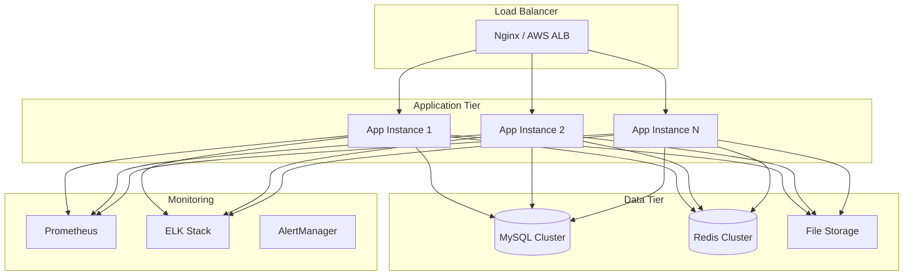

# 📦 Deployment Guide

## 📋 Table of Contents

- [Deployment Overview](#-deployment-overview)
- [Environment Configuration](#-environment-configuration)
- [Docker Deployment](#-docker-deployment)
- [Production Deployment](#-production-deployment)
- [Monitoring & Observability](#-monitoring--observability)
- [Database Management](#-database-management)
- [Security Configuration](#-security-configuration)
- [Troubleshooting](#-troubleshooting)

## 🌐 Deployment Overview

### Deployment Architecture



### Deployment Environments

| Environment | Purpose | Configuration | Availability |
|-------------|---------|---------------|--------------|
| **Local** | Development | Docker Compose | Single instance |
| **Staging** | Testing & QA | Kubernetes | 2 replicas |
| **Production** | Live system | Kubernetes | 3+ replicas |

## ⚙️ Environment Configuration

### Application Properties by Environment

#### Local Development
```yaml
# application-local.yaml
spring:
  profiles:
    active: local
  datasource:
    url: jdbc:mysql://localhost:3306/prototype_reservation
    username: root
    password: reservation
    hikari:
      maximum-pool-size: 5
      minimum-idle: 1
  redis:
    host: localhost
    port: 6379
    timeout: 2000ms
  
jwt:
  secret: local-development-secret-key-not-for-production
  access-token-expiry: 3600000  # 1 hour
  refresh-token-expiry: 604800000  # 7 days

logging:
  level:
    com.reservation: DEBUG
    org.springframework.security: DEBUG
    org.hibernate.SQL: DEBUG
  pattern:
    console: "%d{HH:mm:ss.SSS} [%thread] %-5level %logger{36} - %msg%n"

management:
  endpoints:
    web:
      exposure:
        include: health,info,metrics,prometheus
```

#### Staging Environment
```yaml
# application-stage.yaml
spring:
  profiles:
    active: stage
  datasource:
    url: jdbc:mysql://${DB_HOST:staging-mysql}:${DB_PORT:3306}/${DB_NAME:reservation_stage}
    username: ${DB_USERNAME}
    password: ${DB_PASSWORD}
    hikari:
      maximum-pool-size: 10
      minimum-idle: 2
      connection-timeout: 30000
      idle-timeout: 600000
      max-lifetime: 1800000
  redis:
    host: ${REDIS_HOST:staging-redis}
    port: ${REDIS_PORT:6379}
    password: ${REDIS_PASSWORD}
    timeout: 2000ms
    lettuce:
      pool:
        max-active: 8
        max-idle: 8
        min-idle: 0

jwt:
  secret: ${JWT_SECRET}
  access-token-expiry: ${JWT_ACCESS_EXPIRY:3600000}
  refresh-token-expiry: ${JWT_REFRESH_EXPIRY:604800000}

logging:
  level:
    com.reservation: INFO
    org.springframework.security: WARN
    org.hibernate.SQL: WARN
  file:
    name: /var/log/reservation/application.log
  pattern:
    file: "%d{yyyy-MM-dd HH:mm:ss} [%thread] %-5level %logger{36} - %msg%n"

management:
  endpoints:
    web:
      exposure:
        include: health,info,metrics,prometheus
  endpoint:
    health:
      show-details: when-authorized
```

#### Production Environment
```yaml
# application-production.yaml
spring:
  profiles:
    active: production
  datasource:
    url: jdbc:mysql://${DB_HOST}:${DB_PORT}/${DB_NAME}
    username: ${DB_USERNAME}
    password: ${DB_PASSWORD}
    hikari:
      maximum-pool-size: 20
      minimum-idle: 5
      connection-timeout: 30000
      idle-timeout: 600000
      max-lifetime: 1800000
      leak-detection-threshold: 60000
  redis:
    cluster:
      nodes: ${REDIS_CLUSTER_NODES}
    password: ${REDIS_PASSWORD}
    timeout: 2000ms
    lettuce:
      pool:
        max-active: 16
        max-idle: 8
        min-idle: 2

jwt:
  secret: ${JWT_SECRET}
  access-token-expiry: ${JWT_ACCESS_EXPIRY:1800000}  # 30 minutes in prod
  refresh-token-expiry: ${JWT_REFRESH_EXPIRY:604800000}  # 7 days

server:
  shutdown: graceful
  tomcat:
    threads:
      max: 200
      min-spare: 10
    connection-timeout: 20000ms
    keep-alive-timeout: 20000ms

logging:
  level:
    com.reservation: INFO
    org.springframework.security: WARN
    org.hibernate.SQL: ERROR
  file:
    name: /var/log/reservation/application.log
  pattern:
    file: "%d{yyyy-MM-dd HH:mm:ss} [%thread] %-5level %logger{36} - %msg%n"

management:
  endpoints:
    web:
      exposure:
        include: health,info,metrics,prometheus
      base-path: /actuator
  endpoint:
    health:
      show-details: never
  metrics:
    export:
      prometheus:
        enabled: true
```

## 🐳 Docker Deployment

### Dockerfile

```dockerfile
# Multi-stage build for optimized production image
FROM gradle:8.5-jdk21 AS builder

WORKDIR /app
COPY . .

# Build application
RUN gradle clean build -x test --no-daemon

# Production stage
FROM openjdk:21-jre-slim

# Install required packages
RUN apt-get update && apt-get install -y \
    curl \
    netcat-traditional \
    && rm -rf /var/lib/apt/lists/*

# Create non-root user
RUN groupadd -r reservation && useradd -r -g reservation reservation

# Create directories
RUN mkdir -p /var/log/reservation && \
    chown -R reservation:reservation /var/log/reservation

# Copy application JAR
COPY --from=builder /app/adapter-module/build/libs/adapter-module-*.jar /app/reservation.jar

# Set ownership
RUN chown reservation:reservation /app/reservation.jar

# Switch to non-root user
USER reservation

# Health check
HEALTHCHECK --interval=30s --timeout=3s --start-period=60s --retries=3 \
  CMD curl -f http://localhost:8080/actuator/health || exit 1

# Expose port
EXPOSE 8080

# JVM optimization for containers
ENV JAVA_OPTS="-Xmx1g -Xms512m -XX:+UseG1GC -XX:+UseStringDeduplication"

# Run application
ENTRYPOINT ["sh", "-c", "java $JAVA_OPTS -jar /app/reservation.jar"]
```

### Docker Compose for Production

```yaml
# docker-compose.prod.yml
version: '3.8'

services:
  reservation-app:
    build:
      context: .
      dockerfile: Dockerfile
    image: reservation:latest
    container_name: reservation-app
    restart: unless-stopped
    ports:
      - "8080:8080"
    environment:
      - SPRING_PROFILES_ACTIVE=production
      - DB_HOST=mysql
      - DB_PORT=3306
      - DB_NAME=prototype_reservation
      - DB_USERNAME=${DB_USERNAME}
      - DB_PASSWORD=${DB_PASSWORD}
      - REDIS_HOST=redis
      - REDIS_PORT=6379
      - REDIS_PASSWORD=${REDIS_PASSWORD}
      - JWT_SECRET=${JWT_SECRET}
    depends_on:
      mysql:
        condition: service_healthy
      redis:
        condition: service_healthy
    networks:
      - reservation-network
    volumes:
      - ./logs:/var/log/reservation
    healthcheck:
      test: ["CMD", "curl", "-f", "http://localhost:8080/actuator/health"]
      interval: 30s
      timeout: 10s
      retries: 3
      start_period: 60s

  mysql:
    image: mysql:8.0
    container_name: reservation-mysql
    restart: unless-stopped
    ports:
      - "3306:3306"
    environment:
      MYSQL_ROOT_PASSWORD: ${DB_ROOT_PASSWORD}
      MYSQL_DATABASE: prototype_reservation
      MYSQL_USER: ${DB_USERNAME}
      MYSQL_PASSWORD: ${DB_PASSWORD}
    volumes:
      - mysql-data:/var/lib/mysql
      - ./init-scripts:/docker-entrypoint-initdb.d
    networks:
      - reservation-network
    healthcheck:
      test: ["CMD", "mysqladmin", "ping", "-h", "localhost"]
      interval: 30s
      timeout: 10s
      retries: 5
      start_period: 30s

  redis:
    image: redis:7-alpine
    container_name: reservation-redis
    restart: unless-stopped
    ports:
      - "6379:6379"
    environment:
      REDIS_PASSWORD: ${REDIS_PASSWORD}
    command: redis-server --requirepass ${REDIS_PASSWORD} --appendonly yes
    volumes:
      - redis-data:/data
    networks:
      - reservation-network
    healthcheck:
      test: ["CMD", "redis-cli", "-a", "${REDIS_PASSWORD}", "ping"]
      interval: 30s
      timeout: 10s
      retries: 5

  nginx:
    image: nginx:alpine
    container_name: reservation-nginx
    restart: unless-stopped
    ports:
      - "80:80"
      - "443:443"
    volumes:
      - ./nginx/nginx.conf:/etc/nginx/nginx.conf
      - ./nginx/ssl:/etc/nginx/ssl
      - ./logs/nginx:/var/log/nginx
    depends_on:
      - reservation-app
    networks:
      - reservation-network

volumes:
  mysql-data:
  redis-data:

networks:
  reservation-network:
    driver: bridge
```

### Nginx Configuration

```nginx
# nginx/nginx.conf
events {
    worker_connections 1024;
}

http {
    upstream reservation-backend {
        server reservation-app:8080;
        # Add more servers for load balancing
        # server reservation-app-2:8080;
        # server reservation-app-3:8080;
    }

    # Rate limiting
    limit_req_zone $binary_remote_addr zone=auth:10m rate=5r/m;
    limit_req_zone $binary_remote_addr zone=api:10m rate=100r/m;

    server {
        listen 80;
        server_name your-domain.com;
        
        # Redirect HTTP to HTTPS
        return 301 https://$host$request_uri;
    }

    server {
        listen 443 ssl http2;
        server_name your-domain.com;

        # SSL Configuration
        ssl_certificate /etc/nginx/ssl/cert.pem;
        ssl_certificate_key /etc/nginx/ssl/key.pem;
        ssl_protocols TLSv1.2 TLSv1.3;
        ssl_ciphers ECDHE-RSA-AES128-GCM-SHA256:ECDHE-RSA-AES256-GCM-SHA384;
        ssl_prefer_server_ciphers off;

        # Security headers
        add_header X-Content-Type-Options nosniff;
        add_header X-Frame-Options DENY;
        add_header X-XSS-Protection "1; mode=block";
        add_header Strict-Transport-Security "max-age=31536000; includeSubDomains";

        # Gzip compression
        gzip on;
        gzip_vary on;
        gzip_min_length 1024;
        gzip_types text/plain text/css application/json application/javascript text/xml application/xml;

        # Rate limiting for auth endpoints
        location ~ ^/api/(users|auth)/(sign|login) {
            limit_req zone=auth burst=10 nodelay;
            proxy_pass http://reservation-backend;
            proxy_set_header Host $host;
            proxy_set_header X-Real-IP $remote_addr;
            proxy_set_header X-Forwarded-For $proxy_add_x_forwarded_for;
            proxy_set_header X-Forwarded-Proto $scheme;
        }

        # API endpoints
        location /api/ {
            limit_req zone=api burst=50 nodelay;
            proxy_pass http://reservation-backend;
            proxy_set_header Host $host;
            proxy_set_header X-Real-IP $remote_addr;
            proxy_set_header X-Forwarded-For $proxy_add_x_forwarded_for;
            proxy_set_header X-Forwarded-Proto $scheme;
            proxy_connect_timeout 30s;
            proxy_send_timeout 30s;
            proxy_read_timeout 30s;
        }

        # Health check
        location /actuator/health {
            proxy_pass http://reservation-backend;
            access_log off;
        }

        # Static content
        location /static/ {
            expires 1y;
            add_header Cache-Control "public, immutable";
        }
    }
}
```

## 🚀 Production Deployment

### Kubernetes Deployment

```yaml
# k8s/namespace.yaml
apiVersion: v1
kind: Namespace
metadata:
  name: reservation
  labels:
    name: reservation

---
# k8s/configmap.yaml
apiVersion: v1
kind: ConfigMap
metadata:
  name: reservation-config
  namespace: reservation
data:
  application.yaml: |
    spring:
      profiles:
        active: production
    management:
      endpoints:
        web:
          exposure:
            include: health,info,metrics,prometheus

---
# k8s/secret.yaml
apiVersion: v1
kind: Secret
metadata:
  name: reservation-secrets
  namespace: reservation
type: Opaque
data:
  DB_PASSWORD: <base64-encoded-password>
  REDIS_PASSWORD: <base64-encoded-password>
  JWT_SECRET: <base64-encoded-jwt-secret>

---
# k8s/deployment.yaml
apiVersion: apps/v1
kind: Deployment
metadata:
  name: reservation-app
  namespace: reservation
  labels:
    app: reservation
spec:
  replicas: 3
  strategy:
    type: RollingUpdate
    rollingUpdate:
      maxSurge: 1
      maxUnavailable: 0
  selector:
    matchLabels:
      app: reservation
  template:
    metadata:
      labels:
        app: reservation
    spec:
      containers:
      - name: reservation
        image: reservation:latest
        ports:
        - containerPort: 8080
          name: http
        env:
        - name: SPRING_PROFILES_ACTIVE
          value: "production"
        - name: DB_HOST
          value: "mysql-service"
        - name: DB_USERNAME
          value: "reservation"
        - name: DB_PASSWORD
          valueFrom:
            secretKeyRef:
              name: reservation-secrets
              key: DB_PASSWORD
        - name: REDIS_HOST
          value: "redis-service"
        - name: REDIS_PASSWORD
          valueFrom:
            secretKeyRef:
              name: reservation-secrets
              key: REDIS_PASSWORD
        - name: JWT_SECRET
          valueFrom:
            secretKeyRef:
              name: reservation-secrets
              key: JWT_SECRET
        resources:
          requests:
            memory: "512Mi"
            cpu: "500m"
          limits:
            memory: "1Gi"
            cpu: "1000m"
        livenessProbe:
          httpGet:
            path: /actuator/health/liveness
            port: 8080
          initialDelaySeconds: 90
          periodSeconds: 30
          timeoutSeconds: 5
          failureThreshold: 3
        readinessProbe:
          httpGet:
            path: /actuator/health/readiness
            port: 8080
          initialDelaySeconds: 30
          periodSeconds: 10
          timeoutSeconds: 5
          failureThreshold: 3
        volumeMounts:
        - name: config-volume
          mountPath: /config
        - name: logs-volume
          mountPath: /var/log/reservation
      volumes:
      - name: config-volume
        configMap:
          name: reservation-config
      - name: logs-volume
        emptyDir: {}

---
# k8s/service.yaml
apiVersion: v1
kind: Service
metadata:
  name: reservation-service
  namespace: reservation
  labels:
    app: reservation
spec:
  selector:
    app: reservation
  ports:
  - port: 80
    targetPort: 8080
    protocol: TCP
    name: http
  type: ClusterIP

---
# k8s/ingress.yaml
apiVersion: networking.k8s.io/v1
kind: Ingress
metadata:
  name: reservation-ingress
  namespace: reservation
  annotations:
    kubernetes.io/ingress.class: "nginx"
    cert-manager.io/cluster-issuer: "letsencrypt-prod"
    nginx.ingress.kubernetes.io/rate-limit: "100"
    nginx.ingress.kubernetes.io/rate-limit-window: "1m"
spec:
  tls:
  - hosts:
    - api.your-domain.com
    secretName: reservation-tls
  rules:
  - host: api.your-domain.com
    http:
      paths:
      - path: /
        pathType: Prefix
        backend:
          service:
            name: reservation-service
            port:
              number: 80

---
# k8s/hpa.yaml
apiVersion: autoscaling/v2
kind: HorizontalPodAutoscaler
metadata:
  name: reservation-hpa
  namespace: reservation
spec:
  scaleTargetRef:
    apiVersion: apps/v1
    kind: Deployment
    name: reservation-app
  minReplicas: 3
  maxReplicas: 10
  metrics:
  - type: Resource
    resource:
      name: cpu
      target:
        type: Utilization
        averageUtilization: 70
  - type: Resource
    resource:
      name: memory
      target:
        type: Utilization
        averageUtilization: 80
```

### Deployment Scripts

```bash
#!/bin/bash
# scripts/deploy.sh

set -e

ENVIRONMENT=${1:-staging}
NAMESPACE="reservation"
IMAGE_TAG=${2:-latest}

echo "Deploying to $ENVIRONMENT environment..."

# Validate environment
if [[ ! "$ENVIRONMENT" =~ ^(staging|production)$ ]]; then
    echo "Error: Environment must be 'staging' or 'production'"
    exit 1
fi

# Build and tag image
echo "Building Docker image..."
docker build -t reservation:$IMAGE_TAG .

# Tag for registry
docker tag reservation:$IMAGE_TAG your-registry.com/reservation:$IMAGE_TAG

# Push to registry
echo "Pushing image to registry..."
docker push your-registry.com/reservation:$IMAGE_TAG

# Apply Kubernetes manifests
echo "Applying Kubernetes manifests..."
kubectl apply -f k8s/namespace.yaml
kubectl apply -f k8s/configmap.yaml
kubectl apply -f k8s/secret.yaml

# Update deployment with new image
kubectl set image deployment/reservation-app reservation=your-registry.com/reservation:$IMAGE_TAG -n $NAMESPACE

# Wait for rollout to complete
echo "Waiting for deployment to complete..."
kubectl rollout status deployment/reservation-app -n $NAMESPACE --timeout=300s

# Apply remaining resources
kubectl apply -f k8s/service.yaml
kubectl apply -f k8s/ingress.yaml
kubectl apply -f k8s/hpa.yaml

# Verify deployment
echo "Verifying deployment..."
kubectl get pods -n $NAMESPACE
kubectl get services -n $NAMESPACE

# Run health check
echo "Running health check..."
sleep 30
HEALTH_URL="https://api.your-domain.com/actuator/health"
if curl -f -s $HEALTH_URL > /dev/null; then
    echo "✅ Deployment successful! Application is healthy."
else
    echo "❌ Health check failed. Please check the logs."
    kubectl logs -l app=reservation -n $NAMESPACE --tail=50
    exit 1
fi
```

## 📊 Monitoring & Observability

### Prometheus Configuration

```yaml
# monitoring/prometheus.yml
global:
  scrape_interval: 15s
  evaluation_interval: 15s

rule_files:
  - "alert_rules.yml"

scrape_configs:
  - job_name: 'reservation-app'
    static_configs:
      - targets: ['reservation-service:80']
    metrics_path: /actuator/prometheus
    scrape_interval: 30s

  - job_name: 'mysql'
    static_configs:
      - targets: ['mysql-exporter:9104']

  - job_name: 'redis'
    static_configs:
      - targets: ['redis-exporter:9121']

alerting:
  alertmanagers:
    - static_configs:
        - targets:
          - alertmanager:9093
```

### Alert Rules

```yaml
# monitoring/alert_rules.yml
groups:
  - name: reservation.rules
    rules:
      - alert: HighErrorRate
        expr: rate(http_requests_total{status=~"5.."}[5m]) > 0.1
        for: 5m
        labels:
          severity: critical
        annotations:
          summary: High error rate detected
          description: "Error rate is {{ $value }} errors per second"

      - alert: HighResponseTime
        expr: histogram_quantile(0.95, rate(http_request_duration_seconds_bucket[5m])) > 1
        for: 5m
        labels:
          severity: warning
        annotations:
          summary: High response time
          description: "95th percentile response time is {{ $value }}s"

      - alert: DatabaseConnectionFailure
        expr: hikaricp_connections_active / hikaricp_connections_max > 0.8
        for: 2m
        labels:
          severity: critical
        annotations:
          summary: Database connection pool near capacity
          description: "Connection pool usage is {{ $value | humanizePercentage }}"

      - alert: ApplicationDown
        expr: up{job="reservation-app"} == 0
        for: 1m
        labels:
          severity: critical
        annotations:
          summary: Application is down
          description: "Reservation application is not responding"
```

### Grafana Dashboard

```json
{
  "dashboard": {
    "id": null,
    "title": "Reservation System Dashboard",
    "panels": [
      {
        "title": "Request Rate",
        "type": "graph",
        "targets": [
          {
            "expr": "rate(http_requests_total[5m])",
            "legendFormat": "{{method}} {{uri}}"
          }
        ]
      },
      {
        "title": "Response Time",
        "type": "graph",
        "targets": [
          {
            "expr": "histogram_quantile(0.95, rate(http_request_duration_seconds_bucket[5m]))",
            "legendFormat": "95th percentile"
          },
          {
            "expr": "histogram_quantile(0.50, rate(http_request_duration_seconds_bucket[5m]))",
            "legendFormat": "50th percentile"
          }
        ]
      },
      {
        "title": "JVM Memory Usage",
        "type": "graph",
        "targets": [
          {
            "expr": "jvm_memory_used_bytes / jvm_memory_max_bytes",
            "legendFormat": "{{area}}"
          }
        ]
      },
      {
        "title": "Database Connections",
        "type": "graph",
        "targets": [
          {
            "expr": "hikaricp_connections_active",
            "legendFormat": "Active"
          },
          {
            "expr": "hikaricp_connections_idle",
            "legendFormat": "Idle"
          }
        ]
      }
    ]
  }
}
```

## 🗄️ Database Management

### Production Database Setup

```sql
-- Production database initialization
-- Create database with proper character set
CREATE DATABASE prototype_reservation 
CHARACTER SET utf8mb4 
COLLATE utf8mb4_unicode_ci;

-- Create application user
CREATE USER 'reservation'@'%' IDENTIFIED BY 'strong_password_here';
GRANT SELECT, INSERT, UPDATE, DELETE ON prototype_reservation.* TO 'reservation'@'%';

-- Create read-only user for reporting
CREATE USER 'reservation_readonly'@'%' IDENTIFIED BY 'readonly_password_here';
GRANT SELECT ON prototype_reservation.* TO 'reservation_readonly'@'%';

-- Flush privileges
FLUSH PRIVILEGES;

-- Configure MySQL for production
SET GLOBAL innodb_buffer_pool_size = 1073741824; -- 1GB
SET GLOBAL max_connections = 500;
SET GLOBAL slow_query_log = 1;
SET GLOBAL long_query_time = 2;
```

### Backup Strategy

```bash
#!/bin/bash
# scripts/backup.sh

BACKUP_DIR="/backups"
DB_HOST="mysql-service"
DB_NAME="prototype_reservation"
DB_USER="reservation"
DB_PASSWORD="${DB_PASSWORD}"
DATE=$(date +%Y%m%d_%H%M%S)
BACKUP_FILE="$BACKUP_DIR/reservation_backup_$DATE.sql"

# Create backup directory
mkdir -p $BACKUP_DIR

# Create database backup
echo "Creating database backup..."
mysqldump -h $DB_HOST -u $DB_USER -p$DB_PASSWORD \
  --single-transaction \
  --routines \
  --triggers \
  --events \
  --hex-blob \
  $DB_NAME > $BACKUP_FILE

# Compress backup
gzip $BACKUP_FILE

# Upload to cloud storage (example with AWS S3)
aws s3 cp $BACKUP_FILE.gz s3://your-backup-bucket/database/

# Keep only last 7 days of local backups
find $BACKUP_DIR -name "reservation_backup_*.sql.gz" -mtime +7 -delete

echo "Backup completed: $BACKUP_FILE.gz"
```

## 🛡️ Security Configuration

### SSL/TLS Setup

```bash
#!/bin/bash
# scripts/setup-ssl.sh

# Generate SSL certificate using Let's Encrypt
certbot certonly --webroot \
  -w /var/www/html \
  -d api.your-domain.com \
  --email admin@your-domain.com \
  --agree-tos \
  --non-interactive

# Copy certificates to nginx directory
cp /etc/letsencrypt/live/api.your-domain.com/fullchain.pem ./nginx/ssl/cert.pem
cp /etc/letsencrypt/live/api.your-domain.com/privkey.pem ./nginx/ssl/key.pem

# Set proper permissions
chmod 644 ./nginx/ssl/cert.pem
chmod 600 ./nginx/ssl/key.pem

echo "SSL certificates installed successfully"
```

### Security Hardening

```yaml
# security/security-policy.yaml
apiVersion: v1
kind: Pod
metadata:
  name: reservation-app
spec:
  securityContext:
    runAsNonRoot: true
    runAsUser: 1000
    runAsGroup: 1000
    fsGroup: 1000
  containers:
  - name: reservation
    securityContext:
      allowPrivilegeEscalation: false
      readOnlyRootFilesystem: true
      capabilities:
        drop:
        - ALL
    volumeMounts:
    - name: temp-volume
      mountPath: /tmp
    - name: logs-volume
      mountPath: /var/log/reservation
  volumes:
  - name: temp-volume
    emptyDir: {}
  - name: logs-volume
    emptyDir: {}
```

## 🔧 Troubleshooting

### Common Deployment Issues

#### Application Won't Start

```bash
# Check pod status
kubectl get pods -n reservation

# Check pod logs
kubectl logs -f deployment/reservation-app -n reservation

# Check events
kubectl get events -n reservation --sort-by='.lastTimestamp'

# Common fixes:
# 1. Check resource limits
kubectl describe pod <pod-name> -n reservation

# 2. Verify secrets and config maps
kubectl get secrets -n reservation
kubectl get configmaps -n reservation

# 3. Check database connectivity
kubectl exec -it <pod-name> -n reservation -- nc -zv mysql-service 3306
```

#### Database Connection Issues

```bash
# Test database connection from pod
kubectl exec -it <pod-name> -n reservation -- mysql -h mysql-service -u reservation -p

# Check MySQL logs
kubectl logs mysql-pod -n reservation

# Verify database credentials
kubectl get secret reservation-secrets -n reservation -o yaml
```

#### Performance Issues

```bash
# Check resource usage
kubectl top pods -n reservation
kubectl top nodes

# Scale application
kubectl scale deployment reservation-app --replicas=5 -n reservation

# Check HPA status
kubectl get hpa -n reservation
kubectl describe hpa reservation-hpa -n reservation
```

### Monitoring and Debugging

```bash
# Health check endpoints
curl https://api.your-domain.com/actuator/health
curl https://api.your-domain.com/actuator/info
curl https://api.your-domain.com/actuator/metrics

# Application logs
kubectl logs -f deployment/reservation-app -n reservation

# JVM metrics
kubectl exec -it <pod-name> -n reservation -- jstat -gc -t <PID>

# Thread dump
kubectl exec -it <pod-name> -n reservation -- jstack <PID>

# Heap dump (use carefully in production)
kubectl exec -it <pod-name> -n reservation -- jmap -dump:format=b,file=/tmp/heap.hprof <PID>
```

---

**🚀 This deployment guide ensures reliable, scalable, and secure deployment of the Prototype Reservation System across all environments.**