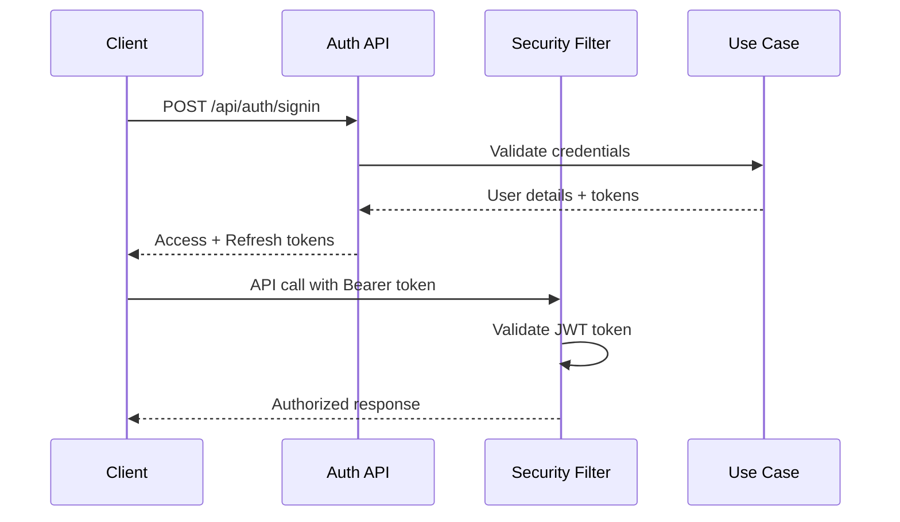

# 📚 API Documentation

## 📋 Table of Contents

- [API Overview](#-api-overview)
- [Authentication](#-authentication)
- [User Management APIs](#-user-management-apis)
- [Restaurant Management APIs](#-restaurant-management-apis)
- [Category APIs](#-category-apis)
- [Company APIs](#-company-apis)
- [Error Handling](#-error-handling)
- [API Testing](#-api-testing)

## 🌐 API Overview

The Prototype Reservation System provides RESTful APIs following clean architecture principles with comprehensive security and validation.

### Base Configuration

```yaml
Base URL: http://localhost:8080/api
Content-Type: application/json
Authentication: Bearer JWT Token (where required)
API Version: v1 (embedded in endpoint paths)
```

### Response Format Standards

```json
// Success Response
{
  "data": {
    // Response payload
  },
  "timestamp": "2024-01-01T10:00:00Z",
  "status": "SUCCESS"
}

// List Response
{
  "data": {
    "content": [...],
    "totalElements": 100,
    "totalPages": 10,
    "currentPage": 0,
    "size": 10
  },
  "timestamp": "2024-01-01T10:00:00Z",
  "status": "SUCCESS"
}

// Error Response
{
  "error": {
    "code": "VALIDATION_ERROR",
    "message": "Invalid input parameters",
    "details": [
      {
        "field": "email",
        "message": "Invalid email format"
      }
    ]
  },
  "timestamp": "2024-01-01T10:00:00Z",
  "status": "ERROR"
}
```

## 🔐 Authentication

### JWT Token Authentication

The system uses JWT tokens for authentication with role-based authorization.

#### Authentication Flow



#### Sign In

```http
POST /api/users/general/sign/in
Content-Type: application/json

{
  "loginId": "user123",
  "password": "SecurePassword123!",
  "rememberMe": true
}
```

```json
// Response
{
  "data": {
    "accessToken": "eyJhbGciOiJIUzI1NiIsInR5cCI6IkpXVCJ9...",
    "refreshToken": "eyJhbGciOiJIUzI1NiIsInR5cCI6IkpXVCJ9...",
    "expiresIn": 3600,
    "tokenType": "Bearer",
    "user": {
      "id": "123e4567-e89b-12d3-a456-426614174000",
      "loginId": "user123",
      "nickname": "John Doe",
      "role": "USER"
    }
  }
}
```

#### Token Refresh

```http
POST /api/users/general/refresh
Authorization: Bearer <refresh_token>
```

#### Sign Out

```http
POST /api/users/general/sign/out
Authorization: Bearer <access_token>
```

### User Roles & Permissions

| Role | Description | Permissions |
|------|-------------|-------------|
| **USER** | General users | Profile management, reservations |
| **SELLER** | Restaurant owners | Restaurant management, reservation viewing |
| **ADMIN** | System administrators | Full system access, user management |

## 👤 User Management APIs

### General User Operations

#### User Registration

```http
POST /api/users/general/sign/up
Content-Type: application/json

{
  "loginId": "newuser123",
  "password": "SecurePassword123!",
  "confirmPassword": "SecurePassword123!",
  "nickname": "New User",
  "email": "newuser@example.com",
  "phone": "+1-555-0123",
  "agreeToTerms": true,
  "agreeToPrivacy": true
}
```

#### User Profile Retrieval

```http
GET /api/users/general/self
Authorization: Bearer <access_token>
```

```json
// Response
{
  "data": {
    "id": "123e4567-e89b-12d3-a456-426614174000",
    "loginId": "user123",
    "nickname": "John Doe",
    "email": "john.doe@example.com",
    "phone": "+1-555-0123",
    "status": "ACTIVE",
    "role": "USER",
    "createdAt": "2024-01-01T10:00:00Z",
    "lastAccessAt": "2024-01-15T14:30:00Z"
  }
}
```

#### Change Password

```http
PATCH /api/users/general/password
Authorization: Bearer <access_token>
Content-Type: application/json

{
  "currentPassword": "CurrentPassword123!",
  "newPassword": "NewSecurePassword456!",
  "confirmNewPassword": "NewSecurePassword456!"
}
```

#### Change Nickname

```http
PATCH /api/users/general/nickname
Authorization: Bearer <access_token>
Content-Type: application/json

{
  "nickname": "Updated Nickname"
}
```

#### Find User IDs (Password Recovery)

```http
POST /api/users/general/find/ids
Content-Type: application/json

{
  "email": "user@example.com",
  "phone": "+1-555-0123"
}
```

#### Find Password (Password Reset)

```http
POST /api/users/general/find/password
Content-Type: application/json

{
  "loginId": "user123",
  "email": "user@example.com"
}
```

### User Account Management

#### Account Deactivation

```http
DELETE /api/users/resign
Authorization: Bearer <access_token>
Content-Type: application/json

{
  "reason": "No longer need the service",
  "password": "UserPassword123!"
}
```

## 🏪 Restaurant Management APIs

### Restaurant Operations

#### Create Restaurant

```http
POST /api/restaurants
Authorization: Bearer <seller_access_token>
Content-Type: application/json

{
  "name": "Amazing Italian Restaurant",
  "description": "Authentic Italian cuisine with modern twist",
  "address": {
    "street": "123 Main Street",
    "city": "New York",
    "state": "NY",
    "postalCode": "10001",
    "country": "USA",
    "coordinate": {
      "latitude": 40.7128,
      "longitude": -74.0060
    }
  },
  "contact": {
    "phone": "+1-555-0199",
    "email": "info@amazingitalian.com",
    "website": "https://amazingitalian.com"
  },
  "cuisines": ["ITALIAN", "MEDITERRANEAN"],
  "nationalities": ["ITALIAN"],
  "tags": ["FINE_DINING", "ROMANTIC", "WINE_BAR"],
  "workingDays": [
    {
      "dayOfWeek": "MONDAY",
      "openTime": "11:00",
      "closeTime": "22:00",
      "isOpen": true
    },
    {
      "dayOfWeek": "SUNDAY",
      "openTime": "12:00",
      "closeTime": "21:00",
      "isOpen": true
    }
  ],
  "photos": [
    {
      "imageUrl": "https://example.com/restaurant1.jpg",
      "description": "Main dining area",
      "displayOrder": 1
    }
  ]
}
```

#### Update Restaurant

```http
PUT /api/restaurants/{restaurantId}
Authorization: Bearer <seller_access_token>
Content-Type: application/json

{
  "name": "Updated Restaurant Name",
  "description": "Updated description",
  // ... other updateable fields
}
```

#### Get Restaurant Details

```http
GET /api/restaurants/{restaurantId}
Authorization: Bearer <access_token>
```

```json
// Response
{
  "data": {
    "id": "789e4567-e89b-12d3-a456-426614174000",
    "name": "Amazing Italian Restaurant",
    "description": "Authentic Italian cuisine with modern twist",
    "address": {
      "street": "123 Main Street",
      "city": "New York",
      "coordinate": {
        "latitude": 40.7128,
        "longitude": -74.0060
      }
    },
    "contact": {
      "phone": "+1-555-0199",
      "email": "info@amazingitalian.com"
    },
    "cuisines": ["ITALIAN", "MEDITERRANEAN"],  
    "averageRating": 4.5,
    "totalReviews": 127,
    "status": "ACTIVE",
    "createdAt": "2024-01-01T10:00:00Z"
  }
}
```

## 📊 Category APIs

### Cuisine Categories

#### Get Available Cuisines

```http
GET /api/categories/cuisines?page=0&size=20&sort=title,asc
```

```json
// Response
{
  "data": {
    "content": [
      {
        "id": "cuisine-001",
        "title": "Italian",
        "description": "Traditional Italian cuisine",
        "type": "CUISINE",
        "isActive": true
      },
      {
        "id": "cuisine-002", 
        "title": "Japanese",
        "description": "Japanese and sushi cuisine",
        "type": "CUISINE",
        "isActive": true
      }
    ],
    "totalElements": 45,
    "totalPages": 3,
    "currentPage": 0
  }
}
```

### Nationality Categories

#### Get Available Nationalities

```http
GET /api/categories/nationalities?page=0&size=20
```

### Tag Categories

#### Get Available Tags

```http
GET /api/categories/tags?page=0&size=50
```

```json
// Response
{
  "data": {
    "content": [
      {
        "id": "tag-001",
        "title": "Fine Dining",
        "description": "Upscale dining experience",
        "type": "TAG",
        "isActive": true
      },
      {
        "id": "tag-002",
        "title": "Family Friendly", 
        "description": "Suitable for families with children",
        "type": "TAG",
        "isActive": true
      }
    ]
  }
}
```

## 🏢 Company APIs

### Company Management

#### Get Companies

```http
GET /api/companies?page=0&size=20&search=restaurant
Authorization: Bearer <access_token>
```

```json
// Response  
{
  "data": {
    "content": [
      {
        "id": "company-001",
        "name": "Restaurant Group Inc.",
        "brand": "Premium Dining",
        "business": {
          "type": "RESTAURANT_CHAIN",
          "registrationNumber": "12345678901",
          "taxId": "TAX123456789"
        },
        "address": {
          "street": "456 Business Ave",
          "city": "Los Angeles",
          "state": "CA"
        },
        "contact": {
          "phone": "+1-555-0200",
          "email": "info@restaurantgroup.com"
        },
        "representative": {
          "name": "Jane Smith",
          "title": "CEO",
          "phone": "+1-555-0201"
        }
      }
    ]
  }
}
```

## ⚠️ Error Handling

### HTTP Status Codes

| Status Code | Description | Usage |
|-------------|-------------|-------|
| **200** | OK | Successful GET, PUT, PATCH |
| **201** | Created | Successful POST (resource created) |
| **204** | No Content | Successful DELETE |
| **400** | Bad Request | Invalid request parameters |
| **401** | Unauthorized | Missing or invalid authentication |
| **403** | Forbidden | Insufficient permissions |
| **404** | Not Found | Resource not found |
| **409** | Conflict | Resource already exists |
| **422** | Unprocessable Entity | Validation errors |
| **500** | Internal Server Error | Server-side errors |

### Error Response Format

```json
// Validation Error (400)
{
  "error": {
    "code": "VALIDATION_ERROR", 
    "message": "Request validation failed",
    "details": [
      {
        "field": "email",
        "rejectedValue": "invalid-email",
        "message": "must be a well-formed email address"
      },
      {
        "field": "password",
        "rejectedValue": "123",
        "message": "must be at least 8 characters long"
      }
    ]
  },
  "timestamp": "2024-01-01T10:00:00Z",
  "path": "/api/users/general/sign/up",
  "status": "ERROR"
}

// Authentication Error (401)
{
  "error": {
    "code": "UNAUTHORIZED",
    "message": "Invalid or expired authentication token"
  },
  "timestamp": "2024-01-01T10:00:00Z",
  "status": "ERROR"
}

// Business Logic Error (422)
{
  "error": {
    "code": "BUSINESS_RULE_VIOLATION",
    "message": "Cannot perform this operation", 
    "details": [
      {
        "rule": "USER_ALREADY_EXISTS",
        "message": "User with this login ID already exists"
      }
    ]
  },
  "timestamp": "2024-01-01T10:00:00Z",
  "status": "ERROR"
}
```

### Common Error Codes

| Error Code | Description | Resolution |
|------------|-------------|------------|
| `VALIDATION_ERROR` | Request validation failed | Check request parameters |
| `UNAUTHORIZED` | Authentication required | Provide valid JWT token |
| `FORBIDDEN` | Insufficient permissions | Check user role/permissions |
| `RESOURCE_NOT_FOUND` | Requested resource not found | Verify resource ID |
| `ALREADY_EXISTS` | Resource already exists | Use different identifier |
| `BUSINESS_RULE_VIOLATION` | Business logic constraint | Check business rules |
| `EXTERNAL_SERVICE_ERROR` | External service unavailable | Retry later |

## 🧪 API Testing

### Using Postman

1. **Import Collection**: Create Postman collection with all endpoints
2. **Environment Variables**: Set up dev/staging/prod environments
3. **Authentication**: Configure OAuth 2.0 with JWT tokens
4. **Test Scripts**: Add automated response validation

### Sample Request Collection

```javascript
// Pre-request Script (for authenticated endpoints)
const loginRequest = {
  url: pm.environment.get("baseUrl") + "/api/users/general/sign/in",
  method: 'POST',
  header: {
    'Content-Type': 'application/json',
  },
  body: {
    mode: 'raw',
    raw: JSON.stringify({
      loginId: pm.environment.get("testUserLoginId"),
      password: pm.environment.get("testUserPassword")
    })
  }
};

pm.sendRequest(loginRequest, (err, response) => {
  if (!err && response.code === 200) {
    const jsonData = response.json();
    pm.environment.set("accessToken", jsonData.data.accessToken);
  }
});

// Test Script (for response validation)
pm.test("Response status is 200", () => {
  pm.response.to.have.status(200);
});

pm.test("Response has data field", () => {
  const jsonData = pm.response.json();
  pm.expect(jsonData).to.have.property('data');
});

pm.test("Response time is less than 500ms", () => {
  pm.expect(pm.response.responseTime).to.be.below(500);
});
```

### Using cURL

```bash
# Set base URL
BASE_URL="http://localhost:8080/api"

# Authenticate and get token
TOKEN=$(curl -s -X POST "$BASE_URL/users/general/sign/in" \
  -H "Content-Type: application/json" \
  -d '{"loginId":"testuser","password":"TestPassword123!"}' \
  | jq -r '.data.accessToken')

# Use token for authenticated requests
curl -X GET "$BASE_URL/users/general/self" \
  -H "Authorization: Bearer $TOKEN" \
  -H "Content-Type: application/json"

# Create restaurant
curl -X POST "$BASE_URL/restaurants" \
  -H "Authorization: Bearer $TOKEN" \
  -H "Content-Type: application/json" \
  -d '{
    "name": "Test Restaurant",
    "description": "Test description",
    "address": {
      "street": "123 Test St",
      "city": "Test City"
    }
  }'
```

---

**📚 For detailed API specifications, refer to the auto-generated Swagger documentation at `/swagger-ui.html` when the application is running.**