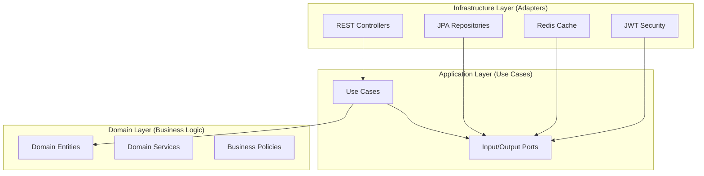
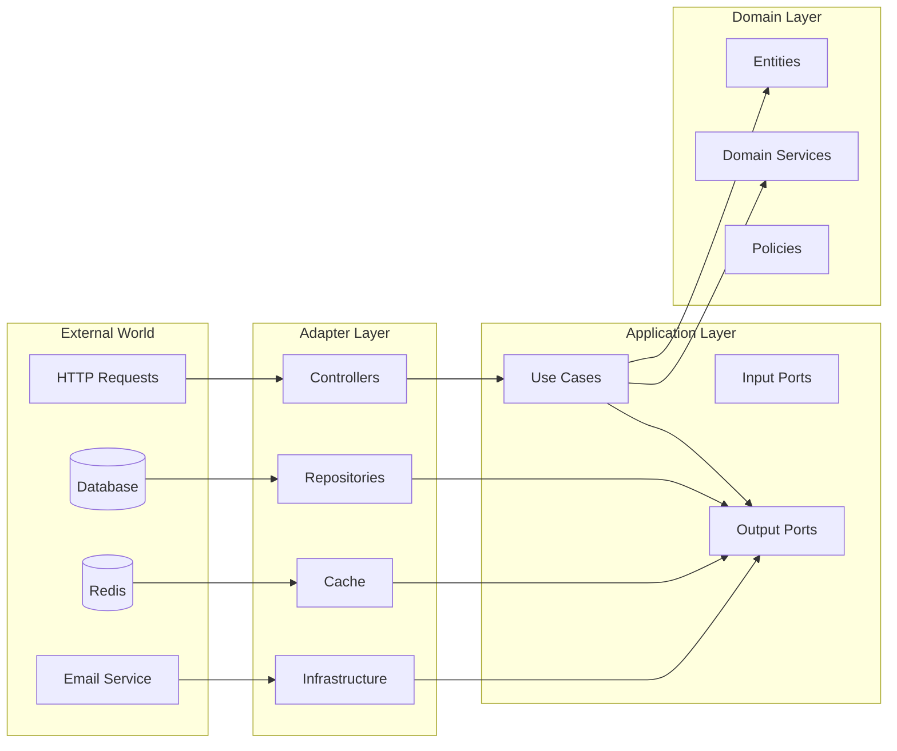

# 🏗️ Architecture Overview

## 📋 Table of Contents

- [Hexagonal Architecture](#-hexagonal-architecture)
- [Module Structure](#-module-structure)
- [Domain-Driven Design](#-domain-driven-design)
- [Dependency Flow](#-dependency-flow)
- [Key Design Patterns](#-key-design-patterns)
- [Infrastructure Integration](#-infrastructure-integration)

## 🔷 Hexagonal Architecture

The system implements **Hexagonal Architecture** (also known as Ports and Adapters) to achieve clean separation of concerns and maintainable code structure.

### Core Principles



### Benefits
- **🔒 Domain Protection**: Business logic isolated from external concerns
- **🔄 Testability**: Easy mocking of external dependencies
- **📈 Scalability**: Adapter replacement without domain changes
- **🛡️ Maintainability**: Clear boundaries and responsibilities

## 📦 Module Structure

### Dependency Hierarchy

```kotlin
// Dependency Direction: Infrastructure → Application → Domain
adapter-module     // Infrastructure Layer
    ↓ depends on
application-module // Application Layer  
    ↓ depends on
core-module        // Domain Layer (NO external dependencies)
    ↑ used by
shared-module      // Shared Kernel
```

### Module Responsibilities

#### 🏛️ Adapter Module (Infrastructure Layer)
**Location**: `adapter-module/src/main/kotlin/com/reservation/`

```
📂 adapter-module/
├── 🌐 rest/                   # REST Controllers & DTOs
│   ├── user/                  # User management endpoints
│   ├── restaurant/            # Restaurant operations
│   ├── company/               # Company management
│   └── category/              # Category services
├── 🗄️ persistence/            # Data Access Layer
│   ├── entity/                # JPA Entities
│   ├── repository/            # Repository Implementations
│   └── common/                # Shared persistence utilities
├── 🔧 config/                 # Infrastructure Configuration
│   ├── security/              # Security configuration
│   ├── persistence/           # Database configuration
│   └── mvc/                   # Web MVC configuration
├── 🔐 infrastructure/         # External Services
│   ├── send/                  # Email services
│   └── upload/                # File upload services
└── 🔄 redis/                  # Caching Layer
    ├── config/                # Redis configuration
    └── token/                 # Token management
```

**Key Components**:
- **REST Controllers**: Handle HTTP requests/responses, validation, and security
- **JPA Entities**: Database mapping with audit fields and soft delete
- **Repository Adapters**: Implement output ports for data access
- **Security Configuration**: JWT authentication, XSS protection, CORS
- **Infrastructure Services**: Email, file upload, caching

#### 🎯 Application Module (Use Cases)
**Location**: `application-module/src/main/kotlin/com/reservation/`

```
📂 application-module/
├── 🎯 usecase/                # Use Case Implementations
│   ├── user/                  # User-related use cases
│   ├── restaurant/            # Restaurant operations
│   └── authenticate/          # Authentication logic
├── 🔌 port/                   # Interface Definitions
│   ├── input/                 # Input Ports (Use Case interfaces)
│   └── output/                # Output Ports (Repository interfaces)
└── 🏭 config/                 # Application Configuration
    └── annotations/           # Custom annotations (@UseCase)
```

**Key Components**:
- **Use Cases**: Application service implementations
- **Input Ports**: Use case interfaces called by adapters
- **Output Ports**: Repository interfaces implemented by adapters
- **Service Factories**: Dependency injection configuration

#### 💎 Core Module (Domain Layer)
**Location**: `core-module/src/main/kotlin/com/reservation/`

```
📂 core-module/
├── 👤 user/                   # User Domain
│   ├── User.kt                # User aggregate root
│   ├── policy/                # User validation policies
│   ├── service/               # User domain services
│   └── common/                # User exceptions
├── 🏪 restaurant/             # Restaurant Domain
│   ├── Restaurant.kt          # Restaurant aggregate root
│   ├── vo/                    # Value objects (Address, Contact, etc.)
│   ├── service/               # Restaurant domain services
│   └── policy/                # Restaurant business rules
├── 🏢 company/                # Company Domain
│   ├── Company.kt             # Company aggregate root
│   └── vo/                    # Company value objects
├── 🔐 authenticate/           # Authentication Domain
│   ├── Authenticate.kt        # Authentication aggregate
│   ├── policy/                # Sign-in policies
│   └── service/               # Authentication domain services
└── 📊 category/               # Category Domain
    ├── cuisine/               # Cuisine categories
    ├── nationality/           # Nationality categories
    └── tag/                   # Tag categories
```

**Domain Characteristics**:
- **🚫 No External Dependencies**: Pure business logic only
- **🎯 Rich Domain Models**: Behavior-driven entities
- **📏 Domain Services**: Complex business logic coordination
- **📋 Validation Policies**: Business rule enforcement
- **💎 Value Objects**: Immutable data structures

#### 🔧 Shared Module (Shared Kernel)
**Location**: `shared-module/src/main/kotlin/com/reservation/`

```
📂 shared-module/
├── 📝 enumeration/            # System-wide enumerations
│   ├── Role.kt                # User roles
│   ├── UserStatus.kt          # User status types
│   └── CategoryType.kt        # Category classifications
├── ⚠️ exceptions/             # Base exception classes
│   ├── ClientException.kt     # Client error base
│   └── InvalidTokenException.kt # Security exceptions
└── 🛠️ utilities/              # Common utilities
    ├── encrypt/               # Encryption utilities
    ├── generator/             # ID/UUID generators
    ├── logger/                # Logging utilities
    └── provider/              # JWT/Token providers
```

**Shared Responsibilities**:
- **System Enumerations**: Consistent type definitions
- **Base Exceptions**: Common error handling patterns
- **Utility Functions**: Reusable operations across modules
- **Cross-cutting Concerns**: Logging, encryption, token management

#### 🧪 Test Module (Testing Utilities)
**Location**: `test-module/src/main/kotlin/com/reservation/`

```
📂 test-module/
├── 🏭 fixture/                # Test fixtures and factories
│   ├── FixtureMonkeyFactory.kt # Property-based test data
│   └── CommonlyUsedArbitraries.kt # Test data generators
└── 🧪 config/                 # Test configuration utilities
```

## 🎯 Domain-Driven Design

### Aggregate Boundaries

```kotlin
// User Aggregate
👤 User (Aggregate Root)
├── 📱 UserAccessHistory     // User access tracking
├── 📋 UserChangeHistory     // User modification history
└── 🔐 ResignedUser         // User resignation data

// Restaurant Aggregate  
🏪 Restaurant (Aggregate Root)
├── 📍 RestaurantAddress     // Location information
├── 📞 RestaurantContact     // Contact details
├── 📸 RestaurantPhotoBook   // Image gallery
├── ⏰ RestaurantRoutine     // Operating hours
└── 🏷️ RestaurantTags       // Classification tags

// Company Aggregate
🏢 Company (Aggregate Root)
├── 🏢 CompanyAddress        // Business address
├── 📞 CompanyContact        # Business contact
└── 👔 Representative       // Company representative
```

### Domain Services

```kotlin
// Authentication Domain Service
🔐 AuthenticateSignInDomainService
├── validateCredentials()    // Credential validation
├── trackAccessAttempt()     // Failed attempt tracking
└── generateTokens()         // JWT token generation

// User Domain Services
👤 ChangeGeneralUserPasswordDomainService
👤 ChangeUserAttributeDomainService  
👤 ChangeUserNicknameDomainService

// Restaurant Domain Services
🏪 CreateRestaurantDomainService
🏪 ChangeRestaurantDomainService
```

### Value Objects

```kotlin
// User Value Objects
📍 UserAddress(street, city, postalCode, country)
📞 UserContact(phone, email)
🔐 AccessDetails(ipAddress, userAgent, timestamp)

// Restaurant Value Objects
📍 RestaurantAddress(address, coordinate, district)
📞 RestaurantContact(phone, email, website)
🍽️ RestaurantCuisines(cuisineTypes: Set<CategoryType>)
📸 RestaurantPhoto(imageUrl, description, displayOrder)
⏰ RestaurantWorkingDay(dayOfWeek, openTime, closeTime)
```

## ⚡ Dependency Flow

### Inward Dependencies Only



### Dependency Rules
1. **🎯 Domain Layer**: No external dependencies - pure business logic
2. **🔧 Application Layer**: Depends only on domain layer and defines ports
3. **🏛️ Adapter Layer**: Implements ports and handles external concerns
4. **🔧 Shared Module**: Utilities available to all layers (carefully managed)

## 🎨 Key Design Patterns

### 1. Repository Pattern
```kotlin
// Output Port (Interface in Application Layer)
interface FindGeneralUser {
    fun findByLoginId(loginId: String): User?
    fun findById(id: UUID): User?
}

// Adapter Implementation (Infrastructure Layer)
@Repository
class UserRepositoryAdapter(
    private val userJpaRepository: UserJpaRepository
) : FindGeneralUser {
    override fun findByLoginId(loginId: String): User? = 
        userJpaRepository.findByLoginId(loginId)?.toDomain()
}
```

### 2. Use Case Pattern
```kotlin
// Input Port (Interface)
interface CreateGeneralUserUseCase {
    fun create(command: CreateGeneralUserCommand): GeneralUserCreatedEvent
}

// Use Case Implementation
@UseCase
class CreateGeneralUserService(
    private val findGeneralUser: FindGeneralUser,
    private val saveGeneralUser: SaveGeneralUser
) : CreateGeneralUserUseCase {
    
    override fun create(command: CreateGeneralUserCommand): GeneralUserCreatedEvent {
        // Business logic implementation
        val user = User.create(command.toCreateUserForm())
        return saveGeneralUser.save(user).toCreatedEvent()
    }
}
```

### 3. Domain Service Pattern
```kotlin
@Component
class CreateRestaurantDomainService {
    fun create(form: CreateRestaurantForm): Restaurant {
        validateBusinessRules(form)
        return Restaurant.create(form)
    }
    
    private fun validateBusinessRules(form: CreateRestaurantForm) {
        // Complex business logic spanning multiple aggregates
    }
}
```

### 4. Policy Pattern
```kotlin
class NormalSignInPolicy : SignInPolicy {
    override fun validate(request: SignInRequest): SignInValidationResult {
        return when {
            isBlocked(request.loginId) -> 
                SignInValidationResult.blocked("Account temporarily blocked")
            !isValidCredentials(request) -> 
                SignInValidationResult.invalidCredentials()
            else -> SignInValidationResult.success()
        }
    }
}
```

## 🔧 Infrastructure Integration

### Database Layer
```kotlin
// JPA Entity (Infrastructure)
@Entity
@Table(name = "users")
class UserEntity : TimeBasedPrimaryKey(), AuditDateTime, LogicalDelete {
    @Column(name = "login_id", unique = true)
    var loginId: String = ""
    
    // Additional fields...
    
    fun toDomain(): User = User(
        id = id,
        loginId = loginId,
        // Map to domain object...
    )
}

// QueryDSL Repository
@Repository
class FindGeneralUserIdsRepository(
    private val queryFactory: JPAQueryFactory
) {
    fun findUserIds(request: FindGeneralUserIdsRequest): List<String> {
        return queryFactory
            .select(userEntity.loginId)
            .from(userEntity)
            .where(buildConditions(request))
            .fetch()
    }
}
```

### Security Integration
```kotlin
@Configuration
@EnableWebSecurity
class SecurityConfig {
    
    @Bean
    fun filterChain(http: HttpSecurity): SecurityFilterChain {
        return http
            .csrf { it.disable() }
            .sessionManagement { 
                it.sessionCreationPolicy(SessionCreationPolicy.STATELESS) 
            }
            .authorizeHttpRequests { auth ->
                auth.requestMatchers("/api/public/**").permitAll()
                    .requestMatchers("/api/user/**").hasRole("USER")
                    .requestMatchers("/api/admin/**").hasRole("ADMIN")
                    .anyRequest().authenticated()
            }
            .addFilterBefore(jwtFilter, UsernamePasswordAuthenticationFilter::class.java)
            .build()
    }
}
```

### Caching Strategy
```kotlin
@Component
class SaveGeneralUserRefreshTokenTemplate(
    private val redisTemplate: RedisTemplate<String, Any>
) {
    fun save(userId: UUID, refreshToken: String, ttl: Duration) {
        val key = RedisKey.generateUserRefreshTokenKey(userId)
        redisTemplate.opsForValue().set(key, refreshToken, ttl)
    }
}
```

---

**🏆 This architecture ensures maintainability, testability, and scalability while enforcing clean boundaries between business logic and infrastructure concerns.**