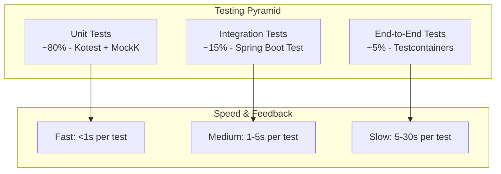

# 🧪 Testing Strategy

## 📋 Table of Contents

- [Testing Philosophy](#-testing-philosophy)
- [Testing Pyramid](#-testing-pyramid)
- [Layer-Specific Testing](#-layer-specific-testing)
- [Testing Tools & Frameworks](#-testing-tools--frameworks)
- [Test Data Management](#-test-data-management)
- [CI/CD Integration](#-cicd-integration)
- [Performance Testing](#-performance-testing)
- [Security Testing](#-security-testing)

## 🎯 Testing Philosophy

### Core Principles

```yaml
Testing Principles:
  1. Test-Driven Development: Write tests before implementation
  2. Layer Isolation: Test each architectural layer independently
  3. Behavior Focus: Test business behavior, not implementation details
  4. Fast Feedback: Prioritize fast-running unit tests
  5. Comprehensive Coverage: Aim for high test coverage with meaningful tests
  6. Property-Based Testing: Use Fixture Monkey for edge case discovery
```

### Quality Gates

```kotlin
// Quality thresholds enforced by CI/CD
val testCoverage = TestCoverage(
    unit = 90.percent,           // Unit test coverage
    integration = 80.percent,    // Integration test coverage
    overall = 85.percent         // Overall project coverage
)

val qualityMetrics = QualityMetrics(
    maxTestExecutionTime = 5.minutes,
    maxBuildTime = 10.minutes,
    detektIssues = 0,           // Zero tolerance for code quality issues
    testFailures = 0            // All tests must pass
)
```

## 🔺 Testing Pyramid

### Testing Distribution Strategy



### Test Categories

| Test Type | Purpose | Tools | Execution Time | Coverage |
|-----------|---------|-------|----------------|----------|
| **Unit Tests** | Business logic, domain rules | Kotest, MockK | <1s | ~80% |
| **Integration Tests** | Component interaction | Spring Test, Testcontainers | 1-5s | ~15% |
| **End-to-End Tests** | Full user workflows | Testcontainers, REST Assured | 5-30s | ~5% |
| **Contract Tests** | API contracts | Spring REST Docs | 1-3s | API endpoints |

## 🏗️ Layer-Specific Testing

### 💎 Domain Layer Testing (Kotest)

Domain layer tests focus on business logic and domain rules using behavior-driven testing.

```kotlin
// core-module/src/test/kotlin/com/reservation/user/UserTest.kt
class UserTest : BehaviorSpec({
    
    given("a valid user creation form") {
        val form = CreateUserForm(
            loginId = "testuser123",
            password = "SecurePassword123!",
            nickname = "Test User",
            email = "test@example.com"
        )
        
        `when`("creating a new user") {
            val user = User.create(form)
            
            then("user should be created with active status") {
                user.status shouldBe UserStatus.ACTIVE
                user.loginId shouldBe "testuser123"
                user.nickname shouldBe "Test User"
                user.email shouldBe "test@example.com"
            }
            
            then("user ID should be generated") {
                user.id shouldNotBe null
            }
        }
    }
    
    given("an active user") {
        val user = FixtureMonkey.giveMeOne<User>().copy(
            status = UserStatus.ACTIVE,
            nickname = "Original Nickname"
        )
        
        `when`("changing nickname to valid value") {
            user.changeNickname("New Nickname")
            
            then("nickname should be updated") {
                user.nickname shouldBe "New Nickname"
            }
        }
        
        `when`("changing nickname to blank value") {
            val exception = shouldThrow<IllegalArgumentException> {
                user.changeNickname("")
            }
            
            then("should throw exception") {
                exception.message shouldContain "Nickname cannot be blank"
            }
            
            then("original nickname should be preserved") {
                user.nickname shouldBe "Original Nickname"
            }
        }
    }
    
    given("user with various statuses") {
        UserStatus.values().forEach { status ->
            `when`("user has status $status") {
                val user = FixtureMonkey.giveMeOne<User>().copy(status = status)
                
                then("canChangePassword should return correct result") {
                    val canChange = user.canChangePassword()
                    canChange shouldBe (status == UserStatus.ACTIVE)
                }
            }
        }
    }
})

// Domain Service Testing
class UserDomainServiceTest : BehaviorSpec({
    val userDomainService = UserDomainService()
    
    given("password validation scenarios") {
        val testCases = listOf(
            Triple("validPassword123!", true, "valid password"),
            Triple("short", false, "too short"),
            Triple("nouppercase123!", false, "no uppercase"),
            Triple("NOLOWERCASE123!", false, "no lowercase"),
            Triple("NoSpecialChar123", false, "no special character"),
            Triple("NoNumbers!", false, "no numbers")
        )
        
        testCases.forEach { (password, expected, description) ->
            `when`("validating password: $description") {
                val result = userDomainService.isValidPassword(password)
                
                then("should return $expected") {
                    result shouldBe expected
                }
            }
        }
    }
})
```

### 🎯 Application Layer Testing (JUnit + MockK)

Application layer tests verify use case orchestration and business workflow coordination.

```kotlin
// application-module/src/test/kotlin/com/reservation/user/usecase/CreateGeneralUserServiceTest.kt
@ExtendWith(MockKExtension::class)
class CreateGeneralUserServiceTest {
    
    @MockK
    private lateinit var findGeneralUser: FindGeneralUser
    
    @MockK
    private lateinit var saveGeneralUser: SaveGeneralUser
    
    @MockK
    private lateinit var userDomainService: UserDomainService
    
    @MockK
    private lateinit var passwordEncoder: PasswordEncoder
    
    private lateinit var createGeneralUserService: CreateGeneralUserService
    
    @BeforeEach
    fun setUp() {
        createGeneralUserService = CreateGeneralUserService(
            findGeneralUser = findGeneralUser,
            saveGeneralUser = saveGeneralUser,
            userDomainService = userDomainService,
            passwordEncoder = passwordEncoder
        )
    }
    
    @Test
    fun `should create user successfully when valid command provided`() {
        // Given
        val command = CreateGeneralUserCommand(
            loginId = "newuser123",
            password = "SecurePassword123!",
            nickname = "New User",
            email = "newuser@example.com"
        )
        
        val expectedUser = FixtureMonkey.giveMeBuilder<User>()
            .set("loginId", command.loginId)
            .set("nickname", command.nickname)
            .set("email", command.email)
            .sample()
        
        every { findGeneralUser.existsByLoginId(command.loginId) } returns false
        every { findGeneralUser.existsByEmail(command.email) } returns false
        every { userDomainService.isValidPassword(command.password) } returns true
        every { passwordEncoder.encode(command.password) } returns "encoded_password"
        every { saveGeneralUser.save(any()) } returns expectedUser
        
        // When
        val result = createGeneralUserService.create(command)
        
        // Then
        assertThat(result.userId).isNotNull
        assertThat(result.loginId).isEqualTo(command.loginId)
        assertThat(result.nickname).isEqualTo(command.nickname)
        
        verify { findGeneralUser.existsByLoginId(command.loginId) }
        verify { findGeneralUser.existsByEmail(command.email) }
        verify { userDomainService.isValidPassword(command.password) }
        verify { passwordEncoder.encode(command.password) }
        verify { saveGeneralUser.save(any()) }
    }
    
    @Test
    fun `should throw AlreadyPersistedException when user with same loginId exists`() {
        // Given
        val command = CreateGeneralUserCommand(
            loginId = "existinguser",
            password = "SecurePassword123!",
            nickname = "Test User",
            email = "test@example.com"
        )
        
        every { findGeneralUser.existsByLoginId(command.loginId) } returns true
        
        // When & Then
        assertThrows<AlreadyPersistedException> {
            createGeneralUserService.create(command)
        }
        
        verify { findGeneralUser.existsByLoginId(command.loginId) }
        verify(exactly = 0) { saveGeneralUser.save(any()) }
    }
    
    @ParameterizedTest
    @ValueSource(strings = ["", "short", "nouppercase123!", "NOLOWERCASE123!"])
    fun `should throw InvalidateUserElementException when password is invalid`(invalidPassword: String) {
        // Given
        val command = CreateGeneralUserCommand(
            loginId = "testuser",
            password = invalidPassword,
            nickname = "Test User",
            email = "test@example.com"
        )
        
        every { findGeneralUser.existsByLoginId(any()) } returns false
        every { findGeneralUser.existsByEmail(any()) } returns false
        every { userDomainService.isValidPassword(invalidPassword) } returns false
        
        // When & Then
        assertThrows<InvalidateUserElementException> {
            createGeneralUserService.create(command)
        }
        
        verify { userDomainService.isValidPassword(invalidPassword) }
        verify(exactly = 0) { saveGeneralUser.save(any()) }
    }
}

// Integration test for complex workflows
@SpringBootTest
@TestPropertySource(locations = ["classpath:application-test.properties"])
class UserWorkflowIntegrationTest {
    
    @Autowired
    private lateinit var createGeneralUserUseCase: CreateGeneralUserUseCase
    
    @Autowired
    private lateinit var authenticateGeneralUserService: AuthenticateGeneralUserService
    
    @Test
    @Transactional
    @Rollback
    fun `should complete user registration and authentication workflow`() {
        // Given - Create user
        val createCommand = CreateGeneralUserCommand(
            loginId = "integrationtest",
            password = "IntegrationTest123!",
            nickname = "Integration Test User",
            email = "integration@test.com"
        )
        
        // When - Create user
        val createResult = createGeneralUserUseCase.create(createCommand)
        
        // Then - User should be created
        assertThat(createResult.userId).isNotNull
        assertThat(createResult.loginId).isEqualTo(createCommand.loginId)
        
        // When - Authenticate user
        val authCommand = AuthenticateGeneralUserCommand(
            loginId = createCommand.loginId,
            password = createCommand.password
        )
        
        val authResult = authenticateGeneralUserService.authenticate(authCommand)
        
        // Then - Authentication should succeed
        assertThat(authResult.accessToken).isNotBlank
        assertThat(authResult.refreshToken).isNotBlank
        assertThat(authResult.user.loginId).isEqualTo(createCommand.loginId)
    }
}
```

### 🏛️ Infrastructure Layer Testing (Testcontainers)

Infrastructure layer tests verify external integrations using real services via Testcontainers.

```kotlin
// adapter-module/src/test/kotlin/com/reservation/user/GeneralUserSignUpControllerTest.kt
@SpringBootTest(webEnvironment = SpringBootTest.WebEnvironment.RANDOM_PORT)
@Testcontainers
@AutoConfigureTestDatabase(replace = AutoConfigureTestDatabase.Replace.NONE)
@TestMethodOrder(OrderAnnotation::class)
class GeneralUserSignUpControllerTest {
    
    companion object {
        @Container
        @JvmStatic
        val mysql: MySQLContainer<*> = MySQLContainer("mysql:8.0")
            .withDatabaseName("test_reservation")
            .withUsername("test")
            .withPassword("test123")
            .withInitScript("init-test-data.sql")
        
        @Container
        @JvmStatic
        val redis: GenericContainer<*> = GenericContainer("redis:7-alpine")
            .withExposedPorts(6379)
    }
    
    @Autowired
    private lateinit var mockMvc: MockMvc
    
    @Autowired
    private lateinit var objectMapper: ObjectMapper
    
    @DynamicPropertySource
    companion object {
        @JvmStatic
        @DynamicPropertySource
        fun configureProperties(registry: DynamicPropertyRegistry) {
            registry.add("spring.datasource.url", mysql::getJdbcUrl)
            registry.add("spring.datasource.username", mysql::getUsername)
            registry.add("spring.datasource.password", mysql::getPassword)
            registry.add("spring.redis.host", redis::getHost)
            registry.add("spring.redis.port") { redis.getMappedPort(6379) }
        }
    }
    
    @Test
    @Order(1)
    fun `should create user successfully when valid request provided`() {
        // Given
        val request = GeneralUserSignUpRequest(
            loginId = "testuser123",
            password = "SecurePassword123!",
            confirmPassword = "SecurePassword123!",
            nickname = "Test User",
            email = "testuser@example.com",
            phone = "+1-555-0123",
            agreeToTerms = true,
            agreeToPrivacy = true
        )
        
        // When & Then
        mockMvc.perform(
            post("/api/users/general/sign/up")
                .contentType(MediaType.APPLICATION_JSON)
                .content(objectMapper.writeValueAsString(request))
        )
        .andExpect(status().isCreated)
        .andExpect(jsonPath("$.data.userId").exists())
        .andExpect(jsonPath("$.data.loginId").value("testuser123"))
        .andExpect(jsonPath("$.data.nickname").value("Test User"))
        .andDo(document("user-signup",
            requestFields(
                fieldWithPath("loginId").description("User login ID"),
                fieldWithPath("password").description("User password"),
                fieldWithPath("confirmPassword").description("Password confirmation"),
                fieldWithPath("nickname").description("User display name"),
                fieldWithPath("email").description("User email address"),
                fieldWithPath("phone").description("User phone number"),
                fieldWithPath("agreeToTerms").description("Terms agreement flag"),
                fieldWithPath("agreeToPrivacy").description("Privacy policy agreement")
            ),
            responseFields(
                fieldWithPath("data.userId").description("Created user ID"),
                fieldWithPath("data.loginId").description("User login ID"),
                fieldWithPath("data.nickname").description("User display name"),
                fieldWithPath("timestamp").description("Response timestamp"),
                fieldWithPath("status").description("Response status")
            )
        ))
    }
    
    @Test
    @Order(2)
    fun `should return 409 when user with same loginId already exists`() {
        // Given - User created in previous test
        val request = GeneralUserSignUpRequest(
            loginId = "testuser123", // Same as previous test
            password = "AnotherPassword123!",
            confirmPassword = "AnotherPassword123!",
            nickname = "Another User",
            email = "another@example.com",
            phone = "+1-555-0124",
            agreeToTerms = true,
            agreeToPrivacy = true
        )
        
        // When & Then
        mockMvc.perform(
            post("/api/users/general/sign/up")
                .contentType(MediaType.APPLICATION_JSON)
                .content(objectMapper.writeValueAsString(request))
        )
        .andExpect(status().isConflict)
        .andExpect(jsonPath("$.error.code").value("ALREADY_PERSISTED"))
        .andExpected(jsonPath("$.error.message").value("User with this login ID already exists"))
    }
    
    @ParameterizedTest
    @MethodSource("invalidSignUpRequests")
    fun `should return 400 when request validation fails`(
        request: GeneralUserSignUpRequest,
        expectedErrors: List<String>
    ) {
        // When & Then
        val result = mockMvc.perform(
            post("/api/users/general/sign/up")
                .contentType(MediaType.APPLICATION_JSON)
                .content(objectMapper.writeValueAsString(request))
        )
        .andExpect(status().isBadRequest)
        .andExpect(jsonPath("$.error.code").value("VALIDATION_ERROR"))
        .andReturn()
        
        val response = objectMapper.readValue(result.response.contentAsString, ErrorResponse::class.java)
        val actualErrors = response.error.details.map { it.message }
        
        expectedErrors.forEach { expectedError ->
            assertThat(actualErrors).anyMatch { it.contains(expectedError) }
        }
    }
    
    companion object {
        @JvmStatic
        fun invalidSignUpRequests(): Stream<Arguments> {
            return Stream.of(
                Arguments.of(
                    GeneralUserSignUpRequest(
                        loginId = "", // Invalid
                        password = "ValidPassword123!",
                        confirmPassword = "ValidPassword123!",
                        nickname = "Test User",
                        email = "test@example.com",
                        phone = "+1-555-0123",
                        agreeToTerms = true,
                        agreeToPrivacy = true
                    ),
                    listOf("Login ID cannot be blank")
                ),
                Arguments.of(
                    GeneralUserSignUpRequest(
                        loginId = "validuser",
                        password = "short", // Invalid
                        confirmPassword = "short",
                        nickname = "Test User",
                        email = "test@example.com",
                        phone = "+1-555-0123",
                        agreeToTerms = true,
                        agreeToPrivacy = true
                    ),
                    listOf("Password must be at least 8 characters")
                ),
                Arguments.of(
                    GeneralUserSignUpRequest(
                        loginId = "validuser",
                        password = "ValidPassword123!",
                        confirmPassword = "DifferentPassword123!", // Mismatch
                        nickname = "Test User",
                        email = "invalid-email", // Invalid format
                        phone = "invalid-phone", // Invalid format
                        agreeToTerms = false, // Must be true
                        agreeToPrivacy = true
                    ),
                    listOf("Passwords do not match", "Invalid email format", "Invalid phone format", "Must agree to terms")
                )
            )
        }
    }
}
```

## 🛠️ Testing Tools & Frameworks

### Framework Comparison

| Framework | Layer | Purpose | Strengths |
|-----------|--------|---------|-----------|
| **Kotest** | Domain | BDD-style unit tests | Expressive DSL, property-based testing |
| **JUnit 5** | Application | Use case testing | Mature, extensive ecosystem |
| **MockK** | All | Mocking framework | Kotlin-native, powerful DSL |
| **Testcontainers** | Infrastructure | Integration testing | Real services, Docker-based |
| **Spring Boot Test** | Infrastructure | Web layer testing | Spring context, test slices |
| **Fixture Monkey** | All | Test data generation | Property-based, edge case discovery |

### Configuration Examples

#### Kotest Configuration

```kotlin
// core-module/src/test/kotlin/ProjectConfig.kt
class ProjectConfig : AbstractProjectConfig() {
    override fun beforeAll() {
        // Global test setup
    }
    
    override fun afterAll() {
        // Global test cleanup
    }
    
    override fun extensions(): List<Extension> = listOf(
        SpringExtension,
        TestContainersExtension
    )
    
    override fun testCaseOrder(): TestCaseOrder = TestCaseOrder.Random
    override fun parallelism(): Int = Runtime.getRuntime().availableProcessors()
}

// Kotest test configuration
class UserTest : BehaviorSpec({
    // Test isolation
    isolationMode = IsolationMode.InstancePerLeaf
    
    // Timeout configuration
    timeout = 5.seconds
    
    // Tags for test categorization
    tags(UnitTest, DomainTest)
    
    // Test body...
})
```

#### MockK Configuration

```kotlin
// MockK extensions for common patterns
fun <T> MockKMatcherScope.anyUUID(): UUID = any<UUID>()
fun <T> MockKMatcherScope.anyInstant(): Instant = any<Instant>()
fun <T> MockKMatcherScope.anyLocalDate(): LocalDate = any<LocalDate>()

// Reusable mock configurations
@TestConfiguration
class TestMockConfiguration {
    
    @Bean
    @Primary
    fun mockPasswordEncoder(): PasswordEncoder = mockk<PasswordEncoder>().apply {
        every { encode(any()) } answers { "encoded_${firstArg<String>()}" }
        every { matches(any(), any()) } returns true
    }
    
    @Bean
    @Primary
    fun mockJwtProvider(): JWTProvider = mockk<JWTProvider>().apply {
        every { generateAccessToken(any()) } returns "mock_access_token"
        every { generateRefreshToken(any()) } returns "mock_refresh_token"
        every { validateToken(any()) } returns true
    }
}
```

## 📊 Test Data Management

### Fixture Monkey Integration

```kotlin
// Test data factories with Fixture Monkey
object TestDataFactory {
    
    private val fixtureMonkey = FixtureMonkey.builder()
        .plugin(KotlinPlugin())
        .build()
    
    fun validUser(): User = fixtureMonkey.giveMeBuilder<User>()
        .set("status", UserStatus.ACTIVE)
        .set("loginId") { "user_${UUID.randomUUID().toString().take(8)}" }
        .set("email") { "${it.loginId}@example.com" }
        .sample()
    
    fun validRestaurant(): Restaurant = fixtureMonkey.giveMeBuilder<Restaurant>()
        .set("name") { "Restaurant ${Random.nextInt(1000)}" }
        .set("status", RestaurantStatus.ACTIVE)
        .set("address.coordinate.latitude") { Random.nextDouble(-90.0, 90.0) }
        .set("address.coordinate.longitude") { Random.nextDouble(-180.0, 180.0) }
        .sample()
    
    fun createUserCommand(
        loginId: String = "testuser_${UUID.randomUUID().toString().take(8)}",
        password: String = "ValidPassword123!",
        email: String = "${loginId}@example.com"
    ): CreateGeneralUserCommand = CreateGeneralUserCommand(
        loginId = loginId,
        password = password,
        nickname = "Test User",
        email = email
    )
    
    // Property-based test data
    fun userArbitrary(): Arbitrary<User> = fixtureMonkey.giveMeArbitrary<User>()
        .filter { it.status != UserStatus.DELETED }
        .map { it.copy(loginId = generateValidLoginId()) }
}

// Property-based testing example
class UserPropertyTest : StringSpec({
    
    "user creation should always result in active status" {
        forAll(TestDataFactory.createUserCommandArbitrary()) { command ->
            val user = User.create(command.toCreateUserForm())
            user.status == UserStatus.ACTIVE
        }
    }
    
    "valid users should always be able to change nickname" {
        forAll(TestDataFactory.userArbitrary(), Arb.string(3..50)) { user, newNickname ->
            assume(user.status == UserStatus.ACTIVE)
            assume(newNickname.isNotBlank())
            
            val originalNickname = user.nickname
            user.changeNickname(newNickname)
            
            user.nickname == newNickname && user.nickname != originalNickname
        }
    }
})
```

### Database Test Data

```sql
-- test-module/src/test/resources/test-data.sql
-- Base test data for integration tests

-- Test users
INSERT INTO users (id, login_id, password, nickname, email, phone, status, created_at, updated_at, is_deleted) VALUES
('11111111-1111-1111-1111-111111111111', 'testuser1', '$2a$10$encrypted_password', 'Test User 1', 'testuser1@example.com', '+1-555-0001', 'ACTIVE', NOW(), NOW(), false),
('22222222-2222-2222-2222-222222222222', 'testuser2', '$2a$10$encrypted_password', 'Test User 2', 'testuser2@example.com', '+1-555-0002', 'ACTIVE', NOW(), NOW(), false),
('33333333-3333-3333-3333-333333333333', 'blockeduser', '$2a$10$encrypted_password', 'Blocked User', 'blocked@example.com', '+1-555-0003', 'BLOCKED', NOW(), NOW(), false);

-- Test companies
INSERT INTO companies (id, name, brand, business_type, registration_number, created_at, updated_at, is_deleted) VALUES
('aaaaaaaa-aaaa-aaaa-aaaa-aaaaaaaaaaaa', 'Test Restaurant Group', 'Premium Dining', 'RESTAURANT_CHAIN', '1234567890', NOW(), NOW(), false);

-- Test restaurants
INSERT INTO restaurants (id, company_id, name, description, address_street, address_city, address_coordinate_latitude, address_coordinate_longitude, status, created_at, updated_at, is_deleted) VALUES
('bbbbbbbb-bbbb-bbbb-bbbb-bbbbbbbbbbbb', 'aaaaaaaa-aaaa-aaaa-aaaa-aaaaaaaaaaaa', 'Test Italian Restaurant', 'Authentic Italian cuisine', '123 Test Street', 'Test City', 40.7128, -74.0060, 'ACTIVE', NOW(), NOW(), false);

-- Test categories
INSERT INTO categories (id, title, description, type, is_active, created_at, updated_at) VALUES
('cuisine-001', 'Italian', 'Italian cuisine', 'CUISINE', true, NOW(), NOW()),
('nationality-001', 'Italian', 'Italian nationality', 'NATIONALITY', true, NOW(), NOW()),
('tag-001', 'Fine Dining', 'Upscale dining experience', 'TAG', true, NOW(), NOW());
```

## 🔄 CI/CD Integration

### GitHub Actions Workflow

```yaml
# .github/workflows/test.yml
name: Test Suite

on:
  push:
    branches: [ main, develop ]
  pull_request:
    branches: [ main ]

jobs:
  test:
    runs-on: ubuntu-latest
    
    services:
      mysql:
        image: mysql:8.0
        env:
          MYSQL_ROOT_PASSWORD: test123
          MYSQL_DATABASE: test_reservation
        ports:
          - 3306:3306
        options: >-
          --health-cmd="mysqladmin ping"
          --health-interval=10s
          --health-timeout=5s
          --health-retries=3
      
      redis:
        image: redis:7-alpine
        ports:
          - 6379:6379
        options: >-
          --health-cmd="redis-cli ping"
          --health-interval=10s
          --health-timeout=5s
          --health-retries=3
    
    steps:
    - uses: actions/checkout@v4
    
    - name: Set up JDK 21
      uses: actions/setup-java@v3
      with:
        java-version: '21'
        distribution: 'temurin'
    
    - name: Cache Gradle packages
      uses: actions/cache@v3
      with:
        path: |
          ~/.gradle/caches
          ~/.gradle/wrapper
        key: ${{ runner.os }}-gradle-${{ hashFiles('**/*.gradle*', '**/gradle-wrapper.properties') }}
        restore-keys: |
          ${{ runner.os }}-gradle-
    
    - name: Make gradlew executable
      run: chmod +x ./gradlew
    
    - name: Run tests
      run: ./gradlew test jacocoTestReport
      env:
        SPRING_PROFILES_ACTIVE: test
        SPRING_DATASOURCE_URL: jdbc:mysql://localhost:3306/test_reservation
        SPRING_DATASOURCE_USERNAME: root
        SPRING_DATASOURCE_PASSWORD: test123
        SPRING_REDIS_HOST: localhost
        SPRING_REDIS_PORT: 6379
    
    - name: Upload coverage reports to Codecov
      uses: codecov/codecov-action@v3
      with:
        files: ./build/reports/jacoco/test/jacocoTestReport.xml
    
    - name: Upload test results
      uses: actions/upload-artifact@v3
      if: always()
      with:
        name: test-results
        path: |
          **/build/test-results/test/TEST-*.xml
          **/build/reports/tests/test/
    
    - name: Run Detekt
      run: ./gradlew detekt
    
    - name: Upload Detekt reports
      uses: actions/upload-artifact@v3
      if: always()
      with:
        name: detekt-reports
        path: build/reports/detekt/
```

### Test Reporting Configuration

```kotlin
// build.gradle.kts - Test reporting configuration
tasks.test {
    useJUnitPlatform()
    
    // Test execution settings
    maxHeapSize = "2g"
    maxParallelForks = Runtime.getRuntime().availableProcessors()
    
    // Test filtering
    systemProperty("kotest.tags", "!Slow")
    
    // Test output
    testLogging {
        events("passed", "skipped", "failed")
        exceptionFormat = TestExceptionFormat.FULL
        showStandardStreams = false
        showStackTraces = true
        showCauses = true
    }
    
    // JaCoCo coverage
    finalizedBy(tasks.jacocoTestReport)
}

tasks.jacocoTestReport {
    dependsOn(tasks.test)
    
    reports {
        xml.required.set(true)
        html.required.set(true)
        csv.required.set(false)
    }
    
    classDirectories.setFrom(
        files(classDirectories.files.map {
            fileTree(it) {
                exclude(
                    "**/*Application*",
                    "**/*Config*",
                    "**/*Entity*",
                    "**/*Request*",
                    "**/*Response*",
                    "**/Q*" // QueryDSL generated classes
                )
            }
        })
    )
}

// Test coverage verification
tasks.jacocoTestCoverageVerification {
    dependsOn(tasks.jacocoTestReport)
    
    violationRules {
        rule {
            limit {
                minimum = "0.85".toBigDecimal() // 85% minimum coverage
            }
        }
        
        rule {
            element = "CLASS"
            limit {
                counter = "BRANCH"
                minimum = "0.80".toBigDecimal() // 80% branch coverage
            }
        }
    }
}
```

## ⚡ Performance Testing

### Load Testing with JMeter

```kotlin
// Performance test configuration
@SpringBootTest(webEnvironment = SpringBootTest.WebEnvironment.DEFINED_PORT)
@TestPropertySource(properties = ["server.port=8080"])
class PerformanceTest {
    
    @Test
    @Disabled("Manual performance testing only")
    fun `measure API response times under load`() {
        // This test is designed to be run manually with JMeter
        // JMeter test plan should be configured to:
        // - 100 concurrent users
        // - 1000 requests per endpoint
        // - Ramp-up time: 30 seconds
        // - Response time assertions: < 500ms for 95th percentile
        
        // Keep application running for JMeter test
        Thread.sleep(Duration.ofMinutes(10).toMillis())
    }
    
    @Test
    fun `should handle concurrent user creation requests`() {
        val executor = Executors.newFixedThreadPool(10)
        val futures = mutableListOf<Future<*>>()
        val successCount = AtomicInteger(0)
        val errorCount = AtomicInteger(0)
        
        repeat(50) { index ->
            futures.add(executor.submit {
                try {
                    val request = GeneralUserSignUpRequest(
                        loginId = "perftest_$index",
                        password = "PerfTest123!",
                        nickname = "Perf Test User $index",
                        email = "perftest$index@example.com",
                        phone = "+1-555-${String.format("%04d", index)}",
                        agreeToTerms = true,
                        agreeToPrivacy = true
                    )
                    
                    val response = restTemplate.postForEntity(
                        "/api/users/general/sign/up",
                        request,
                        GeneralUserSignUpResponse::class.java
                    )
                    
                    if (response.statusCode.is2xxSuccessful) {
                        successCount.incrementAndGet()
                    } else {
                        errorCount.incrementAndGet()
                    }
                } catch (ex: Exception) {
                    errorCount.incrementAndGet()
                }
            })
        }
        
        futures.forEach { it.get(30, TimeUnit.SECONDS) }
        executor.shutdown()
        
        // Assertions
        assertThat(successCount.get()).isGreaterThan(45) // Allow some failures
        assertThat(errorCount.get()).isLessThan(5)
    }
}
```

## 🔐 Security Testing

### Security Test Cases

```kotlin
@SpringBootTest(webEnvironment = SpringBootTest.WebEnvironment.RANDOM_PORT)
class SecurityTest {
    
    @Autowired
    private lateinit var mockMvc: MockMvc
    
    @Test
    fun `should reject requests without authentication for protected endpoints`() {
        val protectedEndpoints = listOf(
            "/api/users/general/self",
            "/api/restaurants",
            "/api/bookings"
        )
        
        protectedEndpoints.forEach { endpoint ->
            mockMvc.perform(get(endpoint))
                .andExpect(status().isUnauthorized)
        }
    }
    
    @Test
    fun `should reject requests with invalid JWT tokens`() {
        val invalidTokens = listOf(
            "invalid_token",
            "Bearer invalid_token",
            "Bearer eyJhbGciOiJIUzI1NiIsInR5cCI6IkpXVCJ9.invalid.signature",
            "" // Empty token
        )
        
        invalidTokens.forEach { token ->
            mockMvc.perform(
                get("/api/users/general/self")
                    .header("Authorization", token)
            )
            .andExpect(status().isUnauthorized)
        }
    }
    
    @Test
    fun `should prevent XSS attacks in user input`() {
        val xssPayloads = listOf(
            "<script>alert('xss')</script>",
            "javascript:alert('xss')",
            "",
            "<%2Fscript%3E%3Cscript%3Ealert('xss')%3C%2Fscript%3E"
        )
        
        xssPayloads.forEach { payload ->
            val request = GeneralUserSignUpRequest(
                loginId = "testuser",
                password = "TestPassword123!",
                confirmPassword = "TestPassword123!",
                nickname = payload, // XSS attempt in nickname
                email = "test@example.com",
                phone = "+1-555-0123",
                agreeToTerms = true,
                agreeToPrivacy = true
            )
            
            mockMvc.perform(
                post("/api/users/general/sign/up")
                    .contentType(MediaType.APPLICATION_JSON)
                    .content(objectMapper.writeValueAsString(request))
            )
            .andExpect(status().isBadRequest)
            .andExpect(jsonPath("$.error.code").value("VALIDATION_ERROR"))
        }
    }
    
    @Test
    fun `should enforce rate limiting for authentication endpoints`() {
        val loginRequest = GeneralUserSignInRequest(
            loginId = "testuser",
            password = "WrongPassword123!"
        )
        
        // Attempt multiple failed logins
        repeat(10) {
            mockMvc.perform(
                post("/api/users/general/sign/in")
                    .contentType(MediaType.APPLICATION_JSON)
                    .content(objectMapper.writeValueAsString(loginRequest))
            )
        }
        
        // Next attempt should be rate limited
        mockMvc.perform(
            post("/api/users/general/sign/in")
                .contentType(MediaType.APPLICATION_JSON)
                .content(objectMapper.writeValueAsString(loginRequest))
        )
        .andExpect(status().isTooManyRequests)
    }
}
```

---

**🏆 This comprehensive testing strategy ensures high code quality, reliability, and maintainability across all architectural layers.**