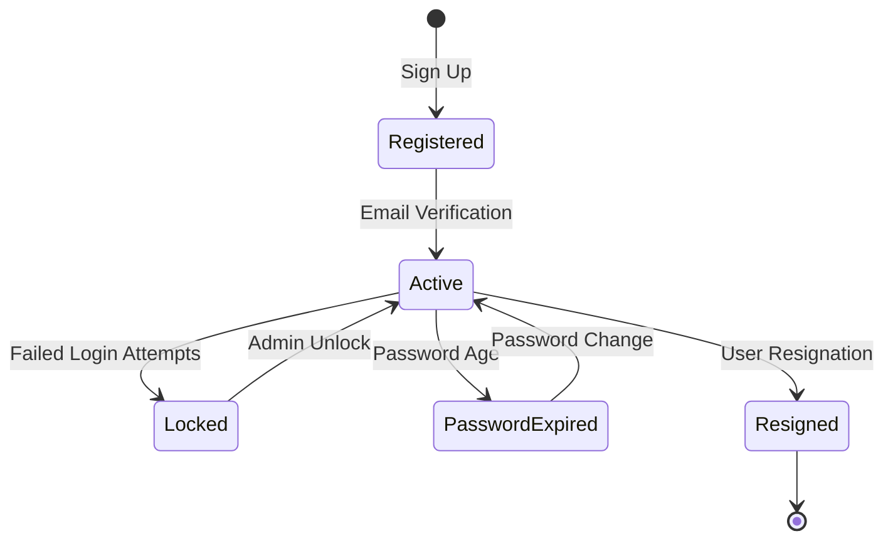

# 🏛️ Domain Model Guide

**Project**: Prototype Reservation System  
**Domain Design**: Domain-Driven Design with Rich Domain Models  
**Language**: Kotlin  

## Table of Contents

1. [Domain Overview](#domain-overview)
2. [Bounded Contexts](#bounded-contexts)
3. [Core Domain Models](#core-domain-models)
4. [Value Objects](#value-objects)
5. [Domain Services](#domain-services)
6. [Business Policies](#business-policies)
7. [Domain Events](#domain-events)
8. [Validation Rules](#validation-rules)

---

## Domain Overview

The Prototype Reservation System is built around the core concept of **restaurant reservations** with supporting domains for **user management**, **restaurant management**, and **company operations**.

### Ubiquitous Language
- **User**: A person who can make reservations (General User)
- **Restaurant Owner**: A user who manages restaurants (Seller User)
- **Restaurant**: A dining establishment that accepts reservations
- **Company**: A business entity that owns restaurants
- **Reservation**: A booking for dining at a restaurant (future implementation)
- **Category**: Classification system for restaurants (cuisine, nationality, tags)

### Domain Map
```mermaid
graph TB
    subgraph "User Context"
        User[User Aggregate]
        UserAuth[Authentication]
        UserProfile[User Profile]
    end
    
    subgraph "Restaurant Context"
        Restaurant[Restaurant Aggregate]
        RestaurantInfo[Restaurant Info]
        RestaurantSchedule[Working Schedule]
        RestaurantPhotos[Photo Gallery]
    end
    
    subgraph "Company Context"
        Company[Company Aggregate]
        CompanyInfo[Company Information]
        BusinessDetails[Business Details]
    end
    
    subgraph "Category Context"
        Categories[Category System]
        Cuisines[Cuisine Types]
        Nationalities[Nationalities]
        Tags[Restaurant Tags]
    end
    
    User --> Restaurant : "owns/manages"
    Company --> Restaurant : "operates"
    Restaurant --> Categories : "categorized by"
```

---

## Bounded Contexts

### 1. User Management Context
**Responsibility**: User authentication, profile management, and user lifecycle

**Core Concepts**:
- User registration and authentication
- Password management and security
- User profile information
- Account lifecycle (active, locked, resigned)

### 2. Restaurant Management Context
**Responsibility**: Restaurant information, operations, and categorization

**Core Concepts**:
- Restaurant creation and management
- Working schedules and availability
- Photo and media management
- Restaurant categorization and tagging

### 3. Company Management Context
**Responsibility**: Business entity management for restaurant owners

**Core Concepts**:
- Company registration and verification
- Business information and compliance
- Multi-restaurant ownership

### 4. Category Management Context
**Responsibility**: Classification system for restaurants

**Core Concepts**:
- Cuisine type classification
- Nationality-based categorization
- Flexible tagging system

---

## Core Domain Models

### 1. User Aggregate

#### User Entity
```kotlin
class User(
    private val id: String? = null,
    private val loginId: LoginId,
    private var password: Password,
    private var personalAttributes: PersonalAttributes,
    nickname: String
) : ServiceUser {
    
    private var userAttributes: UserAttribute = UserAttribute(nickname, USER)
    
    // Business Operations
    fun changePassword(newPassword: Password) {
        if (password == newPassword) {
            throw UseSamePasswordAsBeforeException()
        }
        this.password = newPassword
    }
    
    fun changeUserNickname(userAttributes: UserAttribute) {
        this.userAttributes = userAttributes
    }
    
    fun changePersonalAttributes(personalAttributes: PersonalAttributes) {
        this.personalAttributes = personalAttributes
    }
    
    fun resign(encryptedAttributes: EncryptedAttributes): ResignedUser {
        if (id == null) throw ResignWithoutIdException()
        return ResignedUser(id, loginId, encryptedAttributes, LocalDateTime.now())
    }
}
```

**Key Characteristics**:
- **Rich behavior**: Contains business logic for user operations
- **Encapsulation**: Private fields with controlled access
- **Validation**: Enforces business rules (e.g., password change restrictions)
- **State management**: Manages user lifecycle transitions

#### User State Diagram


### 2. Restaurant Aggregate

#### Restaurant Entity
```kotlin
class Restaurant(
    private val id: String? = null,
    private val companyId: String,
    private val userId: String,
    private var introduce: RestaurantDescription,
    private var contact: RestaurantContact,
    private var address: RestaurantAddress
) {
    // Internal collections managed by aggregate
    private val routine = RestaurantRoutine()
    private val photos = RestaurantPhotoBook()
    private val tags = RestaurantTags()
    private val nationalities = RestaurantNationalities()
    private val cuisines = RestaurantCuisines()
    
    // Controlled state changes
    fun updateDescription(newDescription: RestaurantDescription) {
        introduce = newDescription
    }
    
    fun updateLocation(newLocation: RestaurantAddress) {
        address = newLocation
    }
    
    fun updateContact(newContract: RestaurantContact) {
        contact = newContract
    }
    
    // Collection manipulation through controlled methods
    fun manipulateRoutine(block: (RestaurantRoutine) -> Unit) = routine.apply(block)
    fun manipulatePhoto(block: (RestaurantPhotoBook) -> Unit) = photos.apply(block)
    fun manipulateTags(block: (RestaurantTags) -> Unit) = tags.apply(block)
    
    // Snapshot for persistence
    fun snapshot(): RestaurantSnapshot = RestaurantSnapshot(...)
}
```

**Key Characteristics**:
- **Aggregate root**: Manages internal collections and consistency
- **Controlled access**: Internal state modification through methods
- **Snapshot pattern**: Immutable representation for persistence
- **Business invariants**: Ensures data consistency across operations

### 3. Company Aggregate

#### Company Entity
```kotlin
class Company(
    private val id: String? = null,
    private val brand: Brand,
    private val business: Business,
    private val representative: Representative,
    private var companyAddress: CompanyAddress,
    private var companyContact: CompanyContact
) {
    // Business operations for company management
    fun updateAddress(newAddress: CompanyAddress) {
        companyAddress = newAddress
    }
    
    fun updateContact(newContact: CompanyContact) {
        companyContact = newContact
    }
    
    // Validation and business rules
    fun isEligibleForRestaurantCreation(): Boolean {
        return business.isValid() && representative.isVerified()
    }
}
```

---

## Value Objects

### 1. Authentication Value Objects

#### LoginId
```kotlin
class LoginId(val loginId: String) {
    init {
        LoginIdValidationPolicy().validate(loginId)
    }
    
    companion object {
        fun create(loginId: String): LoginId {
            return LoginId(loginId)
        }
    }
}
```

#### Password
```kotlin
class Password(
    val encodedPassword: String,
    val oldEncodedPassword: String? = null,
    val changedDateTime: LocalDateTime? = null
) {
    fun isExpired(expirationDays: Long = 90): Boolean {
        return changedDateTime?.isBefore(LocalDateTime.now().minusDays(expirationDays)) ?: false
    }
    
    fun isSameAs(other: Password): Boolean {
        return encodedPassword == other.encodedPassword
    }
}
```

### 2. User Value Objects

#### PersonalAttributes
```kotlin
class PersonalAttributes(
    val email: String,
    val mobile: String
) {
    init {
        EmailValidationPolicy().validate(email)
        MobilePhoneValidationPolicy().validate(mobile)
    }
}
```

#### UserAttribute
```kotlin
class UserAttribute(
    val nickname: String,
    val role: Role
) {
    init {
        NicknameValidationPolicy().validate(nickname)
    }
}
```

### 3. Restaurant Value Objects

#### RestaurantDescription
```kotlin
class RestaurantDescription(
    val name: String,
    val introduce: String
) {
    init {
        require(name.isNotBlank()) { "Restaurant name cannot be blank" }
        require(introduce.length <= 1000) { "Introduction too long" }
    }
}
```

#### RestaurantAddress
```kotlin
class RestaurantAddress(
    val zipCode: String,
    val address: String,
    val detail: String,
    val coordinateX: Double,
    val coordinateY: Double
) {
    fun isValidCoordinate(): Boolean {
        return coordinateX in -180.0..180.0 && coordinateY in -90.0..90.0
    }
}
```

#### RestaurantContact
```kotlin
class RestaurantContact(
    val phone: String
) {
    init {
        require(phone.matches(Regex("^\\d{2,3}-\\d{3,4}-\\d{4}$"))) {
            "Invalid phone number format"
        }
    }
}
```

### 4. Collections as Value Objects

#### RestaurantWorkingDay
```kotlin
data class RestaurantWorkingDay(
    val dayOfWeek: DayOfWeek,
    val openTime: LocalTime,
    val closeTime: LocalTime
) {
    init {
        require(openTime.isBefore(closeTime)) {
            "Open time must be before close time"
        }
    }
    
    fun isOpenAt(time: LocalTime): Boolean {
        return !time.isBefore(openTime) && time.isBefore(closeTime)
    }
}
```

---

## Domain Services

### 1. User Domain Services

#### CreateGeneralUserDomainService
```kotlin
class CreateGeneralUserDomainService(
    private val passwordEncoder: PasswordEncoder
) {
    fun createGeneralUser(form: CreateGeneralUserForm): User {
        // Validate business rules
        UserUnifiedValidationPolicy.validate(form)
        
        // Create domain objects
        val loginId = LoginId(form.loginId)
        val encodedPassword = passwordEncoder.encode(form.password)
        val password = Password(encodedPassword)
        val personalAttributes = PersonalAttributes(form.email, form.mobile)
        
        return User(
            loginId = loginId,
            password = password,
            personalAttributes = personalAttributes,
            nickname = form.nickname
        )
    }
}
```

#### ChangeGeneralUserPasswordDomainService
```kotlin
class ChangeGeneralUserPasswordDomainService(
    private val passwordEncoder: PasswordEncoder
) {
    fun changePassword(
        user: User,
        currentPassword: String,
        newPassword: String
    ): User {
        // Verify current password
        if (!passwordEncoder.matches(currentPassword, user.userEncodedPassword)) {
            throw WrongCurrentPasswordException()
        }
        
        // Validate new password
        PasswordValidationPolicy().validate(newPassword)
        
        // Create new password
        val encodedNewPassword = passwordEncoder.encode(newPassword)
        val newPasswordObject = Password(
            encodedPassword = encodedNewPassword,
            oldEncodedPassword = user.userEncodedPassword,
            changedDateTime = LocalDateTime.now()
        )
        
        user.changePassword(newPasswordObject)
        return user
    }
}
```

### 2. Restaurant Domain Services

#### CreateRestaurantDomainService
```kotlin
class CreateRestaurantDomainService {
    fun createRestaurant(
        companyId: String,
        userId: String,
        restaurantInfo: RestaurantCreationInfo
    ): Restaurant {
        // Validate business rules
        validateRestaurantCreationEligibility(companyId, userId)
        
        // Create value objects
        val description = RestaurantDescription(
            restaurantInfo.name,
            restaurantInfo.introduce
        )
        val contact = RestaurantContact(restaurantInfo.phone)
        val address = RestaurantAddress(
            restaurantInfo.zipCode,
            restaurantInfo.address,
            restaurantInfo.detail,
            restaurantInfo.latitude,
            restaurantInfo.longitude
        )
        
        val restaurant = Restaurant(
            companyId = companyId,
            userId = userId,
            introduce = description,
            contact = contact,
            address = address
        )
        
        // Apply additional configurations
        configureWorkingSchedule(restaurant, restaurantInfo.workingDays)
        applyCategories(restaurant, restaurantInfo.categories)
        
        return restaurant
    }
    
    private fun validateRestaurantCreationEligibility(companyId: String, userId: String) {
        // Business rule validation logic
    }
}
```

### 3. Authentication Domain Services

#### AuthenticateSignInDomainService
```kotlin
class AuthenticateSignInDomainService(
    private val passwordEncoder: PasswordEncoder
) {
    fun authenticate(
        loginId: String,
        password: String,
        userRecord: AuthenticationRecord
    ): AuthenticationResult {
        // Check account status
        if (userRecord.userStatus == UserStatus.LOCKED) {
            throw AccountLockedException()
        }
        
        // Verify password
        if (!passwordEncoder.matches(password, userRecord.password)) {
            return AuthenticationResult.failure(userRecord.failCount + 1)
        }
        
        // Apply sign-in policy
        val policy = NormalSignInPolicy()
        return policy.apply(userRecord)
    }
}
```

---

## Business Policies

### 1. Authentication Policies

#### NormalSignInPolicy
```kotlin
class NormalSignInPolicy : SignInPolicy {
    companion object {
        private const val MAX_FAILURE_COUNT = 5
        private const val LOCK_DURATION_HOURS = 24L
    }
    
    override fun apply(record: AuthenticationRecord): AuthenticationResult {
        return when {
            record.failCount >= MAX_FAILURE_COUNT -> {
                AuthenticationResult.locked(
                    lockUntil = LocalDateTime.now().plusHours(LOCK_DURATION_HOURS)
                )
            }
            else -> AuthenticationResult.success(record.reset())
        }
    }
}
```

### 2. Validation Policies

#### PasswordComplexityValidationPolicy
```kotlin
class PasswordComplexityValidationPolicy : PasswordValidationPolicy {
    companion object {
        val PASSWORD_COMPLEXITY_REG_EXP = Regex(
            "^(?=.*[a-z])(?=.*[A-Z])(?=.*\\d)(?=.*[~!@#$%^&*()_+\\-={}|\\[\\]:;\"'<>,.?/]).{8,18}$"
        )
    }
    
    override val reason: String = 
        "Password must contain uppercase, lowercase, numeric, and special characters"
    
    override fun validate(rawPassword: String): Boolean {
        return PASSWORD_COMPLEXITY_REG_EXP.matches(rawPassword)
    }
}
```

#### UserUnifiedValidationPolicy
```kotlin
object UserUnifiedValidationPolicy {
    fun validate(form: CreateGeneralUserForm): CreateGeneralUserForm {
        validateLoginId(form.loginId)
        validatePassword(form.password)
        validateEmail(form.email)
        validateMobile(form.mobile)
        validateNickname(form.nickname)
        return form
    }
    
    private fun validateLoginId(loginId: String) {
        LoginIdValidationPolicy().validate(loginId)
        LoginIdLengthValidationPolicy().validate(loginId)
        LoginIdAlphaNumericValidationPolicy().validate(loginId)
    }
    
    private fun validatePassword(password: String) {
        PasswordLengthValidationPolicy().validate(password)
        PasswordComplexityValidationPolicy().validate(password)
    }
    
    // Additional validation methods...
}
```

---

## Domain Events

### Event Structure (Future Implementation)
```kotlin
sealed class DomainEvent {
    abstract val aggregateId: String
    abstract val occurredOn: LocalDateTime
    abstract val version: Long
}

// User Events
data class UserRegistered(
    override val aggregateId: String,
    val loginId: String,
    val email: String,
    override val occurredOn: LocalDateTime = LocalDateTime.now(),
    override val version: Long = 1
) : DomainEvent()

data class UserPasswordChanged(
    override val aggregateId: String,
    val loginId: String,
    override val occurredOn: LocalDateTime = LocalDateTime.now(),
    override val version: Long = 1
) : DomainEvent()

data class UserSignedIn(
    override val aggregateId: String,
    val loginId: String,
    val ipAddress: String?,
    override val occurredOn: LocalDateTime = LocalDateTime.now(),
    override val version: Long = 1
) : DomainEvent()

// Restaurant Events
data class RestaurantCreated(
    override val aggregateId: String,
    val restaurantName: String,
    val ownerId: String,
    val companyId: String,
    override val occurredOn: LocalDateTime = LocalDateTime.now(),
    override val version: Long = 1
) : DomainEvent()

data class RestaurantUpdated(
    override val aggregateId: String,
    val restaurantName: String,
    val changeType: String,
    override val occurredOn: LocalDateTime = LocalDateTime.now(),
    override val version: Long = 1
) : DomainEvent()
```

### Event Publishing (Future Implementation)
```kotlin
interface DomainEventPublisher {
    fun publish(event: DomainEvent)
    fun publishAll(events: List<DomainEvent>)
}

// Usage in domain entities
class User {
    private val domainEvents = mutableListOf<DomainEvent>()
    
    fun changePassword(newPassword: Password) {
        // Business logic...
        domainEvents.add(
            UserPasswordChanged(
                aggregateId = id!!,
                loginId = loginId.loginId
            )
        )
    }
    
    fun collectDomainEvents(): List<DomainEvent> {
        val events = domainEvents.toList()
        domainEvents.clear()
        return events
    }
}
```

---

## Validation Rules

### 1. User Validation Rules

#### Login ID Validation
- **Length**: 4-20 characters
- **Format**: Alphanumeric characters only
- **Uniqueness**: Must be unique across the system

#### Password Validation
- **Length**: 8-18 characters
- **Complexity**: Must contain:
  - At least one lowercase letter
  - At least one uppercase letter
  - At least one numeric digit
  - At least one special character
- **History**: Cannot reuse previous password

#### Email Validation
- **Format**: Valid email format (RFC 5322)
- **Uniqueness**: Must be unique across the system

#### Mobile Phone Validation
- **Format**: Korean mobile phone format (010-XXXX-XXXX)
- **Uniqueness**: Must be unique across the system

#### Nickname Validation
- **Length**: 2-10 characters
- **Content**: No special characters except Korean, English, numbers

### 2. Restaurant Validation Rules

#### Restaurant Name
- **Length**: 1-100 characters
- **Content**: No profanity or inappropriate content

#### Restaurant Address
- **Coordinates**: Valid latitude/longitude ranges
- **Address Format**: Valid Korean address format

#### Working Hours
- **Time Range**: Open time must be before close time
- **Day Coverage**: At least one working day must be specified

#### Phone Number
- **Format**: Valid Korean business phone format
- **Uniqueness**: Must be unique per restaurant

### 3. Business Rules

#### User Account Management
- **Registration**: Email verification required
- **Account Locking**: After 5 failed login attempts
- **Password Expiry**: 90 days (configurable)
- **Resignation**: Data anonymization and archival

#### Restaurant Management
- **Ownership**: One user can own multiple restaurants
- **Company Association**: Restaurant must be associated with a company
- **Photo Limits**: Maximum 10 photos per restaurant
- **Category Limits**: Maximum 5 tags, 3 nationalities, 3 cuisines

#### Authentication & Authorization
- **Token Expiry**: Access token 1 hour, refresh token 30 days
- **Role Hierarchy**: ADMIN > MANAGER > USER
- **Resource Access**: Users can only modify their own resources

---

## Domain Model Evolution

### Current State
- **Rich domain models** with behavior and validation
- **Value objects** for data consistency and validation
- **Domain services** for complex business logic
- **Validation policies** for business rule enforcement

### Future Enhancements
1. **Domain Events**: Implement event sourcing for audit trails
2. **Specifications**: Complex business rule combinations
3. **Sagas**: Long-running business processes
4. **Event Storming**: Discover new bounded contexts

### Refactoring Guidelines
1. **Extract services** when entities become too complex
2. **Split aggregates** when consistency boundaries change
3. **Introduce events** when cross-aggregate communication is needed
4. **Create specifications** for complex business rules

---

## Conclusion

The domain model provides a solid foundation for the reservation system with:

- **Clear boundaries** between different business contexts
- **Rich behavior** embedded in domain entities
- **Consistent validation** through policies and value objects
- **Flexibility** for future enhancements and business rule changes

The design follows Domain-Driven Design principles while maintaining simplicity and clarity for the development team.