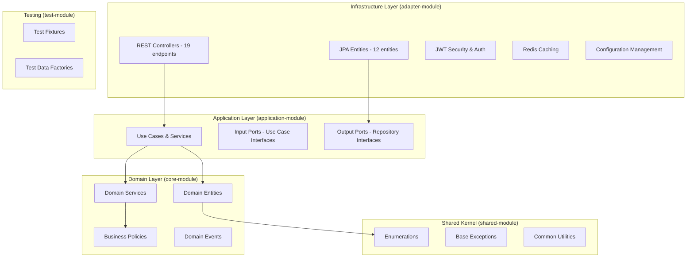

# 🍽️ Prototype Reservation System - Project Context Cache

**Generated**: 2025-01-26 | **Version**: 0.0.1-SNAPSHOT

## 🏗️ Project Architecture Overview

### Hexagonal Architecture Implementation



## 📦 Module Dependencies & Structure

### Module Relationship Matrix

| Module | Dependencies | Purpose | Build Output |
|--------|-------------|---------|--------------|
| **adapter-module** | `shared-module`, `application-module`, `core-module` (compileOnly) | Infrastructure & REST API | Executable JAR (bootJar: true) |
| **application-module** | `shared-module`, `core-module` | Use Cases & Ports | Library JAR (bootJar: false) |
| **core-module** | `shared-module` | Domain Logic | Library JAR (bootJar: false) |
| **shared-module** | None | Shared Utilities | Library JAR (bootJar: false) |
| **test-module** | None | Test Utilities | Library JAR (bootJar: false) |

### Key Architectural Principles
- **Dependency Inversion**: Infrastructure depends on domain, not vice versa
- **Clean Boundaries**: Each layer has clear responsibilities
- **Domain Purity**: Core module has no external framework dependencies
- **Port-Adapter Pattern**: Well-defined interfaces between layers

## 🛠️ Technology Stack & Dependencies

### Core Framework Versions
```yaml
Platform:
  Java: 21 (toolchain)
  Kotlin: 2.0.10
  Spring Boot: 3.4.5
  Gradle: 8.x (wrapper)

Key Dependencies:
  spring-boot-starter-web: Web MVC & REST
  spring-boot-starter-security: JWT Authentication
  spring-boot-starter-data-jpa: JPA & Hibernate
  spring-boot-starter-data-redis: Redis Caching
  spring-boot-starter-validation: Bean Validation
  
Database:
  mysql-connector-j: MySQL 8.0 Driver
  flyway: Database Migration (10.20.1)
  querydsl-jpa: Type-safe Queries (5.1.0)
  
Testing Framework:
  kotest: BDD Testing (5.9.0)
  mockk: Mocking (1.13.10)
  testcontainers: Integration Testing (1.21.0)
  fixture-monkey: Test Data Generation (1.1.11)
  spring-restdocs: API Documentation
```

### Quality & Build Tools
```yaml
Code Quality:
  detekt: Static Analysis (1.23.7) - Zero Tolerance (maxIssues: 0)
  spotless: Code Formatting (6.25.0) with Ktlint (1.2.1)
  jacoco: Test Coverage (0.8.11)

Documentation:
  springdoc-openapi: OpenAPI 3.0 (2.6.0)
  asciidoctor: Documentation Generation (3.3.2)
  restdocs-api-spec: API Spec Generation (0.19.4)

Development Tools:
  p6spy: SQL Logging & Profiling (1.10.0)
  versions: Dependency Updates (0.51.0)
```

## 🗄️ Database & Persistence Layer

### Database Schema Overview
- **12 JPA Entities** mapped to MySQL tables
- **Time-based UUID** primary keys for distributed system readiness
- **Soft delete** pattern with logical delete flags
- **Audit fields** (created_at, updated_at) on all entities
- **Flyway migrations** for database versioning (V1_0 to V1_11)

### Entity Structure
```
📊 Domain Entities:
├── 👤 User Management (3 entities)
│   ├── UserEntity - Core user data
│   ├── UserAccessHistoryEntity - Access tracking
│   └── UserChangeHistoryEntity - Change audit
├── 🏪 Restaurant System (6 entities)
│   ├── RestaurantEntity - Core restaurant data
│   ├── RestaurantPhotoEntity - Image gallery
│   ├── RestaurantWorkingDayEntity - Operating hours
│   ├── RestaurantCuisinesEntity - Cuisine associations
│   ├── RestaurantNationalitiesEntity - Nationality associations
│   └── RestaurantTagsEntity - Tag associations
├── 🏢 Company Management (1 entity)
│   └── CompanyEntity - Restaurant owner companies
├── 📊 Categories (1 entity)
│   └── CategoryEntity - Cuisines, nationalities, tags
└── 👋 User Resignation (1 entity)
    └── WithdrawalUserEntity - Resigned user data
```

### QueryDSL Integration
- **Type-safe queries** generated from JPA entities
- **Custom repository implementations** for complex queries
- **KAPT annotation processing** for Q-class generation

## 🔐 Security Architecture

### Authentication & Authorization
```yaml
Security Model:
  Authentication: JWT-based with refresh tokens
  Authorization: Role-based (USER, SELLER, ADMIN)
  Session Management: Stateless (Redis for token storage)
  Password Hashing: BCrypt with configurable strength

JWT Configuration:
  Secret: Configurable per environment
  Access Token Expiry: 300000ms (5 minutes) - Local
  Issuer: HELLO
  Version: v1

Endpoints Security:
  Public: /api/users/general/sign/*, /api/categories/*
  User: /api/users/general/*, /api/bookings/*
  Seller: /api/restaurants/*, /api/users/seller/*
  Admin: /api/admin/*, /actuator/*
```

### XSS & Security Headers
- **Cross-Site Scripting Protection** with request wrapper
- **Security headers** configuration
- **CORS** management for API access

## 🌐 REST API Structure

### API Endpoint Mapping (19 Controllers)
```
📡 REST Controllers:
├── 👤 User Management (8 controllers)
│   ├── GeneralUserSignUpController - User registration
│   ├── GeneralUserSignInController - Authentication
│   ├── GeneralUserSignOutController - Logout
│   ├── RefreshGeneralUserController - Token refresh
│   ├── FindGeneralUserController - Profile retrieval
│   ├── FindGeneralUserIdsController - ID recovery
│   ├── FindGeneralUserPasswordController - Password reset
│   └── GeneralUserChangePasswordController - Password change
├── 🏪 Restaurant Operations (2 controllers)
│   ├── CreateRestaurantController - Restaurant creation
│   └── ChangeRestaurantController - Restaurant updates
├── 📊 Category Services (3 controllers)
│   ├── FindCuisineController - Cuisine categories
│   ├── FindNationalitiesController - Nationality categories
│   └── FindTagsController - Tag categories
├── 🏢 Company Management (1 controller)
│   └── FindCompaniesController - Company listings
├── 👋 User Account (1 controller)
│   └── ResignUserController - Account deactivation
└── 🔐 Seller Authentication (4 controllers)
    ├── SellerUserSignInController - Seller login
    ├── SellerUserSignOutController - Seller logout
    └── Additional seller-specific endpoints
```

## ⚙️ Configuration Management

### Environment-Specific Configuration
```yaml
Configuration Structure:
  application.yaml: Main configuration with profile imports
  
Profile-Specific Configs:
  ├── persistence/datasource/ - Database configurations
  │   ├── local.yaml - H2 + P6Spy for development
  │   ├── stage.yaml - MySQL staging
  │   └── production.yaml - MySQL production
  ├── security/ - JWT and security settings
  ├── redis/datasource/ - Redis configurations
  ├── restApi/ - API-specific settings
  └── docker/ - Container configurations

Active Profiles: [temporary, local, stage, production]
```

### Docker Environment
```yaml
Services:
  mysql:
    image: mysql:latest
    database: prototype_reservation
    port: 3306
    volumes: mysql_data, init.sql
    healthcheck: mysqladmin ping
    
  redis:
    image: redis:latest
    port: 6379
    healthcheck: redis-cli ping
```

## 🧪 Testing Strategy

### Testing Framework Distribution
```yaml
Testing Layers:
  Domain Layer (core-module):
    Framework: Kotest (BDD style)
    Focus: Business logic, domain rules
    
  Application Layer (application-module):
    Framework: JUnit 5 + MockK
    Focus: Use case orchestration
    
  Infrastructure Layer (adapter-module):
    Framework: Spring Boot Test + Testcontainers
    Focus: Integration testing, API testing
    
Test Data Generation:
  Fixture Monkey: Property-based testing
  MockK: Kotlin-native mocking
  Testcontainers: Real database/Redis testing
```

### Quality Gates & Coverage
- **Zero Detekt Issues** enforced (maxIssues: 0)
- **Automated code formatting** with Spotless + Ktlint
- **Test coverage reporting** with Jacoco
- **Pre-commit hooks** for quality validation

## 📊 Code Statistics

### Project Scale
```yaml
Codebase Metrics:
  Total Kotlin Files: 424
  REST Controllers: 19
  JPA Entities: 12
  Services/Components: 31+
  
Module Distribution:
  adapter-module: Infrastructure & REST API
  application-module: Use Cases & Ports
  core-module: Domain Logic (Pure Kotlin)
  shared-module: Common Utilities
  test-module: Testing Utilities
```

### Build Configuration
- **Multi-module Gradle** project with Kotlin DSL
- **Automated quality checks** integrated into build pipeline
- **Git pre-commit hooks** for code formatting and analysis
- **API documentation generation** with OpenAPI 3.0

## 🚀 Development Workflow

### Key Commands
```bash
# Development
./gradlew bootRun                    # Start application
./gradlew test                       # Run tests
./gradlew jacocoTestReport          # Generate coverage

# Quality
./gradlew spotlessApply             # Format code
./gradlew detekt                    # Static analysis
./gradlew gitPreCommitHook          # Pre-commit validation

# Database
./gradlew flywayMigrate             # Run migrations
./gradlew flywayClean               # Reset database

# Docker
docker-compose up -d                # Start infrastructure
```

### Quality Standards
- **Hexagonal Architecture** enforcement
- **Domain-Driven Design** principles
- **Zero tolerance** for code quality violations
- **Comprehensive testing** at all layers
- **Security-first** development approach

---

**🏆 This project demonstrates enterprise-grade software engineering with clean architecture, comprehensive testing, and strict quality enforcement.**