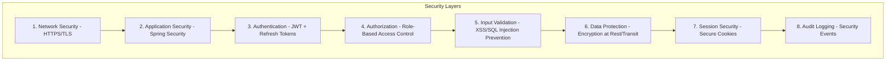

# 🔒 Security Implementation Guide

**Project**: Prototype Reservation System  
**Security Framework**: Spring Security 6.3.5 + JWT  
**Target**: Comprehensive security implementation reference  

## Table of Contents

1. [Security Overview](#security-overview)
2. [Authentication System](#authentication-system)
3. [Authorization Framework](#authorization-framework)
4. [Input Validation & Sanitization](#input-validation--sanitization)
5. [Password Security](#password-security)
6. [Session Management](#session-management)
7. [Security Headers](#security-headers)
8. [Data Protection](#data-protection)
9. [Audit & Monitoring](#audit--monitoring)
10. [Security Testing](#security-testing)
11. [Deployment Security](#deployment-security)

---

## Security Overview

### Security Architecture


### Security Principles Applied
- **Defense in Depth**: Multiple security layers
- **Principle of Least Privilege**: Minimal necessary access
- **Fail Secure**: Default deny, explicit allow
- **Zero Trust**: Verify everything, trust nothing
- **Security by Design**: Built-in, not bolted-on

### Threat Model
**Protected Assets**:
- User credentials and personal information
- Restaurant business data
- System configuration and secrets
- API access and functionality

**Threat Actors**:
- External attackers (credential stuffing, data breaches)
- Malicious users (privilege escalation, data access)
- Insider threats (data exfiltration)
- Automated attacks (bots, scanners)

---

## Authentication System

### JWT Implementation

#### JWT Provider Configuration
```kotlin
// JWTProvider.kt - Core JWT implementation
class JWTProvider(
    secret: String,
    private val issuer: String,
    private val version: JWTVersion,
    override val duration: Long
) : TokenProvider<JWTRecord> {
    
    private val signingKey: SecretKey = Keys.hmacShaKeyFor(
        Base64.getEncoder().encode(secret.toByteArray(Charsets.UTF_8))
    )
    
    override fun tokenize(tokenable: JWTRecord, type: JWTType): String {
        val now = LocalDateTime.now()
        return "$PREFIX " + Jwts.builder()
            .id(tokenable.identity())
            .issuer(issuer)
            .issuedAt(Date.from(now.atZone(ZoneId.systemDefault()).toInstant()))
            .expiration(Date.from(
                now.plus(duration, ChronoUnit.MILLIS)
                    .atZone(ZoneId.systemDefault()).toInstant()
            ))
            .claims(mapOf(
                Pair("id", tokenable.username()),
                Pair("role", tokenable.securityRole.name),
                Pair("version", version.name),
                Pair("type", type.title)
            ))
            .signWith(signingKey)
            .compact()
    }
    
    override fun validate(token: String, type: JWTType): Boolean {
        try {
            val claims: Claims = parse(token)
            val expireDate: Date = claims.expiration
            val now = LocalDateTime.now()
            val expireLocalDateTime = LocalDateTime.ofInstant(
                expireDate.toInstant(), ZoneId.systemDefault()
            )
            val jwtVersion = claims.get("version", String::class.java)
            val jwtType = claims.get("type", String::class.java)
            
            return now.isBefore(expireLocalDateTime) && 
                   type.title == jwtType && 
                   version.name == jwtVersion
        } catch (e: SecurityException) {
            when (e) {
                is ExpiredJwtException -> throw AlreadyExpiredException()
                else -> throw InvalidTokenException()
            }
        }
    }
}
```

#### JWT Filter Implementation
```kotlin
// JwtFilter.kt - Authentication filter
class JwtFilter(
    private val jwtProvider: JWTProvider,
    private val jwtPath: JwtWhitelist?
) : OncePerRequestFilter() {
    
    override fun doFilterInternal(
        request: HttpServletRequest,
        response: HttpServletResponse,
        filterChain: FilterChain
    ) {
        val bearerToken: String = request.getHeader(HttpHeaders.AUTHORIZATION)
        
        if (jwtProvider.validate(bearerToken)) {
            val record = jwtProvider.decrypt(bearerToken)
            val principal = TokenableAuthenticationDetails(
                record.id,
                record.username,
                "",
                record.securityRole
            )
            val authentication: Authentication = UsernamePasswordAuthenticationToken(
                principal, bearerToken, principal.authorities
            )
            SecurityContextHolder.getContext().authentication = authentication
        }
        
        filterChain.doFilter(request, response)
    }
    
    override fun shouldNotFilter(request: HttpServletRequest): Boolean {
        val servletPath = request.servletPath
        return jwtPath?.path?.contains(servletPath) ?: false
    }
}
```

### Token Lifecycle Management

#### Access Token (Short-lived)
- **Duration**: 1 hour
- **Usage**: API access authentication
- **Storage**: Client memory (not localStorage)
- **Transmission**: Authorization header only

#### Refresh Token (Long-lived)
- **Duration**: 30 days
- **Usage**: Access token renewal
- **Storage**: HTTP-only, secure cookies
- **Security**: Rotation on use

#### Token Refresh Flow
```kotlin
@PutMapping("/api/v1/user/general/refresh")
fun refreshToken(
    request: HttpServletRequest,
    response: HttpServletResponse
): RefreshGeneralUserResponse {
    val refreshToken = extractRefreshTokenFromCookie(request)
    
    // Validate refresh token
    if (!jwtProvider.validate(refreshToken, JWTType.REFRESH)) {
        throw InvalidTokenException()
    }
    
    // Generate new access token
    val userRecord = jwtProvider.decrypt(refreshToken)
    val newAccessToken = jwtProvider.tokenize(userRecord, JWTType.ACCESS)
    
    // Rotate refresh token (security best practice)
    val newRefreshToken = jwtProvider.tokenize(userRecord, JWTType.REFRESH)
    setRefreshTokenCookie(response, newRefreshToken)
    
    return RefreshGeneralUserResponse(newAccessToken)
}
```

---

## Authorization Framework

### Role-Based Access Control (RBAC)

#### Role Hierarchy
```kotlin
enum class SecurityRole {
    ROLE_USER,     // Basic users - restaurant customers
    ROLE_MANAGER,  // Restaurant owners and managers
    ROLE_ADMIN;    // System administrators
    
    fun extractRole(): String = this.name.removePrefix("ROLE_")
}
```

#### Hierarchical Permissions
```kotlin
@Bean
fun authorityMapper(): GrantedAuthoritiesMapper = 
    GrantedAuthoritiesMapper { authorities ->
        val mapped = authorities.toMutableList()
        
        // Admin inherits Manager permissions
        if (authorities.any { it.authority == SecurityRole.ROLE_ADMIN.name }) {
            mapped.add(SimpleGrantedAuthority(SecurityRole.ROLE_MANAGER.name))
        }
        
        // Manager inherits User permissions
        if (authorities.any { it.authority == SecurityRole.ROLE_MANAGER.name }) {
            mapped.add(SimpleGrantedAuthority(SecurityRole.ROLE_USER.name))
        }
        
        mapped
    }
```

#### Endpoint Security Configuration
```kotlin
@Bean
fun filterChain(httpSecurity: HttpSecurity): SecurityFilterChain {
    return httpSecurity
        .authorizeHttpRequests {
            // Admin-only endpoints
            it.requestMatchers(*ADMIN_PATHS)
                .hasRole(SecurityRole.ROLE_ADMIN.extractRole())
            
            // Manager/Restaurant owner endpoints  
            it.requestMatchers(*SELLER_PATHS)
                .hasRole(SecurityRole.ROLE_MANAGER.extractRole())
            
            // User endpoints
            it.requestMatchers(*USER_PATHS)
                .hasRole(SecurityRole.ROLE_USER.extractRole())
            
            // Public endpoints
            it.requestMatchers(*COMMON_PATHS)
                .permitAll()
            
            // Default: require authentication
            it.anyRequest().authenticated()
        }
        .build()
}
```

### Method-Level Security
```kotlin
// Future implementation for fine-grained access control
@PreAuthorize("hasRole('MANAGER') and @restaurantService.isOwner(#restaurantId, authentication.name)")
fun updateRestaurant(@PathVariable restaurantId: String, @RequestBody request: UpdateRequest) {
    // Only restaurant owner can update their restaurant
}

@PostAuthorize("returnObject.ownerId == authentication.name or hasRole('ADMIN')")
fun getRestaurantDetails(@PathVariable restaurantId: String): RestaurantDetails {
    // Filter response based on ownership
}
```

### Resource-Based Authorization
```kotlin
// Custom authorization logic in use cases
@UseCase
class ChangeRestaurantService(
    private val loadRestaurant: LoadRestaurant,
    private val extractIdentifier: ExtractIdentifierFromHeaderService
) : UpdateRestaurantUseCase {
    
    @Transactional
    override fun execute(command: ChangeRestaurantCommand): Boolean {
        val restaurant = loadRestaurant.query(command.restaurantId)
        val currentUserId = extractIdentifier.execute(command.authToken)
        
        // Resource-based authorization
        if (restaurant.userId != currentUserId) {
            throw UnauthorizedException("Not authorized to modify this restaurant")
        }
        
        // Proceed with business logic
        return changeRestaurant.command(command.toInquiry())
    }
}
```

---

## Input Validation & Sanitization

### XSS Protection

#### XSS Filter Implementation
```kotlin
class CrossSiteScriptFilter(
    private val xssBlacklist: XssBlacklist?
) : OncePerRequestFilter() {
    
    override fun doFilterInternal(
        request: HttpServletRequest,
        response: HttpServletResponse,
        filterChain: FilterChain
    ) = filterChain.doFilter(RequestWrapper(request), response)
    
    override fun shouldNotFilter(request: HttpServletRequest): Boolean {
        val servletPath = request.servletPath
        return !(xssBlacklist?.path?.contains(servletPath) ?: true)
    }
}
```

#### Request Wrapper for Input Sanitization
```kotlin
class RequestWrapper(request: HttpServletRequest) : HttpServletRequestWrapper(request) {
    
    override fun getParameter(name: String): String? {
        return sanitizeInput(super.getParameter(name))
    }
    
    override fun getParameterValues(name: String): Array<String>? {
        return super.getParameterValues(name)?.map { sanitizeInput(it) }?.toTypedArray()
    }
    
    private fun sanitizeInput(input: String?): String? {
        return input?.let { 
            it.replace("<", "&lt;")
              .replace(">", "&gt;")
              .replace("\"", "&quot;")
              .replace("'", "&#x27;")
              .replace("/", "&#x2F;")
        }
    }
}
```

### Input Validation

#### Bean Validation
```kotlin
data class GeneralUserSignUpRequest(
    @field:NotBlank(message = "Login ID is required")
    @field:Size(min = 4, max = 20, message = "Login ID must be 4-20 characters")
    @field:Pattern(
        regexp = "^[a-zA-Z0-9]+$", 
        message = "Login ID must contain only alphanumeric characters"
    )
    val loginId: String,
    
    @field:NotBlank(message = "Password is required")
    @field:Size(min = 8, max = 18, message = "Password must be 8-18 characters")
    val password: String,
    
    @field:NotBlank(message = "Email is required")
    @field:Email(message = "Invalid email format")
    val email: String,
    
    @field:NotBlank(message = "Mobile is required")
    @field:Pattern(
        regexp = "^010-\\d{4}-\\d{4}$",
        message = "Mobile must be in format: 010-XXXX-XXXX"
    )
    val mobile: String,
    
    @field:NotBlank(message = "Nickname is required")
    @field:Size(min = 2, max = 10, message = "Nickname must be 2-10 characters")
    val nickname: String
)
```

#### Domain-Level Validation
```kotlin
// Value object validation
class LoginId(val loginId: String) {
    init {
        LoginIdValidationPolicy().validate(loginId)
        LoginIdLengthValidationPolicy().validate(loginId)
        LoginIdAlphaNumericValidationPolicy().validate(loginId)
    }
}

// Validation policy implementation
class LoginIdValidationPolicy {
    fun validate(loginId: String) {
        if (loginId.isBlank()) {
            throw InvalidLoginIdException("Login ID cannot be blank")
        }
        if (!loginId.matches(Regex("^[a-zA-Z0-9]+$"))) {
            throw InvalidLoginIdException("Login ID must contain only alphanumeric characters")
        }
    }
}
```

### SQL Injection Prevention

#### QueryDSL Type-Safe Queries
```kotlin
@Component
class AuthenticateUserRepository(
    private val query: JPAQueryFactory
) : AuthenticateGeneralUser {
    
    override fun query(request: AuthenticateGeneralUserInquiry): AuthenticateGeneralUserResult? {
        // Type-safe query with no string concatenation
        return query.select(
            Projections.constructor(
                AuthenticateGeneralUserResult::class.java,
                userEntity.identifier,
                userEntity.loginId,
                userEntity.password,
                userEntity.failCount,
                userEntity.userStatus,
                userEntity.lockedDatetime
            )
        )
        .from(userEntity)
        .where(
            UserQuerySpec.loginIdEq(request.loginId),  // Parameterized query
            UserQuerySpec.roleIsUser(request.role)
        )
        .fetchOne()
    }
}
```

#### Parameterized Queries
```kotlin
// QuerySpec for safe query building
object UserQuerySpec {
    fun loginIdEq(loginId: String): BooleanExpression? {
        return if (loginId.isBlank()) null else userEntity.loginId.eq(loginId)
    }
    
    fun roleIsUser(role: Role): BooleanExpression {
        return userEntity.role.eq(role)
    }
}
```

---

## Password Security

### Password Hashing

#### BCrypt Configuration
```kotlin
class PasswordEncoderUtility {
    companion object {
        private const val BCRYPT_STRENGTH = 12  // High security level
        
        fun getInstance(): PasswordEncoder {
            return BCryptPasswordEncoder(BCRYPT_STRENGTH)
        }
    }
}

@Bean
fun passwordEncoder(): PasswordEncoder = PasswordEncoderUtility.getInstance()
```

### Password Policy Enforcement

#### Password Complexity Validation
```kotlin
class PasswordComplexityValidationPolicy : PasswordValidationPolicy {
    companion object {
        val PASSWORD_COMPLEXITY_REG_EXP = Regex(
            """^(?=.*[a-z])(?=.*[A-Z])(?=.*\d)(?=.*[~!@#$%^&*()_+\-={}|\[\]:;"'<>,.?/]).{8,18}$"""
        )
    }
    
    override val reason: String = 
        "Password must contain uppercase, lowercase, numeric, and special characters"
    
    override fun validate(rawPassword: String): Boolean =
        PASSWORD_COMPLEXITY_REG_EXP.matches(rawPassword)
}
```

#### Password History Prevention
```kotlin
class ChangeGeneralUserPasswordDomainService(
    private val passwordEncoder: PasswordEncoder
) {
    fun changePassword(user: User, newPassword: String): User {
        // Prevent password reuse
        if (passwordEncoder.matches(newPassword, user.userEncodedPassword)) {
            throw UseSamePasswordAsBeforeException()
        }
        
        // Check against old password if available
        user.userOldEncodedPassword?.let { oldPassword ->
            if (passwordEncoder.matches(newPassword, oldPassword)) {
                throw UseSamePasswordAsBeforeException()
            }
        }
        
        val encodedNewPassword = passwordEncoder.encode(newPassword)
        val passwordObject = Password(
            encodedPassword = encodedNewPassword,
            oldEncodedPassword = user.userEncodedPassword,
            changedDateTime = LocalDateTime.now()
        )
        
        user.changePassword(passwordObject)
        return user
    }
}
```

### Account Security

#### Account Lockout Policy
```kotlin
class NormalSignInPolicy : SignInPolicy {
    companion object {
        private const val MAX_FAILURE_COUNT = 5
        private const val LOCK_DURATION_HOURS = 24L
    }
    
    override fun apply(record: AuthenticationRecord): AuthenticationResult {
        return when {
            record.failCount >= MAX_FAILURE_COUNT -> {
                AuthenticationResult.locked(
                    lockUntil = LocalDateTime.now().plusHours(LOCK_DURATION_HOURS)
                )
            }
            record.isPasswordExpired() -> {
                AuthenticationResult.passwordExpired()
            }
            else -> AuthenticationResult.success()
        }
    }
}
```

---

## Session Management

### Secure Cookie Configuration

#### Refresh Token Cookie Settings
```kotlin
object RefreshTokenDefinitions {
    const val REFRESH_TOKEN_KEY = "refreshToken"
    const val REFRESH_TOKEN_PATH = "/"
    const val SECURE = true        // HTTPS only
    const val HTTP_ONLY = true     // No JavaScript access
    const val SAME_SITE = "Strict" // CSRF protection
    const val MAX_AGE = 30 * 24 * 60 * 60 // 30 days
}

// Cookie creation in controller
val refreshTokenCookie = Cookie(RefreshTokenDefinitions.REFRESH_TOKEN_KEY, result.refreshToken)
refreshTokenCookie.path = RefreshTokenDefinitions.REFRESH_TOKEN_PATH
refreshTokenCookie.secure = RefreshTokenDefinitions.SECURE
refreshTokenCookie.isHttpOnly = RefreshTokenDefinitions.HTTP_ONLY
refreshTokenCookie.maxAge = RefreshTokenDefinitions.MAX_AGE
httpServletResponse.addCookie(refreshTokenCookie)
```

### Session Security

#### Redis Session Storage
```kotlin
@Configuration
class RedisTemplateConfig {
    @Bean
    fun redisTemplate(connectionFactory: RedisConnectionFactory): RedisTemplate<String, Any> {
        return RedisTemplate<String, Any>().apply {
            setConnectionFactory(connectionFactory)
            keySerializer = StringRedisSerializer()
            valueSerializer = GenericJackson2JsonRedisSerializer()
            hashKeySerializer = StringRedisSerializer()
            hashValueSerializer = GenericJackson2JsonRedisSerializer()
        }
    }
}
```

#### Session Invalidation
```kotlin
@DeleteMapping("/api/v1/user/general/sign-out")
fun signOut(
    request: HttpServletRequest,
    response: HttpServletResponse
): BooleanResponse {
    // Invalidate refresh token in Redis
    val refreshToken = extractRefreshTokenFromCookie(request)
    refreshToken?.let { 
        redisTemplate.delete("refresh_token:$it")
    }
    
    // Clear refresh token cookie
    val cookie = Cookie(RefreshTokenDefinitions.REFRESH_TOKEN_KEY, "")
    cookie.maxAge = 0
    cookie.path = RefreshTokenDefinitions.REFRESH_TOKEN_PATH
    response.addCookie(cookie)
    
    return BooleanResponse.success(true)
}
```

---

## Security Headers

### Security Header Configuration
```kotlin
@Bean
fun filterChain(httpSecurity: HttpSecurity): SecurityFilterChain {
    return httpSecurity
        .headers { headers ->
            headers
                .frameOptions { it.sameOrigin() }  // Allow same-origin frames
                .contentTypeOptions { it.and() }   // X-Content-Type-Options: nosniff
                .httpStrictTransportSecurity { hstsConfig ->
                    hstsConfig
                        .maxAgeInSeconds(31536000)  // 1 year
                        .includeSubdomains(true)
                }
                .and()
        }
        .build()
}
```

### Custom Security Headers (Future Enhancement)
```kotlin
@Component
class SecurityHeadersFilter : OncePerRequestFilter() {
    override fun doFilterInternal(
        request: HttpServletRequest,
        response: HttpServletResponse,
        filterChain: FilterChain
    ) {
        // Content Security Policy
        response.setHeader(
            "Content-Security-Policy", 
            "default-src 'self'; script-src 'self' 'unsafe-inline'; style-src 'self' 'unsafe-inline'"
        )
        
        // Referrer Policy
        response.setHeader("Referrer-Policy", "strict-origin-when-cross-origin")
        
        // Feature Policy
        response.setHeader(
            "Permissions-Policy", 
            "geolocation=(), microphone=(), camera=()"
        )
        
        filterChain.doFilter(request, response)
    }
}
```

---

## Data Protection

### Encryption at Rest

#### Sensitive Data Encryption
```kotlin
class BidirectionalEncryptUtility(
    private val encryptionKey: String
) {
    private val algorithm = "AES/GCB/PKCS5Padding"
    private val secretKey: SecretKey = SecretKeySpec(
        encryptionKey.toByteArray(), "AES"
    )
    
    fun encrypt(plainText: String): String {
        val cipher = Cipher.getInstance(algorithm)
        cipher.init(Cipher.ENCRYPT_MODE, secretKey)
        val encryptedBytes = cipher.doFinal(plainText.toByteArray())
        return Base64.getEncoder().encodeToString(encryptedBytes)
    }
    
    fun decrypt(encryptedText: String): String {
        val cipher = Cipher.getInstance(algorithm)
        cipher.init(Cipher.DECRYPT_MODE, secretKey)
        val encryptedBytes = Base64.getDecoder().decode(encryptedText)
        val decryptedBytes = cipher.doFinal(encryptedBytes)
        return String(decryptedBytes)
    }
}
```

#### PII Data Encryption
```kotlin
// Encrypted attributes for resigned users
class EncryptedAttributes(
    val encryptedEmail: String,
    val encryptedMobile: String
) {
    companion object {
        fun from(
            personalAttributes: PersonalAttributes,
            encryptUtility: BidirectionalEncryptUtility
        ): EncryptedAttributes {
            return EncryptedAttributes(
                encryptedEmail = encryptUtility.encrypt(personalAttributes.email),
                encryptedMobile = encryptUtility.encrypt(personalAttributes.mobile)
            )
        }
    }
}
```

### Data Masking

#### Logging Data Masking
```kotlin
class MaskingUtility {
    companion object {
        fun maskEmail(email: String): String {
            val parts = email.split("@")
            if (parts.size != 2) return email
            
            val localPart = parts[0]
            val domain = parts[1]
            
            return when {
                localPart.length <= 2 -> "${localPart[0]}***@$domain"
                else -> "${localPart.take(2)}***@$domain"
            }
        }
        
        fun maskMobile(mobile: String): String {
            return if (mobile.length >= 4) {
                "${mobile.take(3)}****${mobile.takeLast(4)}"
            } else mobile
        }
        
        fun maskPassword(password: String): String = "***"
    }
}
```

---

## Audit & Monitoring

### Security Event Logging

#### Access History Tracking
```kotlin
@Component
class CreateUserAccessAdapter(
    private val userAccessHistoryJpaRepository: UserAccessHistoryJpaRepository
) : CreateUserAccessHistory {
    
    override fun command(request: CreateUserAccessHistoryInquiry): Boolean {
        val entity = UserAccessHistoryEntity(
            userIdentifier = request.userIdentifier,
            ipAddress = request.ipAddress,
            userAgent = request.userAgent,
            accessStatus = request.accessStatus,
            failReason = request.failReason
        )
        
        return userAccessHistoryJpaRepository.save(entity) != null
    }
}
```

#### Authentication Event Logging
```kotlin
class AuthenticateGeneralUserService {
    @Transactional
    override fun execute(query: AuthenticateGeneralUserQuery): AuthenticateGeneralUserResult {
        try {
            // Authentication logic...
            
            // Log successful authentication
            createUserAccessHistory.command(
                CreateUserAccessHistoryInquiry(
                    userIdentifier = result.userIdentifier,
                    ipAddress = query.ipAddress,
                    userAgent = query.userAgent,
                    accessStatus = AccessStatus.SUCCESS
                )
            )
            
            return result
        } catch (e: AuthenticationException) {
            // Log failed authentication
            createUserAccessHistory.command(
                CreateUserAccessHistoryInquiry(
                    userIdentifier = query.loginId,
                    ipAddress = query.ipAddress,
                    userAgent = query.userAgent,
                    accessStatus = AccessStatus.FAILURE,
                    failReason = e.message
                )
            )
            throw e
        }
    }
}
```

### Security Monitoring (Future Enhancement)

#### Failed Authentication Monitoring
```kotlin
@Component
class SecurityMonitoringService {
    
    @EventListener
    fun handleAuthenticationFailure(event: AuthenticationFailureEvent) {
        val ipAddress = extractIpAddress(event)
        val failureCount = getRecentFailureCount(ipAddress)
        
        if (failureCount > SUSPICIOUS_THRESHOLD) {
            alertSecurityTeam("Suspicious authentication attempts from $ipAddress")
            temporarilyBlockIp(ipAddress)
        }
    }
    
    @EventListener
    fun handleMultipleAccountLockouts(event: AccountLockoutEvent) {
        // Monitor for distributed attacks
        if (getRecentLockoutCount() > LOCKOUT_THRESHOLD) {
            alertSecurityTeam("Multiple account lockouts detected - possible attack")
        }
    }
}
```

---

## Security Testing

### Authentication Testing

#### JWT Security Tests
```kotlin
@SpringBootTest
class JwtSecurityTest : StringSpec({
    
    "should reject expired JWT token" {
        val expiredToken = createExpiredJwtToken()
        
        mockMvc.get("/api/v1/user/general/profile") {
            header("Authorization", expiredToken)
        }.andExpect {
            status { isUnauthorized() }
        }
    }
    
    "should reject malformed JWT token" {
        val malformedToken = "Bearer invalid.token.here"
        
        mockMvc.get("/api/v1/user/general/profile") {
            header("Authorization", malformedToken)
        }.andExpect {
            status { isUnauthorized() }
        }
    }
    
    "should reject token with invalid signature" {
        val invalidToken = createTokenWithInvalidSignature()
        
        mockMvc.get("/api/v1/user/general/profile") {
            header("Authorization", invalidToken)
        }.andExpect {
            status { isUnauthorized() }
        }
    }
})
```

### Authorization Testing

#### Role-Based Access Control Tests
```kotlin
@SpringBootTest
class AuthorizationTest : StringSpec({
    
    "should allow USER role to access user endpoints" {
        val userToken = createTokenWithRole(SecurityRole.ROLE_USER)
        
        mockMvc.get("/api/v1/user/general/profile") {
            header("Authorization", userToken)
        }.andExpected {
            status { isOk() }
        }
    }
    
    "should deny USER role access to admin endpoints" {
        val userToken = createTokenWithRole(SecurityRole.ROLE_USER)
        
        mockMvc.get("/api/v1/admin/users") {
            header("Authorization", userToken)
        }.andExpect {
            status { isForbidden() }
        }
    }
    
    "should allow ADMIN role access to all endpoints" {
        val adminToken = createTokenWithRole(SecurityRole.ROLE_ADMIN)
        
        mockMvc.get("/api/v1/admin/users") {
            header("Authorization", adminToken)
        }.andExpect {
            status { isOk() }
        }
    }
})
```

### Input Validation Testing

#### XSS Protection Tests
```kotlin
@SpringBootTest
class XssProtectionTest : StringSpec({
    
    "should sanitize XSS payload in request parameters" {
        val xssPayload = "<script>alert('xss')</script>"
        
        mockMvc.post("/api/v1/user/general/sign-up") {
            contentType = MediaType.APPLICATION_JSON
            content = """
                {
                    "loginId": "testuser",
                    "password": "SecurePass123!",
                    "email": "test@example.com",
                    "mobile": "010-1234-5678",
                    "nickname": "$xssPayload"
                }
            """.trimIndent()
        }.andExpect {
            status { isBadRequest() }
            jsonPath("$.error") { exists() }
        }
    }
})
```

### Penetration Testing Checklist

#### OWASP Top 10 Testing
- [ ] **A1 - Injection**: SQL injection, XSS prevention
- [ ] **A2 - Broken Authentication**: Session management, password policies
- [ ] **A3 - Sensitive Data Exposure**: Encryption, data masking
- [ ] **A4 - XML External Entities**: Input validation
- [ ] **A5 - Broken Access Control**: Authorization testing
- [ ] **A6 - Security Misconfiguration**: Header configuration
- [ ] **A7 - Cross-Site Scripting**: XSS protection
- [ ] **A8 - Insecure Deserialization**: Input validation
- [ ] **A9 - Using Components with Known Vulnerabilities**: Dependency scanning
- [ ] **A10 - Insufficient Logging & Monitoring**: Audit trails

---

## Deployment Security

### Environment Configuration

#### Production Security Settings
```yaml
# Production application.yaml
spring:
  security:
    require-ssl: true
  session:
    cookie:
      secure: true
      http-only: true
      same-site: strict

server:
  ssl:
    enabled: true
    key-store: classpath:keystore.p12
    key-store-password: ${SSL_KEYSTORE_PASSWORD}
    key-store-type: PKCS12
  
app:
  jwt:
    secret: ${JWT_SECRET}  # Strong secret from environment
    issuer: ${JWT_ISSUER}
    access-token-duration: 3600000    # 1 hour
    refresh-token-duration: 2592000000 # 30 days
```

#### Secret Management
```bash
# Environment variables for production
export JWT_SECRET="$(openssl rand -base64 64)"
export DATABASE_PASSWORD="$(vault kv get -field=password secret/db)"
export ENCRYPTION_KEY="$(vault kv get -field=key secret/encryption)"
```

### Network Security

#### HTTPS Configuration
```kotlin
@Configuration
class SslConfig {
    
    @Bean
    fun servletWebServerFactory(): ServletWebServerFactory {
        val tomcat = TomcatServletWebServerFactory()
        
        tomcat.addAdditionalTomcatConnectors(createHttpToHttpsRedirectConnector())
        
        return tomcat
    }
    
    private fun createHttpToHttpsRedirectConnector(): Connector {
        val connector = Connector(TomcatServletWebServerFactory.DEFAULT_PROTOCOL)
        connector.scheme = "http"
        connector.port = 8080
        connector.secure = false
        connector.redirectPort = 8443
        return connector
    }
}
```

### Container Security

#### Docker Security Best Practices
```dockerfile
# Use non-root user
FROM openjdk:21-jre-slim
RUN addgroup --system appgroup && adduser --system appuser --ingroup appgroup
USER appuser

# Set secure file permissions
COPY --chown=appuser:appgroup target/app.jar app.jar

# Run with security options
ENTRYPOINT ["java", "-jar", "-Djava.security.egd=file:/dev/./urandom", "/app.jar"]
```

#### Kubernetes Security
```yaml
apiVersion: apps/v1
kind: Deployment
metadata:
  name: reservation-system
spec:
  template:
    spec:
      securityContext:
        runAsNonRoot: true
        runAsUser: 1000
        fsGroup: 1000
      containers:
      - name: app
        securityContext:
          allowPrivilegeEscalation: false
          readOnlyRootFilesystem: true
          capabilities:
            drop:
            - ALL
```

---

## Security Checklist

### Development Security Checklist
- [ ] All inputs validated and sanitized
- [ ] SQL injection prevention through parameterized queries
- [ ] XSS protection implemented
- [ ] Authentication implemented with secure tokens
- [ ] Authorization enforced at all levels
- [ ] Passwords properly hashed with BCrypt
- [ ] Sensitive data encrypted at rest
- [ ] Security headers configured
- [ ] HTTPS enforced in production
- [ ] Security tests written and passing

### Production Security Checklist
- [ ] SSL/TLS certificates configured
- [ ] Environment secrets properly managed
- [ ] Database connections encrypted
- [ ] Container security hardened
- [ ] Network security configured
- [ ] Monitoring and alerting enabled
- [ ] Backup and recovery tested
- [ ] Incident response plan prepared
- [ ] Security audit logs enabled
- [ ] Dependency vulnerability scanning

### Security Maintenance
- [ ] Regular security updates applied
- [ ] Dependency vulnerability monitoring
- [ ] Security audit logs reviewed
- [ ] Access permissions reviewed quarterly
- [ ] Penetration testing annually
- [ ] Security training for developers
- [ ] Incident response procedures tested
- [ ] Business continuity plan maintained

---

## Conclusion

This security implementation provides:

- **Multi-layered Defense**: Authentication, authorization, input validation, encryption
- **Industry Standards**: JWT tokens, BCrypt hashing, HTTPS, secure headers
- **Comprehensive Testing**: Security-focused test suites for all components
- **Production Ready**: Secure deployment configurations and monitoring
- **Maintainable**: Clear separation of security concerns across architecture layers

The security framework follows modern best practices while maintaining simplicity and auditability for ongoing security management.