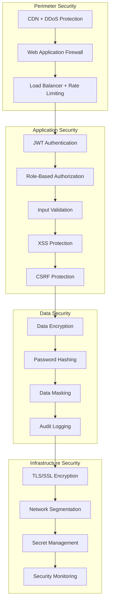

# 🔐 Security Guidelines

## 📋 Table of Contents

- [Security Architecture](#-security-architecture)
- [Authentication & Authorization](#-authentication--authorization)
- [Data Protection](#-data-protection)
- [Input Validation & Sanitization](#-input-validation--sanitization)
- [Security Headers & CORS](#-security-headers--cors)
- [Vulnerability Management](#-vulnerability-management)
- [Security Monitoring](#-security-monitoring)
- [Compliance & Best Practices](#-compliance--best-practices)

## 🏗️ Security Architecture

### Security Layers



### Threat Model

| Threat Category | Risk Level | Mitigation Strategy |
|----------------|------------|-------------------|
| **Injection Attacks** | High | Input validation, parameterized queries |
| **Broken Authentication** | High | JWT tokens, MFA, rate limiting |
| **Sensitive Data Exposure** | High | Encryption, data masking, HTTPS |
| **XML/XXE** | Medium | Input validation, secure parsers |
| **Broken Access Control** | High | RBAC, principle of least privilege |
| **Security Misconfiguration** | Medium | Automated security scanning, hardening |
| **Cross-Site Scripting** | Medium | Input sanitization, CSP headers |
| **Insecure Deserialization** | Low | Avoid deserialization, validation |
| **Known Vulnerabilities** | Medium | Dependency scanning, regular updates |
| **Insufficient Logging** | Low | Comprehensive audit logging |

## 🔑 Authentication & Authorization

### JWT Authentication Implementation

```kotlin
// JWT Provider with secure configuration
@Component
class JWTProvider(
    private val jwtProperties: JWTProperties
) {
    private val logger = LoggerFactory.getLogger<JWTProvider>()
    
    private val secretKey: SecretKey by lazy {
        val keyBytes = jwtProperties.secret.toByteArray(StandardCharsets.UTF_8)
        require(keyBytes.size >= 32) { "JWT secret must be at least 256 bits (32 bytes)" }
        Keys.hmacShaKeyFor(keyBytes)
    }
    
    fun generateAccessToken(user: User): String {
        val now = Instant.now()
        val expiry = now.plusMillis(jwtProperties.accessTokenExpiry)
        
        return Jwts.builder()
            .setSubject(user.id.toString())
            .setIssuedAt(Date.from(now))
            .setExpiration(Date.from(expiry))
            .claim("loginId", user.loginId)
            .claim("role", user.role.name)
            .claim("status", user.status.name)
            .claim("tokenType", JWTType.ACCESS.name)
            .signWith(secretKey, SignatureAlgorithm.HS256)
            .compact()
    }
    
    fun generateRefreshToken(user: User): String {
        val now = Instant.now()
        val expiry = now.plusMillis(jwtProperties.refreshTokenExpiry)
        
        return Jwts.builder()
            .setSubject(user.id.toString())
            .setIssuedAt(Date.from(now))
            .setExpiration(Date.from(expiry))
            .claim("tokenType", JWTType.REFRESH.name)
            .signWith(secretKey, SignatureAlgorithm.HS256)
            .compact()
    }
    
    fun validateToken(token: String): Boolean {
        return try {
            val claims = Jwts.parserBuilder()
                .setSigningKey(secretKey)
                .build()
                .parseClaimsJws(token)
            
            // Additional validation
            val tokenType = claims.body["tokenType"] as? String
            val expiration = claims.body.expiration
            
            when {
                expiration?.before(Date()) == true -> {
                    logger.warn("Token expired: {}", claims.body.subject)
                    false
                }
                tokenType.isNullOrBlank() -> {
                    logger.warn("Invalid token type: {}", claims.body.subject)
                    false
                }
                else -> true
            }
        } catch (ex: JwtException) {
            logger.warn("Invalid JWT token: {}", ex.message)
            false
        }
    }
    
    fun extractClaims(token: String): Claims? {
        return try {
            Jwts.parserBuilder()
                .setSigningKey(secretKey)
                .build()
                .parseClaimsJws(token)
                .body
        } catch (ex: JwtException) {
            logger.error("Failed to extract claims from token", ex)
            null
        }
    }
}
```

### Role-Based Access Control

```kotlin
// Security configuration with RBAC
@Configuration
@EnableWebSecurity
@EnableMethodSecurity(prePostEnabled = true)
class SecurityConfig(
    private val jwtProvider: JWTProvider,
    private val customAuthenticationEntryPoint: CustomAuthenticationEntryPoint,
    private val customAccessDenialHandler: CustomAccessDenialHandler
) {
    
    @Bean
    fun passwordEncoder(): PasswordEncoder {
        return BCryptPasswordEncoder(12) // Use strength 12 for better security
    }
    
    @Bean
    fun securityFilterChain(http: HttpSecurity): SecurityFilterChain {
        return http
            .csrf { it.disable() } // CSRF disabled for API, using JWT
            .sessionManagement { it.sessionCreationPolicy(SessionCreationPolicy.STATELESS) }
            .exceptionHandling { exceptions ->
                exceptions
                    .authenticationEntryPoint(customAuthenticationEntryPoint)
                    .accessDeniedHandler(customAccessDenialHandler)
            }
            .authorizeHttpRequests { auth ->
                // Public endpoints
                auth.requestMatchers(
                    "/api/users/general/sign/up",
                    "/api/users/general/sign/in",
                    "/api/users/general/find/**",
                    "/api/categories/**",
                    "/actuator/health",
                    "/actuator/info"
                ).permitAll()
                
                // User endpoints
                auth.requestMatchers(
                    "/api/users/general/**",
                    "/api/bookings/**"
                ).hasRole("USER")
                
                // Seller endpoints
                auth.requestMatchers(
                    "/api/restaurants/**",
                    "/api/users/seller/**"
                ).hasRole("SELLER")
                
                // Admin endpoints
                auth.requestMatchers(
                    "/api/admin/**",
                    "/actuator/**"
                ).hasRole("ADMIN")
                
                // All other requests require authentication
                auth.anyRequest().authenticated()
            }
            .addFilterBefore(jwtAuthenticationFilter(), UsernamePasswordAuthenticationFilter::class.java)
            .headers { headers ->
                headers
                    .frameOptions().deny()
                    .contentTypeOptions().and()
                    .httpStrictTransportSecurity { hstsConfig ->
                        hstsConfig
                            .maxAgeInSeconds(31536000)
                            .includeSubdomains(true)
                            .preload(true)
                    }
            }
            .build()
    }
    
    @Bean
    fun jwtAuthenticationFilter(): JwtAuthenticationFilter {
        return JwtAuthenticationFilter(jwtProvider)
    }
}

// Method-level security
@RestController
@PreAuthorize("hasRole('USER')")
class BookingController(
    private val createBookingUseCase: CreateBookingUseCase,
    private val bookingSecurityService: BookingSecurityService
) {
    
    @PostMapping("/api/bookings")
    @PreAuthorize("@bookingSecurityService.canCreateBooking(authentication.name, #request.restaurantId)")
    fun createBooking(
        @Valid @RequestBody request: CreateBookingRequest,
        authentication: Authentication
    ): ResponseEntity<BookingResponse> {
        // Implementation
    }
    
    @GetMapping("/api/bookings/{id}")
    @PreAuthorize("@bookingSecurityService.canViewBooking(authentication.name, #id)")
    fun getBooking(@PathVariable id: UUID): ResponseEntity<BookingResponse> {
        // Implementation
    }
}

// Security service for fine-grained authorization
@Service
class BookingSecurityService(
    private val findBooking: FindBooking,
    private val findUser: FindUser
) {
    fun canViewBooking(userId: String, bookingId: UUID): Boolean {
        val booking = findBooking.findById(bookingId) ?: return false
        val user = findUser.findById(UUID.fromString(userId)) ?: return false
        
        return when (user.role) {
            Role.ADMIN -> true
            Role.USER -> booking.userId == user.id
            Role.SELLER -> {
                // Sellers can view bookings for their restaurants
                // Implementation would check restaurant ownership
                false
            }
        }
    }
    
    fun canCreateBooking(userId: String, restaurantId: UUID): Boolean {
        val user = findUser.findById(UUID.fromString(userId)) ?: return false
        
        return when {
            user.status != UserStatus.ACTIVE -> false
            user.role != Role.USER -> false
            else -> true
        }
    }
}
```

### Rate Limiting & Brute Force Protection

```kotlin
// Rate limiting filter
@Component
class RateLimitingFilter : OncePerRequestFilter() {
    private val rateLimiter = ConcurrentHashMap<String, Bucket>()
    
    override fun doFilterInternal(
        request: HttpServletRequest,
        response: HttpServletResponse,
        filterChain: FilterChain
    ) {
        val clientId = getClientIdentifier(request)
        val requestPath = request.requestURI
        
        val bucket = getBucket(clientId, requestPath)
        
        if (bucket.tryConsume(1)) {
            filterChain.doFilter(request, response)
        } else {
            response.status = HttpStatus.TOO_MANY_REQUESTS.value()
            response.contentType = MediaType.APPLICATION_JSON_VALUE
            response.writer.write(
                """
                {
                  "error": {
                    "code": "RATE_LIMIT_EXCEEDED",
                    "message": "Too many requests. Please try again later."
                  },
                  "timestamp": "${Instant.now()}",
                  "status": "ERROR"
                }
                """.trimIndent()
            )
        }
    }
    
    private fun getBucket(clientId: String, path: String): Bucket {
        val key = "$clientId:$path"
        return rateLimiter.computeIfAbsent(key) { createBucket(path) }
    }
    
    private fun createBucket(path: String): Bucket {
        val capacity = when {
            path.contains("/sign/in") -> 5L  // 5 login attempts per minute
            path.contains("/sign/up") -> 3L  // 3 signup attempts per minute
            path.startsWith("/api/") -> 100L  // 100 API requests per minute
            else -> 50L
        }
        
        val refill = Refill.intervally(capacity, Duration.ofMinutes(1))
        val bandwidth = Bandwidth.classic(capacity, refill)
        
        return Bucket4j.builder()
            .addLimit(bandwidth)
            .build()
    }
    
    private fun getClientIdentifier(request: HttpServletRequest): String {
        // Use IP address as identifier (consider using user ID for authenticated requests)
        return request.remoteAddr ?: "unknown"
    }
}

// Failed login tracking
@Service
class AuthenticationAttemptService {
    private val attemptCache = CacheBuilder.newBuilder()
        .maximumSize(1000)
        .expireAfterWrite(24, TimeUnit.HOURS)
        .build<String, AttemptInfo>()
    
    data class AttemptInfo(
        var failedAttempts: Int = 0,
        var lastAttempt: Instant = Instant.now(),
        var blockedUntil: Instant? = null
    )
    
    fun recordFailedAttempt(loginId: String, ipAddress: String) {
        val key = "$loginId:$ipAddress"
        val attempt = attemptCache.get(key) { AttemptInfo() }
        
        attempt.failedAttempts++
        attempt.lastAttempt = Instant.now()
        
        // Block after 5 failed attempts
        if (attempt.failedAttempts >= 5) {
            attempt.blockedUntil = Instant.now().plusSeconds(900) // 15 minutes
        }
        
        attemptCache.put(key, attempt)
    }
    
    fun isBlocked(loginId: String, ipAddress: String): Boolean {
        val key = "$loginId:$ipAddress"
        val attempt = attemptCache.getIfPresent(key) ?: return false
        
        return attempt.blockedUntil?.isAfter(Instant.now()) == true
    }
    
    fun recordSuccessfulAttempt(loginId: String, ipAddress: String) {
        val key = "$loginId:$ipAddress"
        attemptCache.invalidate(key)
    }
}
```

## 🛡️ Data Protection

### Encryption at Rest

```kotlin
// Bidirectional encryption for sensitive data
@Component
class BidirectionalEncryptUtility(
    private val encryptProperties: BidirectionalEncryptProperties
) {
    private val cipher: Cipher = Cipher.getInstance("AES/GCM/NoPadding")
    private val secretKey: SecretKey by lazy {
        val keyBytes = encryptProperties.key.toByteArray(StandardCharsets.UTF_8)
        require(keyBytes.size == 32) { "Encryption key must be exactly 256 bits (32 bytes)" }
        SecretKeySpec(keyBytes, "AES")
    }
    
    fun encrypt(plaintext: String): String {
        return try {
            cipher.init(Cipher.ENCRYPT_MODE, secretKey)
            val iv = cipher.iv
            val ciphertext = cipher.doFinal(plaintext.toByteArray(StandardCharsets.UTF_8))
            
            // Combine IV and ciphertext
            val combined = ByteArray(iv.size + ciphertext.size)
            System.arraycopy(iv, 0, combined, 0, iv.size)
            System.arraycopy(ciphertext, 0, combined, iv.size, ciphertext.size)
            
            Base64.getEncoder().encodeToString(combined)
        } catch (ex: Exception) {
            throw EncryptionException("Failed to encrypt data", ex)
        }
    }
    
    fun decrypt(encryptedData: String): String {
        return try {
            val combined = Base64.getDecoder().decode(encryptedData)
            
            // Extract IV and ciphertext
            val ivSize = 12 // GCM IV size
            val iv = ByteArray(ivSize)
            val ciphertext = ByteArray(combined.size - ivSize)
            
            System.arraycopy(combined, 0, iv, 0, ivSize)
            System.arraycopy(combined, ivSize, ciphertext, 0, ciphertext.size)
            
            cipher.init(Cipher.DECRYPT_MODE, secretKey, GCMParameterSpec(128, iv))
            val plaintext = cipher.doFinal(ciphertext)
            
            String(plaintext, StandardCharsets.UTF_8)
        } catch (ex: Exception) {
            throw EncryptionException("Failed to decrypt data", ex)
        }
    }
}

// Password hashing with BCrypt
@Component
class PasswordEncoderUtility {
    private val encoder = BCryptPasswordEncoder(12)
    
    fun encode(rawPassword: String): String {
        require(rawPassword.length >= 8) { "Password must be at least 8 characters long" }
        return encoder.encode(rawPassword)
    }
    
    fun matches(rawPassword: String, encodedPassword: String): Boolean {
        return encoder.matches(rawPassword, encodedPassword)
    }
}

// Data masking for logs and responses
@Component
class MaskingUtility {
    companion object {
        private val EMAIL_PATTERN = Regex("([a-zA-Z0-9._%+-]+)@([a-zA-Z0-9.-]+\\.[a-zA-Z]{2,})")
        private val PHONE_PATTERN = Regex("(\\+?\\d{1,3}[-.\\s]?)?\\(?\\d{3}\\)?[-.\\s]?\\d{3}[-.\\s]?\\d{4}")
        private val CREDIT_CARD_PATTERN = Regex("\\b\\d{4}[-.\\s]?\\d{4}[-.\\s]?\\d{4}[-.\\s]?\\d{4}\\b")
    }
    
    fun maskEmail(email: String): String {
        return EMAIL_PATTERN.replace(email) { matchResult ->
            val (username, domain) = matchResult.destructured
            val maskedUsername = if (username.length <= 2) {
                "*".repeat(username.length)
            } else {
                username.take(2) + "*".repeat(username.length - 2)
            }
            "$maskedUsername@$domain"
        }
    }
    
    fun maskPhone(phone: String): String {
        return PHONE_PATTERN.replace(phone) { matchResult ->
            val original = matchResult.value
            if (original.length <= 4) {
                "*".repeat(original.length)
            } else {
                "*".repeat(original.length - 4) + original.takeLast(4)
            }
        }
    }
    
    fun maskSensitiveData(text: String): String {
        var masked = text
        masked = maskEmail(masked)
        masked = maskPhone(masked)
        masked = CREDIT_CARD_PATTERN.replace(masked) { "****-****-****-${it.value.takeLast(4)}" }
        return masked
    }
}
```

### Secure Data Handling

```kotlin
// Entity-level encryption
@Entity
@Table(name = "users")
class UserEntity : TimeBasedPrimaryKey(), AuditDateTime {
    @Column(name = "login_id", unique = true)
    var loginId: String = ""
    
    @Column(name = "password_hash")
    var passwordHash: String = ""
    
    @Column(name = "email")
    @Convert(converter = EncryptedStringConverter::class)
    var email: String = ""
    
    @Column(name = "phone")
    @Convert(converter = EncryptedStringConverter::class)
    var phone: String? = null
    
    // Non-sensitive fields
    @Column(name = "nickname")
    var nickname: String = ""
    
    @Enumerated(EnumType.STRING)
    @Column(name = "status")
    var status: UserStatus = UserStatus.ACTIVE
}

// JPA Converter for automatic encryption/decryption
@Converter
class EncryptedStringConverter(
    private val encryptUtility: BidirectionalEncryptUtility
) : AttributeConverter<String, String> {
    
    override fun convertToDatabaseColumn(attribute: String?): String? {
        return attribute?.let { encryptUtility.encrypt(it) }
    }
    
    override fun convertToEntityAttribute(dbData: String?): String? {
        return dbData?.let { encryptUtility.decrypt(it) }
    }
}

// Secure logging configuration
@Component
class SecureLogger {
    private val logger = LoggerFactory.getLogger<SecureLogger>()
    private val maskingUtility = MaskingUtility()
    
    fun logUserAction(userId: UUID, action: String, details: String? = null) {
        val maskedDetails = details?.let { maskingUtility.maskSensitiveData(it) }
        logger.info("User action: userId={}, action={}, details={}", userId, action, maskedDetails)
    }
    
    fun logSecurityEvent(event: String, userId: UUID? = null, ipAddress: String? = null) {
        logger.warn("Security event: event={}, userId={}, ipAddress={}", 
            event, userId, ipAddress)
    }
    
    fun logAuthenticationAttempt(loginId: String, success: Boolean, ipAddress: String) {
        val maskedLoginId = if (loginId.contains("@")) {
            maskingUtility.maskEmail(loginId)
        } else {
            loginId.take(3) + "*".repeat(maxOf(0, loginId.length - 3))
        }
        
        logger.info("Authentication attempt: loginId={}, success={}, ipAddress={}", 
            maskedLoginId, success, ipAddress)
    }
}
```

## 🧹 Input Validation & Sanitization

### Comprehensive Input Validation

```kotlin
// Request validation with custom validators
data class GeneralUserSignUpRequest(
    @field:NotBlank(message = "Login ID is required")
    @field:Size(min = 4, max = 20, message = "Login ID must be between 4 and 20 characters")
    @field:Pattern(
        regexp = "^[a-zA-Z0-9_]+$", 
        message = "Login ID can only contain letters, numbers, and underscores"
    )
    val loginId: String,
    
    @field:NotBlank(message = "Password is required")
    @field:ValidPassword
    val password: String,
    
    @field:NotBlank(message = "Password confirmation is required")
    val confirmPassword: String,
    
    @field:NotBlank(message = "Nickname is required")
    @field:Size(min = 2, max = 50, message = "Nickname must be between 2 and 50 characters")
    @field:XssClean
    val nickname: String,
    
    @field:NotBlank(message = "Email is required")
    @field:Email(message = "Invalid email format")
    @field:Size(max = 100, message = "Email must not exceed 100 characters")
    val email: String,
    
    @field:Pattern(
        regexp = "^\\+?[1-9]\\d{1,14}$", 
        message = "Invalid phone number format"
    )
    val phone: String?,
    
    @field:AssertTrue(message = "Must agree to terms of service")
    val agreeToTerms: Boolean,
    
    @field:AssertTrue(message = "Must agree to privacy policy")
    val agreeToPrivacy: Boolean
) {
    @AssertTrue(message = "Passwords do not match")
    fun isPasswordConfirmed(): Boolean {
        return password == confirmPassword
    }
}

// Custom password validator
@Target(AnnotationTarget.FIELD)
@Retention(AnnotationRetention.RUNTIME)
@Constraint(validatedBy = [PasswordValidator::class])
annotation class ValidPassword(
    val message: String = "Password does not meet security requirements",
    val groups: Array<KClass<*>> = [],
    val payload: Array<KClass<out Payload>> = []
)

class PasswordValidator : ConstraintValidator<ValidPassword, String> {
    override fun isValid(password: String?, context: ConstraintValidatorContext): Boolean {
        if (password.isNullOrBlank()) return false
        
        val violations = mutableListOf<String>()
        
        // Length check
        if (password.length < 8) {
            violations.add("Password must be at least 8 characters long")
        }
        
        if (password.length > 128) {
            violations.add("Password must not exceed 128 characters")
        }
        
        // Character type checks
        if (!password.any { it.isUpperCase() }) {
            violations.add("Password must contain at least one uppercase letter")
        }
        
        if (!password.any { it.isLowerCase() }) {
            violations.add("Password must contain at least one lowercase letter")
        }
        
        if (!password.any { it.isDigit() }) {
            violations.add("Password must contain at least one digit")
        }
        
        if (!password.any { it in "!@#$%^&*()_+-=[]{}|;:,.<>?" }) {
            violations.add("Password must contain at least one special character")
        }
        
        // Common password check
        if (isCommonPassword(password)) {
            violations.add("Password is too common")
        }
        
        if (violations.isNotEmpty()) {
            context.disableDefaultConstraintViolation()
            violations.forEach { violation ->
                context.buildConstraintViolationWithTemplate(violation)
                    .addConstraintViolation()
            }
            return false
        }
        
        return true
    }
    
    private fun isCommonPassword(password: String): Boolean {
        val commonPasswords = setOf(
            "password", "123456", "123456789", "qwerty", "abc123",
            "password123", "admin", "letmein", "welcome", "monkey"
        )
        return commonPasswords.contains(password.lowercase())
    }
}

// XSS prevention validator
@Target(AnnotationTarget.FIELD)
@Retention(AnnotationRetention.RUNTIME)
@Constraint(validatedBy = [XssCleanValidator::class])
annotation class XssClean(
    val message: String = "Input contains potentially malicious content",
    val groups: Array<KClass<*>> = [],
    val payload: Array<KClass<out Payload>> = []
)

class XssCleanValidator : ConstraintValidator<XssClean, String> {
    private val xssPatterns = listOf(
        Regex("<script[^>]*>.*?</script>", RegexOption.IGNORE_CASE),
        Regex("javascript:", RegexOption.IGNORE_CASE),
        Regex("on\\w+\\s*=", RegexOption.IGNORE_CASE),
        Regex("<iframe[^>]*>.*?</iframe>", RegexOption.IGNORE_CASE),
        Regex("<object[^>]*>.*?</object>", RegexOption.IGNORE_CASE),
        Regex("<embed[^>]*>.*?</embed>", RegexOption.IGNORE_CASE)
    )
    
    override fun isValid(value: String?, context: ConstraintValidatorContext): Boolean {
        if (value.isNullOrBlank()) return true
        
        return xssPatterns.none { pattern ->
            pattern.containsMatchIn(value)
        }
    }
}
```

### XSS Protection Filter

```kotlin
// XSS request wrapper
class RequestWrapper(request: HttpServletRequest) : HttpServletRequestWrapper(request) {
    
    override fun getParameter(parameter: String): String? {
        return super.getParameter(parameter)?.let { cleanXSS(it) }
    }
    
    override fun getParameterValues(parameter: String): Array<String>? {
        return super.getParameterValues(parameter)?.map { cleanXSS(it) }?.toTypedArray()
    }
    
    override fun getHeader(name: String): String? {
        return super.getHeader(name)?.let { cleanXSS(it) }
    }
    
    override fun getQueryString(): String? {
        return super.getQueryString()?.let { cleanXSS(it) }
    }
    
    private fun cleanXSS(value: String): String {
        var cleanValue = value
        
        // Remove script tags
        cleanValue = cleanValue.replace(Regex("<script[^>]*>.*?</script>", RegexOption.IGNORE_CASE), "")
        
        // Remove javascript: URLs
        cleanValue = cleanValue.replace(Regex("javascript:", RegexOption.IGNORE_CASE), "")
        
        // Remove on* event handlers
        cleanValue = cleanValue.replace(Regex("on\\w+\\s*=\\s*[\"'][^\"']*[\"']", RegexOption.IGNORE_CASE), "")
        
        // Remove potentially malicious HTML tags
        val maliciousTags = listOf("script", "iframe", "object", "embed", "form", "meta", "link")
        maliciousTags.forEach { tag ->
            cleanValue = cleanValue.replace(Regex("<$tag[^>]*>.*?</$tag>", RegexOption.IGNORE_CASE), "")
            cleanValue = cleanValue.replace(Regex("<$tag[^>]*/>", RegexOption.IGNORE_CASE), "")
        }
        
        // HTML encode remaining potential XSS characters
        cleanValue = cleanValue
            .replace("<", "&lt;")
            .replace(">", "&gt;")
            .replace("\"", "&quot;")
            .replace("'", "&#x27;")
            .replace("/", "&#x2F;")
        
        return cleanValue
    }
}

// XSS protection filter
@Component
class CrossSiteScriptFilter : OncePerRequestFilter() {
    
    override fun doFilterInternal(
        request: HttpServletRequest,
        response: HttpServletResponse,
        filterChain: FilterChain
    ) {
        val wrappedRequest = RequestWrapper(request)
        filterChain.doFilter(wrappedRequest, response)
    }
}
```

## 🌐 Security Headers & CORS

### Security Headers Configuration

```kotlin
// Security headers configuration
@Configuration
class SecurityHeadersConfig {
    
    @Bean
    fun securityHeadersFilter(): FilterRegistrationBean<SecurityHeadersFilter> {
        val registrationBean = FilterRegistrationBean<SecurityHeadersFilter>()
        registrationBean.filter = SecurityHeadersFilter()
        registrationBean.addUrlPatterns("/*")
        registrationBean.order = 1
        return registrationBean
    }
}

class SecurityHeadersFilter : OncePerRequestFilter() {
    
    override fun doFilterInternal(
        request: HttpServletRequest,
        response: HttpServletResponse,
        filterChain: FilterChain
    ) {
        // Content Security Policy
        response.setHeader("Content-Security-Policy", 
            "default-src 'self'; " +
            "script-src 'self' 'unsafe-inline' https://trusted-cdn.com; " +
            "style-src 'self' 'unsafe-inline' https://trusted-cdn.com; " +
            "img-src 'self' data: https:; " +
            "font-src 'self' https://fonts.gstatic.com; " +
            "connect-src 'self' https://api.your-domain.com; " +
            "frame-ancestors 'none'; " +
            "base-uri 'self'; " +
            "object-src 'none'"
        )
        
        // Strict Transport Security
        response.setHeader("Strict-Transport-Security", 
            "max-age=31536000; includeSubDomains; preload")
        
        // X-Frame-Options
        response.setHeader("X-Frame-Options", "DENY")
        
        // X-Content-Type-Options
        response.setHeader("X-Content-Type-Options", "nosniff")
        
        // X-XSS-Protection
        response.setHeader("X-XSS-Protection", "1; mode=block")
        
        // Referrer Policy
        response.setHeader("Referrer-Policy", "strict-origin-when-cross-origin")
        
        // Permissions Policy
        response.setHeader("Permissions-Policy", 
            "camera=(), microphone=(), geolocation=(), payment=(), usb=()")
        
        filterChain.doFilter(request, response)
    }
}

// CORS configuration
@Configuration
class CorsConfig {
    
    @Bean
    fun corsConfigurationSource(): CorsConfigurationSource {
        val configuration = CorsConfiguration()
        
        // Allowed origins (configure for production)
        configuration.allowedOriginPatterns = listOf(
            "https://your-domain.com",
            "https://*.your-domain.com",
            "http://localhost:3000", // Development only
            "http://localhost:8080"  // Development only
        )
        
        // Allowed methods
        configuration.allowedMethods = listOf(
            "GET", "POST", "PUT", "PATCH", "DELETE", "OPTIONS"
        )
        
        // Allowed headers
        configuration.allowedHeaders = listOf(
            "Authorization",
            "Content-Type",
            "X-Requested-With",
            "Accept",
            "Origin",
            "Access-Control-Request-Method",
            "Access-Control-Request-Headers"
        )
        
        // Exposed headers
        configuration.exposedHeaders = listOf(
            "Access-Control-Allow-Origin",
            "Access-Control-Allow-Credentials"
        )
        
        configuration.allowCredentials = true
        configuration.maxAge = 3600L
        
        val source = UrlBasedCorsConfigurationSource()
        source.registerCorsConfiguration("/api/**", configuration)
        
        return source
    }
}
```

## 🔍 Vulnerability Management

### Dependency Scanning

```kotlin
// Gradle dependency checking configuration
// build.gradle.kts

plugins {
    id("org.owasp.dependencycheck") version "8.4.0"
}

dependencyCheck {
    // Set the path to the suppression file
    suppressionFile = "owasp-suppressions.xml"
    
    // Fail the build on CVSS score of 7 or higher
    failBuildOnCVSS = 7.0f
    
    // Analyzer configurations
    analyzers {
        assemblyEnabled = false
        nuspecEnabled = false
        cocoapodsEnabled = false
    }
    
    // Data directory
    data {
        directory = "~/.gradle/dependency-check-data"
    }
    
    // Reporting format
    format = "ALL"
    outputDirectory = "build/reports/dependency-check"
}

// Add to CI/CD pipeline
tasks.register("securityCheck") {
    dependsOn("dependencyCheckAnalyze")
    description = "Run security vulnerability checks"
}
```

### Security Testing

```kotlin
// Security integration tests
@SpringBootTest(webEnvironment = SpringBootTest.WebEnvironment.RANDOM_PORT)
class SecurityIntegrationTest {
    
    @Autowired
    private lateinit var mockMvc: MockMvc
    
    @Test
    fun `should reject SQL injection attempts`() {
        val sqlInjectionPayloads = listOf(
            "'; DROP TABLE users; --",
            "' OR '1'='1",
            "' UNION SELECT * FROM users --",
            "'; INSERT INTO users VALUES ('hacker', 'password'); --"
        )
        
        sqlInjectionPayloads.forEach { payload ->
            mockMvc.perform(
                post("/api/users/general/sign/in")
                    .contentType(MediaType.APPLICATION_JSON)
                    .content("""{"loginId": "$payload", "password": "test"}""")
            )
            .andExpect(status().isBadRequest)
        }
    }
    
    @Test
    fun `should prevent directory traversal attacks`() {
        val traversalPayloads = listOf(
            "../../../etc/passwd",
            "..\\..\\..\\windows\\system32\\drivers\\etc\\hosts",
            "%2e%2e%2f%2e%2e%2f%2e%2e%2fetc%2fpasswd",
            "....//....//....//etc/passwd"
        )
        
        traversalPayloads.forEach { payload ->
            mockMvc.perform(get("/api/files/$payload"))
                .andExpect(status().isBadRequest)
        }
    }
    
    @Test
    fun `should enforce security headers`() {
        mockMvc.perform(get("/api/categories/cuisines"))
            .andExpect(status().isOk)
            .andExpect(header().string("X-Frame-Options", "DENY"))
            .andExpect(header().string("X-Content-Type-Options", "nosniff"))
            .andExpect(header().string("X-XSS-Protection", "1; mode=block"))
            .andExpect(header().exists("Content-Security-Policy"))
            .andExpect(header().exists("Strict-Transport-Security"))
    }
    
    @Test
    fun `should require HTTPS in production`() {
        // Test would verify HTTPS redirect in production environment
        assumeTrue(isProductionEnvironment())
        
        // Implementation would test HTTP to HTTPS redirect
    }
    
    private fun isProductionEnvironment(): Boolean {
        return System.getProperty("spring.profiles.active")?.contains("production") == true
    }
}
```

## 📊 Security Monitoring

### Audit Logging

```kotlin
// Audit log entity
@Entity
@Table(name = "audit_logs")
class AuditLogEntity : TimeBasedPrimaryKey() {
    @Column(name = "user_id")
    var userId: UUID? = null
    
    @Column(name = "action", nullable = false)
    var action: String = ""
    
    @Column(name = "resource_type")
    var resourceType: String? = null
    
    @Column(name = "resource_id")
    var resourceId: String? = null
    
    @Column(name = "ip_address")
    var ipAddress: String? = null
    
    @Column(name = "user_agent")
    var userAgent: String? = null
    
    @Column(name = "result", nullable = false)
    @Enumerated(EnumType.STRING)
    var result: AuditResult = AuditResult.SUCCESS
    
    @Column(name = "details", columnDefinition = "TEXT")
    var details: String? = null
    
    @Column(name = "timestamp", nullable = false)
    var timestamp: Instant = Instant.now()
}

enum class AuditResult {
    SUCCESS, FAILURE, ERROR
}

// Audit service
@Service
class AuditService(
    private val auditLogRepository: AuditLogRepository
) {
    private val logger = LoggerFactory.getLogger<AuditService>()
    
    @Async
    fun logUserAction(
        userId: UUID?,
        action: String,
        resourceType: String? = null,
        resourceId: String? = null,
        result: AuditResult = AuditResult.SUCCESS,
        details: String? = null,
        request: HttpServletRequest? = null
    ) {
        try {
            val auditLog = AuditLogEntity().apply {
                this.userId = userId
                this.action = action
                this.resourceType = resourceType
                this.resourceId = resourceId
                this.result = result
                this.details = details
                this.ipAddress = request?.remoteAddr
                this.userAgent = request?.getHeader("User-Agent")
                this.timestamp = Instant.now()
            }
            
            auditLogRepository.save(auditLog)
            
            // Also log to application logs for immediate visibility
            logger.info(
                "Audit: userId={}, action={}, resource={}:{}, result={}, ip={}",
                userId, action, resourceType, resourceId, result, request?.remoteAddr
            )
        } catch (ex: Exception) {
            logger.error("Failed to create audit log", ex)
        }
    }
}

// Audit aspect for automatic logging
@Aspect
@Component
class AuditAspect(
    private val auditService: AuditService
) {
    
    @Around("@annotation(auditable)")
    fun auditMethod(joinPoint: ProceedingJoinPoint, auditable: Auditable): Any? {
        val startTime = System.currentTimeMillis()
        var result = AuditResult.SUCCESS
        var exception: Throwable? = null
        
        return try {
            val returnValue = joinPoint.proceed()
            returnValue
        } catch (ex: Throwable) {
            result = AuditResult.ERROR
            exception = ex
            throw ex
        } finally {
            val executionTime = System.currentTimeMillis() - startTime
            
            // Extract user context and request details
            val authentication = SecurityContextHolder.getContext().authentication
            val userId = authentication?.name?.let { UUID.fromString(it) }
            
            val request = RequestContextHolder.getRequestAttributes()
                ?.let { it as? ServletRequestAttributes }
                ?.request
            
            // Create audit log
            auditService.logUserAction(
                userId = userId,
                action = auditable.action.ifBlank { 
                    "${joinPoint.signature.declaringType.simpleName}.${joinPoint.signature.name}" 
                },
                resourceType = auditable.resourceType.ifBlank { null },
                result = result,
                details = buildString {
                    append("executionTime=${executionTime}ms")
                    if (exception != null) {
                        append(", error=${exception.message}")
                    }
                },
                request = request
            )
        }
    }
}

// Auditable annotation
@Target(AnnotationTarget.FUNCTION)
@Retention(AnnotationRetention.RUNTIME)
annotation class Auditable(
    val action: String = "",
    val resourceType: String = ""
)

// Usage example
@RestController
class UserController {
    
    @PostMapping("/api/users/general/sign/up")
    @Auditable(action = "USER_REGISTRATION", resourceType = "USER")
    fun signUp(@RequestBody request: GeneralUserSignUpRequest): ResponseEntity<*> {
        // Implementation
    }
    
    @PostMapping("/api/users/general/sign/in")
    @Auditable(action = "USER_LOGIN", resourceType = "USER")
    fun signIn(@RequestBody request: GeneralUserSignInRequest): ResponseEntity<*> {
        // Implementation
    }
}
```

### Security Metrics

```kotlin
// Security metrics configuration
@Configuration
class SecurityMetricsConfig {
    
    @Bean
    fun securityMetrics(): MeterRegistry {
        return Metrics.globalRegistry
    }
}

@Component
class SecurityMetricsCollector(
    private val meterRegistry: MeterRegistry
) {
    private val authenticationAttempts = Counter.builder("security.authentication.attempts")
        .description("Number of authentication attempts")
        .register(meterRegistry)
    
    private val authenticationFailures = Counter.builder("security.authentication.failures")
        .description("Number of failed authentication attempts")
        .register(meterRegistry)
    
    private val rateLimitExceeded = Counter.builder("security.ratelimit.exceeded")
        .description("Number of rate limit violations")
        .register(meterRegistry)
    
    private val xssAttempts = Counter.builder("security.xss.attempts")
        .description("Number of XSS attack attempts")
        .register(meterRegistry)
    
    private val sqlInjectionAttempts = Counter.builder("security.sqli.attempts")
        .description("Number of SQL injection attempts")
        .register(meterRegistry)
    
    fun recordAuthenticationAttempt(success: Boolean, loginId: String? = null) {
        authenticationAttempts.increment(
            Tags.of(
                "success", success.toString(),
                "type", if (loginId?.contains("@") == true) "email" else "username"
            )
        )
        
        if (!success) {
            authenticationFailures.increment()
        }
    }
    
    fun recordRateLimitViolation(endpoint: String, clientId: String) {
        rateLimitExceeded.increment(
            Tags.of(
                "endpoint", endpoint,
                "client_type", if (clientId.matches(Regex("\\d+\\.\\d+\\.\\d+\\.\\d+"))) "ip" else "user"
            )
        )
    }
    
    fun recordSecurityThreat(threatType: String, severity: String) {
        when (threatType.lowercase()) {
            "xss" -> xssAttempts.increment(Tags.of("severity", severity))
            "sqli", "sql_injection" -> sqlInjectionAttempts.increment(Tags.of("severity", severity))
            else -> {
                Counter.builder("security.threat.${threatType.lowercase()}")
                    .description("Security threat attempts: $threatType")
                    .tag("severity", severity)
                    .register(meterRegistry)
                    .increment()
            }
        }
    }
}
```

## 📋 Compliance & Best Practices

### Security Checklist

#### Pre-Deployment Security Checklist

- [ ] **Authentication Security**
  - [ ] JWT tokens use strong secrets (≥256 bits)
  - [ ] Password hashing uses BCrypt with strength ≥12
  - [ ] Rate limiting implemented for auth endpoints
  - [ ] Account lockout after failed attempts
  - [ ] Secure session management

- [ ] **Authorization Controls**
  - [ ] Role-based access control implemented
  - [ ] Method-level security annotations
  - [ ] Resource-level authorization checks
  - [ ] Principle of least privilege enforced

- [ ] **Input Validation**
  - [ ] All inputs validated and sanitized
  - [ ] XSS protection filters active
  - [ ] SQL injection prevention (parameterized queries)
  - [ ] File upload restrictions and validation
  - [ ] Request size limits configured

- [ ] **Data Protection**
  - [ ] Sensitive data encrypted at rest
  - [ ] TLS/SSL configured for data in transit
  - [ ] PII data masked in logs
  - [ ] Database credentials secured
  - [ ] API keys and secrets in secure storage

- [ ] **Security Headers**
  - [ ] Content Security Policy configured
  - [ ] HSTS headers enabled
  - [ ] X-Frame-Options set to DENY
  - [ ] X-Content-Type-Options set to nosniff
  - [ ] CORS properly configured

- [ ] **Vulnerability Management**
  - [ ] Dependency scanning automated
  - [ ] Security patches applied
  - [ ] OWASP Top 10 mitigated
  - [ ] Penetration testing completed
  - [ ] Security code review completed

- [ ] **Monitoring & Logging**
  - [ ] Security events logged
  - [ ] Audit trail implemented
  - [ ] Anomaly detection configured
  - [ ] Security metrics collected
  - [ ] Alert thresholds defined

### Security Maintenance

```bash
#!/bin/bash
# scripts/security-maintenance.sh

# Weekly security maintenance script

echo "Starting security maintenance..."

# Update dependencies
echo "Checking for dependency updates..."
./gradlew dependencyUpdates

# Run security scan
echo "Running OWASP dependency check..."
./gradlew dependencyCheckAnalyze

# Check for known vulnerabilities
echo "Scanning for vulnerabilities..."
./gradlew vulnerabilityReport

# Review security logs
echo "Analyzing security events from the past week..."
# Log analysis commands would go here

# Generate security report
echo "Generating security report..."
# Report generation commands would go here

echo "Security maintenance completed"
```

---

**🛡️ This comprehensive security guide ensures the Prototype Reservation System maintains the highest security standards while protecting user data and system integrity.**