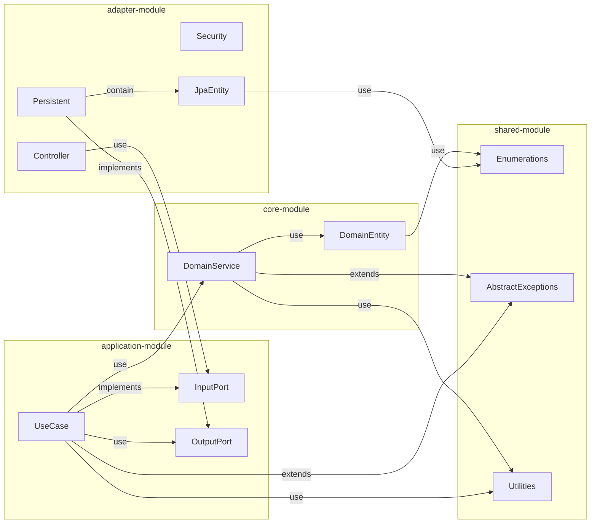

# 프로젝트 개요

- 이름: Prototype Reservation System
- 목적: 예약 시스템 기능을 기반으로 공부한 내용 구현

## 🏗 프로젝트 구조

- `adapter-module`: 컨트롤러, API, 외부 연동
- `application-module`: 실행 환경, 설정 파일
- `core-module`: 도메인 및 서비스 계층
- `shared-module`: 공통 유틸 및 설정 -> 이것 저것 담는 모듈이 되지 않도록 경계한다.
- `test-module`: 테스트에서 공통으로 사용하는 유틸리티를 모아둔다.

## 🧪 품질 정책

- pre-commit hook으로  `spotlessApply` 적용
- commit 시 `./gradlew detekt` 확인
- PR 시 `spotlessKotlinCheck` 확인
- main branch 직접 push 금지

## 🧐 Considerations

1. Domain Driven Design에 맞춰서 도메인 로직과 서비스 로직이 분리된 애플리케이션을 개발.
2. Hexagonal Architecture에 맞춰서 변화에 유연한 애플리케이션을 개발.
3. OverEngineering 해서 할 수 있는 가장 엄격하고 풍부한 방법으로 애플리케이션을 개발.

## 🙂‍ Non-considerations

1. 디테일하게 완벽하게 모든 서비스를 구현하는 것

