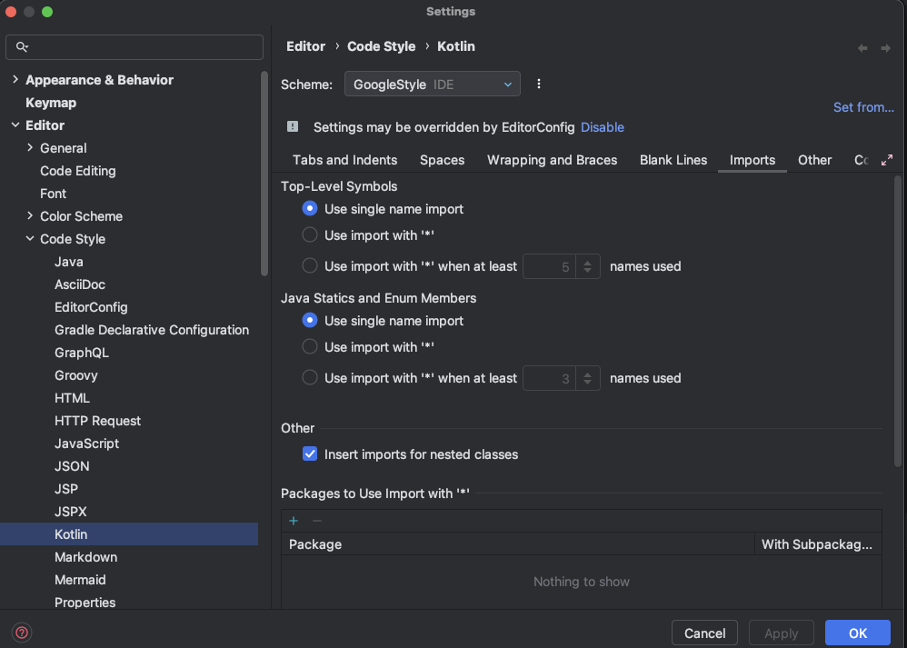

# Google Java Style Guide

- [Google Java Style Guide](https://google.github.io/styleguide/javaguide.html)을 사용.

### 1.Apply GoogleStyle
  1. GoogleStyle의  xml 다운로드 (https://google.github.io/styleguide/intellij-java-google-style.xml)
  2. IDEA에서 아래와 같이 code style XML을 import
  
  ### 2. Settings others
  
- Class count to use import with '*'; 에 999 설정으로 import로 wildcard 방지
- Names count to use static import with '*'; 에 999 설정으로 static member import에 wildcard 방지
