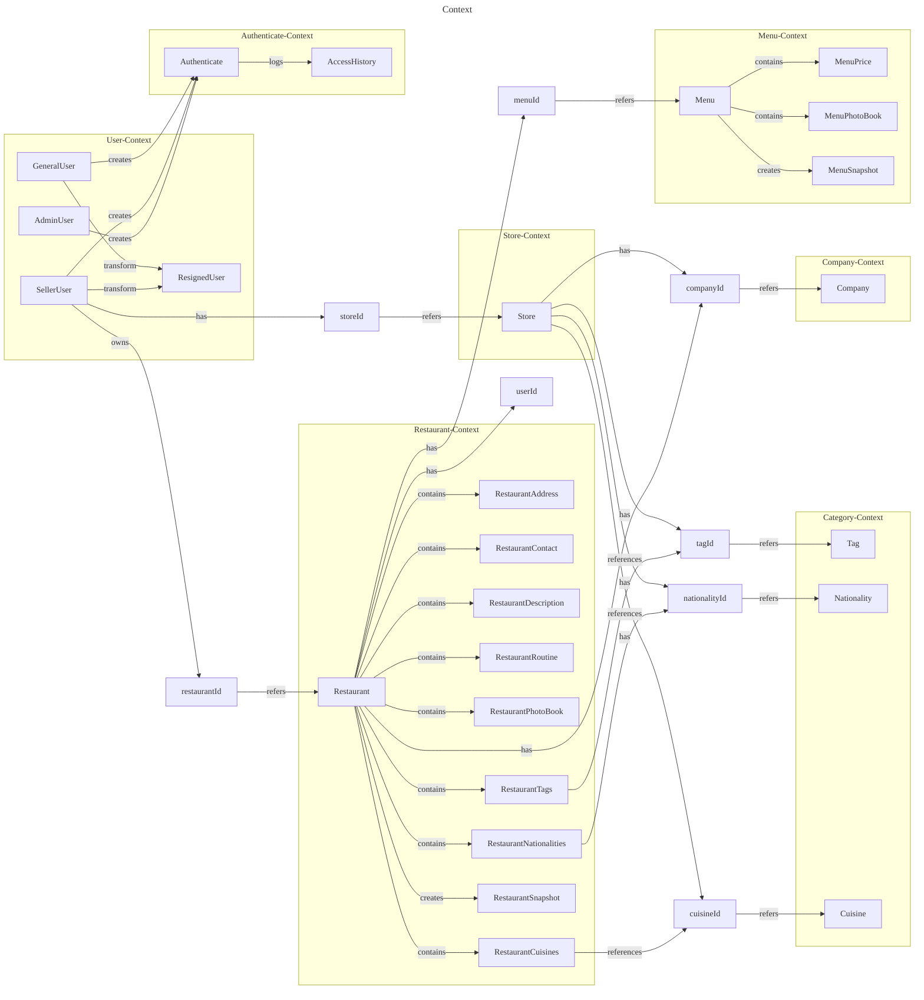

```mermaid
---
title: Context
theme: 'dark'
config:
  fontFamily: 'Pretendard'
  securityLevel: loose
---
graph LR

%% --- VO or Field ---
    storeId
    companyId
    tagId
    nationalityId
    cuisineId
    restaurantId
    menuId
    userId
    

%% --- Contexts ---
    subgraph User-Context
        general_user[GeneralUser]
        seller_user[SellerUser]
        admin_user[AdminUser]
        resigned_user[ResignedUser]
    end

    subgraph Store-Context
        store[Store]
    end

    subgraph Restaurant-Context
        restaurant[Restaurant]
        restaurant_address[RestaurantAddress]
        restaurant_contact[RestaurantContact]
        restaurant_description[RestaurantDescription]
        restaurant_routine[RestaurantRoutine]
        restaurant_photobook[RestaurantPhotoBook]
        restaurant_tags[RestaurantTags]
        restaurant_nationalities[RestaurantNationalities]
        restaurant_cuisines[RestaurantCuisines]
        restaurant_snapshot[RestaurantSnapshot]
    end

    subgraph Menu-Context
        menu[Menu]
        menu_price[MenuPrice]
        menu_photobook[MenuPhotoBook]
        menu_snapshot[MenuSnapshot]
    end

    subgraph Category-Context
        tag[Tag]
        nationality[Nationality]
        cuisine[Cuisine]
    end

    subgraph Company-Context
        company[Company]
    end

    subgraph Authenticate-Context
        authenticate[Authenticate]
        access_history[AccessHistory]
    end

%% --- Relationships ---
    seller_user -->|has| storeId
    storeId -->|refers| store
    general_user -->|transform| resigned_user
    seller_user -->|transform| resigned_user
    
    store -->|has| companyId
    companyId -->|refers| company

    store -->|has| tagId
    tagId -->|refers| tag
    store -->|has| nationalityId
    nationalityId -->|refers| nationality
    store -->|has| cuisineId
    cuisineId -->|refers| cuisine

    %% Restaurant relationships
    seller_user -->|owns| restaurantId
    restaurantId -->|refers| restaurant
    restaurant -->|has| companyId
    restaurant -->|has| userId
    restaurant -->|contains| restaurant_address
    restaurant -->|contains| restaurant_contact
    restaurant -->|contains| restaurant_description
    restaurant -->|contains| restaurant_routine
    restaurant -->|contains| restaurant_photobook
    restaurant -->|contains| restaurant_tags
    restaurant -->|contains| restaurant_nationalities
    restaurant -->|contains| restaurant_cuisines
    restaurant -->|creates| restaurant_snapshot

    restaurant_tags -->|references| tagId
    restaurant_nationalities -->|references| nationalityId
    restaurant_cuisines -->|references| cuisineId

    %% Menu relationships
    restaurant -->|has| menuId
    menuId -->|refers| menu
    menu -->|contains| menu_price
    menu -->|contains| menu_photobook
    menu -->|creates| menu_snapshot

    %% Authentication relationships
    general_user -->|creates| authenticate
    seller_user -->|creates| authenticate
    admin_user -->|creates| authenticate
    authenticate -->|logs| access_history

```