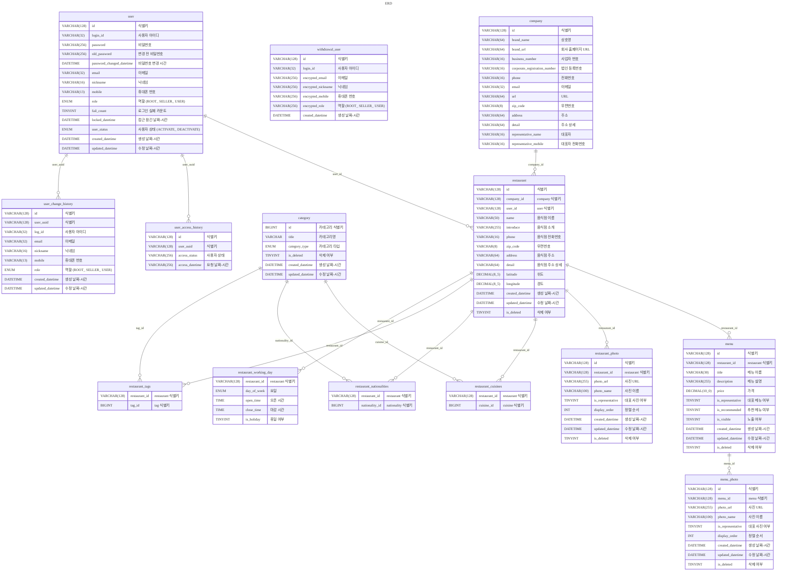

```mermaid
---
title: ERD
theme: 'dark'
config:
  fontFamily: 'Pretendard'
  securityLevel: loose
---
erDiagram
    user[user] {
        VARCHAR(128) id "식별키"
        VARCHAR(32) login_id "사용자 아이디"
        VARCHAR(256) password "비밀번호"
        VARCHAR(256) old_password "변경 전 비밀번호"
        DATETIME password_changed_datetime "비밀번호 변경 시간"
        VARCHAR(32) email "이메일"
        VARCHAR(16) nickname "닉네임"
        VARCHAR(13) mobile "휴대폰 번호"
        ENUM role "역할 (ROOT_ SELLER_ USER)"
        TINYINT fail_count "로그인 실패 카운트"
        DATETIME locked_datetime "접근 잠긴 날짜-시간"
        ENUM user_status "사용자 상태 (ACTIVATE_ DEACTIVATE)"
        DATETIME created_datetime "생성 날짜-시간"
        DATETIME updated_datetime "수정 날짜-시간"
    }

    user_change_history[user_change_history] {
        VARCHAR(128) id "식별키"
        VARCHAR(128) user_uuid "식별키"
        VARCHAR(32) log_id "사용자 아이디"
        VARCHAR(32) email "이메일"
        VARCHAR(16) nickname "닉네임"
        VARCHAR(13) mobile "휴대폰 번호"
        ENUM role "역할 (ROOT_ SELLER_ USER)"
        DATETIME created_datetime "생성 날짜-시간"
        DATETIME updated_datetime "수정 날짜-시간"
    }

    user_access_history[user_access_history] {
        VARCHAR(128) id "식별키"
        VARCHAR(128) user_uuid "식별키"
        VARCHAR(256) access_status "사용자 상태"
        VARCHAR(256) access_datetime "요청 날짜-시간"
    }

    withdrawal_user[withdrawal_user] {
        VARCHAR(128) id "식별키"
        VARCHAR(32) login_id "사용자 아이디"
        VARCHAR(256) encrypted_email "이메일"
        VARCHAR(256) encrypted_nickname "닉네임"
        VARCHAR(256) encrypted_mobile "휴대폰 번호"
        VARCHAR(256) encrypted_role "역할 (ROOT_ SELLER_ USER)"
        DATETIME created_datetime "생성 날짜-시간"
    }

    category[category] {
        BIGINT id "카테고리 식별키"
        VARCHAR title "카테고리명"
        ENUM category_type "카테고리 타입"
        TINYINT is_deleted "삭제 여부"
        DATETIME created_datetime "생성 날짜-시간"
        DATETIME updated_datetime "수정 날짜-시간"
    }

    company[company] {
        VARCHAR(128) id "식별키"
        VARCHAR(64) brand_name "상호명"
        VARCHAR(64) brand_url "회사 홈페이지 URL"
        VARCHAR(16) business_number "사업자 번호"
        VARCHAR(16) corporate_registration_number "법인 등록번호"
        VARCHAR(16) phone "전화번호"
        VARCHAR(32) email "이메일"
        VARCHAR(64) url "URL"
        VARCHAR(8)  zip_code "우편번호"
        VARCHAR(64) address "주소"
        VARCHAR(64) detail "주소 상세"
        VARCHAR(16) representative_name "대표자"
        VARCHAR(16) representative_mobile "대표자 전화번호"
    }

    restaurant[restaurant] {
        VARCHAR(128) id "식별키"
        VARCHAR(128) company_id "company 식별키"
        VARCHAR(128) user_id "user 식별키"
        VARCHAR(50) name "음식점 이름"
        VARCHAR(255) introduce "음식점 소개"
        VARCHAR(16) phone "음식점 전화번호"
        VARCHAR(8) zip_code "우편번호"
        VARCHAR(64) address "음식점 주소"
        VARCHAR(64) detail "음식점 주소 상세"
        DECIMAL(8_5) latitude "위도"
        DECIMAL(8_5) longitude "경도"
        DATETIME created_datetime "생성 날짜-시간"
        DATETIME updated_datetime "수정 날짜-시간"
        TINYINT is_deleted "삭제 여부"
    }

    restaurant_working_day[restaurant_working_day] {
        VARCHAR(128) restaurant_id "restaurant 식별키"
        ENUM day_of_week "요일"
        TIME open_time "오픈 시간"
        TIME close_time "마감 시간"
        TINYINT is_holiday "휴일 여부"
    }

    restaurant_tags[restaurant_tags] {
        VARCHAR(128) restaurant_id "restaurant 식별키"
        BIGINT tag_id "tag 식별키"
    }

    restaurant_nationalities[restaurant_nationalities] {
        VARCHAR(128) restaurant_id "restaurant 식별키"
        BIGINT nationality_id "nationality 식별키"
    }

    restaurant_cuisines[restaurant_cuisines] {
        VARCHAR(128) restaurant_id "restaurant 식별키"
        BIGINT cuisine_id "cuisine 식별키"
    }

    restaurant_photo[restaurant_photo] {
        VARCHAR(128) id "식별키"
        VARCHAR(128) restaurant_id "restaurant 식별키"
        VARCHAR(255) photo_url "사진 URL"
        VARCHAR(100) photo_name "사진 이름"
        TINYINT is_representative "대표 사진 여부"
        INT display_order "정렬 순서"
        DATETIME created_datetime "생성 날짜-시간"
        DATETIME updated_datetime "수정 날짜-시간"
        TINYINT is_deleted "삭제 여부"
    }

    menu[menu] {
        VARCHAR(128) id "식별키"
        VARCHAR(128) restaurant_id "restaurant 식별키"
        VARCHAR(30) title "메뉴 이름"
        VARCHAR(255) description "메뉴 설명"
        DECIMAL(10_0) price "가격"
        TINYINT is_representative "대표 메뉴 여부"
        TINYINT is_recommended "추천 메뉴 여부"
        TINYINT is_visible "노출 여부"
        DATETIME created_datetime "생성 날짜-시간"
        DATETIME updated_datetime "수정 날짜-시간"
        TINYINT is_deleted "삭제 여부"
    }

    menu_photo[menu_photo] {
        VARCHAR(128) id "식별키"
        VARCHAR(128) menu_id "menu 식별키"
        VARCHAR(255) photo_url "사진 URL"
        VARCHAR(100) photo_name "사진 이름"
        TINYINT is_representative "대표 사진 여부"
        INT display_order "정렬 순서"
        DATETIME created_datetime "생성 날짜-시간"
        DATETIME updated_datetime "수정 날짜-시간"
        TINYINT is_deleted "삭제 여부"
    }

    %% Relationships
    user ||--o{ user_change_history: user_uuid
    user ||--o{ user_access_history: user_uuid
    user ||--o{ restaurant: user_id
    company ||--o{ restaurant: company_id
    restaurant ||--o{ restaurant_working_day: restaurant_id
    restaurant ||--o{ restaurant_tags: restaurant_id
    restaurant ||--o{ restaurant_nationalities: restaurant_id  
    restaurant ||--o{ restaurant_cuisines: restaurant_id
    restaurant ||--o{ restaurant_photo: restaurant_id
    restaurant ||--o{ menu: restaurant_id
    menu ||--o{ menu_photo: menu_id
    category ||--o{ restaurant_tags: tag_id
    category ||--o{ restaurant_nationalities: nationality_id
    category ||--o{ restaurant_cuisines: cuisine_id
```