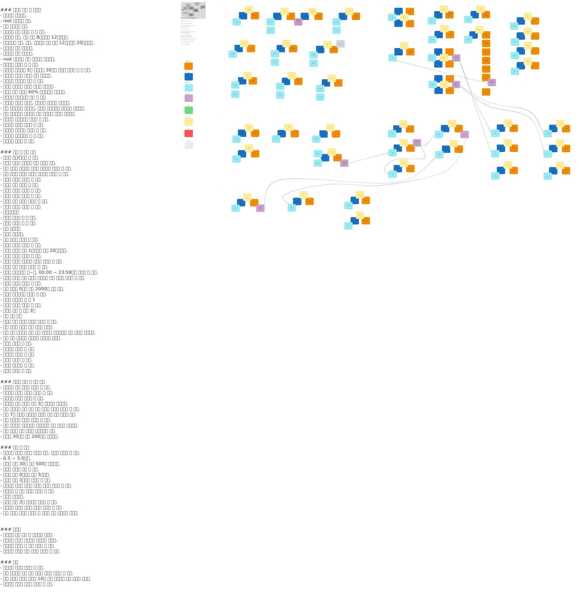

# 음식점 예약 시스템 프로토타이핑
### <q>부제: 공부한 것 실제로 고민하고 구현해보기</q>

- [공부한 내용 정리](https://newkayak12.github.io/2025/05/09/rollup-2025-01.firstHalf.html)
- 프로젝트 진행 일정
  - [2025.05.01 ~ 2025.05.17](https://github.com/users/newkayak12/projects/2)
  - [2025.05.18 ~ 2025.05.31](https://github.com/users/newkayak12/projects/3)
- [프로젝트 진행 방식](/.github/PROJECT.md)

---
#### ~ 2025.05.17 요구 사항 및 이벤트 스토밍 정리

------

