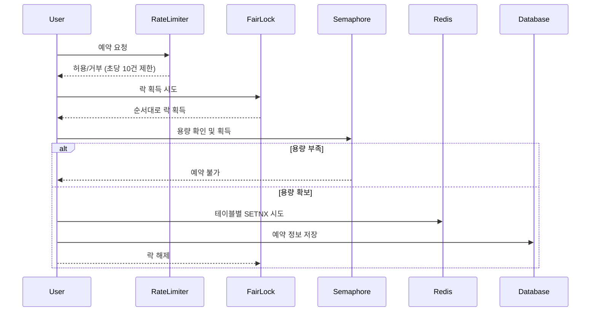

# ADR: 테이블 예약 시스템 동시성 제어 설계

## 맥락

예약 시스템에서 10개의 테이블에 대해 동시에 100명이 예약을 시도하는 상황에서, 중복 예약을 방지하면서도 공정성을 보장하는 동시성 제어 메커니즘이 필요했습니다.

### 기본 요구사항
- 동일한 시간대(restaurantId + date + startTime)에 최대 10개 테이블까지만 예약 허용
- 동시 요청에서 중복 예약 절대 방지
- 먼저 요청한 사용자가 우선적으로 처리되는 공정성 보장
- MSA 환경에서 분산 처리 가능
- 과도한 요청으로부터 시스템 보호

### 고려된 접근법들

#### 1. 단순 Redis SETNX 방식
```kotlin
for (table in availableTables) {
    val success = redisTemplate.opsForValue()
        .setIfAbsent("table:${table.id}", userId, Duration.ofHours(2))
    if (success) return table.id
}
```

**문제점**:
- 빠르지만 요청 순서 보장 불가
- 11등이 9등보다 빨리 예약 성공할 수 있음
- 네트워크 지연이나 DB 조회 타이밍에 따른 불공정성
- 대량 트래픽 시 시스템 부하

#### 2. Database SELECT FOR UPDATE
```sql
SELECT * FROM timetable 
WHERE ... AND table_status = 'AVAILABLE'
FOR UPDATE SKIP LOCKED
```

**문제점**:
- DB 레벨 비관적 락으로 인한 성능 저하
- 10번째 안에 들지만 중복 SELECT로 인한 UPDATE 실패 가능성
- MSA 환경에서 DB 락의 확장성 문제

#### 3. Event Sourcing + Kafka
- Kafka 파티션으로 순서 보장
- 하지만 복잡도 대비 오버엔지니어링

## 결정사항

**Redisson 다중 분산락 조합 방식 채택**
- Fair Lock (순서 보장) + Semaphore (용량 관리) + Rate Limiter (트래픽 제어)

### 핵심 아키텍처



#### 처리 단계별 설명

1. **Rate Limiting**: 레스토랑별로 초당 10건 요청만 허용하여 시스템 부하 방지
2. **Fair Lock 획득**: 요청 순서대로 처리하여 완전한 공정성 보장 (타임아웃 10초)
3. **Semaphore 용량 체크**: Redis 기반 정확한 테이블 수 관리로 오버부킹 방지
4. **테이블 선점**: 사용 가능한 각 테이블에 대해 Redis SETNX로 원자적 선점 시도
5. **예약 완료**: 성공한 테이블에 대해 Database에 예약 정보 저장
6. **자원 해제**: 모든 분산락과 세마포어 허가를 안전하게 해제

#### 예약 취소 프로세스

예약 취소 시에는 Database 삭제, Redis 테이블 키 삭제, Semaphore 허가 반환을 순차적으로 수행하여 즉시 다른 사용자가 해당 용량을 활용할 수 있도록 처리합니다.

### 핵심 메커니즘

1. **Rate Limiter**: 레스토랑별 초당 10건 요청 제한으로 시스템 보호
2. **Fair Lock**: 요청 도착 순서대로 처리하여 공정성 보장
3. **Semaphore**: Redis 기반 정확한 테이블 용량 관리
4. **SETNX**: 개별 테이블 선점으로 중복 방지
5. **TTL 관리**: 자동 만료로 좀비 락 방지

## 장점

1. **완전한 공정성**: Fair Lock으로 먼저 온 요청이 먼저 처리됨
2. **정확한 용량 관리**: Semaphore로 오버부킹 원천 차단
3. **시스템 보호**: Rate Limiter로 과부하 방지
4. **확장성**: Redis 기반으로 MSA 환경에서 안정적 동작
5. **예외 안전성**: 모든 실패 케이스에서 자원 해제 보장
6. **성능**: Redis 인메모리 연산으로 빠른 처리

## 트레이드오프

### 선택한 방식의 한계
- 다중 락으로 인한 약간의 복잡도 증가
- Redis 의존성 심화
- 분산락 타임아웃 시 요청 실패 가능성

### 포기한 대안들
- **단순 SETNX**: 성능은 빠르지만 공정성과 시스템 보호 부족
- **DB 락**: 안전하지만 성능과 확장성 제한
- **Queue 시스템**: 완벽하지만 UI 복잡도 증가

## 실제 사용 사례와 부합

### 실제 예약 서비스에서 고려하는 요소들
1. **공정성**: 먼저 클릭한 사용자가 우선권을 가져야 함
2. **정확성**: 절대 오버부킹이 발생해서는 안 됨
3. **시스템 안정성**:  예약 오픈 시 트래픽 급증 대응
4. **사용자 경험**: 명확한 성공/실패 피드백

## 결과

이 설계로 다음을 달성:
- 100명 동시 요청에서 정확히 10명만 예약 성공
- 요청 순서에 따른 완전한 공정성 보장
- 시스템 과부하 없이 안정적인 트래픽 처리
- MSA 환경에서 일관된 동시성 제어
- 예약 취소 시 즉시 다른 사용자에게 기회 제공

**실제 예약 서비스 수준의 공정성과 안정성**을 제공하는 분산락 아키텍처를 구현했습니다.