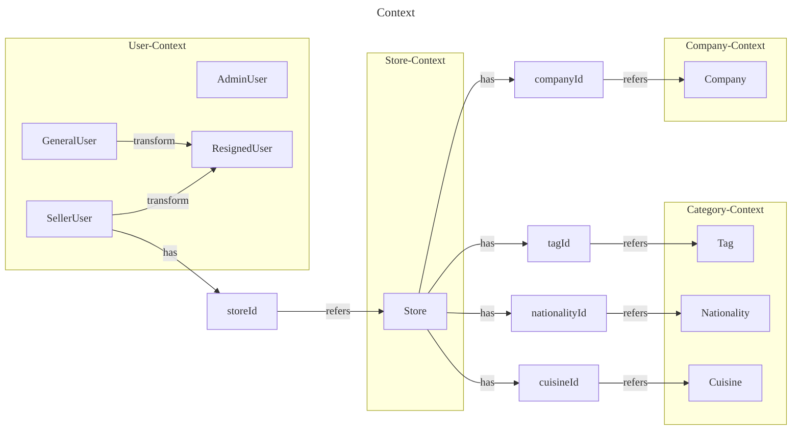

```mermaid
---
title: Context
theme: 'dark'
config:
  fontFamily: 'Pretendard'
  securityLevel: loose
---
graph LR

%% --- VO or Field ---
    storeId
    companyId
    tagId
    nationalityId
    cuisineId
    

%% --- Contexts ---
    subgraph User-Context
        general_user[GeneralUser]
        seller_user[SellerUser]
        admin_user[AdminUser]
        resigned_user[ResignedUser]
    end

    subgraph Store-Context
        store[Store]
    end

    subgraph Category-Context
        tag[Tag]
        nationality[Nationality]
        cuisine[Cuisine]
    end

    subgraph Company-Context
        company[Company]
    end

%% --- Relationships ---
    seller_user -->|has| storeId
    storeId -->|refers| store
    general_user -->|transform| resigned_user
    seller_user -->|transform| resigned_user
    
    store -->|has| companyId
    companyId -->|refers| company

    store -->|has| tagId
    tagId -->|refers| tag
    store -->|has| nationalityId
    nationalityId -->|refers| nationality
    store -->|has| cuisineId
    cuisineId -->|refers| cuisine

```