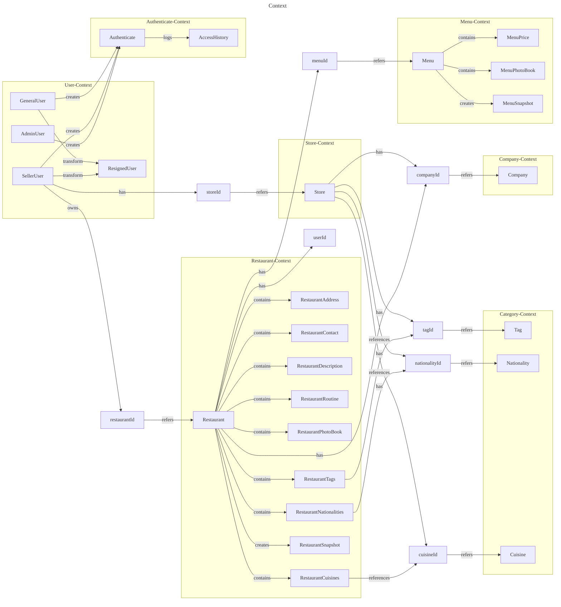

---

# V3 - Core Module DDD Entity Relationships (Actual Implementation)

```mermaid
---
title: Core Module DDD Entities - Actual Implementation
theme: 'dark'
config:
  fontFamily: 'Pretendard'
  securityLevel: loose
---
classDiagram
    %% User Aggregate
    class User {
        -String? id
        -LoginId loginId
        -Password password
        -PersonalAttributes personalAttributes
        -UserAttribute userAttributes
        +String userLoginId
        +String userEncodedPassword
        +String userEmail
        +String userMobile
        +String userNickname
        +Role userRole
        +resign(EncryptedAttributes) ResignedUser
        +changePassword(Password) void
        +changePersonalAttributes(PersonalAttributes) void
        +changeUserNickname(UserAttribute) void
    }

    class RestaurantOwner {
        -String? id
        -LoginId loginId
        -Password password
        -PersonalAttributes personalAttributes
        -UserAttribute userAttributes
        +String? identifier
        +String userEmail
        +String userMobile
        +String userNickname
        +Role userRole
        +resign(EncryptedAttributes) ResignedUser
        +changePassword(Password) void
    }

    class ResignedUser {
        +String id
        +LoginId loginId
        +EncryptedAttributes encryptedAttributes
        +LocalDateTime resignDateTime
    }

    %% Authentication Aggregate
    class Authenticate {
        +String id
        -LoginId loginId
        -Password password
        -LockState lockState
        +Role role
        -List~AccessHistory~ accessLog
        +boolean passwordCheckSuccess
        +boolean lockCheckSuccess
        +boolean isSuccess
        +int failCount
        +LocalDateTime? lockedDateTime
        +UserStatus userStatus
        +canISignIn(String, SignInPolicy) void
        +String loginId()
    }

    class AccessHistory {
        +String authenticateId
        +String loginId
        +AccessStatus status
        +LocalDateTime accessDateTime
        +success(String, LoginId) AccessHistory
        +failure(String, LoginId) AccessHistory
    }

    %% Company Aggregate
    class Company {
        +String id
        -Brand brand
        -Business business
        -CompanyContact companyContact
        -CompanyAddress companyAddress
        -Representative representative
        +String brandName
        +String brandUrl
        +changeBrand(Brand) void
    }

    %% Restaurant Aggregate
    class Restaurant {
        -String? id
        -String companyId
        -String userId
        -RestaurantDescription introduce
        -RestaurantContact contact
        -RestaurantAddress address
        -RestaurantRoutine routine
        -RestaurantPhotoBook photos
        -RestaurantTags tags
        -RestaurantNationalities nationalities
        -RestaurantCuisines cuisines
        +updateDescription(RestaurantDescription) void
        +updateLocation(RestaurantAddress) void
        +updateContact(RestaurantContact) void
        +snapshot() RestaurantSnapshot
    }

    %% Menu Aggregate
    class Menu {
        -String? id
        -String restaurantId
        -MenuDescription information
        -MenuPhotoBook menuPhotoBook
        -MenuAttributes attributes
        -MenuPrice price
        +snapshot() MenuSnapshot
        +changeInformation(MenuDescription) void
        +changeAttributes(MenuAttributes) void
        +changePrice(MenuPrice) void
    }

    %% Schedule Aggregate
    class Schedule {
        -String restaurantId
        -ScheduleActiveStatus status
        -List~TimeSpan~ timeSpans
        -List~Holiday~ holidays
        -List~Table~ tables
        +addHoliday(Holiday) void
        +addTimeSpan(TimeSpan) void
        +snapshot() ScheduleSnapshot
    }

    class Holiday {
        -String? id
        -String restaurantId
        -LocalDate holidayDate
        +snapshot() HolidaySnapshot
    }

    class TimeSpan {
        -String? id
        -String restaurantId
        -LocalTime startTime
        -LocalTime endTime
        +snapshot() TimeSpanSnapshot
    }

    class Table {
        -String? id
        -String restaurantId
        -int capacity
        -TableStatus status
        +snapshot() TableSnapshot
    }

    %% Category Aggregates
    class Tag {
        +Long id
        -CategoryDetail categoryDetail
        +String title
        +changeTitle(String) void
    }

    class Nationality {
        +Long id
        -CategoryDetail categoryDetail
        +String title
        +changeTitle(String) void
    }

    class Cuisine {
        +Long id
        -CategoryDetail categoryDetail
        +String title
        +changeTitle(String) void
    }

    %% Value Objects (Key ones)
    class LoginId {
        +String loginId
    }

    class Password {
        +String encodedPassword
        +String? oldEncodedPassword
        +LocalDateTime? changedDateTime
    }

    class PersonalAttributes {
        +String email
        +String mobile
    }

    class UserAttribute {
        +String nickname
        +Role role
    }

    class LockState {
        +int failCount
        +LocalDateTime? lockedDateTime
        +UserStatus userStatus
        +isDeactivated() boolean
        +isActivated() boolean
        +addFailureCount() LockState
        +activate() LockState
        +deactivate() LockState
    }

    %% Relationships
    User ||--|| LoginId : contains
    User ||--|| Password : contains
    User ||--|| PersonalAttributes : contains
    User ||--|| UserAttribute : contains
    User --> ResignedUser : creates

    RestaurantOwner ||--|| LoginId : contains
    RestaurantOwner ||--|| Password : contains
    RestaurantOwner ||--|| PersonalAttributes : contains
    RestaurantOwner ||--|| UserAttribute : contains
    RestaurantOwner --> ResignedUser : creates

    Authenticate ||--|| LoginId : contains
    Authenticate ||--|| Password : contains
    Authenticate ||--|| LockState : contains
    Authenticate ||--o{ AccessHistory : logs

    Restaurant ||--|| RestaurantDescription : contains
    Restaurant ||--|| RestaurantContact : contains
    Restaurant ||--|| RestaurantAddress : contains
    Restaurant --> Company : references via companyId
    Restaurant --> RestaurantOwner : references via userId

    Menu --> Restaurant : references via restaurantId
    Menu ||--|| MenuDescription : contains
    Menu ||--|| MenuPrice : contains
    Menu ||--|| MenuAttributes : contains

    Schedule --> Restaurant : references via restaurantId
    Schedule ||--o{ TimeSpan : contains
    Schedule ||--o{ Holiday : contains
    Schedule ||--o{ Table : contains

    Holiday --> Restaurant : references via restaurantId
    TimeSpan --> Restaurant : references via restaurantId
    Table --> Restaurant : references via restaurantId

    Restaurant ||--o{ Tag : associates
    Restaurant ||--o{ Nationality : associates
    Restaurant ||--o{ Cuisine : associates

    %% Inheritance/Implementation
    User ..|> ServiceUser : implements
    RestaurantOwner ..|> ServiceUser : implements
```