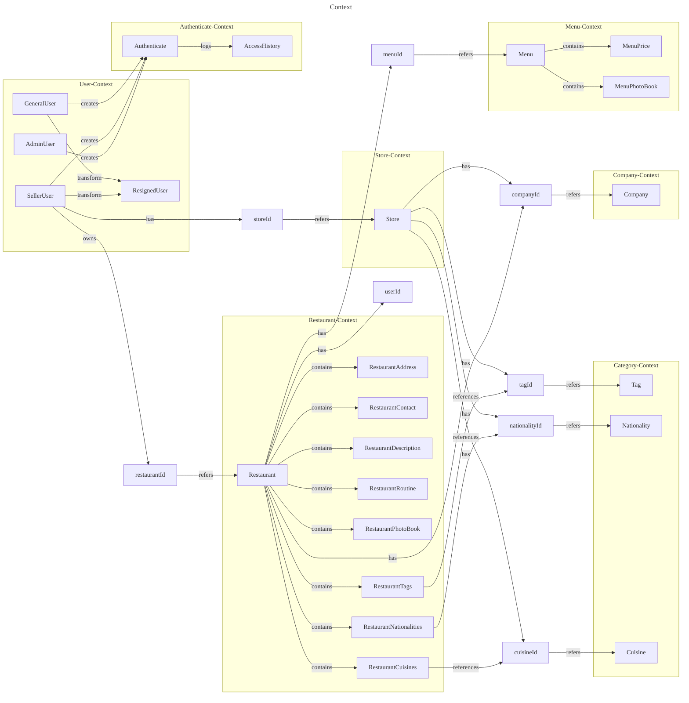

---

[//]: # (# V3 - Core Module DDD Entity Relationships &#40;Actual Implementation&#41;)

[//]: # ()
[//]: # (```mermaid)

[//]: # (---)

[//]: # (title: Core Module DDD Entities - Actual Implementation)

[//]: # (theme: 'dark')

[//]: # (config:)

[//]: # (  fontFamily: 'Pretendard')

[//]: # (  securityLevel: loose)

[//]: # (---)

[//]: # (classDiagram)

[//]: # (    %% User Aggregate)

[//]: # (    class User {)

[//]: # (        -String? id)

[//]: # (        -LoginId loginId)

[//]: # (        -Password password)

[//]: # (        -PersonalAttributes personalAttributes)

[//]: # (        -UserAttribute userAttributes)

[//]: # (        +String userLoginId)

[//]: # (        +String userEncodedPassword)

[//]: # (        +String userEmail)

[//]: # (        +String userMobile)

[//]: # (        +String userNickname)

[//]: # (        +Role userRole)

[//]: # (        +resign&#40;EncryptedAttributes&#41; ResignedUser)

[//]: # (        +changePassword&#40;Password&#41; void)

[//]: # (        +changePersonalAttributes&#40;PersonalAttributes&#41; void)

[//]: # (        +changeUserNickname&#40;UserAttribute&#41; void)

[//]: # (    })

[//]: # ()
[//]: # (    class RestaurantOwner {)

[//]: # (        -String? id)

[//]: # (        -LoginId loginId)

[//]: # (        -Password password)

[//]: # (        -PersonalAttributes personalAttributes)

[//]: # (        -UserAttribute userAttributes)

[//]: # (        +String? identifier)

[//]: # (        +String userEmail)

[//]: # (        +String userMobile)

[//]: # (        +String userNickname)

[//]: # (        +Role userRole)

[//]: # (        +resign&#40;EncryptedAttributes&#41; ResignedUser)

[//]: # (        +changePassword&#40;Password&#41; void)

[//]: # (    })

[//]: # ()
[//]: # (    class ResignedUser {)

[//]: # (        +String id)

[//]: # (        +LoginId loginId)

[//]: # (        +EncryptedAttributes encryptedAttributes)

[//]: # (        +LocalDateTime resignDateTime)

[//]: # (    })

[//]: # ()
[//]: # (    %% Authentication Aggregate)

[//]: # (    class Authenticate {)

[//]: # (        +String id)

[//]: # (        -LoginId loginId)

[//]: # (        -Password password)

[//]: # (        -LockState lockState)

[//]: # (        +Role role)

[//]: # (        -List~AccessHistory~ accessLog)

[//]: # (        +boolean passwordCheckSuccess)

[//]: # (        +boolean lockCheckSuccess)

[//]: # (        +boolean isSuccess)

[//]: # (        +int failCount)

[//]: # (        +LocalDateTime? lockedDateTime)

[//]: # (        +UserStatus userStatus)

[//]: # (        +canISignIn&#40;String, SignInPolicy&#41; void)

[//]: # (        +String loginId&#40;&#41;)

[//]: # (    })

[//]: # ()
[//]: # (    class AccessHistory {)

[//]: # (        +String authenticateId)

[//]: # (        +String loginId)

[//]: # (        +AccessStatus status)

[//]: # (        +LocalDateTime accessDateTime)

[//]: # (        +success&#40;String, LoginId&#41; AccessHistory)

[//]: # (        +failure&#40;String, LoginId&#41; AccessHistory)

[//]: # (    })

[//]: # ()
[//]: # (    %% Company Aggregate)

[//]: # (    class Company {)

[//]: # (        +String id)

[//]: # (        -Brand brand)

[//]: # (        -Business business)

[//]: # (        -CompanyContact companyContact)

[//]: # (        -CompanyAddress companyAddress)

[//]: # (        -Representative representative)

[//]: # (        +String brandName)

[//]: # (        +String brandUrl)

[//]: # (        +changeBrand&#40;Brand&#41; void)

[//]: # (    })

[//]: # ()
[//]: # (    %% Restaurant Aggregate)

[//]: # (    class Restaurant {)

[//]: # (        -String? id)

[//]: # (        -String companyId)

[//]: # (        -String userId)

[//]: # (        -RestaurantDescription introduce)

[//]: # (        -RestaurantContact contact)

[//]: # (        -RestaurantAddress address)

[//]: # (        -RestaurantRoutine routine)

[//]: # (        -RestaurantPhotoBook photos)

[//]: # (        -RestaurantTags tags)

[//]: # (        -RestaurantNationalities nationalities)

[//]: # (        -RestaurantCuisines cuisines)

[//]: # (        +updateDescription&#40;RestaurantDescription&#41; void)

[//]: # (        +updateLocation&#40;RestaurantAddress&#41; void)

[//]: # (        +updateContact&#40;RestaurantContact&#41; void)

[//]: # (        +snapshot&#40;&#41; RestaurantSnapshot)

[//]: # (    })

[//]: # ()
[//]: # (    %% Menu Aggregate)

[//]: # (    class Menu {)

[//]: # (        -String? id)

[//]: # (        -String restaurantId)

[//]: # (        -MenuDescription information)

[//]: # (        -MenuPhotoBook menuPhotoBook)

[//]: # (        -MenuAttributes attributes)

[//]: # (        -MenuPrice price)

[//]: # (        +snapshot&#40;&#41; MenuSnapshot)

[//]: # (        +changeInformation&#40;MenuDescription&#41; void)

[//]: # (        +changeAttributes&#40;MenuAttributes&#41; void)

[//]: # (        +changePrice&#40;MenuPrice&#41; void)

[//]: # (    })

[//]: # ()
[//]: # (    %% Schedule Aggregate)

[//]: # (    class Schedule {)

[//]: # (        -String restaurantId)

[//]: # (        -ScheduleActiveStatus status)

[//]: # (        -List~TimeSpan~ timeSpans)

[//]: # (        -List~Holiday~ holidays)

[//]: # (        -List~Table~ tables)

[//]: # (        +addHoliday&#40;Holiday&#41; void)

[//]: # (        +addTimeSpan&#40;TimeSpan&#41; void)

[//]: # (        +snapshot&#40;&#41; ScheduleSnapshot)

[//]: # (    })

[//]: # ()
[//]: # (    class Holiday {)

[//]: # (        -String? id)

[//]: # (        -String restaurantId)

[//]: # (        -LocalDate holidayDate)

[//]: # (        +snapshot&#40;&#41; HolidaySnapshot)

[//]: # (    })

[//]: # ()
[//]: # (    class TimeSpan {)

[//]: # (        -String? id)

[//]: # (        -String restaurantId)

[//]: # (        -LocalTime startTime)

[//]: # (        -LocalTime endTime)

[//]: # (        +snapshot&#40;&#41; TimeSpanSnapshot)

[//]: # (    })

[//]: # ()
[//]: # (    class Table {)

[//]: # (        -String? id)

[//]: # (        -String restaurantId)

[//]: # (        -int capacity)

[//]: # (        -TableStatus status)

[//]: # (        +snapshot&#40;&#41; TableSnapshot)

[//]: # (    })

[//]: # ()
[//]: # (    %% Category Aggregates)

[//]: # (    class Tag {)

[//]: # (        +Long id)

[//]: # (        -CategoryDetail categoryDetail)

[//]: # (        +String title)

[//]: # (        +changeTitle&#40;String&#41; void)

[//]: # (    })

[//]: # ()
[//]: # (    class Nationality {)

[//]: # (        +Long id)

[//]: # (        -CategoryDetail categoryDetail)

[//]: # (        +String title)

[//]: # (        +changeTitle&#40;String&#41; void)

[//]: # (    })

[//]: # ()
[//]: # (    class Cuisine {)

[//]: # (        +Long id)

[//]: # (        -CategoryDetail categoryDetail)

[//]: # (        +String title)

[//]: # (        +changeTitle&#40;String&#41; void)

[//]: # (    })

[//]: # ()
[//]: # (    %% Value Objects &#40;Key ones&#41;)

[//]: # (    class LoginId {)

[//]: # (        +String loginId)

[//]: # (    })

[//]: # ()
[//]: # (    class Password {)

[//]: # (        +String encodedPassword)

[//]: # (        +String? oldEncodedPassword)

[//]: # (        +LocalDateTime? changedDateTime)

[//]: # (    })

[//]: # ()
[//]: # (    class PersonalAttributes {)

[//]: # (        +String email)

[//]: # (        +String mobile)

[//]: # (    })

[//]: # ()
[//]: # (    class UserAttribute {)

[//]: # (        +String nickname)

[//]: # (        +Role role)

[//]: # (    })

[//]: # ()
[//]: # (    class LockState {)

[//]: # (        +int failCount)

[//]: # (        +LocalDateTime? lockedDateTime)

[//]: # (        +UserStatus userStatus)

[//]: # (        +isDeactivated&#40;&#41; boolean)

[//]: # (        +isActivated&#40;&#41; boolean)

[//]: # (        +addFailureCount&#40;&#41; LockState)

[//]: # (        +activate&#40;&#41; LockState)

[//]: # (        +deactivate&#40;&#41; LockState)

[//]: # (    })

[//]: # ()
[//]: # (    %% Relationships)

[//]: # (    User ||--|| LoginId : contains)

[//]: # (    User ||--|| Password : contains)

[//]: # (    User ||--|| PersonalAttributes : contains)

[//]: # (    User ||--|| UserAttribute : contains)

[//]: # (    User --> ResignedUser : creates)

[//]: # ()
[//]: # (    RestaurantOwner ||--|| LoginId : contains)

[//]: # (    RestaurantOwner ||--|| Password : contains)

[//]: # (    RestaurantOwner ||--|| PersonalAttributes : contains)

[//]: # (    RestaurantOwner ||--|| UserAttribute : contains)

[//]: # (    RestaurantOwner --> ResignedUser : creates)

[//]: # ()
[//]: # (    Authenticate ||--|| LoginId : contains)

[//]: # (    Authenticate ||--|| Password : contains)

[//]: # (    Authenticate ||--|| LockState : contains)

[//]: # (    Authenticate ||--o{ AccessHistory : logs)

[//]: # ()
[//]: # (    Restaurant ||--|| RestaurantDescription : contains)

[//]: # (    Restaurant ||--|| RestaurantContact : contains)

[//]: # (    Restaurant ||--|| RestaurantAddress : contains)

[//]: # (    Restaurant --> Company : references via companyId)

[//]: # (    Restaurant --> RestaurantOwner : references via userId)

[//]: # ()
[//]: # (    Menu --> Restaurant : references via restaurantId)

[//]: # (    Menu ||--|| MenuDescription : contains)

[//]: # (    Menu ||--|| MenuPrice : contains)

[//]: # (    Menu ||--|| MenuAttributes : contains)

[//]: # ()
[//]: # (    Schedule --> Restaurant : references via restaurantId)

[//]: # (    Schedule ||--o{ TimeSpan : contains)

[//]: # (    Schedule ||--o{ Holiday : contains)

[//]: # (    Schedule ||--o{ Table : contains)

[//]: # ()
[//]: # (    Holiday --> Restaurant : references via restaurantId)

[//]: # (    TimeSpan --> Restaurant : references via restaurantId)

[//]: # (    Table --> Restaurant : references via restaurantId)

[//]: # ()
[//]: # (    Restaurant ||--o{ Tag : associates)

[//]: # (    Restaurant ||--o{ Nationality : associates)

[//]: # (    Restaurant ||--o{ Cuisine : associates)

[//]: # ()
[//]: # (    %% Inheritance/Implementation)

[//]: # (    User ..|> ServiceUser : implements)

[//]: # (    RestaurantOwner ..|> ServiceUser : implements)

[//]: # (```)