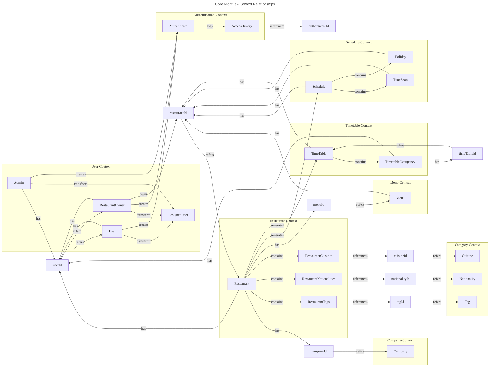

# Core Module Class Diagram V3

---

# V3 - Core Module DDD Entity Relationships (Actual Implementation)

This diagram shows the core domain entities from the actual core-module implementation and their **DDD relationships**.

## Key Features

### 1. Hexagonal Architecture
- Each context is clearly separated and operates independently
- Domain references only occur through IDs

### 2. DDD Core Relationship Patterns
- **Ownership**: `restaurant_owner -->|owns| restaurantId`
- **Reference**: `restaurantId -->|refers| restaurant`
- **Generation**: `restaurant -->|generates| schedule`
- **Transformation**: `user -->|transform| resigned_user`
- **Association**: `restaurant -->|associates| tagId`

### 3. Implementation-Based Domains
- **User Context**: Actual implemented User, RestaurantOwner, Admin entities
- **Schedule vs Timetable**: Separated contexts
  - Schedule: Restaurant operation time management
  - Timetable: Actual reservation table management
- **Authentication Context**: Independent authentication system

### 4. Context Responsibilities

#### User Context
- User lifecycle management (creation, transformation, resignation)
- Role-based user classification

#### Restaurant Context  
- Restaurant basic information management
- Starting point for menu, schedule, table generation

#### Menu Context
- Restaurant-specific menu management

#### Schedule Context
- Restaurant operation hours and holiday management

#### Timetable Context
- Actual reservable timeslots and table management
- Table occupancy status management

#### Category Context
- Tag, nationality, cuisine classification management

#### Authentication Context
- User authentication processing

This structure maintains V1's simplicity while reflecting the actual core-module domain complexity.