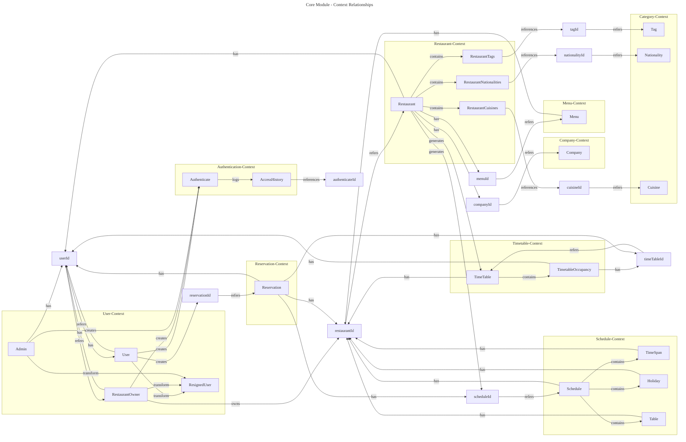

# Core Module Class Diagram V4

---

# V4 - Core Module DDD Entity Relationships (Latest Implementation)

This diagram shows the latest core domain entities from the actual core-module implementation and their **DDD relationships**.

## Key Updates from V3

### 1. New Reservation Context
- **Reservation Domain**: Complete reservation management system
- **Cross-Domain Integration**: Links User, Restaurant, Timetable, and Schedule contexts
- **Event-Driven Architecture**: Supports domain events for reservation processing

### 2. Enhanced Schedule Context
- **Table Entity**: Added explicit table management within schedule context
- **Improved Structure**: Better separation between schedule and timetable concerns
  - Schedule: Restaurant operational definitions (time spans, holidays, tables)
  - Timetable: Real-time reservation slot management

### 3. Refined Domain Boundaries
- **Clearer Separation**: Better distinction between schedule definition and timetable execution
- **ID-Based References**: Consistent use of ID references for cross-domain relationships
- **Domain Event Integration**: Support for event-driven communication between contexts

## Context Responsibilities

### User Context
- User lifecycle management (creation, transformation, resignation)
- Role-based user classification (User, RestaurantOwner, Admin)

### Restaurant Context  
- Restaurant basic information and metadata management
- Central hub for menu, schedule, and table generation
- Category associations (tags, nationalities, cuisines)

### Menu Context
- Restaurant-specific menu item management
- Menu metadata and pricing information

### Schedule Context
- Restaurant operational schedule definitions
- Time span management (opening hours, breaks)
- Holiday management
- Table definitions and availability rules

### Timetable Context
- Real-time reservation slot management
- Table occupancy tracking and status updates
- Time-based availability management

### Reservation Context *(NEW)*
- End-to-end reservation processing
- Integration point for user, restaurant, schedule, and timetable data
- Reservation lifecycle management (creation, confirmation, cancellation)

### Category Context
- Tag, nationality, cuisine classification management
- Shared categorization system across domains

### Authentication Context
- User authentication processing and access tracking
- Security and audit trail management

### Company Context
- Restaurant company/brand information management
- Corporate structure and business details

## Key Architectural Patterns

### 1. Hexagonal Architecture
- Clear separation between domain, application, and infrastructure layers
- Domain contexts operate independently through ID references

### 2. Domain-Driven Design
- Rich domain models with behavior, not anemic data containers
- Domain services for complex cross-aggregate operations
- Event-driven communication for domain state changes

### 3. Event-Driven Architecture
- Domain events for reservation state changes
- Asynchronous processing support for complex workflows

### 4. CQRS Patterns
- Separation of command and query responsibilities
- Optimized read models through snapshots

This V4 structure represents the current production implementation with full reservation capabilities and enhanced domain modeling.