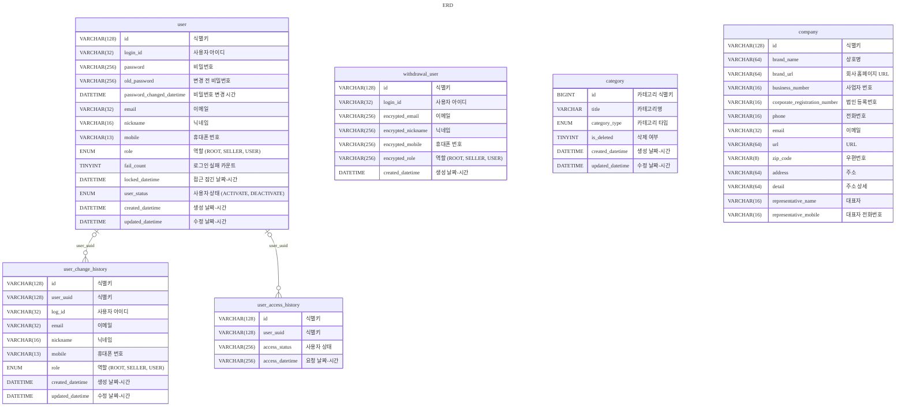

```mermaid
---
title: ERD
theme: 'dark'
config:
  fontFamily: 'Pretendard'
  securityLevel: loose
---
erDiagram
    user[user] {
        VARCHAR(128) id "식별키"
        VARCHAR(32) login_id "사용자 아이디"
        VARCHAR(256) password "비밀번호"
        VARCHAR(256) old_password "변경 전 비밀번호"
        DATETIME password_changed_datetime "비밀번호 변경 시간"
        VARCHAR(32) email "이메일"
        VARCHAR(16) nickname "닉네임"
        VARCHAR(13) mobile "휴대폰 번호"
        ENUM role "역할 (ROOT, SELLER, USER)"
        TINYINT fail_count "로그인 실패 카운트"
        DATETIME locked_datetime "접근 잠긴 날짜-시간"
        ENUM user_status "사용자 상태 (ACTIVATE, DEACTIVATE)"
        DATETIME created_datetime "생성 날짜-시간"
        DATETIME updated_datetime "수정 날짜-시간"
    }

    user_change_history[user_change_history] {
        VARCHAR(128) id "식별키"
        VARCHAR(128) user_uuid "식별키"
        VARCHAR(32) log_id "사용자 아이디"
        VARCHAR(32) email "이메일"
        VARCHAR(16) nickname "닉네임"
        VARCHAR(13) mobile "휴대폰 번호"
        ENUM role "역할 (ROOT, SELLER, USER)"
        DATETIME created_datetime "생성 날짜-시간"
        DATETIME updated_datetime "수정 날짜-시간"
    }

    user_access_history[user_access_history] {
        VARCHAR(128) id "식별키"
        VARCHAR(128) user_uuid "식별키"
        VARCHAR(256) access_status "사용자 상태"
        VARCHAR(256) access_datetime "요청 날짜-시간"
    }

    withdrawal_user[withdrawal_user] {
        VARCHAR(128) id "식별키"
        VARCHAR(32) login_id "사용자 아이디"
        VARCHAR(256) encrypted_email "이메일"
        VARCHAR(256) encrypted_nickname "닉네임"
        VARCHAR(256) encrypted_mobile "휴대폰 번호"
        VARCHAR(256) encrypted_role "역할 (ROOT, SELLER, USER)"
        DATETIME created_datetime "생성 날짜-시간"
    }

    category[category] {
        BIGINT id "카테고리 식별키"
        VARCHAR title "카테고리명"
        ENUM category_type "카테고리 타입"
        TINYINT is_deleted "삭제 여부"
        DATETIME created_datetime "생성 날짜-시간"
        DATETIME updated_datetime "수정 날짜-시간"
    }

    company[company] {
        VARCHAR(128) id "식별키"
        VARCHAR(64) brand_name "상호명"
        VARCHAR(64) brand_url "회사 홈페이지 URL"
        VARCHAR(16) business_number "사업자 번호"
        VARCHAR(16) corporate_registration_number "법인 등록번호"
        VARCHAR(16) phone "전화번호"
        VARCHAR(32) email "이메일"
        VARCHAR(64) url "URL"
        VARCHAR(8)  zip_code "우편번호"
        VARCHAR(64) address "주소"
        VARCHAR(64) detail "주소 상세"
        VARCHAR(16) representative_name "대표자"
        VARCHAR(16) representative_mobile "대표자 전화번호"
    }

    user |o--o{ user_change_history: user_uuid
    user |o--o{ user_access_history: user_uuid
```