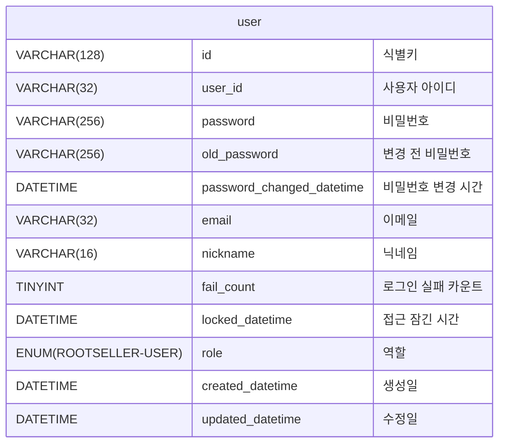

```mermaid
---
prototype
---
erDiagram
    
    user[user] {
        VARCHAR(128) id "식별키"
        VARCHAR(32) user_id "사용자 아이디"
        
        VARCHAR(256) password "비밀번호"
        VARCHAR(256) old_password "변경 전 비밀번호"
        DATETIME password_changed_datetime "비밀번호 변경 시간"
        
        VARCHAR(32) email "이메일"
        VARCHAR(16) nickname "닉네임"
        TINYINT fail_count "로그인 실패 카운트"
        DATETIME locked_datetime "접근 잠긴 시간"
        
        ENUM(ROOTSELLER-USER) role "역할"
        
        DATETIME created_datetime "생성일"
        DATETIME updated_datetime "수정일"
    }

```