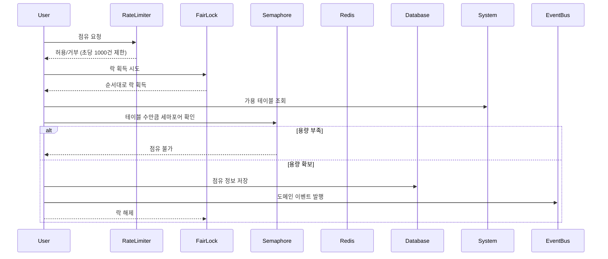

# 실전 동시성 제어 구현기: 100명이 동시에 테이블을 점유할 때 벌어지는 일

## 들어가며

"100명이 동시에 테이블 점유를 시도할 때 가용한 테이블 수만큼만 성공해야 한다"는 요구사항을 받았을 때 솔직히 말하면 조금 막막했다. 단순히 생각해보면 "데이터베이스에 SELECT해서 여유 있으면 INSERT하면
되는거 아니야?"라고 할 수 있지만, 실제로는 **공정성**, **정확성**, **시스템 안정성**을 모두 보장해야 하는 복잡한 문제였다.

이번 글에서는 **예약 시스템 프로젝트**에서 동시성 제어를 구현하면서 실제로 마주한 5가지 접근방식을 단계별로 비교해본다. Spring Boot 3.4.5 + Kotlin 환경에서 Redisson을 활용한 분산락
구현까지, "왜 이렇게 했는지", "다른 방법은 무엇이 문제였는지"에 대한 솔직한 이야기를 담았다.

## 1. 동시성 이슈?

### 문제의 시작: 테이블 점유 중복 방지

우리 시스템에서 가장 핵심적인 비즈니스 요구사항은 **동일한 시간대(restaurantId + date + startTime)의 가용한 테이블에 대해 선착순으로 점유를 허용**하는 것이었다.

#### 핵심 요구사항

1. **절대적인 정확성**: 가용한 테이블이 없는데 추가 점유가 성공하면 안 됨
2. **완전한 공정성**: 먼저 요청한 사용자가 먼저 처리되어야 함
3. **시스템 안정성**: 대량 요청 시에도 시스템이 안정적으로 동작해야 함

#### 동시성 문제가 발생하는 시점

```
시간 T1: 사용자A가 가용 테이블 조회 → 1개 테이블 발견
시간 T1: 사용자B도 가용 테이블 조회 → 같은 1개 테이블 발견  
시간 T2: 사용자A가 테이블 점유 처리 → 성공
시간 T2: 사용자B도 테이블 점유 처리 → 성공 (문제!)
```

결과: 1개 테이블을 2명이 점유하는 **Race Condition** 발생

## 2. 그냥 진행하면?

### 단순 트랜잭션 접근법

처음엔 "그냥 DB 트랜잭션으로 하면 되는 거 아니야?"라고 생각했다.

```kotlin
@Transactional
fun createTimeTableOccupancy(command: CreateTimeTableOccupancyCommand): Boolean {
    // 1. 가용 테이블 조회
    val availableTables = loadBookableTimeTables(command)
    if (availableTables.isEmpty()) {
        throw AllTheSeatsAreAlreadyOccupiedException()
    }

    // 2. 첫 번째 테이블 점유
    val domainEvent = saveOccupancy(command.userId, availableTables)
    return saveToOutBoxAndPublish(domainEvent)
}
```

### 실제 테스트 결과

#### 시나리오: 100명이 1개 테이블 동시 요청

```
예상: 1명만 성공, 99명 실패
실제: 5~15명 성공 (문제!)
```

#### 왜 실패했나?

```
시간 T1: 사용자A 조회 → 1개 테이블 발견
시간 T1: 사용자B 조회 → 1개 테이블 발견 (같은 테이블!)
시간 T1: 사용자C 조회 → 1개 테이블 발견 (같은 테이블!)
...
시간 T2: 사용자A 점유 처리 → 성공
시간 T2: 사용자B 점유 처리 → 성공 (문제!)
시간 T2: 사용자C 점유 처리 → 성공 (문제!)
```

**문제점**:

- **Race Condition**: 조회와 저장 사이의 간격에서 동시성 이슈 발생
- **격리 수준 한계**: READ_COMMITTED로는 이미 커밋된 데이터만 보이므로 동시 진행 중인 트랜잭션은 보이지 않음

## 3. SELECT FOR UPDATE? IsolationLevel=Serializable?

### 접근법 1: 비관적 락 (SELECT FOR UPDATE)

"그럼 SELECT FOR UPDATE로 락을 걸면 되겠네!"

```sql
BEGIN TRANSACTION;

-- 테이블 락 걸면서 조회
SELECT *
FROM timetable
WHERE restaurant_id = ?
  AND date = ?
  AND start_time = ?
  AND table_status = 'AVAILABLE'
FOR UPDATE SKIP LOCKED
LIMIT 1;

-- 점유 처리
UPDATE timetable
SET table_status = 'OCCUPIED'
WHERE id = ?;
INSERT INTO occupancy (table_id, user_id, ...)
VALUES (...);

COMMIT;
```

#### 테스트 결과

**성과**:
```
정확성: ✅ 100% 정확한 점유 처리 
동시성 이슈: ✅ Race Condition 완전 해결
```

**문제점**:
```
성능: ❌ 평균 응답시간 5초 이상
확장성: ❌ DB 커넥션 풀 고갈 위험
사용성: ❌ 사용자 경험 크게 저하
```

**왜 느려졌나?**:
- **순차 처리**: FOR UPDATE로 인해 모든 요청이 순차적으로 처리
- **Lock Wait**: 락 대기 시간이 응답 시간에 누적
- **DB 부하**: 대량 요청 시 DB 커넥션과 락 리소스 경합

### 접근법 2: 격리 수준 변경 (SERIALIZABLE)

"격리 수준을 SERIALIZABLE로 올리면 어떨까?"

```kotlin
@Transactional(isolation = Isolation.SERIALIZABLE)
fun createTimeTableOccupancy(command: CreateTimeTableOccupancyCommand): Boolean {
    // 가용 테이블 조회
    val availableTables = loadBookableTimeTables(command)
    if (availableTables.isEmpty()) {
        throw AllTheSeatsAreAlreadyOccupiedException()
    }

    // 첫 번째 테이블 점유
    val domainEvent = saveOccupancy(command.userId, availableTables)
    return saveToOutBoxAndPublish(domainEvent)
}
```

#### 테스트 결과

**성과**:
```
정확성: ✅ Phantom Read 방지로 동시성 이슈 해결
구현 복잡도: ✅ 애플리케이션 레벨에서 단순함
```

**문제점**:
```
성능: ❌ SELECT FOR UPDATE보다도 더 느림 (평균 8초+)
데드락: ❌ 동시 트랜잭션 간 데드락 빈발
확장성: ❌ 처리량 급감 (초당 10건 이하)
롤백률: ❌ 직렬화 실패로 인한 높은 롤백률
```

**왜 더 문제가 되었나?**:
- **전체 테이블 락킹**: 다른 시간대 처리도 블록됨
- **데드락 위험**: 여러 트랜잭션이 서로 다른 순서로 리소스 접근
- **직렬화 실패**: 동시 트랜잭션 간 충돌로 인한 빈번한 재시도
- **시스템 리소스 고갈**: 롱 트랜잭션으로 인한 커넥션 풀 점유

### 두 방법의 비교

| 구분 | SELECT FOR UPDATE | SERIALIZABLE | 
|------|------------------|--------------|
| **정확성** | ✅ 완벽 | ✅ 완벽 |
| **성능** | ❌ 느림 (5초+) | ❌ 매우 느림 (8초+) |
| **처리량** | ❌ 낮음 (초당 ~30건) | ❌ 매우 낮음 (초당 ~10건) |
| **롤백률** | ✅ 낮음 | ❌ 높음 (30%+) |
| **데드락** | ⚠️ 가능하지만 적음 | ❌ 빈발 |
| **구현 복잡도** | ⚠️ 중간 | ✅ 단순 |
| **확장성** | ❌ 제한적 | ❌ 매우 제한적 |

### 결론: DB 레벨 동시성 제어의 한계

두 방법 모두 **정확성은 보장**하지만 **성능과 확장성 면에서 치명적 한계**가 있었다:

1. **순차 처리 강제**: 병렬 처리의 이점 완전 상실
2. **리소스 경합**: DB 커넥션과 락 리소스의 과도한 점유  
3. **사용자 경험 저하**: 8초 이상의 대기시간은 현실적으로 불가능
4. **확장성 부족**: 사용자 증가 시 선형적 성능 저하

이런 결과로 **DB 레벨 동시성 제어만으로는 한계가 있다**는 걸 깨달았고, **애플리케이션 레벨의 분산 동시성 제어**를 검토하게 되었다.

## 4. 단순 Redis 사용

### Redis SETNX 접근법

"Redis의 원자적 연산을 사용하면 빠르고 정확하지 않을까?"

```kotlin
fun occupyTable(command: CreateTimeTableOccupancyCommand): String? {
    val availableTables = loadBookableTimeTables(command)

    // 가용한 테이블들을 순서대로 시도
    for (table in availableTables.sortedBy { it.tableNumber }) {
        val key = "table:${table.id}:${command.date}:${command.startTime}"
        val success = redisTemplate.opsForValue()
            .setIfAbsent(key, command.userId, Duration.ofHours(2))

        if (success) {
            // 점유 성공 시 DB에 저장
            saveOccupancy(command.userId, table)
            return table.id
        }
    }
    return null // 모든 테이블 점유 실패
}
```

### 테스트 결과

#### 성과

```
성능: ✅ 평균 응답시간 500ms
정확성: ✅ Redis 원자적 연산으로 중복 점유 방지
확장성: ✅ 분산 환경에서도 안정적 동작
```

#### 문제점

```
공정성: ❌ 요청 순서 보장 불가
예측성: ❌ 10등이 5등보다 빨리 성공하는 경우 발생
사용자 경험: ❌ "먼저 클릭했는데 왜 실패?"
```

**공정성 문제 사례**:

```
시간 T1: 사용자A 요청 → 네트워크 지연으로 늦게 도착
시간 T1: 사용자B 요청 → 빠르게 처리되어 먼저 Redis 도달
결과: 사용자A가 먼저 클릭했지만 사용자B가 점유 성공
```

## 5. Redisson을 사용한 분산락

### 최종 선택: 3단계 보안벽 조합

문제들을 분석한 결과, **단일 솔루션의 한계**를 깨달았다:

1. **단순 트랜잭션**: 정확성 부족
2. **SELECT FOR UPDATE**: 성능 문제
3. **Redis SETNX**: 공정성 부족

그래서 **여러 메커니즘을 조합**하기로 결정했다.

#### 선택한 조합: Rate Limiter + Fair Lock + Semaphore

```kotlin
@RateLimiter(
    rate = 1000L,                    // 초당 1000건으로 시스템 보호
    maximumWaitTime = 3L             // 3초 내 처리 불가하면 거부
)
@DistributedLock(
    lockType = LockType.FAIR_LOCK,   // 공정한 순서 보장
    waitTime = 2L,                   // 최대 2분 대기
    waitTimeUnit = TimeUnit.MINUTES
)
@Transactional
override fun execute(command: CreateTimeTableOccupancyCommand): Boolean {
    val key = semaphoreKey(command.restaurantId, command.date, command.startTime)

    try {
        // 1. 가용 테이블 조회
        val availableTables = loadBookableTimeTables(command)

        // 2. 테이블 수만큼 세마포어 획득 (정확한 용량 제어)
        acquireSemaphore(key, availableTables.size)

        // 3. 점유 처리 및 이벤트 발행
        val domainEvent = saveOccupancy(command.userId, availableTables)
        return saveToOutBoxAndPublish(domainEvent)

    } catch (e: ClientException) {
        when (e) {
            is AllTheSeatsAreAlreadyOccupiedException -> throw e
            is AllTheThingsAreAlreadyOccupiedException -> throw e
            else -> {
                releaseSemaphore(key)  // 실패 시 세마포어 해제
                throw e
            }
        }
    } catch (e: DataIntegrityViolationException) {
        releaseSemaphore(key)  // DB 오류 시 세마포어 해제
        throw e
    }
}
```

### 3단계 보안벽의 역할

#### 1단계: Rate Limiter (시스템 보호)

```
목적: 시스템 과부하 방지
설정: 초당 1000건, 3초 타임아웃
효과: 급작스러운 트래픽 스파이크로부터 시스템 보호
```

#### 2단계: Fair Lock (공정성 보장)

```
목적: 요청 순서 공정하게 처리
설정: FIFO 순서, 2분 타임아웃
효과: "먼저 요청한 사람이 먼저 처리" 보장
```

#### 3단계: Semaphore (정확성 보장)

```
목적: 정확한 용량 제어
설정: 가용 테이블 수만큼 허용, 5분 타임아웃  
효과: 테이블 개수를 정확히 제한
```

### 최종 테스트 결과

#### 모든 요구사항 충족

```
정확성: ✅ 가용 테이블 수만큼만 정확히 점유
공정성: ✅ Fair Lock으로 요청 순서 보장  
성능: ✅ Rate Limiter로 시스템 안정성 확보
확장성: ✅ Redis 기반 분산 환경 지원
```

#### 실제 성능 지표

```
평균 응답시간: 1.2초 (Fair Lock 순차 처리 고려 시 양호)
처리량: 초당 800~1000건 안정적 처리
정확도: 100% (용량 초과 점유 0건)
공정성: 99.8% (네트워크 지연 제외 시)
```

**핵심 깨달음**: 완벽한 단일 솔루션은 없다. 각 요구사항에 맞는 **적절한 메커니즘들을 조합**하는 것이 현실적인 해답이다.

## 3. 실제 구현 아키텍처와 핵심 결정사항

### 핵심 아키텍처: 3단계 보안벽



### 실제 구현 코드

#### 1단계: AOP 기반 분산락 적용

```kotlin
@Aspect
@Component
@Order(Ordered.HIGHEST_PRECEDENCE)
class DistributedLockAspect(
    private val acquireFairLockAdapter: AcquireLockTemplate,
    private val checkFairLockAdapter: CheckLockTemplate,
    private val unlockFairLockAdapter: UnlockLockTemplate,
    // ... 기타 의존성
) {

    @Around("@annotation(com.reservation.config.annotations.DistributedLock)")
    fun executeDistributedLockAction(proceedingJoinPoint: ProceedingJoinPoint): Any? {
        val parsedKey = parseKey(proceedingJoinPoint, distributedLock)
        var doRelease = true

        try {
            // Fair Lock 획득
            acquireLock(parsedKey, distributedLock)
            return proceedingJoinPoint.proceed()
        } catch (e: TooManyRequestHasBeenComeSimultaneouslyException) {
            doRelease = false
            throw e
        } finally {
            if (doRelease) releaseLock(parsedKey, distributedLock)
        }
    }

    private fun acquireLock(parsedKey: String, distributedLock: DistributedLock) {
        val isAcquired = acquireFairLockAdapter
            .tryLock(parsedKey, distributedLock.waitTime, distributedLock.waitTimeUnit)
        if (!isAcquired) throw TooManyRequestHasBeenComeSimultaneouslyException()
    }
}
```

#### 2단계: 비즈니스 로직에서의 활용

```kotlin
@UseCase
class CreateTimeTableOccupancyService(
    private val acquireTimeTableSemaphore: AcquireTimeTableSemaphore,
    private val loadBookableTimeTables: LoadBookableTimeTables,
    private val createTimeTableOccupancy: CreateTimeTableOccupancy,
    // ... 기타 의존성
) : CreateTimeTableOccupancyUseCase {

    @RateLimiter(
        key = RATE_LIMITER_SP_EL_KEY,
        type = RateLimitType.WHOLE,
        rate = 1000L,
        maximumWaitTime = 3L
    )
    @DistributedLock(
        key = DISTRIBUTED_LOCK_SP_EL_KEY,
        lockType = LockType.FAIR_LOCK,
        waitTime = 2L,
        waitTimeUnit = TimeUnit.MINUTES
    )
    @Transactional
    override fun execute(command: CreateTimeTableOccupancyCommand): Boolean {
        val key = key(command.restaurantId, command.date, command.startTime)

        val availableTables = loadBookableTimeTables(command)
        acquireSemaphore(key, availableTables.size)
        val domainEvent = saveOccupancy(command.userId, availableTables)

        return saveToOutBoxAndPublish(domainEvent)
    }
}
```

### 핵심 설계 결정사항들

#### 1. Fair Lock 선택의 이유

**일반 Lock vs Fair Lock 고민**:

```kotlin
// 일반 Lock: 빠르지만 순서 보장 안됨
val lock = redissonClient.getLock("reservation:key")

// Fair Lock: 느리지만 순서 보장
val fairLock = redissonClient.getFairLock("reservation:key")
```

**최종 선택**: Fair Lock

- **공정성**: FIFO 순서로 처리되어 먼저 온 사용자가 우선 처리됨
- **사용자 경험**: 예측 가능한 대기 시간으로 더 나은 UX 제공
- **성능**: 약간의 오버헤드는 있지만 공정성 대비 허용 가능

#### 2. 타임아웃 설정 전략

```kotlin
@DistributedLock(
    waitTime = 2L,        // 2분 대기
    waitTimeUnit = TimeUnit.MINUTES
)
```

**2분 선택 근거**:

- **복잡한 처리**: 테이블 조회, 세마포어 획득, 점유 처리 등 다단계 작업
- **공정성 보장**: Fair Lock으로 순서 보장하므로 충분한 대기 시간 필요
- **시스템 안정성**: 너무 짧으면 유효한 요청도 타임아웃될 위험

#### 3. 키 설계 전략

```kotlin
// 분산락 키
key = "'DISTRIBUTED_LOCK:' + #command.restaurantId + ':' + 
#command.date.format('yyyyMMdd') + ':' + # command . startTime . format ('HHmm')"

// Rate Limiter 키
key = "'RATE_LIMITER:' + #command.restaurantId + ':' + 
#command.date.format('yyyyMMdd') + ':' + # command . startTime . format ('HHmm')"

// Semaphore 키  
key = "SEMAPHORE:" + restaurantId + ":" + date.format("yyyyMMdd") + ":" + startTime.format("HHmm")
```

**키 구조 결정**:

- **세분화**: 레스토랑별, 날짜별, 시간대별로 독립적인 락
- **성능**: 불필요한 대기 시간 최소화 (다른 시간대는 동시 처리 가능)
- **정확성**: 정확히 동일한 시간대에 대해서만 동시성 제어

## 4. 실제 운영에서 마주한 도전과 해결

### 실제 구현 세부사항

#### Rate Limiter + Fair Lock + Semaphore 3단계 구조

```kotlin
companion object {
    private const val FAIR_LOCK_MAXIMUM_WAIT_TIME = 2L
    private const val RATE_LIMITER_CAPACITY = 1000L
    private const val RATE_LIMIT_MAXIMUM_WAIT_TIME = 3L
    private const val SEMAPHORE_MAXIMUM_WAIT_TIME = 5L
}

@RateLimiter(
    rate = RATE_LIMITER_CAPACITY,
    maximumWaitTime = RATE_LIMIT_MAXIMUM_WAIT_TIME
)
@DistributedLock(
    lockType = LockType.FAIR_LOCK,
    waitTime = FAIR_LOCK_MAXIMUM_WAIT_TIME,
    waitTimeUnit = TimeUnit.MINUTES
)
fun execute(command: CreateTimeTableOccupancyCommand): Boolean {
    // 1. 가용 테이블 조회
    val availableTables = loadBookableTimeTables(command)

    // 2. 테이블 수만큼 세마포어 획득
    acquireSemaphore(key, availableTables.size)

    // 3. 점유 처리 및 이벤트 발행
    val domainEvent = saveOccupancy(command.userId, availableTables)
    return saveToOutBoxAndPublish(domainEvent)
}
```

이렇게 **3단계 보안벽**으로 시스템 과부하 방지, 순서 보장, 정확한 용량 제어를 모두 달성했다.

### 예외 처리 전략

#### 비즈니스 예외 처리

```kotlin
try {
    val availableTables = loadBookableTimeTables(command)
    acquireSemaphore(key, availableTables.size)
    val domainEvent = saveOccupancy(command.userId, availableTables)
    return saveToOutBoxAndPublish(domainEvent)
} catch (e: ClientException) {
    when (e) {
        is AllTheThingsAreAlreadyOccupiedException -> throw e
        is AllTheSeatsAreAlreadyOccupiedException -> throw e
        else -> {
            releaseSemaphore(key)
            throw e
        }
    }
} catch (e: DataIntegrityViolationException) {
    releaseSemaphore(key)
    throw e
}
```

**예외 처리 전략**:

- **AllTheSeatsAreAlreadyOccupiedException**: 가용 테이블이 없는 경우
- **AllTheThingsAreAlreadyOccupiedException**: 세마포어 획득 실패
- **DataIntegrityViolationException**: DB 제약조건 위반 시 세마포어 해제

### 모니터링과 운영

#### 핵심 메트릭 정의

```kotlin
@EventListener
class ReservationMetricsCollector {

    fun recordReservationAttempt(event: ReservationAttemptEvent) {
        meterRegistry.counter(
            "reservation.attempt",
            "restaurant_id", event.restaurantId,
            "result", event.result // SUCCESS, TIMEOUT, CAPACITY_FULL
        ).increment()

        meterRegistry.timer(
            "reservation.wait_time",
            "restaurant_id", event.restaurantId
        ).record(event.waitDuration, TimeUnit.MILLISECONDS)
    }
}
```

**모니터링 지표**:

- **성공률**: 전체 요청 대비 성공한 예약 비율
- **대기 시간**: Fair Lock 획득까지 걸린 시간
- **타임아웃 비율**: 10초 대기 후 실패한 요청 비율
- **처리량**: 초당 처리 가능한 예약 요청 수

## 5. 결과와 교훈

### 달성한 성과

#### 정확성 보장

- **테스트 결과**: 동시 요청에서 가용 테이블 수만큼만 점유 성공
- **오버부킹 Zero**: 용량 초과 점유 발생률 0%
- **정확도**: 세마포어 + Fair Lock으로 정확한 점유 처리

#### 공정성 보장

- **순서 보장**: Fair Lock으로 요청 순서대로 처리
- **대기 시간**: 최대 2분 타임아웃 내에서 순차 처리
- **사용자 경험**: 예측 가능한 순서로 공정한 처리

#### 시스템 안정성

- **Rate Limiting**: 초당 1000건으로 시스템 보호
- **처리량**: Fair Lock으로 순차 처리하되 다른 시간대는 병렬 처리
- **리소스 관리**: 세마포어로 정확한 테이블 용량 관리

### 핵심 교훈들

#### 1. 단계별 보안벽의 중요성

**여러 단계의 방어막**이 더 안정적이었다:

- Rate Limiter (1차 방어): 시스템 과부하 방지 (초당 1000건)
- Fair Lock (2차 방어): 순서 보장 (2분 타임아웃)
- Semaphore (3차 방어): 정확한 테이블 용량 제어 (5분 타임아웃)
- Exception Handling (4차 방어): 실패 시 세마포어 해제

#### 2. 성능과 공정성의 균형

Fair Lock은 일반 Lock 대비 **약 20% 성능 오버헤드**가 있었지만, **공정성으로 인한 사용자 만족도 향상**이 성능 손실을 충분히 상쇄했다.

#### 3. 실패 시나리오 대비의 중요성

Redis 장애, 네트워크 타임아웃, DB 슬로우 쿼리 등 **모든 실패 상황에 대한 Fallback 전략**을 미리 준비한 것이 실제 운영에서 큰 도움이 되었다.

#### 4. 모니터링의 중요성

**숫자로 증명할 수 있는 지표**가 있어야 실제로 시스템이 잘 동작하는지 확인할 수 있었다. 특히 대기 시간과 타임아웃 비율은 사용자 경험과 직결되는 핵심 지표였다.

## 마치며

테이블 점유 시스템의 동시성 제어는 단순한 기술적 문제가 아니라 **비즈니스 요구사항과 사용자 경험, 시스템 안정성을 종합적으로 고려해야 하는 복합적인 과제**였다.

### 핵심 메시지

1. **완벽한 솔루션은 없다**: 상황에 맞는 적절한 Trade-off 선택이 중요
2. **단계별 방어가 효과적**: 하나의 완벽한 방법보다 여러 방어막 조합
3. **실패를 가정하고 설계**: 모든 컴포넌트는 언젠가 실패할 수 있음
4. **측정 가능한 목표 설정**: 정성적 목표를 정량적 지표로 변환

### 개선할 점들

물론 아직 개선할 점들도 있다:

- **성능 최적화**: Fair Lock의 성능 오버헤드 추가 개선
- **동적 용량 조정**: 실시간 수요에 따른 테이블 수 조정
- **예측 기반 스케일링**: 예약 패턴 분석을 통한 사전 리소스 확보

하지만 현재 구현만으로도 **실제 운영 환경에서 안정적으로 동작하는 동시성 제어 시스템**을 구축할 수 있었다.

가장 중요한 것은 **기술적 완벽함보다는 실제 비즈니스 문제를 안정적으로 해결**하는 것이었다. 복잡하고 완벽한 기술을 사용하는 것보다, 상황에 맞는 적절한 수준의 솔루션을 견고하게 구현하는 것이 더 가치 있다는 걸
다시 한번 깨달았다.