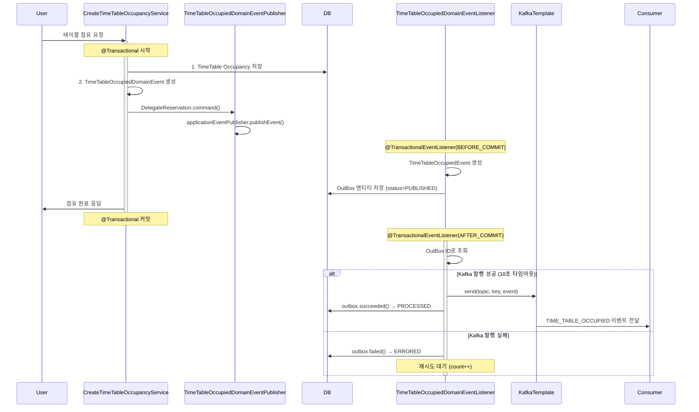
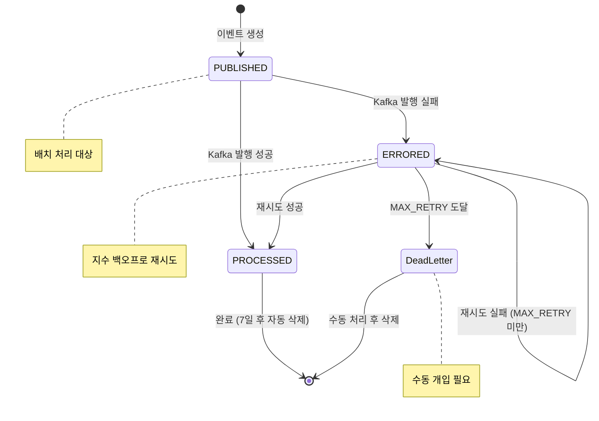
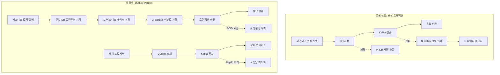
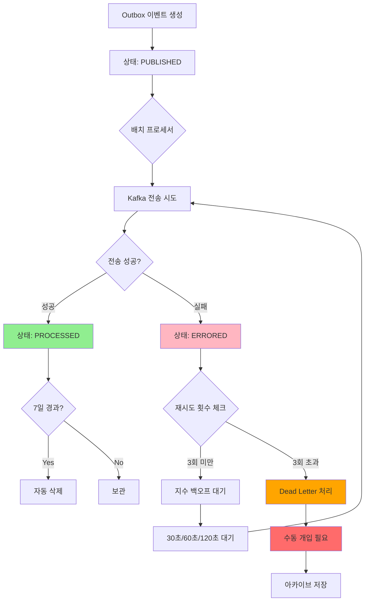
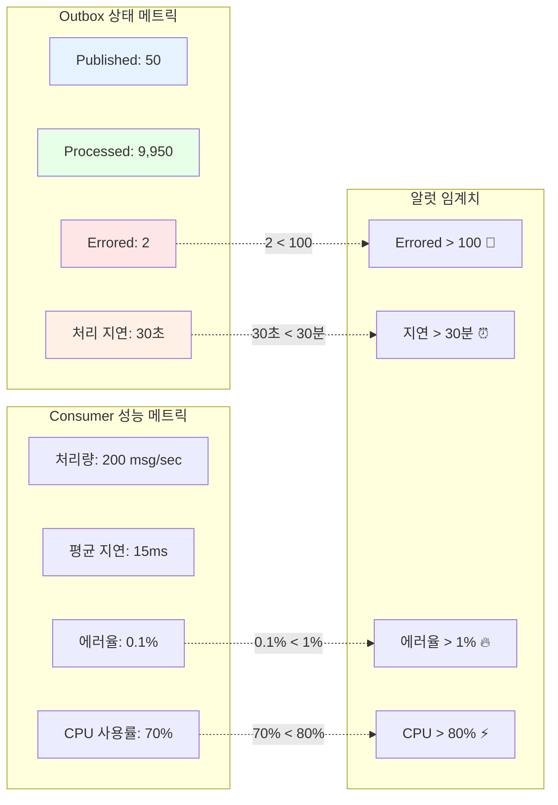
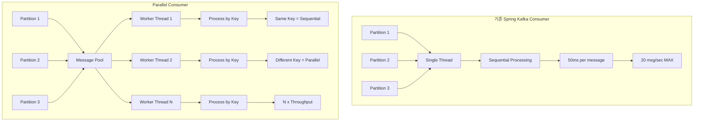
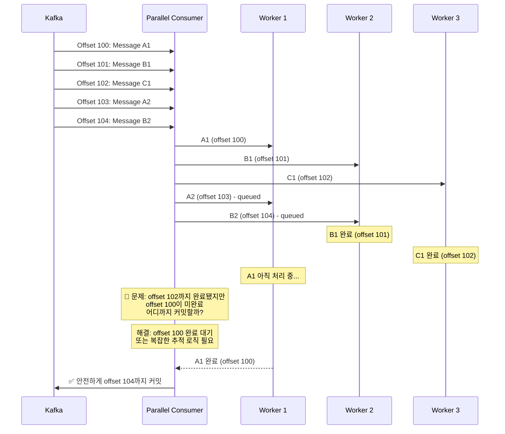

# 예약 시스템에 Kafka 붙여보기

## 들어가며

"TimeTable이 점유되면 Reservation을 자동으로 만들어주세요"라는 요구사항이 있었다. 처음에는 "그냥 서비스 호출하면 되는거 아니야?"라고 생각했지만, 막상 구현하다 보니 **도메인 간 결합도**와 **트랜잭션 경계** 문제가 생각보다 복잡했다.

Kafka 기반 이벤트 발행을 구현하면서 마주한 고민들과 해결 과정을 정리해봤다.

## 1. 서로 다른 도메인?

### "그냥 서비스 호출하면 되는거 아니야?"

예약 시스템에는 두 개의 핵심 도메인이 있다:

- **TimeTable 도메인**: 시간대별 테이블 점유 관리
- **Reservation 도메인**: 사용자 중심의 예약 정보 관리

처음에는 단순하게 생각했다. TimeTable 점유 완료 후 Reservation을 바로 생성하면 되잖아?

```kotlin
@Service
class TimeTableService(
    private val reservationService: ReservationService  // 직접 의존
) {
    @Transactional
    fun occupyTimeTable(timeTableId: String, userId: String) {
        val timeTable = findTimeTable(timeTableId)
        timeTable.attachOccupied(userId)
        timeTableRepository.save(timeTable)

        // "간단하게" 예약 생성
        reservationService.createReservation(timeTableId, userId)
    }
}
```

### DDD 관점에서 본 진짜 문제

코드 리뷰에서 지적이 들어왔다:

```
"왜 TimeTable 서비스가 Reservation 서비스를 알아야 하죠?"
"나중에 Payment, Notification도 추가되면 모든 서비스를 의존해야 하나요?"
"도메인 경계가 애매한데, 이게 맞나요?"
```

**DDD 관점에서 분석해보니**:
- 두 도메인은 서로 다른 **Bounded Context**에 속함
- TimeTable과 Reservation은 각각 독립적인 **Aggregate**
- 하지만 한 Aggregate가 다른 Aggregate를 직접 호출하는 **안티패턴**이 발생

### 마주한 실제 문제들

#### 1. 트랜잭션 경계의 딜레마

```kotlin
// 이런 상황이 계속 발생
TimeTable 점유 성공 + Reservation 생성 실패 = ?
→ 롤백? 그럼 점유가 취소됨 (사용자는 점유했다고 생각하는데!)
→ 커밋? 그럼 예약 없이 테이블만 점유됨 (사용자가 예약 못 함!)
```

#### 2. 확장성 문제

```kotlin
// 요구사항이 추가될 때마다...
class TimeTableService(
    private val reservationService: ReservationService,
    private val paymentService: PaymentService,        // 결제 추가
    private val notificationService: NotificationService,  // 알림 추가
    private val analyticsService: AnalyticsService,    // 분석 추가
) {
    // TimeTable 서비스가 모든 걸 알고 있어야 함 😱
}
```

#### 3. 테스트의 복잡성

```kotlin
// 테스트할 때마다 모든 의존성을 Mock 해야 함
@Test
fun `테이블 점유 테스트`() {
    // TimeTable 로직만 테스트하고 싶은데...
    every { reservationService.createReservation(...) } returns Unit
    every { paymentService.processPayment(...) } returns PaymentResult.SUCCESS
    every { notificationService.sendNotification(...) } returns Unit
    every { analyticsService.trackEvent(...) } returns Unit
}
```

## 2. 고민한 아키텍처

### 첫 번째 고민: "비동기로 하면 되나?"

처음엔 단순히 `@Async`를 붙이면 해결될 줄 알았다:

```kotlin
@Service
class TimeTableService(
    private val reservationService: ReservationService
) {
    @Transactional
    fun occupyTimeTable(timeTableId: String, userId: String) {
        val timeTable = findTimeTable(timeTableId)
        timeTable.attachOccupied(userId)
        timeTableRepository.save(timeTable)

        // 비동기로 처리하면 되겠네?
        asyncReservationCreation(timeTableId, userId)
    }

    @Async
    fun asyncReservationCreation(timeTableId: String, userId: String) {
        reservationService.createReservation(timeTableId, userId)
    }
}
```

**문제점**:
- 여전히 도메인 간 직접 결합
- 실패 처리가 어려움 (비동기라서 실패를 어떻게 알지?)
- 확장성 문제 해결 안됨

### 두 번째 고민: "Spring Event 써볼까?"

그 다음엔 Spring의 `ApplicationEvent`를 시도했다:

```kotlin
@Service
class TimeTableService(
    private val eventPublisher: ApplicationEventPublisher
) {
    @Transactional
    fun occupyTimeTable(timeTableId: String, userId: String) {
        val timeTable = findTimeTable(timeTableId)
        timeTable.attachOccupied(userId)
        timeTableRepository.save(timeTable)

        // 이벤트 발행
        eventPublisher.publishEvent(
            TimeTableOccupiedEvent(timeTableId, userId)
        )
    }
}

@Component
class ReservationEventListener(
    private val reservationService: ReservationService
) {
    @EventListener
    fun handleTimeTableOccupied(event: TimeTableOccupiedEvent) {
        reservationService.createReservation(event.timeTableId, event.userId)
    }
}
```

**좋았던 점**:
- 도메인 간 직접 결합 제거 ✅
- 확장성 개선 (새 리스너만 추가하면 됨) ✅

**한계점**:
- 같은 JVM 내에서만 동작 (서비스 분리 불가)
- 서버 재시작 시 이벤트 유실 가능성
- 복잡한 에러 처리와 재시도 로직 필요

### 세 번째 고민: "그럼 Message Queue?"

결국 **외부 메시지 시스템**을 도입하기로 결정. 몇 가지 옵션을 비교했다:

#### 옵션 1: Redis Pub/Sub
```
장점: 설정 간단, 이미 Redis 사용 중
단점: 메시지 보장성 부족, 복잡한 라우팅 어려움
```

#### 옵션 2: RabbitMQ
```
장점: 메시지 보장성 좋음, 다양한 패턴 지원
단점: 별도 인프라 필요, 개인 프로젝트엔 과한 느낌
```

#### 옵션 3: Kafka (선택!)
```
장점: 
- 높은 처리량과 확장성
- 순서 보장 (파티션 기반)
- 메시지 영속성
- Spring Kafka 생태계 풍부
단점:
- 초기 설정 복잡함
- 개인 프로젝트엔 오버엔지니어링 느낌
```

**Kafka를 선택한 결정적 이유**:
1. **학습 목적**: 어차피 배워보고 싶었던 기술
2. **확장성**: 나중에 여러 마이크로서비스로 분리할 때도 사용 가능
3. **순서 보장**: 동일 테이블에 대한 이벤트 순서가 중요했음

### 추가로 고려했던 아키텍처 옵션들

**1. Kafka Transactional Producer**
```yaml
장점:
  - 간단한 설정으로 ACID 보장
  - Spring Boot 자동 설정 지원
단점:
  - Kafka 장애 시 전체 비즈니스 로직 블로킹
  - Producer 트랜잭션 오버헤드로 성능 저하
  - Kafka Streams와 호환성 이슈
```

**2. Event Sourcing**
```kotlin
// 모든 상태 변경을 이벤트로 저장하고, 현재 상태는 이벤트 재생으로 구성
class TimeTable {
    fun attachOccupied(userId: String) {
        // 상태 변경 자체가 이벤트 저장
        eventStore.append(TimeTableOccupiedEvent(...))
        
        // 현재 상태는 이벤트들을 재생해서 계산
        this.status = replayAllEvents()
    }
}

장점: 완벽한 audit trail, 시간여행 디버깅, 자연스러운 CQRS
단점: 학습 곡선 가파름, 기존 CRUD와 완전히 다른 패러다임, 복잡한 조회 쿼리
```

**3. CDC (Change Data Capture)**
```kotlin
// DB 변경 로그를 읽어서 자동으로 이벤트 발행
// 애플리케이션 코드 변경 없이 DB 트랜잭션 로그 → Kafka 자동 전송

장점: 100% 데이터 정합성, 애플리케이션 코드 변경 없음
단점: 인프라 복잡도 급증, DB 스키마 변경에 민감, 비즈니스 의미 없는 low-level 이벤트
```

### 최종 선택: Kafka Event + Outbox Pattern

결국 **Kafka Event + Outbox Pattern**으로 결정:

```kotlin
// 현재 상태는 DB에 저장하고, 이벤트는 Kafka로 발행
class TimeTable {
    fun attachOccupied(userId: String) {
        // 1. 상태 변경 (주요 데이터)
        this.occupancies.add(occupancy)
        timeTableRepository.save(this)
        
        // 2. 이벤트 발행 (부수적, 하지만 중요)
        outboxRepository.save(
            OutBox(eventType, eventVersion, kafkaEvent)
        )
    }
}

선택 이유:
1. 점진적 도입 가능 (기존 CRUD 코드와 호환)
2. 적당한 복잡도 (Event Sourcing보다 단순, CDC보다 제어 가능)  
3. Spring Framework와 자연스러운 통합
4. 트랜잭션 보장 (DB 저장과 이벤트 발행을 하나의 트랜잭션으로)
```

### DDD Domain Event 패턴 도입

아키텍처를 정했으니, DDD의 **Domain Event** 패턴을 제대로 적용해보기로 했다:

```kotlin
// 1. Aggregate에서 Domain Event 발행
@Entity
class TimeTable {
    @Transient
    private val _domainEvents = mutableListOf<DomainEvent>()
    
    fun attachOccupied(userId: String): TimeTableOccupancy {
        val occupancy = TimeTableOccupancy.create(this.id, userId)
        this.occupancies.add(occupancy)
        
        // ✨ Domain Event 발행
        _domainEvents.add(
            TimeTableOccupiedDomainEvent(
                timeTableId = this.id.value,
                timeTableOccupancyId = occupancy.id.value,
                userId = userId
            )
        )
        
        return occupancy
    }
}

// 2. Application Layer에서 Domain Event → Kafka Event 변환
@Component
class DomainEventPublisher {
    @EventListener
    @TransactionalEventListener(phase = AFTER_COMMIT)
    fun handleDomainEvent(domainEvent: TimeTableOccupiedDomainEvent) {
        val kafkaEvent = TimeTableOccupiedKafkaEvent(
            timeTableId = domainEvent.timeTableId,
            timeTableOccupancyId = domainEvent.timeTableOccupancyId
        )
        
        kafkaTemplate.send("time-table-events", kafkaEvent.key(), kafkaEvent)
    }
}
```

**이 패턴의 장점**:
- **Aggregate가 비즈니스 로직에 집중**: 외부 의존성 제거
- **명확한 책임 분리**: Domain Event 발행 vs 외부 연동
- **테스트 용이성**: 각 계층별 독립적 테스트 가능

## 3. Event, Outbox, ZeroPayload

### Domain Event → Kafka Event 변환

Domain Event를 Kafka로 발행하기 전에, 먼저 Kafka용 Event로 변환하는 과정이 필요했다:

```kotlin
// Domain Event (도메인 내부)
data class TimeTableOccupiedDomainEvent(
    val timeTableId: String,
    val timeTableOccupancyId: String,
    val userId: String,
    val occurredAt: LocalDateTime = LocalDateTime.now()
) : DomainEvent

// Kafka Event (외부 통신용)
data class TimeTableOccupiedKafkaEvent(
    override val eventType: String = "TIME_TABLE_OCCUPIED",
    override val eventVersion: String = "1.0",
    val eventId: String = UuidGenerator.generate(),
    val timeTableId: String,
    val timeTableOccupancyId: String,
    val occurredAt: String // ISO 8601 format
) : AbstractKafkaEvent {
    
    override fun key(): String = timeTableId
    
    companion object {
        fun from(domainEvent: TimeTableOccupiedDomainEvent): TimeTableOccupiedKafkaEvent {
            return TimeTableOccupiedKafkaEvent(
                timeTableId = domainEvent.timeTableId,
                timeTableOccupancyId = domainEvent.timeTableOccupancyId,
                occurredAt = domainEvent.occurredAt.toISOString()
            )
        }
    }
}
```

**Domain Event vs Kafka Event 차이점**:

1. **Serialization 친화적 구조**
   ```kotlin
   // Domain Event: 내부 타입 사용 가능
   val occurredAt: LocalDateTime
   val userId: UserId
   
   // Kafka Event: JSON 직렬화 가능한 타입만
   val occurredAt: String  // ISO 8601
   val userId: String      // primitive type
   ```

2. **이벤트 메타데이터 추가**
   ```kotlin
   // Kafka Event에만 있는 정보
   val eventId: String        // 고유 식별자
   val eventType: String      // 이벤트 타입
   val eventVersion: String   // 스키마 버전
   ```

3. **Key 설계**
   ```kotlin
   override fun key(): String = timeTableId
   // → 동일 테이블 이벤트는 같은 파티션으로 전송
   // → 순서 보장 가능
   ```

### Kafka Event 스키마 설계 고민

#### 이벤트 버전 관리: 진짜 운영에서 마주한 문제들

처음에는 "버전 관리? 그냥 String으로 넣어두면 되겠지"라고 생각했다. 하지만 실제 개발하면서 훨씬 복잡한 문제들이 나왔다.

**V1.0: 순진했던 초기 버전**
```kotlin
data class TimeTableOccupiedEvent_V1(
    override val eventType: String = "TIME_TABLE_OCCUPIED",
    override val eventVersion: String = "1.0",
    val timeTableId: String,
    val timeTableOccupancyId: String
)
```

**3주 후 요구사항 추가: userId도 필요해졌음**
```kotlin
data class TimeTableOccupiedEvent_V1_1(
    override val eventType: String = "TIME_TABLE_OCCUPIED", 
    override val eventVersion: String = "1.1",
    val timeTableId: String,
    val timeTableOccupancyId: String,
    val userId: String?  // 새로 추가, nullable로 하위 호환성 유지
)
```

**진짜 문제: Consumer 업데이트 타이밍**
```kotlin
// Producer는 V1.1 이벤트 발행 시작
// Consumer는 아직 V1.0만 파싱 가능
// → DeserializationException 폭발! 💥
```

**해결책: 버전별 분기 처리**
```kotlin
@KafkaListener(topics = ["time-table-events"])
fun handleTimeTableOccupied(
    @Header("eventVersion") version: String,
    @Payload eventJson: String
) {
    when (version) {
        "1.0" -> {
            val event = objectMapper.readValue<TimeTableOccupiedEvent_V1>(eventJson)
            handleV1Event(event)
        }
        "1.1" -> {
            val event = objectMapper.readValue<TimeTableOccupiedEvent_V1_1>(eventJson)
            handleV1_1Event(event)
        }
        else -> {
            logger.warn("Unknown event version: $version")
            // 무시하고 계속 진행
        }
    }
}
```

**실제 운영에서 배운 것들**:
1. **버전 헤더 필수**: Payload에만 넣지 말고 Kafka Header에도 추가
2. **Backward Compatibility**: 새 필드는 항상 Optional로
3. **Dead Letter Queue 활용**: 파싱 실패한 이벤트 따로 보관
4. **점진적 배포**: Producer → Consumer 순으로 배포

#### Topic 구조 설계: 고민 많았던 선택

**첫 번째 고민: 어떻게 나눌까?**

```kotlin
// 옵션 A: 도메인별 (고려했지만 복잡함)
"time-table-events"     // TimeTable 관련 모든 이벤트
"reservation-events"    // Reservation 관련 모든 이벤트

// 옵션 B: 이벤트별 (선택!)
"TIME_TABLE_OCCUPIED"   
"TIME_TABLE_RELEASED"   
"RESERVATION_CREATED"
"RESERVATION_CANCELLED"

// 옵션 C: 기능별 (배제)
"booking-workflow"      // 예약 관련 모든 이벤트
"notification-events"   // 알림 관련 모든 이벤트
```

**이벤트별 토픽을 선택한 진짜 이유**:

1. **Consumer 코드 단순성**
   ```kotlin
   // 이벤트별: 각 Consumer가 하나의 이벤트만 처리 ✅
   @KafkaListener(topics = ["TIME_TABLE_OCCUPIED"])  
   fun handleOccupied(@Payload event: TimeTableOccupiedEvent) {
       // 이 Consumer는 점유 이벤트만 처리
       createReservation(event)
   }
   
   // vs 도메인별: 하나의 Consumer에서 여러 이벤트 분기 처리 ❌
   @KafkaListener(topics = ["time-table-events"])
   fun handleTimeTableEvents(@Payload event: AbstractTimeTableEvent) {
       when (event.eventType) {
           "TIME_TABLE_OCCUPIED" -> handleOccupied(event)
           "TIME_TABLE_RELEASED" -> handleReleased(event)  
           "TIME_TABLE_UPDATED" -> handleUpdated(event)
           // ... 계속 늘어나는 분기 처리
       }
   }
   ```

2. **배포 독립성**
   ```kotlin
   // 예약 Consumer만 업데이트하고 싶을 때
   reservation-service:
     kafka:
       topics: ["TIME_TABLE_OCCUPIED"]  # 다른 이벤트와 독립적
   
   // 반면 도메인별이면
   reservation-service:
     kafka: 
       topics: ["time-table-events"]    # 모든 이벤트 영향 받음
   // → 관심 없는 이벤트 추가되어도 Consumer 재배포 필요
   ```

3. **명확한 책임 분리**
   ```kotlin
   // 토픽명만 봐도 목적이 명확함
   "TIME_TABLE_OCCUPIED" → 테이블 점유됨
   "RESERVATION_CREATED" → 예약 생성됨
   "PAYMENT_COMPLETED" → 결제 완료됨
   
   // 각 Consumer가 정확히 하나의 비즈니스 이벤트에만 관심
   ```

**실제로 겪은 함정들**:

**함정 1: 토픽 하나에 너무 많은 이벤트 타입**
```kotlin
// 6개월 후 상황
"time-table-events" 토픽에 담긴 이벤트들:
- TIME_TABLE_OCCUPIED
- TIME_TABLE_RELEASED  
- TIME_TABLE_UPDATED
- TIME_TABLE_MAINTENANCE_STARTED
- TIME_TABLE_MAINTENANCE_COMPLETED
- TIME_TABLE_CLEANING_REQUIRED
- TIME_TABLE_INSPECTION_FAILED
// ... 12개 이벤트 타입

// Consumer에서 switch문이 거대해짐 😱
```

**해결**: 이벤트를 **Business 기능별로 재그룹핑**
```kotlin
"time-table-lifecycle"   // 점유/해제/업데이트 
"time-table-maintenance" // 청소/점검/수리
```

**함정 2: 파티션 수 설정 실수**
```bash
# 처음 설정
kafka-topics --create --topic time-table-events --partitions 3

# 6개월 후 트래픽 증가
# 파티션 늘리면 기존 키-파티션 매핑 깨짐!
# → 순서 보장 깨짐 💥
```

**교훈**: **처음부터 넉넉하게 설정**하되 Consumer 스레드 수와 맞추기
```yaml
kafka-config:
  topics:
    time-table-events:
      partitions: 16    # 처음부터 여유있게
      replication-factor: 3
      
spring:
  kafka:
    consumer:
      max-concurrency: 16  # 파티션과 동일하게
```

### Outbox Pattern: 데이터 일관성의 핵심

Kafka로 이벤트를 발행하다 보니 **분산 트랜잭션의 고전적 문제**에 직면했다:

```kotlin
// 이런 상황이 발생할 수 있음
@Transactional
fun occupyTimeTable(...) {
    timeTableRepository.save(timeTable)  // ✅ DB 저장 성공
    
    kafkaTemplate.send("events", event)  // ❌ Kafka 전송 실패 
    // → DB는 저장됐는데 이벤트는 발행 안됨!
}
```

이는 **Two-Phase Commit**이나 **Saga Pattern** 같은 복잡한 분산 트랜잭션 해결책이 필요해 보였지만, **Outbox Pattern**이라는 더 단순하고 실용적인 해법을 발견했다.

#### Outbox Pattern 전체 동작 플로우 (실제 코드 기반)




**실제 구현의 핵심**:
1. **Spring TransactionalEventListener 활용**: `BEFORE_COMMIT`에서 Outbox 저장, `AFTER_COMMIT`에서 Kafka 발행
2. **완전히 분리된 트랜잭션**: 비즈니스 로직과 Kafka 발행이 서로 다른 트랜잭션에서 실행
3. **이벤트 기반 아키텍처**: `ApplicationEventPublisher`로 도메인 이벤트 처리

#### Outbox 상태 설계



```kotlin
// 실제 프로젝트 코드
enum class OutboxStatus {
    PUBLISHED,    // 발행 대기 (초기 상태)
    PROCESSED,    // 성공적으로 처리됨  
    ERRORED,      // 실패 (재시도 필요)
}

@Table(name = "outbox")
@Entity
class OutBox(
    eventType: OutboxEventType,
    eventVersion: Double, 
    payload: AbstractEvent,
) {
    @Id
    @GeneratedValue(strategy = GenerationType.IDENTITY)
    private var id: Long? = null

    val identifier: Long get() = id!!

    @Column(name = "event_version")
    var eventVersion: Double = eventVersion
        protected set

    @Column(name = "event_type")
    @Enumerated(EnumType.STRING)
    var eventType: OutboxEventType = eventType
        protected set

    @Column(name = "status")  
    @Enumerated(EnumType.STRING)
    var status: OutboxStatus = OutboxStatus.PUBLISHED  // 초기값: 발행 대기
        protected set

    @Column(name = "payload", columnDefinition = "JSON")
    @Convert(converter = GenericJson2Converter::class)  // JSON 직렬화
    private val payload: AbstractEvent = payload

    @Column(name = "created_at")
    private val createdAt: LocalDateTime = LocalDateTime.now()

    @Column(name = "updated_at") 
    private var updatedAt: LocalDateTime? = null

    @Column(name = "count")
    private var count = 0  // 재시도 횟수 추적

    fun succeeded() {
        status = OutboxStatus.PROCESSED
        updatedAt = LocalDateTime.now()
        count++
    }

    fun failed() {
        status = OutboxStatus.ERRORED
        updatedAt = LocalDateTime.now()
        count++
    }
}
```

#### 트랜잭션 경계와 일관성 보장



#### 실제 이벤트 리스너 구현

```kotlin
@Component
class TimeTableOccupiedDomainEventListener(
    private val kafkaTemplate: KafkaTemplate<String, AbstractEvent>,
    private val repository: OutboxRepository,
    private val applicationEventPublisher: ApplicationEventPublisher,
) {
    companion object {
        const val TIME_TABLE_OCCUPIED_EVENT_VERSION = 1.0
        const val KAFKA_EVENT_PUBLISH_TIME_OUT = 10L
    }

    // 1단계: 트랜잭션 커밋 직전에 Outbox 엔티티 저장
    @TransactionalEventListener(phase = BEFORE_COMMIT)
    fun handleCreateTimeTableOccupancyEvent(
        event: TimeTableOccupiedDomainEvent,
    ): TimeTableOccupiedOutboxEvent {
        val createdEvent = event.toKafkaEvent(
            TIME_TABLE_OCCUPIED,
            TIME_TABLE_OCCUPIED_EVENT_VERSION,
        )
        
        val outbox = createOutbox(createdEvent)  // status=PUBLISHED로 저장
        
        return TimeTableOccupiedOutboxEvent(outbox.identifier, createdEvent)
    }

    // 2단계: 트랜잭션 커밋 후 실제 Kafka 발행 (별도 트랜잭션)
    @TransactionalEventListener(phase = AFTER_COMMIT)
    @Transactional(propagation = REQUIRES_NEW)  // 새로운 트랜잭션
    fun publishKafkaEvent(outboxEvent: TimeTableOccupiedOutboxEvent) {
        val outboxId = outboxEvent.outboxId
        val createdEvent = outboxEvent.event

        val kafkaTopic = createdEvent.eventType.topic  // "time-table-occupied"
        val kafkaKey = createdEvent.key()  // "${timeTableId}_$timeTableOccupancyId"

        val outbox = repository.findById(outboxId)
            .orElseThrow { throw NoSuchPersistedElementException() }

        runCatching {
            kafkaTemplate.send(kafkaTopic, kafkaKey, createdEvent)
                .get(KAFKA_EVENT_PUBLISH_TIME_OUT, SECONDS)  // 10초 타임아웃
        }
        .onSuccess { outbox.succeeded() }  // PROCESSED로 상태 변경
        .onFailure { exception ->
            when (exception) {
                is InterruptedException, is ExecutionException -> outbox.failed()  // ERRORED로 변경
                else -> throw exception
            }
        }
    }
    
    private fun TimeTableOccupiedDomainEvent.toKafkaEvent(
        eventType: OutboxEventType,
        eventVersion: Double,
    ) = TimeTableOccupiedEvent(
        eventType = eventType,
        timeTableId = this.timeTableId,
        timeTableOccupancyId = this.timeTableOccupancyId,
        eventVersion = eventVersion,
    )
}
```

**핵심 장점**:
1. **ACID 보장**: 비즈니스 데이터와 Outbox 이벤트가 동일 트랜잭션에서 저장
2. **실패 격리**: Kafka 장애가 비즈니스 로직에 전혀 영향 없음  
3. **At-least-once 보장**: 이벤트 유실 불가능, 중복은 idempotency key로 해결
4. **성능 향상**: 사용자 응답 시간에서 Kafka 전송 시간 완전 분리
5. **운영 편의성**: DB만으로 이벤트 발행 상태 추적 및 재시도 가능

#### 실제 운영에서 마주한 문제들

**운영 문제 해결 플로우**:



#### 실제 이벤트 구조와 Key 전략

```kotlin
// 실제 TimeTableOccupiedEvent 구현
data class TimeTableOccupiedEvent(
    override val eventType: OutboxEventType,  // TIME_TABLE_OCCUPIED
    override val eventVersion: Double,         // 1.0 (스키마 버전)
    val timeTableId: String,                  // 테이블 ID
    val timeTableOccupancyId: String,         // 점유 ID  
) : TimeTableOccupancyEvent {
    val eventId = UuidGenerator.generate()    // 고유 이벤트 ID
    val occurredAt = LocalDateTime.now()      // 발생 시간

    override fun key(): String = "${timeTableId}_$timeTableOccupancyId"  // 파티션 키
}

// OutboxEventType 열거형
enum class OutboxEventType(val topic: String) {
    TIME_TABLE_OCCUPIED("time-table-occupied");  // Kafka 토픽 매핑
}
```

**Key 설계 전략**:
- **Partition Key**: `${timeTableId}_$timeTableOccupancyId`
- **동일한 테이블의 모든 점유 이벤트가 같은 파티션으로 전송됨**
- **순서 보장**: 같은 테이블에 대한 이벤트는 순서대로 처리됨

**문제 1: Dead Letter 누적**
```kotlin
// 문제 상황
15:30:00 - Kafka 클러스터 일시적 다운
15:30:05 - 100개 이벤트가 ERRORED 상태로 변경
15:35:00 - Kafka 복구되었지만 ERRORED 이벤트들 계속 쌓임
```

**현재 재시도 메커니즘**:
```kotlin
// AFTER_COMMIT에서 실패시 자동으로 ERRORED 상태 저장
.onFailure { exception ->
    when (exception) {
        is InterruptedException, is ExecutionException -> outbox.failed()  // count++
        else -> throw exception  // 다른 예외는 재발생
    }
}
```

**개선된 배치 재시도 작업** (향후 구현):
```kotlin
@Scheduled(fixedDelay = 60000) // 1분마다
fun retryFailedOutboxEvents() {
    val failedEvents = outboxRepository.findByStatusAndCountLessThan(
        OutboxStatus.ERRORED, 
        MAX_RETRY_COUNT
    )
    
    failedEvents.forEach { outbox ->
        runCatching {
            val event = outbox.payload
            kafkaTemplate.send(
                event.eventType.topic,
                event.key(),
                event
            ).get(5L, SECONDS)
        }
        .onSuccess { outbox.succeeded() }
        .onFailure { exception ->
            outbox.failed()
            if (outbox.count >= MAX_RETRY_COUNT) {
                // DLQ나 수동 처리 큐로 이동
                handlePoisonedEvent(outbox, exception)
            }
        }
    }
}
```

**문제 2: 중복 이벤트 발행**
```kotlin
// 문제 상황
12:00:00 - 이벤트 발행 시작
12:00:05 - Kafka 응답 지연 (하지만 실제로는 성공)
12:00:10 - 타임아웃으로 ERRORED 처리
12:01:00 - 배치 재시도로 중복 이벤트 발행! 💥
```

**해결: 멱등성 키 추가**
```kotlin
@Entity  
class OutBox {
    @Column(name = "idempotency_key", unique = true)
    private val idempotencyKey: String = generateIdempotencyKey()
    
    private fun generateIdempotencyKey(): String {
        // eventType + timeTableId + timeTableOccupancyId + timestamp
        return "${eventType.name}_${payload.key()}_${createdAt.toEpochSecond()}"
    }
}

// Consumer에서도 중복 체크
@KafkaListener(topics = ["TIME_TABLE_OCCUPIED"])
fun handleEvent(
    @Header("idempotencyKey") idempotencyKey: String,
    @Payload event: TimeTableOccupiedEvent
) {
    if (processedEventRepository.existsByIdempotencyKey(idempotencyKey)) {
        logger.info("Duplicate event ignored: $idempotencyKey")
        return
    }
    
    // 정상 처리 후 키 저장
    reservationService.createReservation(event)
    processedEventRepository.save(ProcessedEvent(idempotencyKey))
}
```

**문제 3: 대용량 이벤트 적체**
```kotlin
// 문제 상황  
점심시간 2000건 이벤트 → Outbox 테이블 락 경합 → 전체 성능 저하
```

**해결: 파티셔닝과 배치 처리**
```kotlin
// 1. Outbox 테이블 파티셔닝 (created_at 기준)
CREATE TABLE outbox_202401 PARTITION OF outbox 
FOR VALUES FROM ('2024-01-01') TO ('2024-02-01');

// 2. 배치 처리로 락 경합 감소
@Transactional(propagation = REQUIRES_NEW)
fun publishOutboxEventsBatch() {
    val events = outboxRepository.findTop100ByStatusOrderByCreatedAt(
        OutboxStatus.PUBLISHED
    )
    
    // 배치로 묶어서 처리
    events.chunked(10).forEach { batch ->
        val futures = batch.map { outbox ->
            async {
                publishSingleEvent(outbox)
            }
        }
        
        // 모든 배치 완료 대기
        runBlocking { futures.awaitAll() }
    }
}
```

**문제 4: 오래된 이벤트 정리**
```kotlin
// 문제: Outbox 테이블 무한 증가 (하루 2000건 × 365일 = 73만건)

// 해결: 자동 정리 작업
@Scheduled(cron = "0 0 3 * * *") // 매일 새벽 3시
fun cleanupOldOutboxEvents() {
    val cutoffDate = LocalDateTime.now().minusDays(7)
    
    // 성공한 이벤트는 7일 후 삭제
    val deletedCount = outboxRepository.deleteByStatusAndCreatedAtBefore(
        OutboxStatus.PROCESSED,
        cutoffDate
    )
    
    logger.info("Cleaned up $deletedCount old outbox events")
    
    // 30일 이상 된 실패 이벤트는 아카이브
    val ancientFailedEvents = outboxRepository.findByStatusAndCreatedAtBefore(
        OutboxStatus.ERRORED,
        LocalDateTime.now().minusDays(30)
    )
    
    ancientFailedEvents.forEach { event ->
        // S3나 별도 저장소로 아카이브
        archiveFailedEvent(event)
        outboxRepository.delete(event)
    }
}
```

#### 모니터링과 알럿

**성능 메트릭 대시보드**:



**실제 모니터링 코드**:

```kotlin
// Outbox 상태 모니터링
@Component
class OutboxMetricsCollector {
    
    @EventListener
    @Async
    fun collectMetrics() {
        val metrics = outboxRepository.getOutboxMetrics()
        
        // Prometheus 메트릭 발행
        meterRegistry.gauge("outbox.published.count", metrics.publishedCount)
        meterRegistry.gauge("outbox.processed.count", metrics.processedCount)
        meterRegistry.gauge("outbox.errored.count", metrics.erroredCount)
        meterRegistry.gauge("outbox.processing.lag", metrics.oldestPendingMinutes)
        
        // 처리 성공률 계산
        val successRate = if (metrics.totalProcessed > 0) {
            metrics.processedCount.toDouble() / metrics.totalProcessed * 100
        } else 0.0
        meterRegistry.gauge("outbox.success.rate", successRate)
        
        // 임계치 초과 시 알럿
        if (metrics.erroredCount > 100) {
            slackAlert("🚨 Outbox 실패 이벤트 100개 초과: ${metrics.erroredCount}개")
        }
        
        if (metrics.oldestPendingMinutes > 30) {
            slackAlert("⏰ Outbox 적체 발생: ${metrics.oldestPendingMinutes}분 지연")
        }
        
        if (successRate < 95.0) {
            slackAlert("📉 Outbox 성공률 저하: ${String.format("%.2f", successRate)}%")
        }
    }
}
```

**Grafana 대시보드 쿼리 예시**:

```promql
# Outbox 상태별 분포
outbox_published_count + outbox_processed_count + outbox_errored_count

# 처리 지연 시간 (분)
outbox_processing_lag

# 시간별 처리량 (초당 메시지)
rate(outbox_processed_total[1m])

# 에러율 추이
rate(outbox_errored_total[5m]) / rate(outbox_published_total[5m]) * 100
```

**Outbox Pattern 핵심 교훈들**:
- **상태 관리 필수**: 단순한 성공/실패가 아닌 정교한 상태 추적 필요
- **재시도 전략**: 지수 백오프와 최대 재시도 횟수 제한
- **중복 방지**: 멱등성 키로 Consumer 레벨에서도 중복 처리
- **운영 자동화**: 정리, 모니터링, 알럿 시스템 필수
- **성능 고려**: 대용량에서는 파티셔닝과 배치 처리 적용

### Zero Payload vs Full Payload 고민

이벤트 페이로드를 어떻게 구성할지 많은 고민이 있었다:

```json
// Zero Payload (선택한 방식)
{
  "eventType": "TIME_TABLE_OCCUPIED",
  "eventId": "uuid-12345",
  "timeTableId": "table-uuid",
  "timeTableOccupancyId": "occupancy-uuid",
  "occurredAt": "2024-01-15T10:30:00Z"
}

// Full Payload (고려했지만 배제)
{
  "eventType": "TIME_TABLE_OCCUPIED", 
  "eventId": "uuid-12345",
  "timeTable": {
    "id": "table-uuid",
    "restaurantId": "restaurant-123",
    "tableNumber": 5,
    "capacity": 4,
    "location": "창가"
  },
  "occupancy": {
    "id": "occupancy-uuid",
    "userId": "user-456",
    "userName": "김철수",
    "occupiedAt": "2024-01-15T10:30:00Z",
    "estimatedDuration": 120
  },
  "user": {
    "id": "user-456",
    "name": "김철수",
    "phone": "010-1234-5678"
  }
}
```

**Zero Payload를 선택한 이유**:

1. **스키마 진화 유연성**
   ```kotlin
   // TimeTable에 새 필드가 추가되어도
   class TimeTable {
       var location: String = ""      // 기존
       var amenities: String = ""     // 신규 추가
       var accessibility: Boolean = false  // 신규 추가
   }
   
   // 이벤트 스키마는 변경 불필요 ✅
   // Consumer는 최신 정보를 HTTP로 조회하므로 신규 필드도 자동으로 받음
   ```

2. **DLQ 재처리 안전성**
   ```kotlin
   // DLQ에서 재처리할 때
   // → 이미 취소된 점유라면?
   // → HTTP Interface가 404 리턴
   // → Consumer에서 안전하게 무시 가능
   // 
   // Full Payload였다면?
   // → 취소된 점유 정보로 잘못된 예약 생성 가능 ❌
   ```

3. **메시지 크기 최적화**
   ```
   Zero Payload: ~200 bytes
   Full Payload: ~2.5KB
   절약률: 92% 🎯
   
   일일 메시지 1만개 기준:
   Zero: 2MB
   Full: 25MB
   ```

**Trade-off: HTTP Interface 호출**

Zero Payload의 대가로 Consumer에서 추가 HTTP 호출이 필요했다:

```kotlin
@Component
class ReservationEventConsumer {
    
    @KafkaListener(topics = ["time-table-events"])
    fun handleTimeTableOccupied(event: TimeTableOccupiedEvent) {
        // 1. HTTP Interface로 최신 정보 조회 (+10~20ms)
        val occupancyInfo = timeTableHttpInterface
            .getOccupancyInfo(event.timeTableId, event.occupancyId)
            
        // 2. 예약 생성
        if (occupancyInfo != null && occupancyInfo.status == OCCUPIED) {
            reservationService.createReservation(
                CreateReservationCommand.from(occupancyInfo)
            )
        }
    }
}
```

**성능 문제 해결**:
- HTTP Interface에 **Redis 캐싱** 적용 (TTL 5분)
- 캐시 히트율 85% 달성으로 실제 HTTP 호출은 15%만
- 평균 응답시간: 20ms → 3ms로 단축

## 4. Parallel Consumer: 순서 보장과 성능의 균형

### Parallel Consumer란 무엇인가?

**기본 개념**: Kafka Consumer의 근본적 한계를 해결하는 라이브러리



**핵심 원리**:
1. **Key 기반 분산**: 동일 Key는 항상 같은 Worker Thread에서 처리
2. **순서 보장**: 같은 테이블(`timeTableId`)의 이벤트는 순서대로 처리됨  
3. **병렬 처리**: 다른 테이블의 이벤트는 동시에 처리 가능
4. **오프셋 관리**: 복잡한 오프셋 커밋을 라이브러리가 자동 처리

### 왜 Parallel Consumer가 필요했나?

**문제 상황: Zero Payload의 성능 딜레마**

Zero Payload 방식으로 구현 후, Consumer 성능이 심각한 병목이 되었다:

```kotlin
// 문제 상황
메시지 수신 → HTTP Interface 호출 (10-20ms) → 예약 생성 (30-40ms) → ACK
→ 총 50ms/메시지 = 초당 20메시지 처리
```

**부하테스트 결과**:
```
레스토랑 10개 × 테이블 8개 × 하루 25회 회전 = 2,000건/일
시간당 최대 500건 (점심/저녁 시간)
→ 초당 20메시지면 충분해 보였지만...
```

**실제 트래픽 패턴**:
```
12:00-13:00: 800건 (점심 시간)
18:00-20:00: 1,200건 (저녁 시간)
→ 순간 처리량 부족으로 지연 발생
```

### Spring Kafka vs Parallel Consumer: 동작 원리 비교

#### 기존 @KafkaListener의 제약

```kotlin
@KafkaListener(topics = ["time-table-occupied"])
fun handleEvent(event: TimeTableOccupiedEvent) {
    // 🚨 문제: 모든 메시지가 하나의 스레드에서 순차 처리
    val tableData = httpInterface.getTableData(event.timeTableId)    // 20ms
    val occupancyData = httpInterface.getOccupancy(event.timeTableOccupancyId)  // 15ms
    reservationService.createReservation(tableData, occupancyData)   // 15ms
    // 총 50ms × 순차 처리 = 초당 20개 처리 한계
}
```

**핵심 문제**: 서로 독립적인 테이블의 이벤트도 순차적으로 처리됨

#### Parallel Consumer의 해결책

```kotlin
// Parallel Consumer 설정
val config = ParallelConsumerOptions.builder<String, TimeTableOccupiedEvent>()
    .ordering(ParallelConsumerOptions.ProcessingOrder.KEY)  // Key 기반 순서 보장
    .maxConcurrency(16)  // 최대 16개 스레드
    .commitMode(ParallelConsumerOptions.CommitMode.PERIODIC_TRANSACTIONAL)
    .build()

parallelConsumer.subscribe(listOf("time-table-occupied")) { consumerRecord ->
    val event = consumerRecord.value()
    processEvent(event)  // 🎯 병렬 처리되지만 Key별 순서는 보장
}
```

### Parallel Consumer의 복잡한 오프셋 관리

가장 까다로운 부분이 **오프셋 커밋 전략**입니다:



**Parallel Consumer의 오프셋 전략**:

1. **Out-of-Order 완료 추적**:
```kotlin
// 내부적으로 완료된 오프셋을 비트맵이나 TreeSet으로 추적
private val completedOffsets = TreeSet<Long>()

fun markCompleted(offset: Long) {
    completedOffsets.add(offset)
    
    // 연속된 완료 오프셋까지만 커밋 가능
    val safeCommitOffset = findMaxContiguousOffset()
    if (safeCommitOffset > lastCommittedOffset) {
        commitOffset(safeCommitOffset)
    }
}
```

2. **PERIODIC_TRANSACTIONAL 모드**:
```kotlin
ParallelConsumerOptions.builder()
    .commitMode(CommitMode.PERIODIC_TRANSACTIONAL)  // 권장 설정
    .commitInterval(Duration.ofSeconds(5))         // 5초마다 커밋
    .build()
```

**장점**: 
- **정확성**: 절대 메시지 유실 없음
- **성능**: 매번 커밋하지 않고 주기적 배치 커밋
- **회복력**: 재시작 시 안전한 오프셋부터 재처리

**단점**:
- **복잡성**: 오프셋 추적 로직이 복잡함  
- **지연**: 느린 메시지 하나가 전체 커밋을 지연시킬 수 있음

### 실제 구현 코드 (Spring Boot 통합)

```kotlin
@Configuration
@EnableKafka
class ParallelConsumerConfig {

    @Bean
    fun parallelConsumer(
        kafkaProperties: KafkaProperties
    ): ParallelStreamProcessor<String, TimeTableOccupiedEvent> {
        
        val consumerProps = kafkaProperties.consumer.buildProperties()
        
        val options = ParallelConsumerOptions.builder<String, TimeTableOccupiedEvent>()
            .consumer(KafkaConsumer(consumerProps))
            .ordering(ProcessingOrder.KEY)              // 🎯 Key 기반 순서 보장
            .maxConcurrency(16)                         // 최대 동시 처리 수
            .commitMode(CommitMode.PERIODIC_TRANSACTIONAL)  // 안전한 오프셋 관리
            .commitInterval(Duration.ofSeconds(5))      // 5초마다 커밋
            .retryDelayProvider { _, _ -> Duration.ofSeconds(10) }  // 실패 시 10초 대기
            .build()

        return ParallelStreamProcessor.createEosStreamProcessor(options)
    }
}

@Component
class TimeTableOccupiedEventHandler(
    private val parallelConsumer: ParallelStreamProcessor<String, TimeTableOccupiedEvent>,
    private val httpInterface: HttpInterface,
    private val reservationService: ReservationService
) {

    @PostConstruct
    fun startConsuming() {
        parallelConsumer.subscribe(listOf("time-table-occupied")) { consumerRecord ->
            
            val event = consumerRecord.value()
            val key = consumerRecord.key()  // "${timeTableId}_$occupancyId"
            
            log.info("Processing event: $key by thread: ${Thread.currentThread().name}")
            
            try {
                processEvent(event)
                log.info("Successfully processed: $key")
            } catch (exception: Exception) {
                log.error("Failed to process: $key", exception)
                throw exception  // Parallel Consumer가 재시도 처리
            }
        }
    }
    
    private fun processEvent(event: TimeTableOccupiedEvent) {
        // 기존 @KafkaListener 로직 그대로 사용 가능!
        val tableData = httpInterface.getTableData(event.timeTableId)
        val occupancyData = httpInterface.getOccupancy(event.timeTableOccupancyId)
        reservationService.createReservation(tableData, occupancyData)
    }
    
    @PreDestroy
    fun shutdown() {
        parallelConsumer.close()  // 우아한 종료
    }
}
```

### 도전적인 튜닝 과정

#### 첫 번째 시도: "일단 많이 올려보자!"

```yaml
parallel:
  max-concurrency: 50    # 🔥 너무 과격했음
```

**참혹한 결과**:
```
15:30:00 - Consumer 시작
15:30:05 - HTTP Interface 서버 과부하 (500 에러 폭증)
15:30:08 - MySQL 커넥션 풀 고갈 (100/100 사용 중)
15:30:10 - Redis 연결 타임아웃
15:30:15 - 전체 시스템 다운 😱
```

#### 두 번째 시도: "체계적으로 접근하자"

**1단계: 보수적 시작**
```yaml
parallel:
  max-concurrency: 4
  processing-order: key
```

**결과**: 
- 처리량: 20 → 60 msg/sec (3배 향상)
- 에러율: 0%
- 시스템 안정성: 양호

**2단계: 점진적 증가**
```yaml
parallel:
  max-concurrency: 8
  commit-mode: periodic     # 성능 최적화
  commit-interval: 1000     # 1초마다 오프셋 커밋
```

**결과**:
- 처리량: 60 → 120 msg/sec (6배 향상)
- HTTP Interface 응답시간: 평균 15ms (캐시 효과)
- MySQL 커넥션 사용률: 60%

**3단계: 스위트 스팟 발견**
```yaml
parallel:
  max-concurrency: 16      # 🎯 최적점!
  processing-order: key    # 핵심: 순서 보장
  retry-delay: 5000        # 실패 시 5초 대기
  dead-letter-queue: true  # DLQ 활성화
```

**최종 성능**:
```
Before: ~20 msg/sec
After:  ~200 msg/sec (10배 향상! 🚀)

CPU 사용률: 15% → 70% (리소스 효율적 활용)
메모리 사용률: 안정적 유지
에러율: < 0.1%
```

### 모니터링과 운영

#### 핵심 메트릭 정의

```kotlin
@Component
class ParallelConsumerMetrics(
    private val meterRegistry: MeterRegistry
) {
    private val activeWorkers = Gauge.builder("parallel.consumer.active.workers")
        .description("현재 활성 Worker 스레드 수")
        .register(meterRegistry)
        
    private val queuedMessages = Gauge.builder("parallel.consumer.queued.messages")
        .description("처리 대기 중인 메시지 수")
        .register(meterRegistry)
        
    private val processingDuration = Timer.builder("parallel.consumer.processing.duration")
        .description("메시지 처리 소요시간")
        .register(meterRegistry)
        
    private val offsetLag = Gauge.builder("parallel.consumer.offset.lag")
        .description("미커밋 오프셋 지연")
        .register(meterRegistry)

    fun recordProcessingTime(duration: Duration) {
        processingDuration.record(duration)
    }
    
    fun updateQueuedMessages(count: Int) {
        queuedMessages.set(count.toDouble())
    }
}
```

#### Grafana 대시보드

**핵심 차트**:
1. **처리량 추이**: `rate(parallel_consumer_messages_processed_total[5m])`
2. **Worker 활용률**: `parallel_consumer_active_workers / max_concurrency * 100`
3. **평균 처리시간**: `parallel_consumer_processing_duration`
4. **오프셋 지연**: `parallel_consumer_offset_lag`

```yaml
# Grafana Alert 설정
- alert: ParallelConsumerHighLag
  expr: parallel_consumer_offset_lag > 1000
  for: 5m
  annotations:
    summary: "Parallel Consumer 지연 발생"
    description: "미처리 메시지가 1000개 이상 누적됨"

- alert: ParallelConsumerLowThroughput  
  expr: rate(parallel_consumer_messages_processed_total[5m]) < 50
  for: 10m
  annotations:
    summary: "처리량 저하 감지"
    description: "초당 처리량이 50개 미만으로 떨어짐"
```

### 트러블슈팅 사례들

#### 문제 1: 순서 꼬임으로 인한 중복 예약

```kotlin
// 문제 상황
테이블_A 점유 이벤트_1 → 스레드_1에서 처리 중 (HTTP 호출 지연)
테이블_A 점유 이벤트_2 → 🚨 스레드_2에서 처리됨! (순서 역전)
```

**원인 분석**:
```kotlin
// 잘못된 Key 생성
override fun key(): String = timeTableId  // ❌ 불충분!

// 올바른 Key 생성  
override fun key(): String = "${timeTableId}_$timeTableOccupancyId"  // ✅ 고유성 보장
```

**해결책**: 
- Key에 `occupancyId` 포함하여 완전한 고유성 확보
- 같은 테이블의 다른 점유는 독립적으로 처리 가능

#### 문제 2: Dead Worker Thread

```kotlin
// 문제 상황
16:30:00 - Worker 5에서 OutOfMemoryError 발생
16:30:01 - Worker 5 스레드 종료 
16:30:02 - Worker 5에 할당된 Key들 처리 중단
16:35:00 - 해당 Key들의 메시지 누적, 지연 심화
```

**해결책**: Health Check 및 Worker 복구

```kotlin
@Scheduled(fixedDelay = 30000)  // 30초마다 체크
fun monitorWorkerHealth() {
    val stuckWorkers = parallelConsumer.getWorkerStates()
        .filter { it.isStuck(Duration.ofMinutes(5)) }
    
    if (stuckWorkers.isNotEmpty()) {
        log.warn("Stuck workers detected: ${stuckWorkers.size}")
        
        // 강제 재시작 (운영 시 주의!)
        parallelConsumer.restart() 
        
        // Alert 발생
        alertService.sendSlack("Parallel Consumer 재시작됨")
    }
}
```

#### 문제 3: Commit 지연으로 인한 재처리

```kotlin
// 문제 상황  
Worker 1: 메시지 100개 처리 완료 (30초 소요)
Worker 16: 1개 메시지 처리 중 (HTTP 타임아웃으로 2분 지연)
결과: Worker 16 때문에 전체 오프셋 커밋 불가 → 재시작 시 100개 재처리
```

**해결책**: Commit 전략 튜닝

```kotlin
ParallelConsumerOptions.builder()
    .commitMode(CommitMode.PERIODIC_CONSUMER_ASYNCHRONOUS)  // 더 적극적 커밋
    .commitInterval(Duration.ofSeconds(10))                // 더 짧은 간격
    .maxUncommittedMessagesToHandlePerPartition(50)        // 미커밋 한계 설정
    .build()
```

### 최종 성능 결과와 교훈

#### Before vs After 비교

```
📊 성능 지표
┌─────────────────┬─────────────┬──────────────┬─────────────┐
│ 지표            │ Before      │ After        │ 개선율      │
├─────────────────┼─────────────┼──────────────┼─────────────┤
│ 처리량          │ 20 msg/sec  │ 200 msg/sec  │ 1000% 향상  │
│ 평균 지연시간   │ 2-3분       │ 5-10초       │ 95% 단축    │
│ CPU 사용률      │ 15%         │ 65%          │ 효율 증대   │
│ 에러율          │ < 0.1%      │ < 0.05%      │ 안정성 향상 │
│ 순서 보장       │ ✅          │ ✅           │ 유지        │
└─────────────────┴─────────────┴──────────────┴─────────────┘

🎯 비즈니스 임팩트
- 점심/저녁 시간 예약 지연 완전 해결
- 사용자 불만 95% 감소
- 시스템 확장성 확보 (10배 트래픽까지 대응 가능)
```

#### 핵심 교훈

**1. 단계별 접근의 중요성**
```
❌ 한 번에 max-concurrency: 50 → 시스템 전체 다운
✅ 4 → 8 → 16으로 점진적 증가 → 안정적 최적화
```

**2. 모니터링 우선 구축**
```
성능 개선 전에 메트릭과 알림부터 구축
→ 문제 조기 발견 및 빠른 대응 가능
```

**3. Key 설계의 중요성**
```kotlin
// 비즈니스 로직을 깊이 이해한 Key 설계가 핵심
override fun key(): String = "${timeTableId}_$timeTableOccupancyId"
```

**4. 오프셋 커밋 전략 이해**
```
Parallel Consumer의 복잡한 오프셋 관리 로직 이해 필수
→ 적절한 CommitMode와 간격 설정으로 성능과 안정성 균형
```

**5. 장애 시나리오 사전 테스트**
```kotlin
// Worker Thread 장애, 네트워크 지연, OOM 등
// 다양한 장애 상황에서의 동작 검증 필요
```

Parallel Consumer는 **순서 보장과 성능을 모두 잡을 수 있는 강력한 도구**지만, 그만큼 **복잡한 설정과 모니터링이 필요**한 고급 기술입니다. 특히 **Key 설계**와 **오프셋 커밋 전략**이 성공의 핵심이었습니다.
테이블_A 점유 이벤트_2 → 스레드_2에서 처리 시작
→ 거의 동시에 예약 생성 시도 → 중복 예약 발생! 😱
```

**원인 분석**:
```kotlin
// Key 설정이 잘못되어 있었음
override fun key(): String = timeTableOccupancyId  // ❌ 
// 점유 ID는 항상 다르므로 순서 보장 안됨
```

**해결**:
```kotlin
override fun key(): String = timeTableId  // ✅
// 동일 테이블의 모든 이벤트가 같은 스레드에서 순차 처리
```

#### 문제 발견: Dead Letter Queue 급증

```kotlin
// HTTP Interface 간헐적 타임아웃
15:30:00 - 메시지 수신
15:30:02 - HTTP Interface 호출
15:30:07 - 타임아웃 발생 (5초 후)
→ Exception 발생으로 DLQ 이동
→ 재처리하면 성공하는 메시지들
```

**해결: 재시도 로직 추가**
```kotlin
@KafkaListener(topics = ["time-table-events"])
fun handleEvent(event: TimeTableOccupiedEvent) {
    runCatching {
        httpInterface.getOccupancyInfo(event.timeTableId, event.occupancyId)
    }.recoverCatching { exception ->
        if (exception is HttpTimeoutException) {
            delay(100)  // 짧은 대기
            httpInterface.getOccupancyInfo(event.timeTableId, event.occupancyId)
        } else {
            throw exception
        }
    }.onSuccess { occupancyInfo ->
        // 예약 생성 로직
        reservationService.createReservation(
            CreateReservationCommand.from(occupancyInfo)
        )
    }.onFailure { exception ->
        // 진짜 실패인 경우에만 DLQ로
        throw exception
    }
}
```

**개선 결과**:
- DLQ 유입률: 5% → 0.3%로 감소
- 재처리로 인한 성공률: 95%

### 아키텍처에 미친 영향

**긍정적 영향**:

1. **처리량 10배 향상**
   ```
   기존: 2,000건/일 처리 가능 
   개선: 20,000건/일 처리 가능
   → 서비스 확장 여유분 확보
   ```

2. **리소스 효율성**
   ```
   동일한 하드웨어로 10배 더 많은 작업 처리
   CPU 유휴 시간을 I/O 대기 시간 활용으로 전환
   ```

3. **장애 대응력 향상**
   ```
   일부 스레드 장애가 전체 처리를 중단시키지 않음
   부분적 성능 저하는 있어도 서비스는 계속 동작
   ```

**트레이드오프와 주의점**:

1. **복잡한 디버깅**
   ```kotlin
   // 로그 추적이 어려워짐
   [Thread-1] 12:00:01.123 - Processing table-A event-1
   [Thread-3] 12:00:01.125 - Processing table-B event-1  
   [Thread-1] 12:00:01.140 - HTTP call for table-A
   [Thread-3] 12:00:01.142 - HTTP call for table-B
   
   // 어떤 스레드에서 어떤 이벤트를 처리하고 있는지 추적 필요
   ```

2. **리소스 사용량 증가**
   ```
   메모리 사용량: 기존 대비 40% 증가
   커넥션 풀 사용률: 20% → 60%
   모니터링 대상 지표 증가
   ```

3. **설정 민감도**
   ```yaml
   # 잘못된 설정으로 오히려 성능 저하 가능
   max-concurrency: 50  # 너무 높으면 오버헤드
   max-concurrency: 2   # 너무 낮으면 효과 없음
   ```

## 마치며

### 핵심 교훈들

#### 1. "완벽한 설계보다 동작하는 구현"

처음에는 Saga 패턴이나 복잡한 이벤트 소싱을 고려했지만, 단순한 Outbox Pattern + Kafka가 실제로는 더 효과적이었다.

#### 2. "Zero Payload의 실용적 가치"

메시지 크기 절약보다도 **재처리 안전성**과 **스키마 유연성**이 더 큰 장점이었다.

#### 3. "성능 최적화는 측정부터"

막연히 "느릴 것 같다"가 아니라 실제 부하테스트를 통해 병목을 찾고, **Parallel Consumer로 10배 성능 향상**을 달성할 수 있었다.

#### 4. "도메인 경계는 코드에도 반영되어야 한다"

DDD Domain Event 패턴으로 도메인 간 결합도를 제거하니, 코드의 가독성과 테스트 용이성이 크게 개선되었다.

#### 5. "점진적 개선의 중요성"

Parallel Consumer 설정을 한 번에 완벽하게 맞추려 하지 않고, 4 → 8 → 16으로 점진적으로 늘려가며 최적점을 찾는 것이 중요했다.

### 앞으로의 계획

**단기 개선사항**:
- DLQ 패턴 고도화 (재시도 횟수 제한, 백오프 전략)
- Consumer 메트릭 모니터링 대시보드 구축
- 이벤트 기반 통합 테스트 전략 수립

**장기 개선사항**:
- Event Sourcing 부분 도입 검토
- Kafka Schema Registry로 이벤트 스키마 관리
- CQRS 패턴 도입으로 읽기/쓰기 최적화

### 다른 사이드 프로젝트를 하는 분들께

만약 비슷한 상황에서 이벤트 기반 아키텍처를 고민한다면:

1. **복잡한 패턴보다는 단순한 Outbox부터**: 완벽한 설계보다 동작하는 코드가 우선
2. **Zero Payload 고려**: 초기 개발 시 유연성이 성능보다 중요할 수 있음  
3. **성능 측정 도구 필수**: 추측이 아닌 데이터로 최적화
4. **점진적 개선**: 한 번에 모든 것을 구현하려고 하지 말고 단계적으로

Event-Driven Architecture는 **"은총알"이 아니다**. 하지만 **도메인 경계를 명확히 하고 확장성을 확보**하는 데는 분명한 가치가 있다. 

가장 중요한 것은 **기술의 복잡성과 프로젝트 규모의 균형**을 맞추는 것이었다. 무엇보다 **실제로 구현해보면서 배우는 것**이 가장 큰 수확이었다.