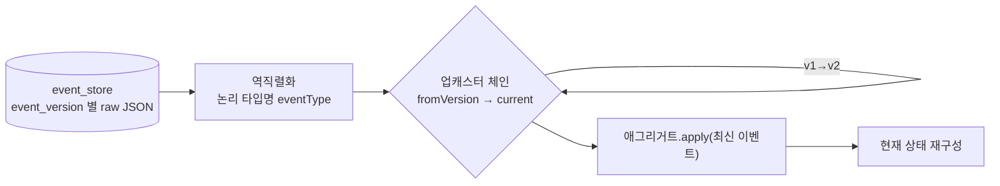

# ADR: 이벤트 스키마 진화 — 버저닝·업캐스팅·wire 포맷

- **상태**: Proposed (2026-06-13) · 사이클 `20260612-v2-cqrs-es-architecture`
- **상위**: [[RFC-001-v2-cqrs-and-event-sourcing]] · **설계**: [[02-write-model]]
- **근거 ADR**: [[05.event-store-mysql-table]]
- **계승**: [[07.reservation]] (`AbstractEvent` · `eventVersion`)

## 맥락

ES 컨텍스트(`reservation`·`timetable`·`restaurant` — [[02.selective-event-sourcing-scope]])에서 이벤트는 **진실의 원천이며 영구히 보존**된다. 현재 상태는 리플레이로 재구성하므로, 한 번 쌓인 이벤트는 지울 수도 마이그레이션으로 덮어쓸 수도 없다. 코드는 진화하는데 과거 이벤트는 *옛 모양 그대로* 남는다 — 이 비대칭이 ES의 본질적 부채다.

따라서 V2는 **이벤트 스키마가 바뀌는 상황에 대한 규약**을 먼저 잠가야 한다. 비-ES 컨텍스트는 Zero Payload([[07.reservation]]) 덕에 진화 충격이 작지만(식별자 중심·컨슈머가 최신 조회), **리플레이로 상태를 복원해야 하는 ES 컨텍스트는 과거 모든 버전의 이벤트를 *읽어낼* 수 있어야** 한다.

### 쟁점
- 같은 이벤트 타입의 v1 페이로드와 v3 페이로드가 한 스트림에 공존한다. 리플레이가 둘 다 소화해야 한다.
- 어디서 변환할 것인가 — 저장 시(in-place 마이그레이션) vs 읽기 시(업캐스팅)?
- 직렬화 포맷(wire format) — JSON을 유지할지 스키마 기반(Avro/Protobuf)으로 갈지, 그리고 다형성 디스크리미네이터를 FQCN(`@class`)으로 둘지 **논리 타입명**으로 바꿀지?
- 어떤 변경을 허용하고(호환), 어떤 변경을 금지할 것인가?

### 자산
- `AbstractEvent` 가 `eventType` · `eventVersion` · 다형성(v1은 `@class`)을 이미 보유([[07.reservation]] 계승). 진화 메타데이터의 토대는 있다 — 단 v2는 디스크리미네이터를 논리 타입명으로 바꾼다(아래 §3).
- 이벤트 스토어가 `event_version` 컬럼을 보유([[05.event-store-mysql-table]]). 행마다 버전이 박혀 저장된다.

## 고려된 옵션들

### 변환 위치

#### Option A1: 읽기 시 업캐스팅 (선택됨)
저장은 *발생 당시 버전 그대로*. 리플레이/역직렬화 직전 업캐스터 체인이 구버전 → 신버전으로 변환해 도메인에 항상 최신 모양으로 전달.
- 장점: 원본 이벤트 불변(append-only 정신 유지·감사 보존). 마이그레이션 배치 불필요. 롤백 안전(코드만 되돌리면 됨).
- 단점: 읽기 경로에 변환 비용·코드(업캐스터 누적). 구버전이 영원히 따라온다.

#### Option A2: 저장본 in-place 마이그레이션
스키마 변경 시 배치로 과거 이벤트 페이로드를 신버전으로 덮어씀.
- 장점: 읽기 경로 단순(항상 최신 버전만).
- 단점: **append-only·불변성 위반** — ES의 근본 원칙과 충돌. 감사 원본 훼손. 마이그레이션 실패 시 복구 난해. 롤백 불가.

### wire 포맷

#### Option B1: JSON 직렬화 유지, 디스크리미네이터는 논리 타입명 (선택됨)
JSON 직렬화 골격은 `AbstractEvent` 그대로(payload = MySQL `JSON`), 단 **다형성 타입 식별을 FQCN `@class`가 아니라 논리 타입명(`eventType`)으로** 한다.
- 장점: 신규 의존 0. 가독·디버깅 용이. JSON 본질상 forward/backward 유연(미지 필드 무시·누락 필드 기본값). 논리 타입명이라 **클래스 이동/리네임이 페이로드에 무영향**(FQCN 결합 제거). [[05.event-store-mysql-table]]의 "기존 자산 재사용" 정신과 정합.
- 단점: 스키마 강제·자동 호환성 검사 없음(규약·테스트로 메움). `eventType → 클래스` 레지스트리를 유지해야 함.

#### Option B2: 스키마 기반 포맷 (Avro / Protobuf)
스키마로 직렬화, 스키마 레지스트리로 호환성 강제.
- 장점: 호환성 자동 검사. 콤팩트. 폴리글랏 컨슈머 친화.
- 단점: 신규 인프라(레지스트리)·학습·빌드 파이프라인. 단일 JVM·단일 팀·현 규모에 과함. 스토어 가독성 상실. [[05.event-store-mysql-table]]가 전용 제품을 미룬 것과 같은 YAGNI.

## 결정사항

**A1(읽기 시 업캐스팅) + B1(JSON + 논리 타입명 디스크리미네이터 — FQCN `@class` 제거). 스키마 레지스트리는 보류(YAGNI).**

원칙 한 줄: **"이벤트는 발생 당시 모양 그대로 영구 저장한다. 변환은 읽을 때 명시적 업캐스터로 한다."**

### 1. 버저닝 — `eventVersion`
- 페이로드의 **호환 불가능한 변경**마다 `eventVersion` 을 올린다(`(eventType, eventVersion)` 이 역직렬화 계약의 키).
- 호환되는 변경(아래 규칙의 backward-compatible)만이면 버전을 올리지 않는다 — JSON 유연성으로 흡수.
- 저장 시 `event_store.event_version` 에 발생 버전이 박힌다([[05.event-store-mysql-table]]). 행은 자기 버전을 안다.

### 2. 업캐스팅 — 명시적 체인
- 역직렬화 직전, `(eventType, fromVersion)` → `currentVersion` 으로 끌어올리는 **업캐스터 체인**을 둔다(v1→v2→v3 단계 합성).
- 업캐스터는 **순수 변환 함수**(과거 JSON → 신버전 JSON/객체). 사이드이펙트·외부 조회 금지(리플레이 재현성).
- 도메인 `apply(event)` 는 **항상 최신 버전 이벤트만** 본다 — 구버전 분기는 애그리거트에 새지 않는다([[02-write-model]]의 `apply` 책임 보호).

### 3. wire 포맷 — JSON + 논리 타입명 디스크리미네이터 (FQCN `@class` 제거)
- `payload` = MySQL `JSON`([[05.event-store-mysql-table]]). 직렬화 골격은 `AbstractEvent` 계승하되, **다형성 디스크리미네이터를 FQCN(`@class`/`Id.CLASS`)에서 논리 타입명으로 전환**한다.
- 디스크리미네이터 = 기존 `eventType`(`OutboxEventType` enum). `@JsonTypeInfo(use = Id.NAME, property = "eventType")` + `eventType → 현재 클래스` 레지스트리로 해소. `(eventType, eventVersion)`이 이미 역직렬화 계약 키라 자연스럽다.
- 효과: **클래스 이동/리네임이 페이로드에 영향 없다** — 영구 이벤트에 FQCN을 박던 ES 안티패턴 제거. v1의 `Id.CLASS`에서 의도적 개선.

### 4. 호환성 규칙 (forward / backward)
ES 리플레이에서 본질은 **backward**(신코드가 구이벤트를 읽음)다. 컨텍스트 간 Outbox 발행에서는 **forward**(구코드가 신이벤트를 받음)도 본다.

| 변경 | 호환성 | 버전 업? | 처리 |
|------|--------|---------|------|
| 선택 필드 추가(기본값 있음) | backward OK | 불필요 | JSON 누락 → 기본값 |
| 필드 삭제 | backward 위험 | 권장 | 업캐스터가 채우거나 무시 |
| **필수 필드 추가** | backward 깨짐 | **필수** | 업캐스터가 구이벤트에 값 보강 |
| 필드 의미/타입 변경 | 깨짐 | **필수** | 업캐스터가 변환 |
| 이벤트 클래스 리네임/이동 | **무영향**(논리 타입명) | 불필요 | 클래스는 자유 이동, `eventType`만 유지 |

- **불변 규칙**: 한 번 배포된 `(eventType, eventVersion)` 의 의미는 **절대 바꾸지 않는다**. 바꾸려면 새 버전을 발급한다.
- 컨슈머는 **모르는 필드를 무시**(forward 관용)하고, **누락 필드는 기본값/업캐스터**로 메운다(backward 관용).

### 5. 보호 장치
- **라운드트립 회귀 테스트**: 각 `(eventType, eventVersion)` 의 **고정 JSON 픽스처**를 저장소처럼 보관 → 최신 코드가 모든 과거 버전을 리플레이로 읽어내는지 CI에서 검증. (스키마 레지스트리의 호환성 검사를 테스트로 대체)
- Fixture Monkey 기반 라운드트립으로 직렬화↔역직렬화 동치 검증.

## 장점
1. append-only·불변성 보존 — ES 원칙([[05.event-store-mysql-table]])과 정합. 원본 이벤트·감사 훼손 0.
2. 신규 인프라 0 — `AbstractEvent`·MySQL `JSON` 그대로. [[05.event-store-mysql-table]]의 YAGNI 정신 계승.
3. 구버전 분기가 도메인에 새지 않음 — `apply` 는 항상 최신만 본다([[02-write-model]]).
4. 롤백 안전 — 저장본을 건드리지 않으니 코드만 되돌리면 됨.

## 트레이드오프

### 선택한 방식의 한계
- 업캐스터가 **단조 증가**(과거 버전은 영원히 부양). 오래된 컨텍스트일수록 체인이 길어진다.
- JSON은 스키마를 **강제하지 않음** — 호환성 보증을 규약·픽스처 테스트에 의존(자동 게이트 없음).
- `eventType → 클래스` 레지스트리를 유지·동기화해야 함(타입명 추가 시 등록) — FQCN 결합 제거의 합리적 대가.

### 포기한 대안들
- **in-place 마이그레이션(A2)**: append-only·감사 위반. ES 근본과 충돌.
- **Avro/Protobuf + 레지스트리(B2)**: 다중 컨슈머·폴리글랏이 *증명되기 전엔* 과한 인프라·학습. [[05.event-store-mysql-table]]가 전용 제품을 미룬 것과 동일한 판단.

## 미결정 사항 및 추가 논의 (TBD)
- **구체 이벤트 카탈로그·페이로드·초기 버전**: 이벤트 스토밍 재실시 후 확정([[02-write-model]] 계승). 본 ADR은 *진화 메커니즘*만 잠근다.
- 업캐스터 등록·탐색 방식(레지스트리 빈 vs 어노테이션 스캔)은 구현 사이클에서.
- 논리 타입명 레지스트리 구현 방식(`@JsonTypeName` 스캔 vs 명시 등록 빈) — 구현 사이클.
- **스키마 레지스트리 도입 기준**: 외부/폴리글랏 컨슈머가 이벤트를 직접 구독해야 함이 *증명*되면 재검토(점진 확장 — [[05.event-store-mysql-table]]의 전용 제품 전환 기준과 정합).
- 스냅샷 자체의 스키마 진화 — 스냅샷은 *재생성 가능*하므로 버리고 리플레이로 다시 만들 수 있으나, 그 폐기/재생성 정책은 별도 검토.

## 결과 (기대)
- ES 컨텍스트가 코드 진화와 무관하게 **과거 모든 이벤트를 안전히 리플레이**.
- 스키마 변경이 명시적 업캐스터 + 픽스처 테스트로 통제 — 침묵하는 역직렬화 깨짐 방지.
- 진화 비용을 ES 컨텍스트에 한정하고, 인프라 추가 없이 흡수.

## 관련 문서
- [[RFC-001-v2-cqrs-and-event-sourcing]] · [[02-write-model]]
- ADR: [[05.event-store-mysql-table]] · [[02.selective-event-sourcing-scope]] · [[07.command-domain-jpa-separation]]
- 계승: [[07.reservation]]
