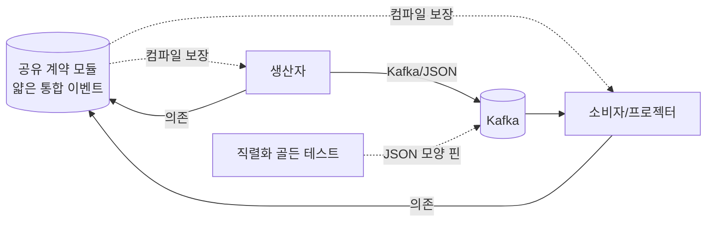

# ADR-021: 통합 이벤트 계약 — 얇은 공유 계약 모듈(컴파일 보장) + 직렬화 골든 테스트, 스키마 레지스트리/SCC/Pact는 보류

- **상태**: Proposed
- **사이클**: `20260612-v2-cqrs-es-architecture`
- **상위 RFC**: [[RFC-023-event-schema-contract-management]] · **설계**: [[DESIGN-008-messaging-topology]]
- **연관 ADR**: [[ADR-010-event-schema-evolution]] · [[ADR-009-event-ordering-and-delivery-guarantee]] · [[ADR-022-event-identity]]

---

## 맥락과 문제 (Context and Problem Statement)

V1 모놀리스에서는 이벤트를 내는 쪽과 읽는 쪽이 같은 앱·같은 타입을 공유했다. `ReservationConfirmed`의 `confirmedAt`을 `confirmedTime`으로 고치면, 그 타입을 읽던 코드가 같은 빌드 안에 있어 컴파일러가 즉시 잡았다 — 모양이 어긋나면 빌드가 안 된다.

V2는 command가 이벤트를 내고(`reservation`이 `ReservationConfirmed`를 발행), 별개로 배포되는 소비자/프로젝터 모듈이 그걸 Kafka/JSON으로만 받는다([[DESIGN-008-messaging-topology]] §4.12). 둘 사이에 컴파일러가 없다. 생산자가 `confirmedAt`을 `confirmedTime`으로 고치거나 필드를 빼도 빌드는 멀쩡히 통과하고, **배포된 뒤 런타임에** 프로젝터가 못 알아먹어 깨진다. 이런 깨짐은 사람 리뷰로 막기 어렵고 발견도 늦다.

이 결정은 *같은 시점에* 생산자 변경이 소비자를 깨는지를 보는 **wire 축**이다. 과거 이벤트를 새 코드로 읽는 **시간 축**(업캐스팅, [[ADR-010-event-schema-evolution]])과는 다른 관심사이며, 이벤트 저장·보존 라이프사이클([[RFC-004-event-store-schema-evolution]])과도 다르다.

**분리된 생산자·소비자 사이의 wire 모양 어긋남을 런타임에 닿기 전에 잡되, 솔로·모노레포 규모에 과한 계약 machinery(스텁 생성·브로커)를 미리 지불하지 않으려면 안전망을 무엇으로 칠 것인가.**

## 결정 동인 (Decision Drivers)

- 분리된 생산자·소비자 사이 wire 모양 어긋남을 배포 후 런타임이 아니라 빌드 시점에 잡아야 한다.
- 무트래픽 학습 규모에 스텁 생성·브로커 같은 무거운 계약 machinery를 미리 지불하지 않는다(YAGNI).
- 공유 계약이 내부 도메인 이벤트까지 묶어 컨텍스트 내부를 도로 결합시키지 않아야 한다 — 공유 대상은 얇은 통합 이벤트(published language)로 한정한다.
- wire 축(같은 시점 생산자·소비자 호환)과 시간 축(업캐스팅, [[ADR-010-event-schema-evolution]])을 섞지 않는다.

## 검토한 선택지 (Considered Options)

- **A. 얇은 통합 이벤트 공유 계약 모듈** — 통합 이벤트 정의를 한 모듈에 두고 생산자·소비자가 공동 의존해 모양 어긋남을 컴파일 단계에서 잡는다.
- **B. 직렬화 골든 테스트** — 통합 이벤트의 JSON 모양을 스냅샷으로 고정해 필드 rename·삭제가 테스트를 깨게 한다.
- **C. Spring Cloud Contract(SCC)** — 생산자가 계약을 선언해 스텁을 생성하고 Spring 빌드에 얹는 계약 테스트 프레임워크.
- **D. Pact** — 소비자가 기대를 적고 생산자가 검증하는 consumer-driven 계약 테스트. 별도 Pact Broker가 필요하다.
- **E. 스키마 레지스트리(Avro/Confluent·Protobuf)** — 생산자가 스키마를 등록하고 레지스트리가 호환성 정책(`BACKWARD`/`FULL`)을 등록 단계에서 강제한다.

## 결정 (Decision Outcome)

**채택: A(얇은 통합 이벤트 공유 계약 모듈, 컴파일 보장) + B(직렬화 골든 테스트, wire 모양 보장)를 기본으로 둔다. C·D·E는 지금 도입하지 않고 졸업 후보로 보류한다.**

A가 컴파일 보장을, B가 A의 구멍(버전 스큐 시 wire 호환)을 메우면 스텁·브로커 machinery 없이 대부분의 어긋남을 덮는다. C(SCC)는 스텁 생성·검증 파이프라인이 솔로·내부 단계에서 치를 결합 문제보다 무겁고, D(Pact)는 외부 소비자가 없는 지금 단계에 브로커 운영 비용이 값을 못 한다. E(스키마 레지스트리)는 ES/EDA 학습 초점을 Confluent/Avro SerDe 운영으로 가리는 인프라이며, [[ADR-010-event-schema-evolution]]이 이미 닫은 "JSON 유지·레지스트리 미도입" 선과 정합해 계약 거버넌스 관점에서도 같은 보류를 재확인한다.

결정의 구조는 다음과 같다.

- **공유 계약 모듈은 얇은 통합 이벤트(published language)만 담는다.** 내부 도메인 이벤트는 각 컨텍스트가 소유하며 공유 모듈로 묶지 않는다 — 그렇지 않으면 이벤트로 떼어 놓은 컨텍스트 내부가 도로 결합된다. 내부 이벤트의 버전·업캐스팅은 [[ADR-010-event-schema-evolution]]의 몫이다.
- **생산자·소비자가 공유 계약 모듈에 공동 의존한다.** 통합 이벤트 필드를 rename·삭제하는 변경은 그 타입을 참조하는 소비자 쪽 컴파일이 깨진다 — 런타임이 아니라 빌드에서 잡힌다.
- **컴파일 보장은 같은 모듈 버전일 때만 성립한다.** 생산자·소비자가 독립 배포되어 서로 다른 버전을 들면 컴파일 보장은 사라지고 런타임 JSON 호환만 남는다. 이 구멍을 직렬화 골든 테스트가 메운다 — 통합 이벤트의 JSON 모양을 스냅샷으로 핀 박아, 필드 rename·삭제가 버전 스큐 상황에서도 테스트로 잡힌다.
- **호환성 규율은 additive-only다.** 필드는 추가만 하고(소비자는 기본값으로 처리), 삭제·rename은 금지한다. 깨는 변경이 필요하면 새 통합 이벤트 버전 + 업캐스팅([[ADR-010-event-schema-evolution]])으로 간다. 이는 스키마 레지스트리의 `BACKWARD` 정책이 강제하는 바로 그 규칙을 인프라 없이 규약으로 흉내 낸 것이다.
- **SCC/Pact/스키마 레지스트리는 졸업 후보로 남긴다.** 통합 이벤트 수가 늘어 손으로 쓰는 직렬화 테스트가 감당 못 하는 선이 오거나(SCC), 외부 파트너가 이벤트를 직접 구독하거나(Pact), 멀티팀·독립 배포 버전 스큐가 실제 문제로 올라오면(스키마 레지스트리) 그때 도구를 택일해 도입한다.

목표 계약 구조:

### 결과 (Consequences)

**좋은 점**

- 통합 이벤트 모양 어긋남의 대부분을 빌드 시점 컴파일 에러로 잡는다 — 배포 후 런타임 발견이라는 늦고 비싼 실패 모드가 준다.
- 스텁 생성·브로커·레지스트리 없이(machinery 0) 안전망을 얻어, 솔로·모노레포 규모의 결합 문제 대비 과잉투자를 피한다.
- 내부 도메인 이벤트와 통합 이벤트를 공유 계약 모듈 경계로 계속 분리해, 이벤트로 갈라 놓은 컨텍스트 내부 결합이 되살아나지 않는다.
- additive-only 규율 + 직렬화 골든 테스트로 스키마 레지스트리가 강제하는 호환성 가치를 인프라 0에 근사한다.

**트레이드오프**

- 컴파일 보장은 생산자·소비자가 같은 공유 모듈 버전일 때만 성립한다. 독립 배포로 버전 스큐가 생기면 직렬화 골든 테스트가 유일한 안전망이 된다.
- additive-only 규율은 컴파일러가 강제하지 못하는 사회적 규약이다 — 코드 리뷰 체크(§확인)에 의존하며, 지켜지지 않으면 조용히 무너질 수 있다.
- 통합 이벤트 수와 wire 호환 규칙이 늘면 손으로 쓰는 직렬화 테스트가 감당 못 하는 선이 온다. **재검토 트리거**: 통합 이벤트가 늘어 골든 테스트 유지 비용이 커지면 SCC로, 외부 파트너 구독이 생기면 Pact로, 멀티팀·독립 배포 버전 스큐가 실증되면 스키마 레지스트리로 졸업한다.

### 확인 (Confirmation)

- 공유 계약 모듈의 통합 이벤트 필드를 rename·삭제했을 때 소비자 측 빌드가 컴파일 실패로 이를 잡는지 CI로 확인한다.
- 통합 이벤트별 JSON 모양이 직렬화 골든 테스트(스냅샷)로 핀 박혀 있고, 필드 rename·삭제가 그 테스트를 깨는지 확인한다.
- 공유 계약 모듈에 내부 도메인 이벤트(컨텍스트 소유 타입)가 섞여 들어가지 않는지 코드 리뷰·아키텍처 테스트로 확인한다.
- additive-only 위반(필수 필드 삭제·rename 없이 버전 미증가) 여부는 코드 리뷰 체크리스트로 확인한다.

## 선택지 상세 (Pros and Cons of the Options)

### C. Spring Cloud Contract(SCC)

- 장점: 생산자가 계약을 선언하면 스텁이 자동 생성되고 Spring 빌드 파이프라인에 얹혀 브로커가 필요 없다.
- 단점: 스텁 생성·생산자/소비자 검증 파이프라인이 솔로·내부 단계에서 치를 결합 문제보다 무겁다.
- 기각 사유: 지금은 overspec. 통합 이벤트가 늘어 손 작성 직렬화 테스트가 감당 못 할 때 졸업 후보로 남긴다.

### D. Pact

- 장점: 소비자가 기대를 직접 명세하는 consumer-driven이라 외부 소비자의 실제 요구를 반영한다.
- 단점: 별도 Pact Broker 운영이 필요하다.
- 기각 사유: 외부 소비자가 없는 지금 단계엔 브로커 운영 비용이 값을 못 한다. 외부 파트너 구독이 생기면 졸업 후보.

### E. 스키마 레지스트리(Avro/Confluent·Protobuf)

- 장점: 호환성 정책(`BACKWARD`/`FULL`)을 등록 단계에서 기계로 강제해 wire 계약을 가장 강하게 닫는다.
- 단점: 별도 서비스(가용성·운영 표면)이고, JSON+업캐스팅([[ADR-010-event-schema-evolution]])으로 잡은 직렬화 경로를 Avro/Protobuf로 전면 교체해야 한다. 학습 초점이 ES/EDA 코어(이벤트 소싱·프로젝션·멱등·재구축·사가)에서 Confluent/Avro SerDe 운영으로 이탈한다.
- 기각 사유: [[ADR-010-event-schema-evolution]]이 이미 "JSON 유지·레지스트리 미도입"으로 닫은 선과 같다 — 계약 거버넌스 관점에서도 그 보류를 재확인한다. 멀티팀·외부·폴리글랏 컨슈머가 실증되면 졸업 후보.

## 추가 정보 (More Information)

- **미결정 (→ 구현 사이클)**: 공유 계약 모듈의 위치·소유·버저닝 규약(단일 공유 모듈 vs 컨텍스트별 published-language 모듈), 직렬화 골든 테스트 도구 택일과 CI 게이트 편입 방식, SCC/Pact/스키마 레지스트리 졸업 트리거의 구체 임계값과 그때의 도구 택일.
- 관련: [[RFC-023-event-schema-contract-management]] · [[DESIGN-008-messaging-topology]] · [[RFC-003-messaging-delivery]] · [[RFC-022-event-schema-evolution]] · [[RFC-004-event-store-schema-evolution]] · [[ADR-010-event-schema-evolution]] · [[ADR-009-event-ordering-and-delivery-guarantee]] · [[ADR-022-event-identity]]
