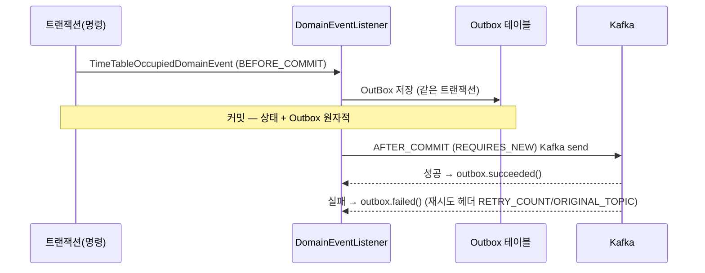

# V2 Analysis — 01. Current State (V1)

> 현재 시스템을 이벤트 소싱/CQRS 관점에서 사실 기반으로 기술한다. 모든 항목은 코드 근거를 동반한다.

## 1. 모듈 구조 (Hexagonal)

| 모듈 | 책임 |
|------|------|
| `core-module` | 도메인 엔티티 · 도메인 서비스 · VO · 스냅샷 (외부 의존성 0) |
| `application-module` | 유스케이스 · 입력/출력 포트 |
| `adapter-module` | 컨트롤러 · 시큐리티 · 이벤트 리스너 · Kafka |
| `infrastructure-module` | JPA 영속성 · Outbox · 식별자 생성 · 이벤트 추상 |
| `shared-module` | enum · 추상 예외 · 유틸 |
| `batch-module` | 배치 잡 (QueryDSL cursor reader) |

의존성 방향(core ← application ← adapter)은 잘 지켜진다. ADR `docs/v1/adr/01.ddd.md` 대로 **도메인 엔티티와 JPA 엔티티가 물리적으로 분리**되어 있다 — CQRS/ES로 갈 때 어댑터 교체가 용이한 토대.

## 2. 바운디드 컨텍스트 (9개)

`restaurant` · `reservation` · `schedule` · `timetable` · `user` · `menu` · `category` · `authenticate` · `company`

> `com/reservation/` 하위 디렉토리는 10개지만, `properties/`(=`BidirectionalEncryptProperties.kt`, 암호화 설정 홀더)는 도메인 컨텍스트가 아니다. 도메인 바운디드 컨텍스트는 9개.

- **핵심 도메인**: `reservation` (booker, restaurantInformation, schedule, occupancy, status). `restaurant` · `timetable` · `user` 에 의존하고, 역참조는 없다.
- **지원/조회성**: `category`(nationalities/cuisines/tags), `menu` 등 — 변화 빈도 낮고 lookup 성격.

## 3. 상태 변경 & 스냅샷 패턴

애그리거트는 **가변(`var`) 필드 + setter/manipulator**로 외부에서 변경된다. 예 — `core-module/.../restaurant/Restaurant.kt`:

```kotlin
class Restaurant(
    private val id: String? = null,
    private val companyId: String,
    private var introduce: RestaurantDescription,   // var
    private var contact: RestaurantContact,
    private var address: RestaurantAddress,
) {
    fun updateDescription(newDescription: RestaurantDescription) { introduce = newDescription }  // setter
    fun manipulateTags(block: (RestaurantTags) -> Unit) = tags.apply(block)                      // 외부 mutator
    fun snapshot() = RestaurantSnapshot( ... )      // 영속화용 단방향 DTO
}
```

- 모든 애그리거트에 `snapshot()` 존재(약 12종 스냅샷; 8개 애그리거트 + Reservation 하위 VO 4종). 스냅샷은 **애그리거트 → 영속성** 단방향 DTO이며, 이벤트 스트림에서 상태를 재구성하는 용도가 아니다.
- 변경은 **불변 복사(`copy()`)가 아니라 제자리 변이(in-place mutation)**.

## 4. 영속성 & Read/Write 결합 (CQRS 준비도)

| 측면 | 현황 |
|------|------|
| 포트 분리 | ✅ 인터페이스 수준: `CreateRestaurant`/`ChangeRestaurant`(명령) vs `FindRestaurants`/`FindRestaurant`(조회) |
| 모델 분리 | ❌ 동일 JPA 엔티티(`RestaurantEntity`)가 명령·조회 양쪽 사용 |
| 테이블/DB 분리 | ❌ 같은 테이블·같은 DB. 읽기 전용 프로젝션/뷰 없음 |
| 읽기 최적화 | ❌ 이벤트 프로젝션 기반 read model 없음 (배치만 QueryDSL cursor 사용) |

→ **CQRS는 "포트만 분리, 저장소는 통합" 상태.** 진짜 R/W 분리는 미구현.

## 5. 식별자 · 동시성

- **PK**: 시간 기반 UUID (`infrastructure-module` 의 `TimeBasedIdGenerator`/`TimeBasedUuidStrategy`). 분산 친화적.
- **낙관적 락 `@Version`**: 15개 엔티티 중 **`TimeTableEntity` 1개만**. 애그리거트 자체 버전 개념 없음.

## 6. 이미 존재하는 이벤트 인프라 (가장 중요한 자산)

`timetable` 컨텍스트에 **검증된 Transactional Outbox + Kafka**가 작동 중이다. 모듈에 걸쳐 구현됨:

| 위치 | 구성요소 |
|------|----------|
| `shared-module/.../enumeration/` | `OutboxEventType`, `OutboxStatus` |
| `infrastructure-module/.../event/abstractEvent/AbstractEvent.kt` | `sealed interface AbstractEvent { eventType; eventVersion; key() }` (+ Jackson `@class` 다형성) |
| `infrastructure-module/.../persistence/outbox/` | `OutBox` 엔티티 · `OutboxRepository`/`OutboxAdapter`/`OutboxJpaRepository` |
| `core-module/.../timetable/event/` | `TimeTableOccupiedDomainEvent` (도메인 이벤트) |
| `adapter-module/.../event/timetable/occupancy/` | `TimeTableOccupiedDomainEventListener`, `TimeTableOccupiedEvent`(Kafka), `TimeTableOccupiedOutboxEvent` |
| `core-module/.../restaurant/event/` | `CreateScheduleEvent` (restaurant 컨텍스트의 도메인 이벤트) |

### 동작 흐름 (`TimeTableOccupiedDomainEventListener`)



- `BEFORE_COMMIT`에 Outbox를 같은 트랜잭션으로 저장 → **상태와 이벤트 기록의 원자성** 보장.
- `AFTER_COMMIT` + `REQUIRES_NEW`로 Kafka 발행 → 성공/실패를 Outbox 상태로 추적, 재시도/DLT 헤더 존재.
- `eventVersion`(예: `1.0`) 보유 → 이벤트 진화(versioning) 토대 일부 존재.

> 평가: 이것은 교과서적 Transactional Outbox다. **V2의 이벤트 드리븐 기반은 이미 1개 컨텍스트에서 입증되었다.** 남은 일은 (1) 이 패턴을 다른 컨텍스트로 일반화, (2) 애그리거트가 이벤트를 *직접* 내도록 재설계, (3) (선택한 범위에서) 이벤트 스토어/리플레이 도입이다.
