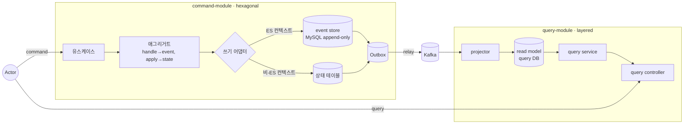

# V2 Design Doc — 00. Overview (목표 아키텍처)

- **상태**: 설계 (사이클 `20260612-v2-cqrs-es-architecture`)
- **상위 결정**: [[RFC-001-v2-cqrs-and-event-sourcing]]
- **근거 분석**: [[01-current-state]] · [[02-domain-limitations]]

> 본 design_doc 묶음은 [[RFC-001-v2-cqrs-and-event-sourcing]]에서 합의된 결정을 **어떻게 구현하는가**로 풀어쓴다. *왜* 그 결정인지의 근거는 각 ADR에 있다.

## 한눈에 보는 목표 아키텍처

## 문서 인덱스

| 문서 | 내용 | 근거 ADR |
|------|------|----------|
| [[01-module-structure]] | command/query 모듈·패키지 트리, hexagonal/layered, 의존성 규칙, 경계 강제 | [[01.cqrs-command-query-module-split]] · [[03.command-hexagonal-query-layered]] |
| [[02-write-model]] | ES 쓰기(이벤트 스토어·애그리거트·동시성·스냅샷) / 비-ES 쓰기(상태+Outbox) / 발행 경로 | [[02.selective-event-sourcing-scope]] · [[05.event-store-mysql-table]] · [[07.command-domain-jpa-separation]] |
| [[03-read-model]] | query layered, projector, 프로젝션 read model, replica, 일관성 | [[04.read-model-projection-and-replica]] |
| [[04-migration]] | 점진 전환 순서 (한 번에 하나씩 이전) | [[06.strangler-migration]] |
| [[05-aggregate-design]] | 애그리거트 설계·도메인 로직 배치 (취약점 W-1 대응) | [[03.command-hexagonal-query-layered]] |

## 설계 불변식 (전 문서 공통)

1. **command는 리치 도메인, query는 얇은 조회.** 아키텍처 비대칭(hexagonal vs layered)은 의도된 경제성.
2. **command ↔ query 유일 접점은 이벤트(`contract`).** query는 command의 스키마/도메인을 모른다.
3. **ES/비-ES 차이는 command의 쓰기 어댑터에만.** 대외 이벤트 발행(Outbox→Kafka)과 query 측은 둘을 구분하지 않는다.
4. **YAGNI.** 프로젝션·물리 분리·전용 이벤트 스토어 제품은 필요가 증명될 때 도입.

## 컨텍스트 분류 (요약)

| 분류 | 컨텍스트 | 쓰기 모델 |
|------|----------|-----------|
| 진짜 ES | `reservation` · `timetable` · `restaurant` | event store + 리플레이 |
| 상태 + Outbox (CQRS) | `schedule` · `user` · `authenticate` | 상태 테이블 + 통합 이벤트 |
| 현행/lookup | `menu` · `category` · `company` | 상태 테이블 (구독 필요 시 Outbox) |

> 분류 경계(특히 `schedule`·`menu`)는 이벤트 스토밍 재실시 후 재검토 가능. 상세 [[02-write-model]].
