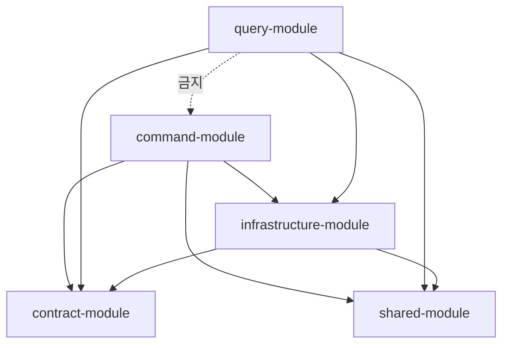

# V2 Design Doc — 01. Module Structure

- **상위 결정**: [[01.cqrs-command-query-module-split]] · [[03.command-hexagonal-query-layered]]
- **개요**: [[00-design-overview]]

## 모듈 트리

```
prototype-reservation-system
├── shared-module                  # enum, 추상예외, 유틸 (현행 유지)
├── contract-module        (신규)  # 이벤트 계약: AbstractEvent + 구체 이벤트, 공유 ID/타입
├── infrastructure-module          # 횡단 기술: 이벤트 스토어 엔진·Kafka·Outbox 배관·ID 생성·DB 설정
│
├── command-module         (신규)  # ── hexagonal, 도메인 = 패키지
│   └── com.reservation.command
│       ├── reservation/   domain/ · application/ · adapter/
│       ├── restaurant/    domain/ · application/ · adapter/
│       ├── timetable/     domain/ · application/ · adapter/
│       ├── schedule/      …
│       ├── user/  authenticate/  menu/  category/  company/
│       └── (공통) com.reservation.command.support
│
└── query-module           (신규)  # ── layered, 도메인 = 패키지
    └── com.reservation.query
        ├── reservation/   web/ · service/ · repository/ · projection/ · model/
        ├── restaurant/    …
        └── …
```

> 기존 `core-module` / `application-module` / `adapter-module` 의 쓰기 측 코드는 `command-module` 의 각 도메인 패키지로, 조회 측 코드는 `query-module` 로 이전한다. 이전은 [[04-migration]] 의 Strangler 순서를 따른다.

## command-module — hexagonal (도메인 패키지 내부)

각 도메인 패키지는 내부적으로 헥사고날 3층을 **하위 패키지**로 가진다.

```
com.reservation.command.reservation
├── domain/          # 애그리거트(행위 중심), 도메인 이벤트, 도메인 서비스(꼭 필요한 경우만)
├── application/
│   ├── port/in/     # command 유스케이스 인터페이스 (CreateReservation, CancelReservation …)
│   ├── port/out/    # 이벤트 스토어/상태/Outbox 저장 포트
│   └── service/     # 유스케이스 구현 (애그리거트 조립·실행)
└── adapter/
    ├── in/web/      # command 컨트롤러
    └── out/         # event-store writer · state writer · outbox publisher (infrastructure-module 사용)
```

- 애그리거트는 `handle(command) → List<DomainEvent>` + `apply(event) → newState` 책임을 **스스로** 진다 (빈약 도메인 탈피, 상세 [[02-write-model]]).
- ES/비-ES 차이는 `adapter/out` 구현에만 나타난다 (event store vs 상태+Outbox).

## query-module — layered (도메인 패키지 내부)

```
com.reservation.query.reservation
├── web/             # query 컨트롤러
├── service/         # 조회 서비스 (read model → 응답 DTO)
├── repository/      # QueryDSL / read model 저장소 조회
├── projection/      # 이벤트 구독 projector → read model 갱신
└── model/           # read model 엔티티 / 응답 DTO
```

- **포트/어댑터 없음** — 읽기는 "DB→DTO"라 layered가 경제적 ([[03.command-hexagonal-query-layered]]).
- `projection/` 이 `contract` 이벤트를 구독해 `model/` 을 채운다. query는 command 도메인을 import 하지 않는다.

## 의존성 규칙 (핵심)



| 모듈 | 허용 의존 | 금지 |
|------|-----------|------|
| `command` | `contract`, `infrastructure`, `shared` | `query` |
| `query` | `contract`, `infrastructure`(읽기 부분), `shared` | **`command`, 도메인 core** |
| `contract` | `shared` | `command`, `query`, `infrastructure` |
| `infrastructure` | `contract`, `shared` | `command`, `query` |

- **query → command/도메인 core 의존은 컴파일 차단**이 목표. Gradle 모듈 경계로 1차 강제.
- 도메인 패키지 간 경계(예: `reservation` 가 `restaurant` 도메인 패키지를 직접 참조 금지)는 모듈로는 못 막으므로 **ArchUnit/Konsist 규칙**으로 강제한다.

## 경계 강제 (ArchUnit / Konsist)

- 도메인 패키지 간 직접 의존 금지 (컨텍스트 간은 `contract` 이벤트로만).
- `command.*.domain` 이 `adapter`/`infrastructure` 를 의존하지 않음 (헥사고날 의존 역전).
- `query.*` 가 `command.*` 를 import 하지 않음.
- 위반 시 빌드 실패 — `detekt`/테스트 단계에 편입.

## 향후 물리 분리 경로

top-level이 command/query라 **"읽기 전체를 query 서비스로"** 분리는 `query-module` 을 별도 배포로 떼면 된다. **"도메인별 서비스 분할"** 은 두 모듈에서 같은 이름 도메인 패키지를 함께 들어내는 비용이 있으나, 패키지 경계가 깨끗하면 수용 가능하다([[01.cqrs-command-query-module-split]] 트레이드오프 참조).

## 관련 문서
- [[00-design-overview]] · [[02-write-model]] · [[03-read-model]] · [[04-migration]]
- ADR: [[01.cqrs-command-query-module-split]] · [[03.command-hexagonal-query-layered]]
- 계승: [[02.hexagonal]]
