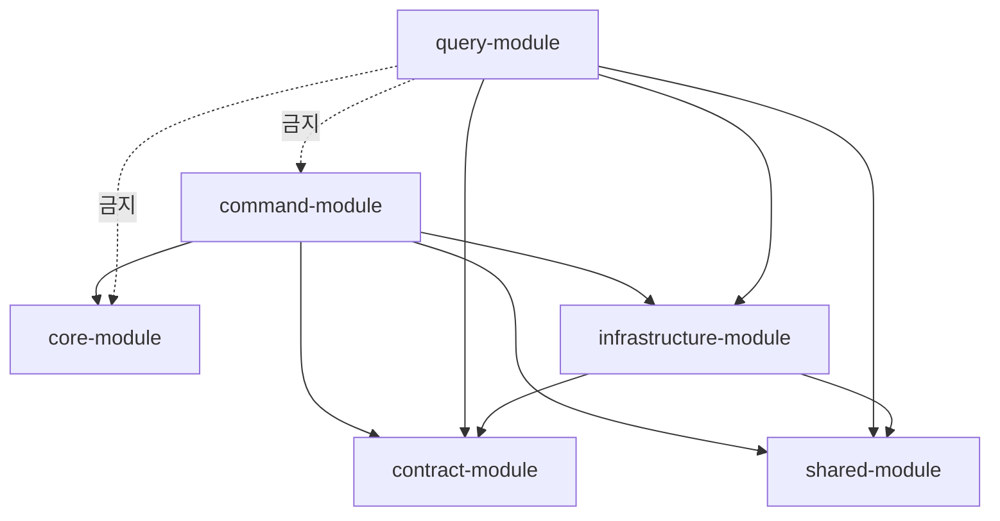

# V2 Design Doc — 01. Module Structure

- **상위 결정**: [[01.cqrs-command-query-module-split]] · [[03.command-hexagonal-query-layered]]
- **개요**: [[00-design-overview]]

## 모듈 트리

```
prototype-reservation-system
├── shared-module                  # enum, 추상예외, 유틸 (현행 유지)
├── core-module            (현행 유지)  # 의존성 없는 순수 도메인: 애그리거트·도메인 이벤트·도메인 서비스 (컨텍스트별 패키지)
├── contract-module        (신규)  # 이벤트 계약: AbstractEvent + 구체 이벤트, 공유 ID/타입
├── infrastructure-module          # 횡단 기술: 이벤트 스토어 엔진·Kafka·Outbox 배관·ID 생성·DB 설정
│
├── command-module         (신규)  # ── hexagonal, application/adapter (도메인은 core-module)
│   └── com.reservation.command
│       ├── reservation/   application/ · adapter/   (도메인 → core-module)
│       ├── restaurant/    application/ · adapter/
│       ├── timetable/     application/ · adapter/
│       ├── schedule/      …
│       ├── user/  authenticate/  menu/  category/  company/
│       └── (공통) com.reservation.command.support
│
└── query-module           (신규)  # ── layered, 도메인 = 패키지
    └── com.reservation.query
        ├── reservation/   web/ · service/ · repository/ · projection/ · model/
        ├── restaurant/    …
        └── …
```

> 기존 `core-module` / `application-module` / `adapter-module` 의 쓰기 측 코드는 `command-module` 의 각 도메인 패키지로, 조회 측 코드는 `query-module` 로 이전한다. 이전은 [[04-migration]] 의 Strangler 순서를 따른다.

> **순수 도메인의 거처 — V1처럼 의존성 없는 별도 `core-module`을 유지한다.** 순수 도메인을 command 모듈 안 `domain` 패키지로 함께 두는 대안(모듈 통합)은 **비채택**이다([[RFC-010-module-structure-migration]]). (b) 별도 모듈을 택하는 핵심은 순수성의 강제 방식이다 — 별도 모듈이라는 *물리 경계*가 "도메인은 인프라를 모른다"를 빌드 차원에서 강제하므로, 순수성이 검증 규칙이 아니라 *컴파일 의존성*으로 보장된다. 통합안의 매력은 CQRS를 모듈 최상단에서 가른 경계와의 일치(command 도메인이 그 모듈에 응집)였으나, 그 응집은 ArchUnit/Konsist 같은 *검증 경계*로만 순수성을 지켜야 해 물리 경계만큼 안 새지는 못한다. 현행이 이미 (b)인 이상 전환 비용도 들지 않는다. 즉 **(도메인=별도 `core-module`) + (순수성=컴파일 의존성)**이다([[01.cqrs-command-query-module-split]] · [[07.command-domain-jpa-separation]]). `command-module` 의 각 컨텍스트 패키지는 도메인을 `core-module` 에서 가져다 쓰고, application/adapter 만 담는다.

> 컨텍스트가 늘어 단일 `core-module` 이 비대해지면 "이 도메인이 어느 컨텍스트 소속인가"가 흐려질 수 있다. 그때의 답은 통합안으로의 회귀가 아니라 `core-module` 내부를 **컨텍스트별 패키지·서브모듈**로 가르는 것이다. 단일 core 가 컨텍스트 응집을 해치는 임계는 전환을 돌려 보며 본다([[RFC-010-module-structure-migration]]).

## command-module — hexagonal (도메인은 core-module)

각 컨텍스트는 헥사고날 3층 중 **도메인을 `core-module`** 에 두고, application/adapter 를 `command-module` 의 컨텍스트 패키지에 가진다.

```
core-module                          # 의존성 없는 순수 도메인 (컨텍스트별 패키지)
└── com.reservation.reservation
    └── domain/          # 애그리거트(행위 중심), 도메인 이벤트, 도메인 서비스(꼭 필요한 경우만)

command-module
└── com.reservation.command.reservation
    ├── application/
    │   ├── port/in/     # command 유스케이스 인터페이스 (CreateReservation, CancelReservation …)
    │   ├── port/out/    # 이벤트 스토어/상태/Outbox 저장 포트
    │   └── service/     # 유스케이스 구현 (core-module 애그리거트 조립·실행)
    └── adapter/
        ├── in/web/      # command 컨트롤러
        └── out/         # event-store writer · state writer · outbox publisher (infrastructure-module 사용)
```

- `command-module` 은 도메인을 `core-module` 에서 가져다 쓴다 (`command → core`). `core-module` 은 어디에도 의존하지 않는다.

- 애그리거트는 `handle(command) → List<DomainEvent>` + `apply(event) → newState` 책임을 **스스로** 진다 (빈약 도메인 탈피, 상세 [[02-write-model]]).
- ES/비-ES 차이는 `adapter/out` 구현에만 나타난다 (event store vs 상태+Outbox).
- 비-ES 컨텍스트의 도메인↔JPA 매핑은 **V1식 엄격한 hexagonal 수동 매핑을 유지**한다 — 컨텍스트별로 손으로 쓴 매핑 함수가 `adapter/out` 안쪽에 명시적으로 남는다. 코드 생성 도구(MapStruct류)·공통 매퍼 추상은 비채택([[07.command-domain-jpa-separation]] · [[RFC-010-module-structure-migration]]). 반복이 과해지면 공통 추상이 아니라 경계를 흐리지 않는 국소 컨벤션(같은 자리·같은 시그니처)으로 대응한다.

## query-module — layered (도메인 패키지 내부)

```
com.reservation.query.reservation
├── web/             # query 컨트롤러
├── service/         # 조회 서비스 (read model → 응답 DTO)
├── repository/      # QueryDSL / read model 저장소 조회
├── projection/      # 이벤트 구독 projector → read model 갱신
└── model/           # read model 엔티티 / 응답 DTO
```

- **포트/어댑터 없음** — 읽기는 "DB→DTO"라 layered가 경제적 ([[03.command-hexagonal-query-layered]]).
- `projection/` 이 `contract` 이벤트를 구독해 `model/` 을 채운다. query는 command 도메인을 import 하지 않는다.

## 의존성 규칙 (핵심)



| 모듈 | 허용 의존 | 금지 |
|------|-----------|------|
| `core` (순수 도메인) | (없음 — 의존성 없음) | `command`, `query`, `contract`, `infrastructure`, JPA·Spring |
| `command` | `core`, `contract`, `infrastructure`, `shared` | `query` |
| `query` | `contract`, `infrastructure`(읽기 부분), `shared` | **`command`, `core`(도메인)** |
| `contract` | `shared` | `command`, `query`, `infrastructure` |
| `infrastructure` | `contract`, `shared` | `command`, `query`, `core` |

- **query → command/`core`(도메인) 의존은 컴파일 차단**이 목표. 별도 모듈인 `core` 가 JPA·Spring 을 import하지 못하는 순수성도 **모듈 경계(컴파일 의존성)** 로 강제된다.
- 도메인 패키지 간 경계(예: `core` 안에서 `reservation` 가 `restaurant` 도메인 패키지를 직접 참조 금지)는 모듈로는 못 막으므로 **ArchUnit/Konsist 규칙**으로 강제한다.

## 경계 강제 (ArchUnit / Konsist)

- 도메인 패키지 간 직접 의존 금지 (컨텍스트 간은 `contract` 이벤트로만).
- `command.*.domain` 이 `adapter`/`infrastructure` 를 의존하지 않음 (헥사고날 의존 역전).
- `query.*` 가 `command.*` 를 import 하지 않음.
- 위반 시 빌드 실패 — `detekt`/테스트 단계에 편입.

## 신규 기능 컨텍스트 (리뷰·포인트·신고)

리뷰/별점·포인트·신고는 V1에 없던 신규 도메인이라 Strangler *전환 대상*이 아니다 — **각각 별도 command 컨텍스트로, 처음부터 신구조 네이티브로** 짓는다(기존 컨텍스트에 욱여넣지 않는다). 다만 투입 시점은 **레퍼런스 컨텍스트 한두 개의 전환이 끝나 패턴(모듈 구조·매핑 규약·검증 규칙)이 검증된 뒤**다. 아직 흔들리는 규약 위에 새 코드를 쌓으면 패턴이 바뀔 때 신규 기능도 함께 흔들린다([[RFC-010-module-structure-migration]]). 사업 우선순위가 전환보다 높아 순서가 뒤집히면 패턴 미확정 리스크를 명시한다. 각 신규 기능의 상세 도메인 설계는 후속 사이클.

## 향후 물리 분리 경로

top-level이 command/query라 **"읽기 전체를 query 서비스로"** 분리는 `query-module` 을 별도 배포로 떼면 된다. **"도메인별 서비스 분할"** 은 두 모듈에서 같은 이름 도메인 패키지를 함께 들어내는 비용이 있으나, 패키지 경계가 깨끗하면 수용 가능하다([[01.cqrs-command-query-module-split]] 트레이드오프 참조). command/query의 *물리* 배포 분리 시점 자체는 [[09-deployment-runtime]]가 다룬다.

## 관련 문서
- [[00-design-overview]] · [[02-write-model]] · [[03-read-model]] · [[04-migration]] · [[09-deployment-runtime]]
- RFC: [[RFC-010-module-structure-migration]]
- ADR: [[01.cqrs-command-query-module-split]] · [[03.command-hexagonal-query-layered]] · [[07.command-domain-jpa-separation]]
- 계승: [[02.hexagonal]]
