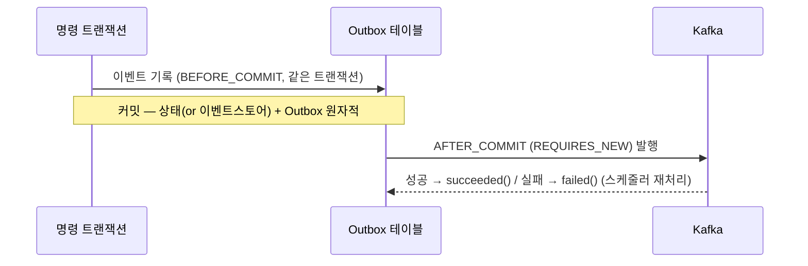

# V2 Design Doc — 02. Write Model

- **상위 결정**: [[02.selective-event-sourcing-scope]] · [[05.event-store-mysql-table]]
- **개요**: [[00-design-overview]]
- **계승**: [[07.reservation]] (Outbox·Zero Payload·PoisonMessage)

> command 측 쓰기 모델은 컨텍스트 분류에 따라 두 갈래다. **단, 대외 이벤트 발행 경로는 동일**하다.

## A. ES 컨텍스트 — `reservation` · `timetable` · `restaurant`

진실의 원천 = **append-only 이벤트 스트림**. 현재 상태는 이벤트 리플레이로 재구성한다.

### 애그리거트 책임 (빈약 도메인 탈피)

```kotlin
// 개념 예시 — 실제 시그니처는 구현 사이클에서 확정
class Reservation private constructor(/* state */) {
    fun handle(command: CancelReservation): List<DomainEvent> {
        // 불변식 검증은 애그리거트 안에서 (방문 3일 전까지만 등)
        require(canCancel(command.now)) { "취소 가능 기한 초과" }
        return listOf(ReservationCancelled(id, command.reason, command.now))
    }
    fun apply(event: ReservationCancelled): Reservation { /* 불변 전이 */ }
}
```

- `handle(command) → List<DomainEvent>`: 불변식 검증 후 발생할 이벤트를 반환.
- `apply(event) → newState`: 이벤트를 상태에 적용(불변 복사). 리플레이·신규 발생에 공용.
- V1의 도메인 서비스 검증 로직([[02-domain-limitations]] #1)은 애그리거트로 이전한다.

### 이벤트 스토어 (MySQL 직접 구현 — [[05.event-store-mysql-table]])

```
event_store(
  aggregate_type, aggregate_id, sequence_no,   -- (aggregate_id, sequence_no) UNIQUE
  event_type, event_version, payload(JSON),
  occurred_at
)
```

- **낙관적 동시성**: `expected_sequence` 에 append. 충돌 시 `(aggregate_id, sequence_no)` UNIQUE 위반 → 재시도. (V1의 부재 #6 해소)
- **스냅샷 최적화**: 기존 `*Snapshot` 패턴을 재활용해 N개 이벤트마다 스냅샷 저장 → 리플레이 단축.
- **전용 제품 미도입**: 현 규모에서 EventStoreDB/Axon은 과함. 근거 [[05.event-store-mysql-table]].

## B. 비-ES 컨텍스트 — 상태 + Outbox (`schedule` · `user` · `authenticate`)

진실의 원천 = **현재 상태 테이블**(V1 방식 유지). 변경 시 통합 이벤트를 Outbox로 발행한다.

1. 커맨드 → 애그리거트가 상태 변경(행위 중심으로 개선) → 상태 테이블 저장.
2. **같은 트랜잭션**에서 Outbox에 통합 이벤트 기록 (timetable `BEFORE_COMMIT` 패턴).
3. 커밋 후 Kafka 발행.

> **도메인/JPA 분리 유지** ([[07.command-domain-jpa-separation]]): 1번의 애그리거트는 순수 도메인(`domain`)이고, 상태 테이블은 별도 JPA 엔티티(`adapter/out`)로 매핑한다. 애그리거트에 `@Entity` 를 붙이지 않는다(도메인 JPA 오염 금지). V1 방식 그대로.

> ES냐 비-ES냐의 차이는 1번(이벤트 스토어 vs 상태 테이블)뿐이다. 2~3번(Outbox 발행)은 동일하다.

## C. 현행/lookup — `menu` · `category` · `company`

저빈도·lookup 성격. 상태 테이블만 유지하며, **다른 컨텍스트가 구독해야 할 때만** Outbox 이벤트를 추가한다. 그 외 변경 없음.

## 공통: 대외 이벤트 발행 경로 (Outbox → Kafka)

ES·비-ES 무관하게 동일하다. [[07.reservation]]에서 검증된 패턴을 일반화한다.



- **Zero Payload** 원칙 계승([[07.reservation]]): 메시지는 식별자 중심, 컨슈머가 최신 상태/이벤트 조회. 스키마 진화·DLQ 재처리 안전.
- **eventVersion** 보유(`AbstractEvent`)로 이벤트 진화 대응.
- **재처리**: 스케줄러 기반 미발행 Outbox 재시도, Consumer 실패는 PoisonMessage 별도 관리([[07.reservation]] 계승).

## 도메인 이벤트 카탈로그 (TBD)

컨텍스트별 구체 이벤트 목록·페이로드·버전 정책은 **이벤트 스토밍 재실시 후 확정**한다(기존 보드는 참고용). 본 문서는 *메커니즘*만 확정한다.

## 관련 문서
- [[00-design-overview]] · [[01-module-structure]] · [[03-read-model]] · [[04-migration]]
- ADR: [[02.selective-event-sourcing-scope]] · [[05.event-store-mysql-table]]
- 계승: [[07.reservation]]
