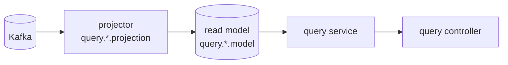

# V2 Design Doc — 03. Read Model

- **상위 결정**: [[04.read-model-projection-and-replica]]
- **근거 RFC**: [[RFC-002-read-model-consistency]] (무엇을 읽기 모델에 두나·일관성)
- **개요**: [[00-design-overview]]

> query 측은 layered이며, command의 도메인/스키마를 모른다. 읽기 소스는 **이벤트 프로젝션 read model**이 기본, 저빈도 lookup은 **경량 프로젝션/published 테이블**이다. 둘 다 **query 전용 MySQL**(projector가 Kafka 이벤트로 채움)에 있고, query-module은 그 DB에 정적 바인딩된다 — command DB와 물리 분리, 다리는 Kafka(라우팅 코드 없음 — [[13.db-hosting-and-read-write-topology]]).

> ⚠️ 본 문서는 **목표 아키텍처**다. 현재(V1) 구현은 별도 read model 없이 쓰기 테이블을 공유 조회한다([[01-current-state]] §4). 프로젝션 전환은 [[06.strangler-migration]] 순서대로 단계적으로 도입한다.

## 원칙: 읽기는 항상 query 측, command는 읽기를 서빙하지 않는다

CQRS에서 command의 책임은 검증+쓰기뿐이다. 조회는 전부 query 측이 처리한다. top-level 모듈 분리([[01-module-structure]])의 귀결로, **query는 command 테이블을 직접 조회하지 않는다**(스키마 결합 = 안티패턴).

## 읽기 소스 두 갈래

### (가) 이벤트 프로젝션 read model — 기본

- `projection/` 컴포넌트가 `contract` 이벤트를 구독해 비정규화 `model/` 을 갱신.
- 교차 컨텍스트 조인·고읽기·다른 모양의 조회에 사용.
- **ES 컨텍스트는 최소 1개의 현재상태 프로젝션을 반드시 가진다** — 이벤트 스트림은 임의 조회에 못 쓰므로. ("프로젝션 미적용"은 *추가* 프로젝션을 안 만든다는 뜻이지 읽기 뷰가 0개라는 뜻이 아니다.)
- **조직: 도메인별 스키마 분리.** read model은 화면·조회 용도마다 여럿 생기는데, 이를 한 query 인스턴스 안에서 **도메인별 스키마로 나눠** 담는다 — 도메인 경계가 스키마 경계와 맞아 어느 read model이 어느 도메인 소속인지 분명해지고(`query.{domain}.model`), command 측 컨텍스트 분리와 대칭을 이룬다. 읽기 확장은 인스턴스 분할이 아니라 query 인스턴스의 HA 레플리카로 분산한다([[RFC-007-deployment-infra-ops]]·[[13.db-hosting-and-read-write-topology]]).

### (나) 저빈도 lookup — projection이냐 published-subscription이냐, 소유자로 가른다

거의 안 변하는 참조 데이터(`category`·`company`·`menu`)도 읽기 소스는 (가)와 같은 종류다 — **남이 흘리는 걸 비동기로 받아 query DB의 로컬 테이블을 갱신**한다. 수단은 둘뿐이고, *그 데이터의 소유자가 누구냐*로만 갈린다([[RFC-002-read-model-consistency]]).

| 수단 | 언제 | 소스 |
|------|------|------|
| projection | 그 lookup을 **내 컨텍스트가 소유**할 때 | 내 도메인 이벤트를 구독해 경량 read model 갱신 |
| published-subscription | 그 lookup을 **다른 컨텍스트가 소유**하고 그쪽이 변경을 발행할 때 | 소유 컨텍스트의 published 변경을 구독해 로컬 테이블 갱신 |

- 둘 다 **async-fed 로컬 카피**다 — 읽기 지연이 당연한 것도 (가)와 같은 이유. **조회 시점에 원본을 동기 호출(cross-context fetch)하는 것은 금지** — 읽기 경로에 런타임 결합을 다시 들여 CQRS를 깬다([[RFC-002-read-model-consistency]]). published는 구독해 로컬에 적재하는 비동기 카피이지 동기 조회가 아니다.
- **seed는 수단이 아니다.** "static해서 seed"는 분해하면 사라진다 — 진짜 불변이면 *코드 상수*라 읽기 테이블이 없고, 가끔이라도 바뀌면 소유자가 있어 published-subscription이며, 테이블형이지만 배포로만 바뀌면 flyway로 초기 적재한 로컬 테이블일 뿐(적재는 초기화 디테일이지 읽기 전략이 아니다).
- 어느 수단이든 **command 테이블 직접 조회는 금지** — query DB는 command DB와 물리 분리라([[13.db-hosting-and-read-write-topology]]) 이 경계가 *물리적으로* 성립한다. (이전 "read replica 경유" 안은 query가 쓰기 스키마에 결합해 폐기.)
- 항목별 projection/published 귀속 표의 확정은 company·menu의 실제 소유권이 드러나는 구현 사이클에서. 여기서는 *원칙*만 못 박는다.

### (다) 비-ES 컨텍스트는 기존 QueryDSL 조회를 유지

"query는 projection만 읽는다"는 규칙은 **ES로 전환된 컨텍스트에 적용되는 규칙**이지, 시스템 전체를 강제로 ES화하라는 요구가 아니다([[RFC-002-read-model-consistency]]). 발생시킬 이벤트도 없는 비-ES 컨텍스트에 projection 파이프라인을 억지로 얹는 건 비용 대비 이득이 의심스럽다. 따라서 비-ES 컨텍스트는 기존 QueryDSL 조회를 그대로 둔다. (단, 비-ES 컨텍스트가 ES 컨텍스트의 데이터를 조인해 읽어야 하는 경우가 생기면 통일 압력이 생긴다 — 그 필요성은 구현 사이클에서 검증.)

## 컨텍스트별 초기 읽기 전략

| 컨텍스트 | 초기 읽기 | 비고 |
|----------|-----------|------|
| `reservation` | 프로젝션 (예약 목록·상세, 식당명 비정규화) | ES — 현재상태 프로젝션 필수 |
| `restaurant` | 프로젝션 (검색·상세) | ES |
| `timetable` | 프로젝션 (가용 시간) | ES |
| `schedule` | 프로젝션 (또는 경량 lookup) | 변화 빈도 보고 결정 |
| `user`/`authenticate` | 경량 프로젝션 (단순 조회) + 일부 프로젝션 | |
| `menu` | (나) lookup — projection/published | 소유자 보고 확정 |
| `category`·`company` | (나) lookup — projection/published | 소유자 보고 확정 |

> 위 표는 선제적 깔기가 아니라 **아래 '읽기 요구 입증' 기준을 통과한 결과**다. (`schedule`만 변화 빈도 측정에 달려 미결 — 측정 후 프로젝션/경량 lookup 중 확정.)

### 프로젝션을 만들 자격 — '읽기 요구 입증' 기준

프로젝션은 공짜가 아니다(파이프라인·재구축·일관성 지연을 지고 온다). 그래서 "프로젝션을 가진다"는 **읽기 요구가 입증된 컨텍스트에 한한다**([[RFC-002-read-model-consistency]]). '입증' 기준이 느슨하면 결국 모든 컨텍스트가 프로젝션을 갖게 돼 YAGNI가 무너지므로, 기준을 명시한다 — 아래 중 **하나라도** 해당하면 입증된 것으로 본다.

1. **교차 컨텍스트 조인 회피** — 다른 컨텍스트의 데이터를 함께 보여줘야 하는 화면이 있고(예: 예약 목록의 식당명), 그것을 런타임 조인 대신 비정규화로 풀어야 할 때.
2. **ES 컨텍스트의 현재상태 조회** — 이벤트 스트림은 임의 조회에 못 쓰므로 ES 컨텍스트는 최소 1개 현재상태 프로젝션이 *무조건* 필요(위 (가)).
3. **읽기 모양이 쓰기 모델과 다름** — 검색·집계·정렬 등 쓰기 정규화 모델로는 비싼 조회 형태가 실제 화면에 있을 때.
4. **읽기 부하 격리** — 조회 트래픽이 쓰기 경로에 부담을 주어 분리가 측정으로 정당화될 때.

위 어디에도 안 닿으면 프로젝션을 만들지 않고 (나)의 lookup(projection/published) 또는 비-ES QueryDSL((다))로 간다. "있으면 편하다"는 입증이 아니다 — 실재하는 화면/부하 요구만 입증으로 친다.

## 교차 컨텍스트 예시

예약 목록이 "식당 이름"을 보여줘야 할 때:
1. `restaurant`(ES) 가 이름 변경 → `RestaurantRenamed` 이벤트 발행(Outbox→Kafka).
2. `query.reservation.projection` 이 구독 → 자기 read model의 식당명 칼럼 갱신.
3. 예약 조회는 **조인 없이** 빠르게 읽고, 컨텍스트 결합은 이벤트로만.

## query layered — projection은 갱신, service는 조회

query 측은 layered(web/service/repository/projection/model)다([[03.command-hexagonal-query-layered]]). 두 경로의 책임과 트랜잭션 경계를 가른다([[RFC-002-read-model-consistency]]).

- **projection = 쓰기 경로.** 이벤트를 받아 read model을 *갱신*한다. 트랜잭션 경계는 **메시징 소비 단위**에 맞춰 닫는다(한 이벤트(배치) 처리 = 한 트랜잭션 + 오프셋 커밋).
- **service = 읽기 경로.** 그 모델을 *조회*해 DTO로 돌려준다. 단순 읽기이므로 트랜잭션 경계는 **service에서** 닫는다(읽기 전용).
- 두 경로는 같은 read model 테이블을 공유하되 방향이 반대다 — projection은 들어오는 이벤트로 쓰고, service는 화면 질의로 읽는다. 둘을 한 트랜잭션으로 묶지 않는다.

## 일관성

### 기본은 최종 일관성 — read-your-writes는 증명된 화면만 예외

- **기본 비동기(최종 일관성)** — 프로젝션은 이벤트 구독으로 갱신되어 본질적으로 *뒤처진다*. 그래서 **"쓰고 바로 읽으면 아직 없을 수 있다"를 버그가 아니라 기본 사양으로 못 박는다**([[RFC-002-read-model-consistency]]). 이걸 받아들이지 않으면 일관성 예외가 시스템 전체로 번져 CQRS의 이점이 사라진다.
- **예외는 정책으로만 연다.** 동기 프로젝션·버전 토큰 read-your-writes·command DB 직접 읽기 같은 예외 수단은 전부 분리를 깨는 비용이 있으므로 기본값으로 깔지 않는다. "이 화면이 즉시 반영을 요구한다"가 *증명된* 경우에만 승인하고, 어떤 수단을 쓸지는 그 화면 성격을 보고 그때 고른다. 화면 목록을 미리 못 박지 않는 이유는, 증거 없이 예외를 여는 게 바로 막으려는 것이기 때문이다. (예약 확정 직후 "내 예약 목록"처럼 명백한 후보가 나오면 신규 ADR "읽기 신선도 예외 정책"으로 승격.)
- Zero Payload([[02-write-model]])라 projector는 필요한 최신 상태를 조회해 채울 수 있어 재처리 안전.

### 프로젝션 지연 — 방향은 여기, 숫자는 측정 후

- 지연을 정상으로 받아들이기로 했으니 남는 건 "얼마까지"다. 절대 수치(p99 몇 ms)는 실제 메시징 lag을 재기 전엔 근거 없는 숫자가 된다. 그래서 **정책 형태만 지금 확정**한다 — p99 지연 목표를 두고 초과 시 알람을 건다는 골격. 목표의 절대값은 [[RFC-003-messaging-delivery]]의 lag 측정과 함께 운영 단계에서 튜닝한다.

## Redis·캐싱의 자리 — 프로젝션 위에 캐시를 얹지 않는다

> 근거·기각된 대안은 [[RFC-018-caching-redis-role]].

프로젝션 read model은 이미 조회 모양으로 비정규화해 디스크에 영속된 **머티리얼라이즈드 캐시**다. 그 앞에 Redis를 한 겹 더 두면 *캐시 위의 캐시*다. **기본적으로 read model 앞에 캐시 층을 얹지 않는다.**

- 핫 쿼리가 느리면 1차 대응은 Redis 한 겹이 아니라 **그 화면 전용 프로젝션을 추가**하는 것이다(위 "프로젝션을 만들 자격"). read model은 용도마다 여럿 둘 수 있으니 이미 가진 메커니즘의 재사용이다.
- 읽기 확장은 캐시가 아니라 query 인스턴스 **HA 레플리카**로 분산한다([[09-deployment-runtime]]).
- 최종 일관 세계에서 TTL 캐시는 staleness를 **두 겹**으로 쌓는다(이벤트→프로젝션 지연 + 프로젝션→캐시 TTL). 그 2차 staleness를 기본으로 사들이지 않는다.
- 캐시를 정말 둘 패턴(프로젝션으로도 비싼 진짜 핫 패턴)은 읽기 분포 **측정 후** 그 패턴에 한해 결정한다 — 전역 캐시 정책을 먼저 세우지 않는다(위 "프로젝션 지연 — 숫자는 측정 후"와 같은 결).

**그래서 V2에서 Redis는 읽기 캐시가 아니다.** 역할은 "여러 인스턴스가 공유해야 하는 휘발성·짧은 TTL **조정 상태**" 전용 — 레이트리밋 카운터, 일시적 분산 락(도메인 동시성은 애그리거트+낙관적 락이 먼저 흡수하므로 사용 면적 축소, [[05-aggregate-design]]), 요청-단 멱등 디듀프([[12-api-contract]] 잔여 케이스). 인증 부산물(refresh·폐기)은 [[16-auth-token]]이 Redis 밖으로 들어냈으므로, 남는 워크로드는 손실 허용 **단일 durability 등급**뿐 → `allkeys-lru` 하나로 충분(호스팅·토폴로지는 [[09-deployment-runtime]]).

## 관련 문서
- [[00-design-overview]] · [[01-module-structure]] · [[02-write-model]] · [[09-deployment-runtime]]
- RFC: [[RFC-002-read-model-consistency]] · [[RFC-003-messaging-delivery]] · [[RFC-007-deployment-infra-ops]]
- ADR: [[04.read-model-projection-and-replica]] · [[03.command-hexagonal-query-layered]]
