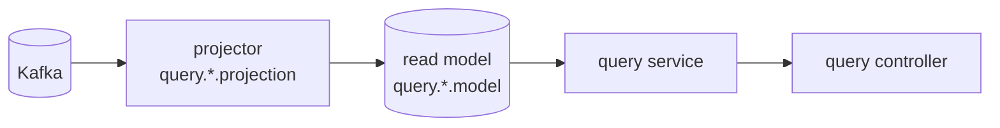

# V2 Design Doc — 03. Read Model

- **상위 결정**: [[04.read-model-projection-and-replica]]
- **개요**: [[00-design-overview]]

> query 측은 layered이며, command의 도메인/스키마를 모른다. 읽기 소스는 **이벤트 프로젝션 read model**이 기본, 저빈도 lookup은 **경량 프로젝션/published 테이블**이다. 둘 다 **query 전용 MySQL**(projector가 Kafka 이벤트로 채움)에 있고, query-module은 그 DB에 정적 바인딩된다 — command DB와 물리 분리, 다리는 Kafka(라우팅 코드 없음 — [[13.db-hosting-and-read-write-topology]]).

> ⚠️ 본 문서는 **목표 아키텍처**다. 현재(V1) 구현은 별도 read model 없이 쓰기 테이블을 공유 조회한다([[01-current-state]] §4). 프로젝션 전환은 [[06.strangler-migration]] 순서대로 단계적으로 도입한다.

## 원칙: 읽기는 항상 query 측, command는 읽기를 서빙하지 않는다

CQRS에서 command의 책임은 검증+쓰기뿐이다. 조회는 전부 query 측이 처리한다. top-level 모듈 분리([[01-module-structure]])의 귀결로, **query는 command 테이블을 직접 조회하지 않는다**(스키마 결합 = 안티패턴).

## 읽기 소스 두 갈래

### (가) 이벤트 프로젝션 read model — 기본

- `projection/` 컴포넌트가 `contract` 이벤트를 구독해 비정규화 `model/` 을 갱신.
- 교차 컨텍스트 조인·고읽기·다른 모양의 조회에 사용.
- **ES 컨텍스트는 최소 1개의 현재상태 프로젝션을 반드시 가진다** — 이벤트 스트림은 임의 조회에 못 쓰므로. ("프로젝션 미적용"은 *추가* 프로젝션을 안 만든다는 뜻이지 읽기 뷰가 0개라는 뜻이 아니다.)

### (나) 경량 lookup 프로젝션 — 저빈도분

- 교차 조인·고읽기 프로젝션이 필요 없는 저빈도 lookup(예: `category`, `company`)도 query DB 안에 **경량 프로젝션(또는 lookup 컨텍스트가 published한 테이블)**으로 둔다. command DB를 읽지 않는다.
- **command 테이블 직접 조회는 금지** — query DB는 command DB와 물리 분리라([[13.db-hosting-and-read-write-topology]]) 이 경계가 *물리적으로* 성립한다. (이전 "read replica 경유" 안은 query가 쓰기 스키마에 결합해 폐기.)

## 컨텍스트별 초기 읽기 전략 (초안)

| 컨텍스트 | 초기 읽기 | 비고 |
|----------|-----------|------|
| `reservation` | 프로젝션 (예약 목록·상세, 식당명 비정규화) | ES — 현재상태 프로젝션 필수 |
| `restaurant` | 프로젝션 (검색·상세) | ES |
| `timetable` | 프로젝션 (가용 시간) | ES |
| `schedule` | 프로젝션 (또는 경량 lookup) | 변화 빈도 보고 결정 |
| `user`/`authenticate` | 경량 프로젝션 (단순 조회) + 일부 프로젝션 | |
| `menu` | 경량 lookup 프로젝션 | |
| `category`·`company` | 경량 lookup 프로젝션 | (나) |

> YAGNI: 프로젝션은 실제 읽기 요구(교차 조인/성능)가 있는 곳부터. 선제적으로 전 컨텍스트에 깔지 않는다.

## 교차 컨텍스트 예시

예약 목록이 "식당 이름"을 보여줘야 할 때:
1. `restaurant`(ES) 가 이름 변경 → `RestaurantRenamed` 이벤트 발행(Outbox→Kafka).
2. `query.reservation.projection` 이 구독 → 자기 read model의 식당명 칼럼 갱신.
3. 예약 조회는 **조인 없이** 빠르게 읽고, 컨텍스트 결합은 이벤트로만.

## 일관성

- **기본 비동기(최종 일관성)** — 프로젝션은 이벤트 구독으로 갱신, 짧은 지연 허용.
- 지연 허용치·동기 프로젝션이 필요한 예외 케이스는 구현 사이클에서 화면 요구에 따라 정의 (현재 미확정).
- Zero Payload([[02-write-model]])라 projector는 필요한 최신 상태를 조회해 채울 수 있어 재처리 안전.

## 관련 문서
- [[00-design-overview]] · [[01-module-structure]] · [[02-write-model]]
- ADR: [[04.read-model-projection-and-replica]] · [[03.command-hexagonal-query-layered]]
