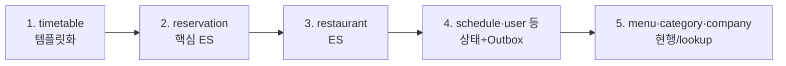

# V2 Design Doc — 04. Migration Strategy

- **상위 결정**: [[06.strangler-migration]]
- **개요**: [[00-design-overview]]

> 빅뱅이 아니라 **점진 전환** — 컨텍스트를 **한 번에 하나씩 V2로 옮긴다.** 두 시스템을 동시에 가동하는 "병행 운영"이 아니라, 코드 레벨에서 컨텍스트를 순차 이전하는 것이다.

## 원칙

- **컨텍스트 단위 순차 이전** — 한 번에 하나의 바운디드 컨텍스트만 command/query 모듈로 옮긴다.
- **미전환분은 그대로** — 아직 옮기지 않은 컨텍스트는 기존(V1) 코드를 그대로 둔다. 별도 운영·복제 없음. 전환된 컨텍스트와의 통합만 이벤트(Outbox→Kafka)로 잇는다.
- **fail-fast** — 가장 위험·핵심인 컨텍스트(ES)를 앞에 두되, **이미 검증된 `timetable`을 첫 템플릿**으로.

## 전환 순서 (초안 — 의존성 기반)

| 단계 | 대상 | 작업 핵심 | 비고 |
|------|------|-----------|------|
| 1 | `timetable` | 기존 Outbox/Kafka를 V2 `command`/`query` 모듈 구조로 정리 → **레퍼런스 템플릿** 확정 | 이미 이벤트 인지 |
| 2 | `reservation` | 애그리거트 행위화 + 이벤트 스토어 + 프로젝션. [[07.reservation]] EDA 계승 | 핵심 도메인 |
| 3 | `restaurant` | ES화 + 검색/상세 프로젝션 | |
| 4 | `schedule`·`user`·`authenticate` | 상태+Outbox로 CQRS 참여 | 비-ES |
| 5 | `menu`·`category`·`company` | 현행 유지, 필요 시 Outbox | lockup·저빈도 |

> 단계 1이 템플릿을 확정하므로 가장 먼저. 2~3은 ES 비용이 큰 핵심이라 앞쪽(fail-fast). 신규 기능(리뷰·포인트·신고)은 별도 컨텍스트로, 전환된 패턴 위에서 추가.

## 전환 중 정합성 (혼재 구간)

- 한 컨텍스트를 옮기는 동안, 아직 안 옮긴 컨텍스트와는 **이벤트로만** 통신 → 강결합 없이 한 번에 하나씩 이동 가능.
- Zero Payload 이벤트라 컨슈머가 최신 상태를 조회 → 구·신 코드 혼재 구간에서도 안전.

## 체크포인트

각 단계 완료 = (a) 해당 컨텍스트의 command/query 모듈 이전, (b) 이벤트 발행·구독 정상, (c) 기존 기능 회귀 없음. 단계별로 별도 사이클로 다룰 수 있다(이 문서 사이클은 *설계*까지).

## 관련 문서
- [[00-design-overview]] · [[02-write-model]] · [[03-read-model]]
- ADR: [[06.strangler-migration]]
- 계승: [[07.reservation]]
