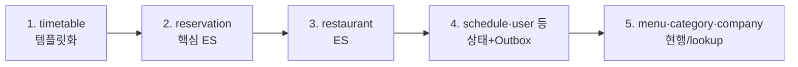

# V2 Design Doc — 04. Migration Strategy

- **상위 결정**: [[06.strangler-migration]]
- **개요**: [[00-design-overview]]

> 빅뱅이 아니라 **점진 전환** — 컨텍스트를 **한 번에 하나씩 V2로 옮긴다.** 시스템 전체를 한꺼번에 두 벌로 띄우는 빅뱅식 병행이 아니라, 컨텍스트를 순차 이전한다. 다만 *컨텍스트 하나를 옮기는 동안에는* V1과 V2가 한동안 공존한다 — 이행의 본질은 그 **병행 운영 창(window)**을 여닫는 일이다([[RFC-013-data-migration-genesis-events]]). 창을 열고, 상태를 옮기고, 트래픽을 넘긴 뒤, 그 컨텍스트의 V1을 닫는다.

## 원칙

- **컨텍스트 단위 순차 이전** — 한 번에 하나의 바운디드 컨텍스트만 command/query 모듈로 옮긴다.
- **병행 운영 창** — 컨텍스트를 옮기는 구간 동안 V1과 V2가 공존한다. 시딩·정합성·백필·컷오버·검증은 모두 *이 창을 어떻게 관리하느냐*의 하위 문제다([[RFC-013-data-migration-genesis-events]]).
- **단방향 동기로 고정** — 창 안에서 진실 원천은 한쪽으로 고정하고 변경을 그 한쪽으로만 흘린다. 양방향 dual-write는 정합성·진실 원천 모호성 때문에 배제한다.
- **미전환분은 그대로** — 아직 옮기지 않은 컨텍스트는 기존(V1) 코드를 그대로 둔다. 전환된 컨텍스트와의 통합만 이벤트(Outbox→Kafka)로 잇는다.
- **fail-fast** — 가장 위험·핵심인 컨텍스트(ES)를 앞에 두되, **이미 검증된 `timetable`을 첫 템플릿**으로.
- **순수 도메인은 현행 `core-module`에 그대로** — 컨텍스트를 옮길 때 순수 도메인 코드는 command 쪽 hexagonal 안의 `domain` 패키지로 끌어오지 않고 V1과 같이 의존성 없는 별도 `core-module`에 둔다([[RFC-010-module-structure-migration]] · [[01-module-structure]]). 물리 경계가 "도메인은 인프라를 모른다"를 빌드 차원에서 강제하므로 순수성이 검증 규칙이 아니라 컴파일 의존성으로 보장되고, 현행이 이미 이 구조라 전환 비용도 들지 않는다. (컨텍스트가 늘어 단일 core가 비대해지면 답은 (a)로의 회귀가 아니라 `core-module` 내부를 컨텍스트별 패키지·서브모듈로 가르는 것 — 그 선은 [[01-module-structure]].)
- **도메인↔JPA 매핑은 수동으로** — 분리의 대가로 생기는 변환 코드는 컨텍스트별로 손으로 쓴 매핑 함수가 경계 안쪽(어댑터/퍼시스턴스)에 명시적으로 남긴다. 코드 생성 도구(MapStruct류 — Kotlin 스택과 마찰)도 공통 매퍼 추상(도메인·인프라 양쪽을 알아 경계를 흐림)도 배제한다([[RFC-010-module-structure-migration]] · [[07.command-domain-jpa-separation]]). 명시적 수동 매핑이 경계의 엄격함을 지키는 값이며, 보일러플레이트는 제거할 결함이 아니라 분리의 정당한 대가다. 이 매핑 규약이 곧 레퍼런스 컨텍스트가 확정하는 산출의 일부다.

## 전환 순서 (초안 — 의존성 기반)

| 단계 | 대상 | 작업 핵심 | 비고 |
|------|------|-----------|------|
| 1 | `timetable` | 기존 Outbox/Kafka를 V2 `command`/`query` 모듈 구조로 정리 → **레퍼런스 템플릿** 확정 | 이미 이벤트 인지 |
| 2 | `reservation` | 애그리거트 행위화 + 이벤트 스토어 + 프로젝션. [[07.reservation]] EDA 계승 | 핵심 도메인 |
| 3 | `restaurant` | ES화 + 검색/상세 프로젝션 | |
| 4 | `schedule`·`user`·`authenticate` | 상태+Outbox로 CQRS 참여 | 비-ES |
| 5 | `menu`·`category`·`company` | 현행 유지, 필요 시 Outbox | lockup·저빈도 |

> 단계 1이 템플릿을 확정하므로 가장 먼저. 2~3은 ES 비용이 큰 핵심이라 앞쪽(fail-fast). 신규 기능(리뷰·포인트·신고)은 각각 별도 command 컨텍스트로 두되 — Strangler 전환 대상이 아니라 처음부터 신구조 네이티브 — **레퍼런스 컨텍스트 확정(첫 한 바퀴) 이후** 투입한다([[RFC-010-module-structure-migration]]). 패턴(모듈 구조·매핑 규약·검증 규칙)이 검증되기 전에 올리면 아직 흔들리는 규약 위에 새 코드를 쌓는 셈이라, "레퍼런스 이후"가 안전한 투입선이다.

**순서를 정하는 규칙**(결과 시퀀스가 아니라 *판단 기준* — 의존성 그래프가 바뀌거나 컨텍스트가 추가돼도 재적용한다, [[RFC-010-module-structure-migration]]):
- **1차 기준 = 의존성.** 잎(다른 컨텍스트가 덜 의존하는) 쪽을 먼저 옮겨 재작업을 최소화한다. 많이 의존받는 컨텍스트를 먼저 옮기면 그 위에 매달린 것들이 바뀔 때마다 되짚어야 한다.
- **결선(tie-break) = 위험·학습 가치.** 의존도가 비슷한 후보가 둘 이상이면, **위험이 낮으면서 새 패턴(command=hexagonal·도메인↔JPA 분리·매핑 규약)을 한 바퀴 온전히 보여 주는** 컨텍스트를 첫 타자로 둔다. 학습 가치를 가산점으로 삼는다 — `timetable`이 1번인 이유가 이것(이미 이벤트라 위험 낮음 + 템플릿 가치 높음)이다.

## 병행 창 관리 (한 컨텍스트 이전 중)

병행 창에서 다룰 두 축은 동기의 *방향*과 창의 *길이*다([[RFC-013-data-migration-genesis-events]]).

- **방향 — 단방향 고정.** 전환 창 동안 진실 원천을 한쪽으로 고정하고 변경을 그 한쪽으로만 흘린다. 양방향 dual-write는 배제한다. 아직 V1이 쓰기를 받는 동안은 V1→V2 방향으로 신규 변경을 이벤트로 흘려 V2를 데워 두고, 컷오버 이후엔 V2만 쓴다.
- **길이 — 긴 병행을 기본.** 두 갈래가 있다.
  - **(긴 병행, 기본)** V1이 컷오버 전까지 계속 쓰기를 받고, V1→V2 단방향 동기로 신규 변경을 이벤트로 흘려 V2를 데워 두다가 피처 플래그로 넘긴다 — 다운타임 0, 다만 지속 동기 파이프를 운영·검증해야 한다.
  - **(얇은 컷오버, 단축)** 컨텍스트별로 짧은 쓰기 프리즈(읽기전용)를 걸고, 그 시점 상태를 일회성 제네시스 임포트로 옮긴 뒤 V2로 전환한다 — 단순하나 컨텍스트당 수 분의 프리즈를 감수한다.
- **무중단 단방향 동기 + 플래그 컷오버를 표준 목표 패턴**으로 삼는다. 실서비스 트래픽이 없어 "병행 기계장치 운영 비용"이라는 절감 명분은 비어 있고, 살아 있는 축은 *학습*이다([[RFC-001-v2-cqrs-and-event-sourcing]]) — 위험 없이 진짜 운영 패턴을 연습할 샌드박스로 본다. 적어도 **레퍼런스 컨텍스트 한 바퀴**는 이 패턴을 온전히 세운다.
- **얇은 컷오버는 단축으로만** — 그 패턴을 한 번 증명한 뒤, 동기 파이프를 또 세워봐야 새로 배울 게 없는 사소한/잎 컨텍스트에 한해 허용한다. 반복의 경계는 첫 컨텍스트를 해본 뒤 정한다.

### 혼재 구간 (아직 안 옮긴 컨텍스트와의 통신)

- 한 컨텍스트를 옮기는 동안, 아직 안 옮긴 컨텍스트와는 **이벤트로만** 통신 → 강결합 없이 한 번에 하나씩 이동 가능.
- Zero Payload 이벤트라 컨슈머가 최신 상태를 조회 → 구·신 코드 혼재 구간에서도 안전.

## 상태를 이벤트로 시딩 — 제네시스 이벤트

병행 창을 열고 단방향 동기를 걸어도, ES 컨텍스트에는 출발점 문제가 하나 더 있다. **V1 테이블에는 이력이 없다** — 지금의 행 한 줄, 즉 "현재 상태"만 있을 뿐 그 상태에 이르기까지의 사건은 어디에도 없다. 그런데 V2 ES 컨텍스트의 진실 원천은 이벤트 이력이다([[00-design-overview]] · [[02-write-model]]). 그래서 V1 행을 V2 테이블로 그냥 복사할 수 없고, 현재 상태를 **이벤트 이력의 형태로 바꿔서** 적재해야 비로소 V2 모델이 성립한다([[RFC-013-data-migration-genesis-events]]).

- **기본 — 행당 단일 genesis 이벤트.** V1 행 하나를 `…Imported` 같은 genesis 이벤트 하나로 싣는다("이 상태는 V1에서 통째로 가져온 것이며 그 이전 이력은 알 수 없다"는 정직한 선언). 실제로 일어나지 않은 중간 사건을 지어내 이력을 합성하면 그것은 곧 *허구*이고, 진실 원천을 이벤트로 삼겠다는 전제([[RFC-001-v2-cqrs-and-event-sourcing]])를 스스로 더럽힌다. 비용도 단일 이벤트가 압도적으로 싸다.
- **예외 — 합성 이력 복원.** 도메인이 정말로 이력 자체를 필요로 하고 V1에 신뢰할 만한 원천(감사 로그·이력 테이블)이 실제로 남아 있는 컨텍스트에 한해서만 여러 이벤트로 푼다. 해당 여부는 전환 사이클에서 데이터를 보고 판단한다.
- genesis 이벤트도 이벤트 스토어의 일급 시민이라 스키마·버전을 가지며 [[08-event-store-lifecycle]]의 진화 규칙을 그대로 따른다. 별도 타입으로 둘지 기존 `Created` 계열에 `source=imported`로 얹을지는 Design 디테일.

### 백필 — RFC-011 재구축 재사용

genesis 이벤트를 적재했다고 끝이 아니다. 그 이벤트들로 읽기 모델을 채워야(backfill) 쿼리가 작동한다. 그런데 **이미 적재된 이벤트 스트림으로 읽기 모델을 다시 빌드하는 일은 [[RFC-011-projection-rebuild-catchup]]의 프로젝션 재구축과 정확히 같은 동작**이다([[03-read-model]]). 그래서 백필용 별도 파이프라인을 만들지 않는다 — 시딩이 끝나면 재구축/캐치업 메커니즘을 그대로 돌린다. 백필은 "초기 이벤트 묶음에 대한 첫 프로젝션 실행"일 뿐이다.

### 컷오버·롤백 — 피처 플래그 + V1 보존

컨텍스트별로 V1을 끄고 V2를 켜는 스위치는 **피처 플래그**로 둔다. 플래그로 트래픽을 V1↔V2로 토글하면 문제가 보일 때 즉시 되돌릴 수 있다. 롤백은 두 결로 갈린다.

- **트래픽 롤백 — 즉시.** V1이 단방향 동기로 여전히 진실을 들고 있으니(위 §방향), 플래그를 V1로 토글하면 읽기·쓰기가 V1로 돌아간다.
- **데이터 롤백 — 시간으로 흡수.** V2에 쌓인 이벤트를 V1으로 되돌리는 건 까다롭다(append-only라 물리 삭제가 없고, 양방향 역동기는 이중 기록의 함정으로 회귀). 정교한 역동기를 설계하는 대신, **컷오버 직후 일정 기간 V1을 폐기하지 않고 보존**하고 그 기간엔 트래픽 토글만으로 안전망을 삼는다. 보존 기간 구체값은 Design.

### 이행 검증 — 동등성 게이트

이행이 맞게 됐는지는 믿음이 아니라 측정으로 말한다. 세 축으로 V1↔V2 동등성을 본다.

1. **건수 일치** — V1 행 수 = 적재된 genesis 이벤트 수 = 백필된 읽기 모델 행 수.
2. **핵심 필드 일치** — 키·금액·상태 등 도메인이 정한 비교 대상.
3. **재구성 상태 일치** — V2 이벤트로 다시 세운 현재 상태 = V1의 현재 상태.

이 세 축은 **컷오버 게이트**다 — 동등성이 통과해야만 피처 플래그를 V2로 넘긴다(사후 모니터링으로 두면 트래픽이 넘어간 뒤 불일치를 발견해 롤백 비용이 커진다). 일회성 스크립트가 아니라 회귀로 묶어 이행 로직이 바뀔 때마다 동등성을 다시 본다([[11-environments-and-testing]] · [[14.testing-strategy]]).

## 체크포인트

각 단계 완료 = (a) 해당 컨텍스트의 command/query 모듈 이전, (b) 이벤트 발행·구독 정상, (c) 기존 기능 회귀 없음.

**단위 사이클 분할 규약**([[RFC-010-module-structure-migration]]) — **컨텍스트 1개 = 사이클 1개**가 기본 단위다(WIP=1과 정합: 한 번에 하나의 컨텍스트만 연다).
- **첫(레퍼런스) 컨텍스트 사이클은 가장 무겁게** 잡는다. 거기서 매핑 규약·검증 규칙·전환 절차(단방향 동기·genesis·동등성 게이트)를 *함께* 확정한다 — 이 사이클이 곧 템플릿을 만든다.
- **이후 컨텍스트는 그 레퍼런스를 복제하는 가벼운 사이클**로 돈다. 절차를 새로 발명하지 않고 첫 사이클의 산출을 재사용하므로, 둘째부터는 도메인 차이에만 집중한다.
- 이 문서 사이클은 *설계*까지다.

## 관련 문서
- [[00-design-overview]] · [[02-write-model]] · [[03-read-model]] · [[08-event-store-lifecycle]] · [[11-environments-and-testing]]
- RFC: [[RFC-010-module-structure-migration]] · [[RFC-013-data-migration-genesis-events]] · [[RFC-011-projection-rebuild-catchup]]
- ADR: [[06.strangler-migration]]
- 계승: [[07.reservation]]
