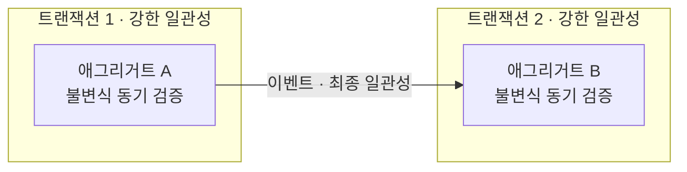
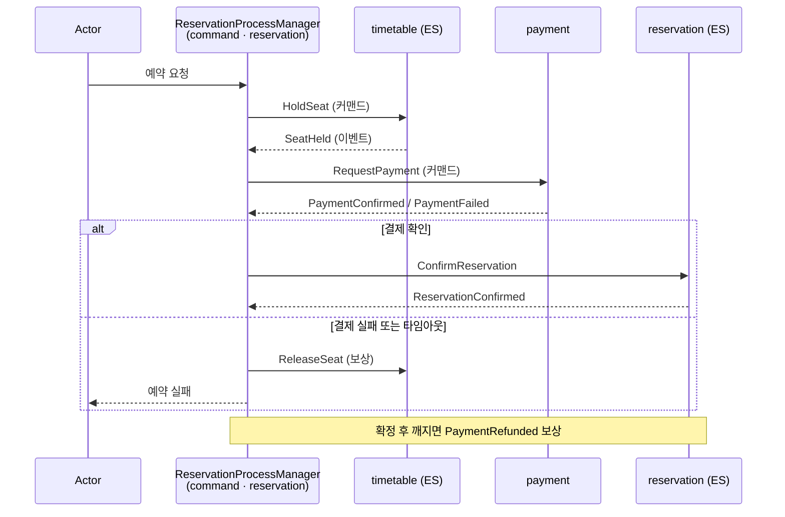
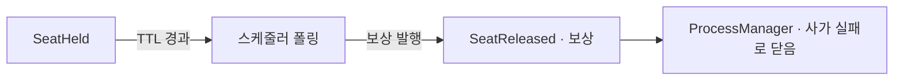

# V2 Design Doc — 06. Consistency & Sagas

- **상위 결정**: [[08.saga-orchestration-vs-choreography]]
- **개요**: [[00-design-overview]] · **쓰기 모델**: [[02-write-model]]
- **계승**: [[07.reservation]] (v1 — Timetable·Reservation EDA, 보상 트랜잭션은 v1에서 미결정으로 남았던 항목)

> 9개 컨텍스트가 하나의 예약 시스템으로 어떻게 맞물리는가. 핵심은 **일관성 경계를 어디에 긋고, 경계를 넘는 비즈니스 트랜잭션을 무엇으로 잇는가**다.

## 일관성 경계: 애그리거트 = 트랜잭션, 그 바깥 = 최종 일관성

V2의 일관성 규칙은 두 줄이다.

1. **애그리거트 하나 = 강한 일관성 = 한 트랜잭션.** 한 커맨드는 단 하나의 애그리거트만 원자적으로 바꾼다. 불변식은 그 애그리거트 안에서 동기 검증된다([[02-write-model]] — `handle(command) → events`).
2. **애그리거트 둘 이상 = 최종 일관성 = 이벤트.** 여러 애그리거트(특히 다른 컨텍스트)에 걸친 변화는 한 트랜잭션으로 묶지 않는다. 이벤트로 비동기 전파한다([[00-design-overview]] 불변식 #2·#3).

이 규칙은 새로 만든 것이 아니라 [[07.reservation]]에서 이미 실천하던 것을 명문화한 것이다 — Timetable 점유와 Reservation 생성은 별개 트랜잭션이고, 그 사이를 Kafka 이벤트가 잇는다.

> "한 커맨드 = 한 애그리거트"는 규율이다. 두 애그리거트를 한 트랜잭션에서 바꾸고 싶어지면, 그것은 경계를 잘못 그었다는 신호이거나 사가가 필요하다는 신호다.

## 컨텍스트 횡단 비즈니스 트랜잭션

예약 시스템의 의미 있는 동작 상당수는 **여러 컨텍스트에 걸친다**. 대표 예 — "예약을 잡는다"는 자리 **임시 점유** → **결제 대기** → 결제되면 **확정**으로 흐른다([[RFC-006-saga-process-manager]] 맥락):

| 단계 | 컨텍스트 | 애그리거트 변화 | 사가 이벤트 |
|------|----------|-----------------|-------------|
| 1 | `timetable` (ES) | 해당 슬롯을 임시 점유(hold) | `SeatHeld` |
| 2 | `payment` | 결제를 기다려 확정 | `PaymentConfirmed` |
| 3 | `reservation` (ES) | 예약 확정(confirmed) | `ReservationConfirmed` |
| (참여) | `user` (비-ES) | 예약자 식별·자격 | — |

이 단계들은 **한 트랜잭션에 들어갈 수 없다**(컨텍스트마다 다른 애그리거트·다른 저장소·top-level 모듈 분리). 따라서 단계 사이는 이벤트로 잇고, 중간 실패는 **보상 트랜잭션**으로 되돌린다 — 결제가 제때 안 오면 점유를 풀고(`SeatReleased`), 결제는 됐는데 확정이 깨지면 환불한다(`PaymentRefunded`). 이것이 사가(saga)다.

## 사가 = 최종 일관성 비즈니스 트랜잭션

사가는 "여러 로컬 트랜잭션을 이벤트로 잇고, 실패하면 앞선 단계를 보상하는" 패턴이다. 두 가지 조율 방식이 있다.

- **코레오그래피(Choreography)**: 중앙 조율자 없음. 각 컨텍스트가 이벤트를 듣고 자기 일을 한 뒤 다음 이벤트를 낸다. 단순 반응에 적합.
- **오케스트레이션(Orchestration)**: 프로세스 매니저(process manager)가 단계 순서·보상·타임아웃을 들고 커맨드를 보낸다. 멀티스텝·라이프사이클에 적합.

정상 흐름(`SeatHeld` → `PaymentConfirmed` → `ReservationConfirmed`)만 보면 코레오그래피로 충분하다. 코레오그래피가 부족한 건 두 군데다([[RFC-006-saga-process-manager]]):

1. **타임아웃은 "이벤트의 부재"다.** 자리를 잡아 두고 결제를 기다리는데 사용자가 떠나면 `PaymentConfirmed`도 `PaymentFailed`도 오지 않는다. 코레오그래피는 이벤트가 와야 반응하는데, 아무 이벤트도 안 오는 상황엔 반응할 주체가 없다 — 시계를 보다 점유를 풀어 줄(`SeatReleased`) 흐름의 주인이 필요하다.
2. **되감기는 "어디까지 왔는지"를 알아야 한다.** 결제는 됐는데 확정이 깨지면 환불(`PaymentRefunded`)해야 하는데, 그러려면 *전체 흐름의 현재 위치*를 알아야 한다. 코레오그래피에선 각 컨텍스트가 자기 조각만 봐 누구도 전체를 모른다.

이 둘(타임아웃 감시 + 단계 간 보상)이 "흐름 전체 상태를 든 주인 = PM"을 요구한다. **결제·기다림·보상 중 하나라도 끼면 PM이 기본**이고, 코레오그래피는 그 셋이 없는 부수효과 없는 단발 통지로 좁힌다 — 돈이 걸린 흐름을 "코레오냐 PM이냐" 판단 거리에 남기지 않는다([[RFC-006-saga-process-manager]]).

**무엇을 어디에 쓰는지는 [[08.saga-orchestration-vs-choreography]]에서 결정한다.** 요약: **예약 라이프사이클 = 오케스트레이션(프로세스 매니저), 단순 통지·동기화 = 코레오그래피.**

## 예약 사가 — 오케스트레이션 (권고 적용)

예약 확정은 멀티스텝이고, 중간 실패 시 임시 점유를 풀어야 하며, 사용자가 결제를 안 하면 만료시켜야 한다. 이런 라이프사이클은 흐름을 한 곳에서 보는 **프로세스 매니저**가 맞다. 흐름은 자리 임시 점유(`SeatHeld`) → 결제 대기(`PaymentConfirmed`) → 예약 확정(`ReservationConfirmed`)이다.

- 프로세스 매니저는 `command-module`의 `reservation` 컨텍스트에 둔다(예약 라이프사이클의 주인이 예약 컨텍스트이므로). 단계 진행은 이벤트 구독으로 받고, 다음 단계는 커맨드로 보낸다.
- 프로세스 매니저 자신의 상태(어느 단계인가)는 이벤트 소싱으로 기록한다 — `reservation`이 이미 ES이므로 자연스럽다([[RFC-006-saga-process-manager]]). 사가 상태는 별도 enum 컬럼이 아니라 **이 사가 이벤트들이 시간순으로 쌓인 스트림 그 자체**다 — `SeatHeld`(19:03) → `PaymentConfirmed`(19:05) → `ReservationConfirmed`, 타임아웃이면 `SeatHeld`(19:03) 뒤 `SeatReleased`(19:08). 사가가 왜 거기서 멈췄는지·어느 보상까지 돌았는지가 스트림에 그대로 남아 운영 추적에 유리하다. 구체 스키마는 구현 사이클에서 확정(TBD).
- **미결 경계 — enum 으로 충분한 단순 흐름까지 이벤트로 쌓을 것인가**([[RFC-006-saga-process-manager]]). 위는 예약 확정처럼 단계·보상이 풍부한 흐름을 전제로 ES 스트림을 택한 것이다. 그러나 단계가 한둘뿐인 단순 PM 까지 모든 상태 전이를 이벤트로 적재하는 것은 과할 수 있다 — 그런 흐름은 enum 한 컬럼으로 현재 단계를 들고 가는 편이 싸다. **"흐름별로 ES 스트림이냐 enum 이냐"를 가르는 경계는 흐름 카탈로그가 확정되는 시점에 PM 별로 판단한다**(TBD). 사가 표면 계약(주고받는 이벤트)은 어느 쪽을 골라도 불변이다.

### 결제 단계는 외부 경계다 — `payment` 컨텍스트로 위임

위 흐름에서 `payment`는 다른 컨텍스트(`timetable`·`reservation`)와 결이 다르다. **우리가 통제하지 못하는 외부 PG(결제 게이트웨이)와 말하는 컨텍스트**이기 때문이다([[RFC-016-payment-integration-boundary]]). 사가 입장에서 `payment`는 `RequestPayment` 커맨드를 받아 `PaymentConfirmed`/`PaymentFailed`를 돌려주는 한 단계일 뿐이지만, 그 단계 *안쪽* — 외부 PG 호출의 비동기·타임아웃·재시도·환불(`PaymentRefunded`) API 실패 처리 — 은 PM이 직접 들 게 아니라 `payment` 컨텍스트가 자기 경계 안에서 흡수해야 한다. 그래야 외부 연동의 불확실성이 예약 사가 본류로 새어 나오지 않는다.

본 문서는 `payment`를 **사가의 한 참여 컨텍스트**로만 다룬다. 결제 컨텍스트가 무엇인지 — 외부 PG와의 경계, 멱등·웹훅·정합성, command/query 형태 — 의 상세 설계는 [[14-payment-integration]]으로 위임한다.

## 보상 트랜잭션

분산 트랜잭션엔 롤백이 없다. 이미 커밋된 로컬 트랜잭션은 **반대 동작(보상)** 으로 되돌린다.

| 정방향 | 보상 |
|--------|------|
| `SeatHeld` (timetable 임시 점유) | `SeatReleased` (점유 해제) |
| `PaymentConfirmed` (결제 확정) | `PaymentRefunded` (환불) |
| `ConfirmReservation` | `CancelReservation` |
| (상태 차감류) | 역연산 이벤트 |

- 보상은 **삭제가 아니라 새 이벤트**다. ES 컨텍스트에서 점유를 "없던 일"로 지우지 않고 `SeatReleased` 를 append 한다 — append-only 불변식 유지([[05.event-store-mysql-table]]), 이력·감사 보존.
- 보상은 **멱등**이어야 한다. 같은 보상 이벤트를 두 번 받아도 한 번 적용한 것과 같아야 한다(이벤트 재처리·중복 전달 대비). Zero Payload 재조회([[07.reservation]])로 "이미 풀린 점유면 무시"를 판단한다.
- [[07.reservation]]이 미결정으로 남겼던 "Reservation 생성 불가 시 Timetable 상태 보정"이 바로 이 보상이다. V2는 이를 프로세스 매니저의 명시적 보상 단계로 끌어올린다.

## 사가 타임아웃 / 만료

사가는 영원히 열려 있으면 안 된다. 두 종류의 시간 제약을 다룬다.

### (가) 임시 점유 만료 — 도메인 본질

`timetable`의 임시 점유(hold)는 **TTL**을 갖는다. 사용자가 N분 안에 결제하지 않으면 점유는 자동 만료되어 슬롯이 풀린다.

- 만료의 권위는 **`timetable` 애그리거트**에 둔다 — "내 점유가 언제 죽는가"는 timetable의 불변식이다.
- 만료 트리거: 스케줄러가 주기적으로 깨어 "`SeatHeld`인 채 TTL이 지난" 점유를 찾아 `SeatReleased` 보상을 발행한다 — 안무가 못 메우는 "이벤트 부재"를 폴링이 시계 역할로 메운다. (v1의 Outbox 재처리와 같은 스케줄러 인프라 결을 따른다 — [[07.reservation]].)
- `SeatReleased` 로 열린 예약 사가가 실패로 닫힌다.

### (나) 사가 스텝 타임아웃 — 프로세스 매니저

프로세스 매니저가 다음 단계 이벤트(예: `PaymentConfirmed`)를 일정 시간 안에 못 받으면, 타임아웃으로 간주하고 보상 경로로 진입한다.

- 타임아웃 역시 스케줄러가 "기한 지난 미완 사가"를 깨우는 방식(폴링). 전용 타이머 인프라는 도입하지 않는다(YAGNI — [[00-design-overview]] 불변식 #4).
- **폴링 주기 ≤ 임시 점유 TTL 은 수치로 검증할 제약이다**([[RFC-006-saga-process-manager]]). 폴링이 시계를 대신하므로, 폴링 주기가 TTL 보다 길면 점유가 실제 만료 시각보다 *늦게* 풀려 그만큼 슬롯이 헛되이 묶인다(만료 정밀도 = 폴링 주기). 따라서 구현 사이클에서 TTL 값을 정할 때 **"폴링 주기 ≤ TTL(허용 만료 지연)"** 관계를 수치로 함께 검증한다 — 두 값을 따로 정하면 안 된다.
- 구체 TTL 값·타임아웃 임계치·폴링 주기는 화면/UX 요구에 묶이므로 구현 사이클에서 확정(TBD).

## 중복·순서·재처리 (이미 가진 자산 활용)

컨텍스트 횡단 일관성의 실무 난점은 대부분 메시징 특성에서 온다. V2는 새로 발명하지 않고 [[07.reservation]] 자산을 재사용한다.

- **순서**: Kafka 파티션 키 = `aggregate_id` 로 애그리거트별 순서 보장. 토픽 분할·전달 보장의 세부는 [[07-messaging-topology]].
- **중복(at-least-once)**: 컨슈머·프로젝션·보상 모두 **멱등** 설계. Zero Payload 재조회로 현재 상태 기준 판단.
- **재처리 실패**: 스케줄러 기반 Outbox 재시도 + PoisonMessage 별도 관리(v1 계승). 사가 단계 실패도 같은 PoisonMessage 운영 흐름에 태운다.
- **미결 — v1 PoisonMessage 모델이 "부분 보상 상태"를 담는가**([[RFC-006-saga-process-manager]]). 단순 메시지 실패와 달리 사가 단계 실패는 **보상을 이미 일부만 돌린 중간 상태**일 수 있다(예: `SeatReleased`는 됐는데 `PaymentRefunded`가 실패). 이 부분 보상 상태를 v1 PoisonMessage·수동 재생 루프가 그대로 표현·복구할 수 있는지, 아니면 사가 전용 보정 경로가 따로 필요한지는 구현 사이클에서 확정한다(TBD) — 단순 "재생하면 끝"이 성립하지 않을 수 있는 자리다.

## 정리

- 애그리거트 안 = 강한 일관성, 애그리거트 밖 = 이벤트 기반 최종 일관성.
- 컨텍스트 횡단 트랜잭션(예약 확정)은 **사가**. **결제·기다림·보상 중 하나라도 끼면 오케스트레이션(프로세스 매니저)이 기본**, 코레오그래피는 부수효과 없는 단발 통지로 한정 — 결정은 [[08.saga-orchestration-vs-choreography]].
- 실패는 롤백이 아니라 **보상 이벤트**(append-only·멱등).
- 시간 제약은 **임시 점유 TTL**(timetable 권위) + **사가 스텝 타임아웃**(프로세스 매니저), 둘 다 스케줄러 폴링으로(YAGNI).
- 예약 외 흐름(취소·노쇼·환불)은 셋 다 결제(돈)에 닿아 보상·타임아웃이 끼므로 **PM으로 기우는 잠정 방향**([[RFC-006-saga-process-manager]]) — 실제 단계·보상 대상과 분류 표 비준은 이벤트 스토밍 카탈로그 뒤로 연다.
- 구체 이벤트 카탈로그·TTL 값·프로세스 매니저 상태 모델은 이벤트 스토밍 후 TBD.

## 관련 문서
- [[00-design-overview]] · [[02-write-model]] · [[03-read-model]] · [[07-messaging-topology]] · [[14-payment-integration]]
- RFC: [[RFC-006-saga-process-manager]] · [[RFC-016-payment-integration-boundary]]
- ADR: [[08.saga-orchestration-vs-choreography]] · [[09.event-ordering-and-delivery-guarantee]] · [[05.event-store-mysql-table]] · [[02.selective-event-sourcing-scope]]
- 계승: [[07.reservation]]
