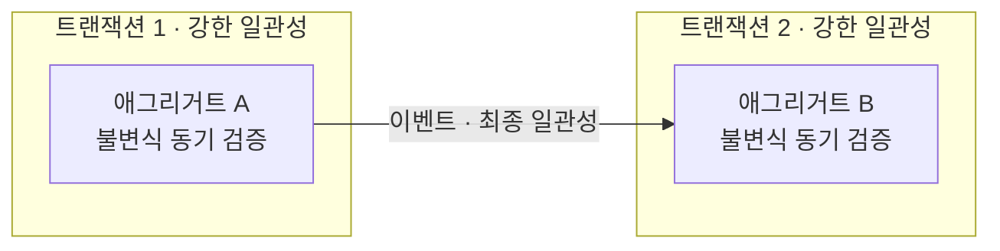
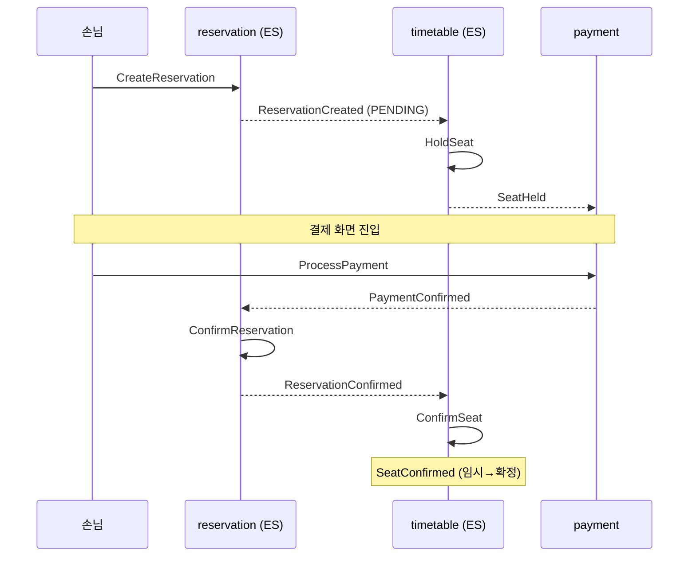
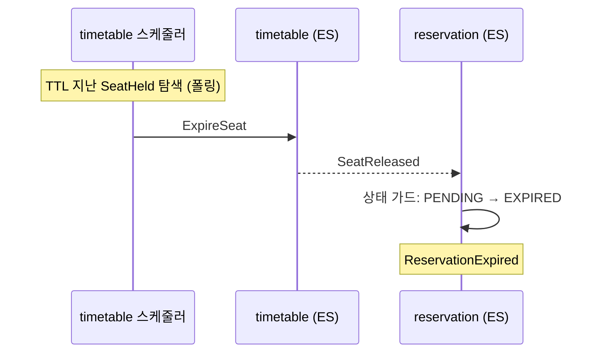
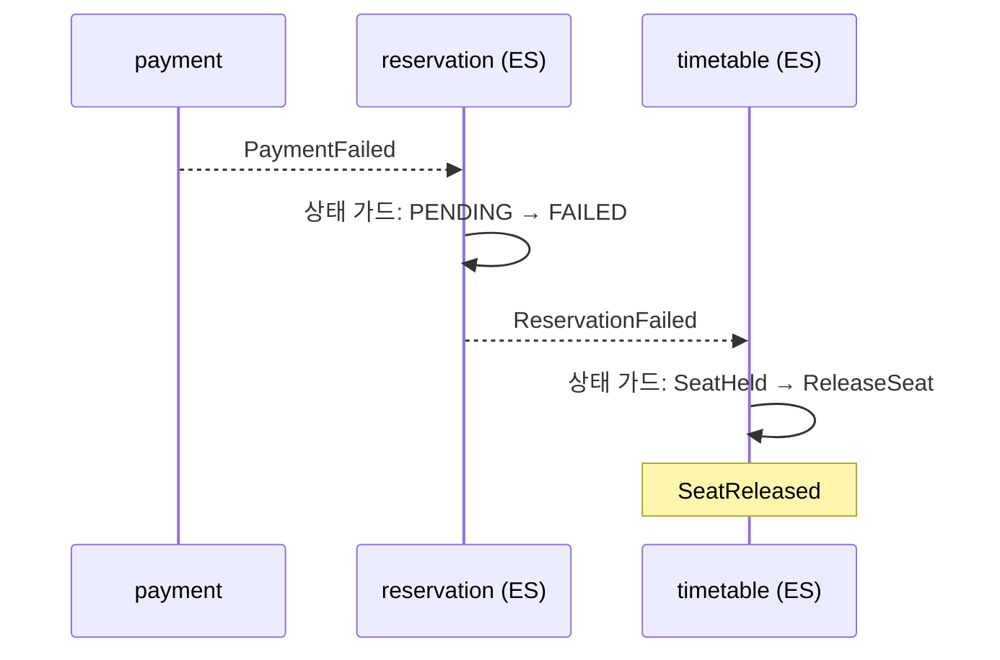
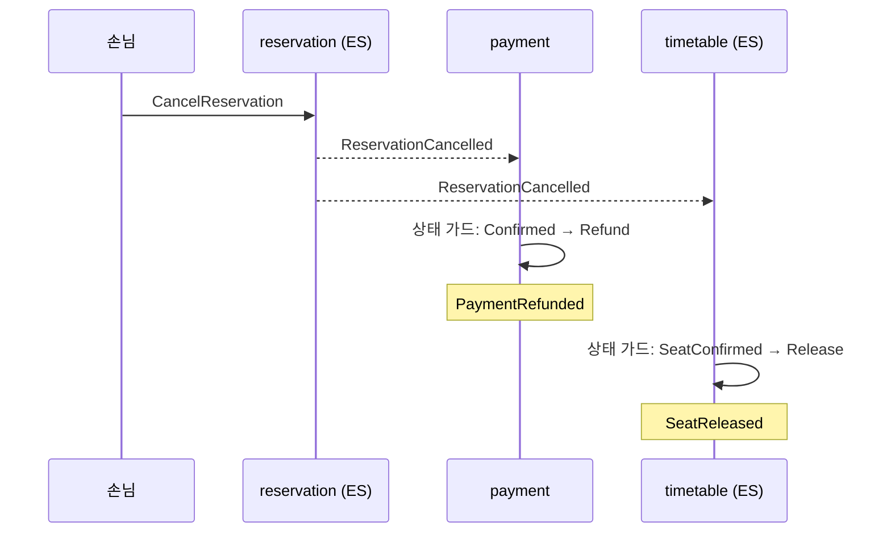
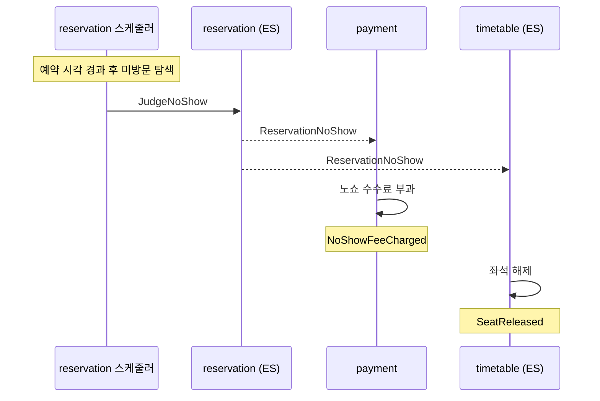
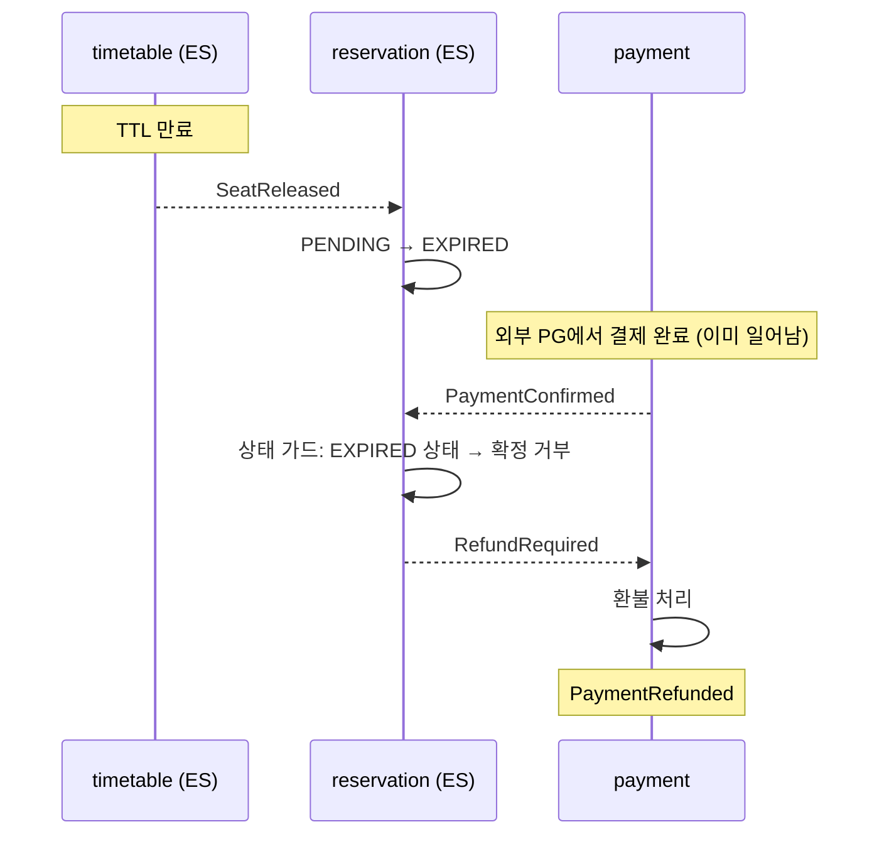
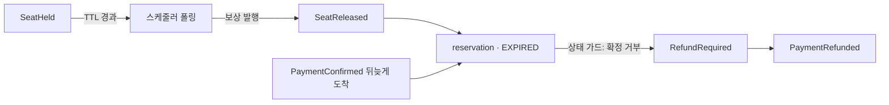

# V2 Design Doc — 06. Consistency & Sagas

- **상위 결정**: [[08.saga-orchestration-vs-choreography]]
- **개요**: [[00-design-overview]] · **쓰기 모델**: [[02-write-model]]
- **계승**: [[07.reservation]] (v1 — Timetable·Reservation EDA, 보상 트랜잭션은 v1에서 미결정으로 남았던 항목)

> 9개 컨텍스트가 하나의 예약 시스템으로 어떻게 맞물리는가. 핵심은 **일관성 경계를 어디에 긋고, 경계를 넘는 비즈니스 트랜잭션을 무엇으로 잇는가**다.

## 일관성 경계: 애그리거트 = 트랜잭션, 그 바깥 = 최종 일관성

V2의 일관성 규칙은 두 줄이다.

1. **애그리거트 하나 = 강한 일관성 = 한 트랜잭션.** 한 커맨드는 단 하나의 애그리거트만 원자적으로 바꾼다. 불변식은 그 애그리거트 안에서 동기 검증된다([[02-write-model]] — `handle(command) → events`).
2. **애그리거트 둘 이상 = 최종 일관성 = 이벤트.** 여러 애그리거트(특히 다른 컨텍스트)에 걸친 변화는 한 트랜잭션으로 묶지 않는다. 이벤트로 비동기 전파한다([[00-design-overview]] 불변식 #2·#3).

이 규칙은 새로 만든 것이 아니라 [[07.reservation]]에서 이미 실천하던 것을 명문화한 것이다 — Timetable 점유와 Reservation 생성은 별개 트랜잭션이고, 그 사이를 Kafka 이벤트가 잇는다.

> "한 커맨드 = 한 애그리거트"는 규율이다. 두 애그리거트를 한 트랜잭션에서 바꾸고 싶어지면, 그것은 경계를 잘못 그었다는 신호이거나 사가가 필요하다는 신호다.

## 컨텍스트 횡단 비즈니스 트랜잭션

예약 시스템의 의미 있는 동작 상당수는 **여러 컨텍스트에 걸친다**. 대표 예 — "예약을 잡는다"는 자리 **임시 점유** → **결제 대기** → 결제되면 **확정**으로 흐른다([[RFC-006-saga-process-manager]] 맥락):

| 단계 | 컨텍스트 | 애그리거트 변화 | 사가 이벤트 |
|------|----------|-----------------|-------------|
| 1    | `timetable` (ES) | 해당 슬롯을 임시 점유(hold) | `SeatHeld` |
| 2    | `payment`        | 결제를 기다려 확정            | `PaymentConfirmed` |
| 3    | `reservation` (ES) | 예약 확정(confirmed)        | `ReservationConfirmed` |
| (참여) | `user` (비-ES)   | 예약자 식별·자격              | — |

이 단계들은 **한 트랜잭션에 들어갈 수 없다**(컨텍스트마다 다른 애그리거트·다른 저장소·top-level 모듈 분리). 따라서 단계 사이는 이벤트로 잇고, 중간 실패는 **보상 트랜잭션**으로 되돌린다 — 결제가 제때 안 오면 점유를 풀고(`SeatReleased`), 결제는 됐는데 확정이 깨지면 환불한다(`PaymentRefunded`). 이것이 사가(saga)다.

## 사가 = 최종 일관성 비즈니스 트랜잭션

사가는 "여러 로컬 트랜잭션을 이벤트로 잇고, 실패하면 앞선 단계를 보상하는" 패턴이다. 두 가지 조율 방식이 있다.

- **코레오그래피(Choreography)**: 중앙 조율자 없음. 각 컨텍스트가 이벤트를 듣고 자기 일을 한 뒤 다음 이벤트를 낸다. 각 컨텍스트가 자기 aggregate 상태를 보고 자기 보상을 판단한다.
- **오케스트레이션(Orchestration)**: 프로세스 매니저(process manager)가 단계 순서·보상·타임아웃을 들고 커맨드를 보낸다.

**V2 예약 도메인은 코레오그래피를 택한다**([[08.saga-orchestration-vs-choreography]]). 근거:

1. 예약 흐름(확정·취소·노쇼)이 전부 **2~3스텝 선형**이다 — PM 상태 머신 인프라 비용을 정당화하지 못한다.
2. PM의 두 논거(타임아웃 감시, 되감기 주인)가 코레오그래피로 해결 가능하다:
   - **타임아웃**: `timetable`이 자기 점유 TTL을 자기가 관리(데이터 소유자 자치).
   - **되감기**: 각 aggregate가 자기 상태를 보고 자기 보상을 판단(중앙 위치 불필요).
3. PM은 관리 포인트를 줄이지 않고 1+N으로 늘린다. 복잡도를 줄이지 않고 위치만 옮긴다.

## 예약 사가 — 코레오그래피 이벤트 흐름

### 예약 확정 (Happy Path)

- `reservation`이 PENDING 상태로 생성되어 correlationId 역할.
- 각 컨텍스트는 이벤트를 듣고 자기 aggregate에 커맨드를 실행.
- 흐름의 "주인"은 없다 — 각 컨텍스트가 자기 구간만 책임진다.

### 타임아웃 — 결제 미도착 (TTL 만료)

- `timetable`이 자기 점유의 TTL을 자기가 관리 — **데이터 소유자 자치**.
- V1 스케줄러 패턴 재사용.
- `reservation`은 `SeatReleased`를 듣고 자기 상태를 EXPIRED로 전이.

### 결제 실패

- `payment`가 실패 이벤트를 발행하면, `reservation`이 듣고 상태 전이, `timetable`이 듣고 자기 보상(좌석 해제).

### 예약 취소

- `reservation`이 취소 이벤트를 발행하면, `payment`와 `timetable`이 **각자 자기 상태를 보고 자기 보상을 판단**.
- `payment`가 `Confirmed` 상태가 아니면(결제 전 취소) 환불 없이 무시.

### 노쇼

### paid-after-expiry 레이스

점유 만료 후 결제가 뒤늦게 도착하는 레이스 — aggregate 상태 가드로 방어.

- `reservation` aggregate가 EXPIRED 상태에서 `PaymentConfirmed`를 받으면 **확정 거부 + 환불 트리거**.
- PM 없이 aggregate 상태 가드만으로 레이스를 방어한다.

## 보상 트랜잭션

분산 트랜잭션엔 롤백이 없다. 이미 커밋된 로컬 트랜잭션은 **반대 동작(보상)** 으로 되돌린다.

| 정방향                              | 보상                          |
|--------------------------------------|-------------------------------|
| `SeatHeld` (timetable 임시 점유)     | `SeatReleased` (점유 해제)    |
| `PaymentConfirmed` (결제 확정)       | `PaymentRefunded` (환불)      |
| `ReservationConfirmed` (예약 확정)   | `ReservationCancelled` (취소) |

- 보상은 **삭제가 아니라 새 이벤트**다. ES 컨텍스트에서 점유를 "없던 일"로 지우지 않고 `SeatReleased` 를 append 한다 — append-only 불변식 유지([[05.event-store-mysql-table]]), 이력·감사 보존.
- 보상은 **멱등**이어야 한다. 같은 보상 이벤트를 두 번 받아도 한 번 적용한 것과 같아야 한다(이벤트 재처리·중복 전달 대비). Zero Payload 재조회([[07.reservation]])로 "이미 풀린 점유면 무시"를 판단한다.
- 각 컨텍스트가 **자기 aggregate 상태를 보고 자기 보상을 판단**한다. 중앙에서 보상 순서를 제어할 필요 없다 — `payment`는 자기가 `Confirmed` 상태인지 보고 환불을 결정하고, `timetable`은 자기가 `SeatHeld` 상태인지 보고 해제를 결정한다.
- [[07.reservation]]이 미결정으로 남겼던 "Reservation 생성 불가 시 Timetable 상태 보정"이 바로 이 보상이다. V2는 이를 코레오그래피의 명시적 보상 이벤트로 끌어올린다.

### 결제 단계는 외부 경계다 — `payment` 컨텍스트로 위임

위 흐름에서 `payment`는 다른 컨텍스트(`timetable`·`reservation`)와 결이 다르다. **우리가 통제하지 못하는 외부 PG(결제 게이트웨이)와 말하는 컨텍스트**이기 때문이다([[RFC-016-payment-integration-boundary]]). 사가 입장에서 `payment`는 `SeatHeld`를 듣고 결제를 처리해 `PaymentConfirmed`/`PaymentFailed`를 돌려주는 참여자일 뿐이지만, 그 *안쪽* — 외부 PG 호출의 비동기·타임아웃·재시도·환불 API 실패 처리 — 은 `payment` 컨텍스트가 자기 경계 안에서 흡수해야 한다.

본 문서는 `payment`를 **사가의 한 참여 컨텍스트**로만 다룬다. 결제 컨텍스트의 상세 설계는 [[14-payment-integration]]으로 위임한다.

## 사가 타임아웃 / 만료

사가는 영원히 열려 있으면 안 된다. 코레오그래피에서 타임아웃은 **데이터 소유자가 자치적으로 관리**한다.

### (가) 임시 점유 만료 — timetable 자치

`timetable`의 임시 점유(hold)는 **TTL**을 갖는다. 사용자가 N분 안에 결제하지 않으면 점유는 자동 만료되어 슬롯이 풀린다.

- 만료의 권위는 **`timetable` 애그리거트**에 둔다 — "내 점유가 언제 죽는가"는 timetable의 불변식이다.
- 만료 트리거: 스케줄러가 주기적으로 깨어 "`SeatHeld`인 채 TTL이 지난" 점유를 찾아 `SeatReleased` 보상을 발행한다. v1의 Outbox 재처리와 같은 스케줄러 인프라 결을 따른다([[07.reservation]]).
- `SeatReleased`를 `reservation`이 구독해 상태를 EXPIRED로 전이 — 사가가 닫힌다.

### (나) 노쇼 판정 — reservation 자치

예약 시각이 지났는데 손님이 오지 않은 경우, `reservation` 스케줄러가 미방문 예약을 탐색해 `JudgeNoShow` 커맨드를 발행한다.

### (다) 폴링 주기와 TTL 관계

폴링이 시계를 대신하므로, **폴링 주기 ≤ TTL(허용 만료 지연)** 관계를 수치로 검증해야 한다. 폴링 주기가 TTL보다 길면 점유가 실제 만료 시각보다 늦게 풀려 그만큼 슬롯이 묶인다. 구현 사이클에서 TTL 값을 정할 때 두 값을 함께 검증한다.

### (라) 두 시계가 충돌할 때 — paid-after-expiry 레이스

`timetable` TTL 만료와 외부 PG 결제 완료가 엇갈리는 레이스가 구조적으로 존재한다. 이 레이스를 **aggregate 상태 가드**로 방어한다(위 "paid-after-expiry 레이스" 시퀀스 참조).

- **만료된 점유에는 확정을 거부한다 — 오버부킹 방지.** `reservation`이 EXPIRED 상태에서 `PaymentConfirmed`를 받으면 확정 거부.
- **환불 트리거.** 확정 거부 시 `RefundRequired` 이벤트를 발행해 `payment`가 환불을 처리한다.
- PM 없이 aggregate 상태 가드만으로 정합성을 보장한다.

## 중복·순서·재처리 (이미 가진 자산 활용)

컨텍스트 횡단 일관성의 실무 난점은 대부분 메시징 특성에서 온다. V2는 새로 발명하지 않고 [[07.reservation]] 자산을 재사용한다.

- **순서**: Kafka 파티션 키 = `aggregate_id` 로 애그리거트별 순서 보장. 토픽 분할·전달 보장의 세부는 [[07-messaging-topology]].
- **중복(at-least-once)**: 컨슈머·보상 모두 **멱등** 설계. Zero Payload 재조회로 현재 상태 기준 판단.
- **재처리 실패**: 스케줄러 기반 Outbox 재시도 + PoisonMessage 별도 관리(v1 계승). 사가 단계 실패도 같은 PoisonMessage 운영 흐름에 태운다.
- **미결 — v1 PoisonMessage 모델이 "부분 보상 상태"를 담는가**([[RFC-006-saga-process-manager]]). 단순 메시지 실패와 달리 사가 단계 실패는 **보상을 이미 일부만 돌린 중간 상태**일 수 있다(예: `SeatReleased`는 됐는데 `PaymentRefunded`가 실패). 이 부분 보상 상태를 v1 PoisonMessage·수동 재생 루프가 그대로 표현·복구할 수 있는지, 아니면 사가 전용 보정 경로가 따로 필요한지는 구현 사이클에서 확정한다(TBD).

## 정리

- 애그리거트 안 = 강한 일관성, 애그리거트 밖 = 이벤트 기반 최종 일관성.
- 컨텍스트 횡단 트랜잭션(예약 확정·취소·노쇼)은 **사가**. **코레오그래피 기본** — 각 컨텍스트가 이벤트를 듣고 자기 aggregate 상태를 보고 자기 보상을 책임진다([[08.saga-orchestration-vs-choreography]]).
- 실패는 롤백이 아니라 **보상 이벤트**(append-only·멱등).
- 타임아웃은 **데이터 소유자 자치** — `timetable`이 자기 점유 TTL을, `reservation` 스케줄러가 노쇼 판정을 관리. 둘 다 V1 스케줄러 패턴 재사용(YAGNI).
- 경합(paid-after-expiry)은 **aggregate 상태 가드**로 방어.
- 구체 이벤트 카탈로그·TTL 값은 이벤트 스토밍 후 TBD.

## 관련 문서
- [[00-design-overview]] · [[02-write-model]] · [[03-read-model]] · [[07-messaging-topology]] · [[14-payment-integration]]
- RFC: [[RFC-006-saga-process-manager]] · [[RFC-016-payment-integration-boundary]]
- ADR: [[08.saga-orchestration-vs-choreography]] · [[09.event-ordering-and-delivery-guarantee]] · [[05.event-store-mysql-table]] · [[02.selective-event-sourcing-scope]]
- 계승: [[07.reservation]]
