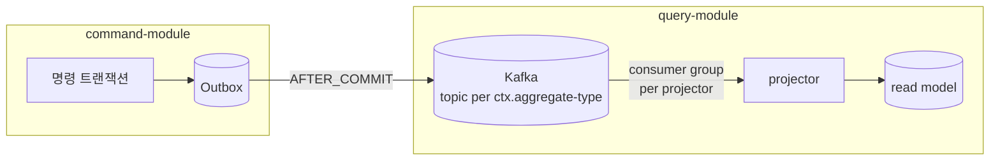
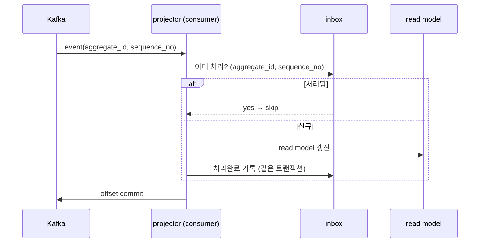

# V2 Design Doc — 07. Messaging Topology & Delivery Guarantee

- **상위 결정**: [[09.event-ordering-and-delivery-guarantee]]
- **개요**: [[00-design-overview]]
- **인접**: [[03-read-model]] · [[06-consistency-and-sagas]]
- **계승**: [[07.reservation]] (Kafka·Outbox·Zero Payload·PoisonMessage)

> command↔query 의 유일한 접점은 **이벤트(contract)** 다([[03.command-hexagonal-query-layered]]). 그 이벤트가 흐르는 길이 Kafka다. 본 문서는 토픽을 어떻게 자르고, 순서를 어디까지 보장하며, 무엇을 전달 보장하는지를 *메커니즘 수준*에서 확정한다.

> ⚠️ 본 문서는 **목표 아키텍처**다. 현재(V1) `timetable`은 단일 Outbox→Kafka 경로만 운영한다([[07.reservation]]). 토픽 분할·프로젝터 컨슈머 그룹은 [[06.strangler-migration]] 순서대로 도입한다.

## 전제: Outbox 가 발행 경계, Kafka 는 전달 경계

쓰기 트랜잭션과 발행의 원자성은 Outbox 가 책임진다([[02-write-model]] §공통). Kafka 는 그 다음 단계 — **발행된 이벤트를 query 측 프로젝터에게 나르는 전달 채널**이다. 따라서 본 문서의 보장은 "Outbox 가 이벤트를 1건 이상 발행한다"를 출발점으로 한다.

## 1. 토픽 구성 — 컨텍스트 / aggregate-type 단위

토픽은 **`<context>.<aggregate-type>` 단위**로 자른다. 예: `reservation.reservation`, `restaurant.restaurant`, `timetable.timetable`, `schedule.schedule`.

- **왜 컨텍스트/aggregate-type 단위인가**: 토픽이 곧 "스트림의 의미 경계"다. 한 aggregate-type 의 모든 이벤트가 한 토픽에 모이면, 그 토픽을 구독하는 쪽은 "그 애그리거트의 생애"를 순서대로 읽는다. event_store 의 `aggregate_type` 축([[05.event-store-mysql-table]])과 자연 정렬된다.
- **왜 이벤트-타입별 토픽이 아닌가**: `ReservationCreated`·`ReservationCancelled` 를 각각 토픽으로 자르면 한 애그리거트의 사건이 여러 토픽에 흩어져 **순서 보장이 깨진다**(아래 §2). 이벤트 타입은 토픽이 아니라 메시지의 `eventType`(`AbstractEvent`) 으로 구분한다.
- **너무 잘게 자르지 않는다(YAGNI)**: 컨텍스트당 애그리거트가 하나면 토픽도 하나다. 컨슈머가 필요 없는 타입은 무시(filter)하면 되고, 분리 비용(파티션·관리) 대비 이득이 없다.

> 토픽 목록의 확정은 도메인 이벤트 카탈로그(TBD)에 의존한다. 본 문서는 **분할 축(컨텍스트/aggregate-type)** 만 확정한다.

## 2. 파티션 키 = aggregate_id → 애그리거트별 순서 보장

메시지의 **파티션 키는 `aggregate_id`** 로 고정한다.

- Kafka 의 순서 보장은 **파티션 내부**에서만 성립한다. 같은 키는 항상 같은 파티션으로 가므로, **한 애그리거트의 이벤트들은 발행 순서대로 소비**된다(`ReservationCreated` → `ReservationConfirmed` → `ReservationCancelled` 가 뒤집히지 않음).
- 서로 다른 애그리거트 간에는 순서를 보장하지 않는다 — 그리고 **보장할 필요도 없다**. 불변식은 애그리거트 경계 안에서만 성립([[05-aggregate-design]])하므로, 교차 애그리거트 전역 순서는 도메인 요구가 아니다.

### 한계: 파티션 수 변경 = 재해싱

키→파티션 매핑은 기본적으로 `hash(key) % partitionCount` 다. **파티션 수를 늘리면 매핑이 바뀌어**, 같은 `aggregate_id` 가 이전과 다른 파티션으로 갈 수 있다. 그 순간 "예전 파티션의 미소비 이벤트"와 "새 파티션의 신규 이벤트" 사이에 순서 보장이 깨진다.

- **대응 원칙**: 파티션 수는 **고정 지향**으로 가고 보수적 초기값(일반 토픽 3, 고처리량 토픽 6~12 수준)을 둔다. 증설이 정말 필요하면 in-place 로 파티션을 늘려 재해싱하지 말고, **새 토픽으로 마이그레이션**한다(구 토픽 드레인 → 신 토픽으로 컷오버, [[RFC-003-messaging-delivery]]).
- 절대 초기값은 처리량 추정으로 잡고 증설 절차는 운영 사이클에서 확정(TBD). 본 문서는 **"파티션 수는 순서 보장의 계약 일부"** 라는 점을 못 박는다.

## 3. 프로젝터용 컨슈머 그룹과 리밸런싱

각 프로젝터(`query.<ctx>.projection`, [[03-read-model]])는 **자기 전용 컨슈머 그룹**을 가진다.

- 컨슈머 그룹이 다르면 같은 토픽을 **독립적으로** 읽는다. 즉 `reservation.reservation` 토픽을 `reservation` 프로젝터와 (식당명 비정규화가 필요한) 다른 프로젝터가 각자 자기 오프셋으로 소비한다 — pub/sub 팬아웃.
- **리밸런싱 영향**: 그룹 내 컨슈머가 추가/제거되면 파티션이 재배정된다. 재배정 중에는 짧게 소비가 멈추고, 인플라이트 메시지가 재처리될 수 있다 → **멱등 컨슈머(§4)가 전제**다. 리밸런싱을 빈번하게 만들지 않도록 컨슈머 수를 안정적으로 운영한다.
- **리밸런싱 전략 = cooperative-sticky 기본.** 기본(eager) 리밸런싱은 재배정 때 모든 컨슈머가 전 파티션을 한 번에 놓았다 다시 잡아 그룹 전체가 잠깐 멎는다("stop-the-world"). **cooperative-sticky(incremental)** 는 영향받는 파티션만 점진 이양해 정지 구간을 최소화하므로 이를 기본 전략으로 둔다([[RFC-003-messaging-delivery]]). 멱등이 안전망이라 어느 전략이든 정확성은 같지만, cooperative-sticky 는 그 안전망이 부담할 재처리량과 정지 시간을 줄인다.

### Competing consumers (그룹 내 병렬)

한 프로젝터를 수평 확장하려면 **같은 컨슈머 그룹에 인스턴스를 늘린다**. 파티션이 인스턴스들에 나뉘어 배정되어 병렬 소비(competing consumers)가 된다.

- **병렬 상한 = 파티션 수.** 인스턴스가 파티션보다 많으면 초과분은 놀고만 있는다. 이것이 §2 에서 "파티션 수를 넉넉히"의 또 다른 이유다.
- 순서 보장은 여전히 파티션 단위 → **같은 `aggregate_id` 는 한 인스턴스가 순서대로** 처리한다. 병렬화해도 애그리거트별 순서는 안전하다.

## 4. 전달 보장 — at-least-once + 멱등 → effectively-once

### 우리가 택하는 보장: at-least-once

- Outbox 의 AFTER_COMMIT 발행과 스케줄러 재시도([[02-write-model]])는 **누락보다 중복을 허용**하는 설계다. 즉 같은 이벤트가 1회 이상 도착할 수 있다.
- Kafka 소비 측도 "처리 후 오프셋 커밋" 순서라, 처리 성공·오프셋 커밋 실패 시 재소비가 일어난다 → 역시 중복 가능.

### 중복을 멱등 컨슈머/inbox 로 흡수 → effectively-once

at-least-once 의 중복은 **컨슈머가 멱등**이면 결과적으로 1회 효과(effectively-once)가 된다.

- **inbox 패턴**: 컨슈머는 처리한 이벤트의 식별자(`aggregate_id` + `sequence_no`, 또는 이벤트 ID)를 inbox(처리완료 기록)에 남기고, **이미 처리한 것은 스킵**한다. read model 갱신과 inbox 기록을 **한 트랜잭션**으로 묶어 원자화한다.
- **자연 멱등 가능 케이스**: Zero Payload([[02-write-model]])라 프로젝터가 "최신 상태를 조회해 덮어쓰기(upsert)"하는 경우, 같은 이벤트를 두 번 처리해도 결과가 같다. 이때는 inbox 없이도 멱등이 성립할 수 있다 — 단, 순서 역전(같은 애그리거트는 §2로 막힘) 가정 아래에서만.
- **inbox 생략의 자격 조건**: 그래서 inbox 생략은 "순서 역전 없음 **+** 자연 멱등 upsert"를 **동시에** 만족하는 컨슈머에만 허용한다. 둘 중 하나라도 깨지면(역전 가능 + 비-멱등 적용) 오래된 값으로 덮어쓰는 사고가 나므로 inbox를 유지한다. 어떤 프로젝터가 실제로 순서 역전 무풍지대인지는 컨슈머별로 검증한다(귀속은 운영/구현 사이클, [[RFC-003-messaging-delivery]]).
- **유지하는 inbox의 수명**: inbox는 무한히 쌓지 않는다. 보존 기간을 짧게(재처리 윈도를 덮을 만큼) 두고 주기적으로 GC 한다 — 재처리가 일어날 현실적 시간차를 지나면 그 기록은 더 이상 중복을 막을 일이 없다.

### 진짜 exactly-once 는 채택하지 않는다

Kafka 의 트랜잭셔널 producer/consumer(EOS)로 이론상 exactly-once 를 만들 수 있으나 — **우리는 채택하지 않는다.**

- **이유**: (1) Outbox→Kafka 단계가 이미 트랜잭션 밖(AFTER_COMMIT)이라 producer 측 EOS 만으로 끝나지 않고, (2) 소비 측 read model 은 외부 시스템(MySQL)이라 Kafka 트랜잭션 경계 밖이다. 진짜 EOS 는 전 구간을 Kafka 트랜잭션으로 묶어야 해 **비용·복잡도가 학습 목표 대비 과하다**(YAGNI).
- **결론**: at-least-once + 멱등으로 **effectively-once**를 만든다. "정확히 한 번 전달"이 아니라 "정확히 한 번의 효과"가 목표다.

## 5. 보장 성립 조건 — 그레이스풀 셧다운과 인플라이트 드레인

위 보장은 **종료가 깔끔할 때만** 성립한다. 막무가내 종료(SIGKILL·OOM)는 인플라이트 메시지를 어중간한 상태로 남긴다.

- **command 측**: 셧다운 시 진행 중 트랜잭션을 마치고, Outbox 발행 스케줄러를 멈춘다. 미발행분은 다음 기동 때 재발행(at-least-once 보존).
- **query 측(프로젝터)**: 셧다운 시 **현재 폴링한 배치를 끝까지 처리하고 오프셋을 커밋한 뒤** 종료한다(인플라이트 드레인). 드레인 없이 죽으면 미커밋 오프셋이 재소비되는데, 이는 멱등(§4)으로 흡수되므로 **안전하되 비효율** — 그래서 드레인으로 재처리량을 줄인다.
- **리밸런싱 직전**도 동일 — 파티션을 내놓기 전에 진행분을 커밋(또는 멱등에 위임)한다.

> 한 줄: **멱등은 안전망, 드레인은 효율.** 둘 다 있어야 effectively-once 가 비용 없이 성립한다.

## 6. 백프레셔와 consumer lag

- **consumer lag** = 토픽의 최신 오프셋과 컨슈머 커밋 오프셋의 차 = read model 의 **최종 일관성 지연**([[03-read-model]] §일관성)의 직접 지표다. lag 모니터링이 곧 "읽기 신선도" 모니터링이다.
- **백프레셔**: 프로젝터가 못 따라가면 lag 가 쌓인다. 대응은 (1) competing consumers 로 병렬 확장(§3, 상한=파티션 수), (2) 프로젝션 갱신 자체를 가볍게(Zero Payload upsert), (3) 그래도 모자라면 파티션 증설(§2 한계 감수, 정지 후).
- Kafka 는 디스크에 보존하므로 컨슈머가 느려도 producer 를 막지 않는다(브로커가 버퍼). 즉 백프레셔는 "command 가 느려지는" 문제가 아니라 "읽기가 늦어지는" 문제다 — CQRS 의 의도된 비대칭과 정합.
- **lag 임계·SLI 단일화는 별도 관측 RFC로 분리.** lag 을 핵심 SLI 로 본다는 *전제*(메커니즘)는 여기서 깔되, warn/crit 임계 절대값과 [[RFC-008-observability]]·[[RFC-007-deployment-infra-ops]] SLI 체계와의 단일화는 [[03-read-model]] 프로젝션 지연과 한 지표라 함께 다뤄야 한다 — 그래서 메시징 문서가 독립적으로 닫지 않고 **관측 RFC로 모아 확정**한다([[RFC-003-messaging-delivery]] §별도 RFC로 분리). 메시징 문서는 별도 lag 지표를 따로 만들지 않는다.
- 동기 프로젝션 예외(특정 화면만 읽기 직후 일관성 요구)는 운영/구현 사이클에서 정의(TBD).

## 7. 멱등으로 못 막는 것 — 외부 부수효과

§4 의 멱등은 **상태 수렴**에 대한 보장이다. upsert 는 재적용해도 같은 상태로 수렴하니 중복이 거저 흡수된다. 문제는 그렇게 흡수되지 않는 **부수효과**다 — 알림 발송, 외부 결제 연동([[06-consistency-and-sagas]]) 같은 건 at-least-once 재처리에서 **두 번 발사**된다. 알림이 두 통 가고, 결제가 두 번 일어난다. read model upsert 와 달리 "두 번 해도 같다"가 성립하지 않는다.

단일 해법은 없고 부수효과의 성격을 따라 갈래가 나뉜다. 기본값은 **"모든 비-멱등 부수효과는 디듀프나 outbox로 감싼다"**이고, 수동 보정은 예외다.

- **디듀프 테이블(기본)**: 멱등키(이벤트 ID 또는 비즈니스 키)를 PK로 갖는 테이블에 시도를 기록하고, 같은 키의 두 번째 시도는 무시한다. 부수효과를 자기 트랜잭션에 묶을 수 있을 때.
- **부수효과 outbox**: 외부 시스템 연동처럼 자기 트랜잭션에 묶을 수 없는 건 별도 outbox 로 빼서 발행 자체를 한 번만 보장한다. relay 를 하나 더 늘리는 비용이 있으므로(§8), 부수효과 유형별 귀속은 운영/구현 사이클에서 가른다([[RFC-003-messaging-delivery]]).
- **수동 보정**: 자동 보정이 불가능한 잔여만 운영 절차로 남긴다.

## 8. 발행 relay — 단일성과 폴링/CDC

### relay 의 단일성 (중복 발행 방지)

command DB 의 Outbox 를 Kafka 로 잇는 relay 는 가용성을 위해 여러 인스턴스로 뜬다([[09-deployment-runtime]]). 그러면 같은 outbox 행을 두 인스턴스가 동시에 집어 **중복 발행**할 수 있다. 막는 길은 둘 — leader election 으로 하나만 일하게 하거나, `SELECT … FOR UPDATE SKIP LOCKED` 로 행을 잠그며 경쟁 소비하거나.

- **택: `SKIP LOCKED`.** relay 가 이미 DB 에 붙어 있으니, **DB 가 직렬화를 대신 해주게** 한다. 여러 relay 인스턴스가 서로 잠기지 않은 행만 집어가니 중복 없이 경쟁 소비가 된다.
- leader election 은 코디네이터(주키퍼/etcd 류)와 리더 교체 로직이라는 운영 짐을 새로 진다. **별도 코디네이터가 필요 없다**는 게 `SKIP LOCKED` 의 결정적 이점이다.
- 단, 중복 발행을 완전히 0 으로 만드는 건 아니다(발행 후 커밋 전 장애). 그래서 §4 의 소비 측 멱등이 여전히 최종 안전망이다 — relay 단일성은 "중복을 줄이는" 장치이지 at-least-once 전제를 뒤집지 않는다.

### 폴링으로 시작, CDC 는 트리거로

relay 가 outbox 를 읽는 방식은 폴링과 CDC(Debezium) 두 갈래다. CDC 는 듀얼 라이트를 없애고 지연도 줄지만, Kafka Connect 클러스터를 운영하는 성숙도 비용이 든다([[12.kafka-hosting-msk-vs-self-managed]]).

- **택: 폴링 relay 로 시작.** 초기 트래픽에서 Connect 운영비를 먼저 무는 건 과투자다(YAGNI).
- CDC 전환은 "언젠가"가 아니라 명시적 **전환 트리거**로 못 박는다 — (1) 폴링 지연이 SLI 를 위협하거나, (2) 듀얼 라이트 제거가 정합성 요구로 올라오거나, (3) Connect 운영 성숙도가 충분해질 때. 트리거를 명시하지 않으면 폴링이 영구 부채로 굳는다([[RFC-003-messaging-delivery]]).
- relay 단일성·CDC 전환 기준은 필요 시 신규 ADR 로 분리한다.

## 9. 실패 메시지의 운영 루프 — DLQ

처리에 실패하는 poison message 는 무한 재시도로 파티션을 막거나, 조용히 버려져선 안 된다. V1 의 PoisonMessage·스케줄러 재처리([[07.reservation]])를 계승해 단계를 둔다.

- **즉시 3회 재시도 → 지수 백오프 → DLQ 격리.** 재시도로 풀리는 일시 장애는 즉시 흡수하고, 안 풀리면 백오프로 파티션 점유를 풀어준 뒤 DLQ 로 옮긴다.
- **DLQ 격리 후엔 메시지 채널(예: Slack)로 알람 발송 + 기본 수동 재생.** DLQ가 조용히 쌓이면 의미가 없으므로 사람이 즉시 인지할 채널로 밀어낸다. 자동 재생은 원인이 일시적임을 확신할 수 있을 때만이라 기본값으로 두지 않는다.
- 재시도 횟수·백오프 곡선·자동 재생 조건의 구체 값은 운영/구현 사이클에서 튜닝(TBD).

## 10. 토픽 retention 과 재구축의 진실 원천

토픽을 얼마나 오래 보관할지는 **재구축을 어디서 하느냐**와 묶여 있다.

- read model 을 토픽 처음부터 다시 흘려 재구축하려면 retention 이 그만큼 길어야 한다. 하지만 V2 에서 진실 원천은 **이벤트 스토어**다([[02-write-model]]) — 토픽은 전달 채널일 뿐 영속 기록이 아니다.
- 그러니 **토픽 retention 은 짧게** 두고, 재구축은 **스토어 리플레이**로 한다([[RFC-011-projection-rebuild-catchup]] 재구축 소스와 정합). 토픽이 재구축의 소스가 아니므로 길게 보관할 이유가 없다.
- 예외: 상태성 lookup 토픽처럼 **"최신 상태"가 의미를 갖는 것**만 `log compaction` 을 쓴다(키별 최신값만 보존).
- 짧은 retention 의 구체 기간·compaction 대상 토픽 식별은 운영/구현 사이클에서(TBD, [[RFC-003-messaging-delivery]]).

## 11. 무엇을 Kafka 로 내보내는가 — 통합 이벤트

§1 의 토픽으로 나가는 것은 내부 도메인 이벤트가 아니라 **통합 이벤트(published language)**다.

- **내부 도메인 이벤트와 분리한다.** 내부 모델을 그대로 흘리면 내부 변경이 외부 컨슈머를 깨뜨린다([[02-write-model]]). Kafka 경계로 나가는 건 외부 계약으로 안정화한 통합 이벤트뿐이다.
- **페이로드 모양(thin/fat)·직렬화 규약·스키마 버저닝은 별도 RFC로 분리.** 통합 이벤트라는 *경계*는 여기서 확정하되, 그 *모양*은 결합도·스키마 진화가 얽혀 단독 결론이 어렵다 — [[10.event-schema-evolution]]·소비자 계약 테스트([[11-environments-and-testing]])와 묶어 전용 RFC에서 다룬다([[RFC-003-messaging-delivery]] §별도 RFC로 분리). thin 지향(id+핵심 필드, Zero Payload 계열 [[07.reservation]])이라는 방향성만 잠정 전제로 깐다.

## 관련 문서
- [[00-design-overview]] · [[03-read-model]] · [[06-consistency-and-sagas]] · [[02-write-model]] · [[RFC-011-projection-rebuild-catchup]]
- RFC: [[RFC-003-messaging-delivery]]
- ADR: [[09.event-ordering-and-delivery-guarantee]] · [[05.event-store-mysql-table]] · [[03.command-hexagonal-query-layered]] · [[12.kafka-hosting-msk-vs-self-managed]]
- 계승: [[07.reservation]]
