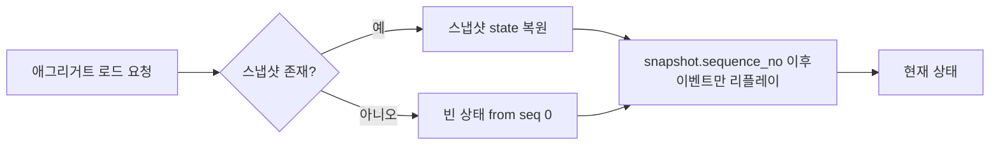
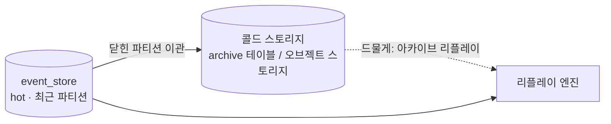
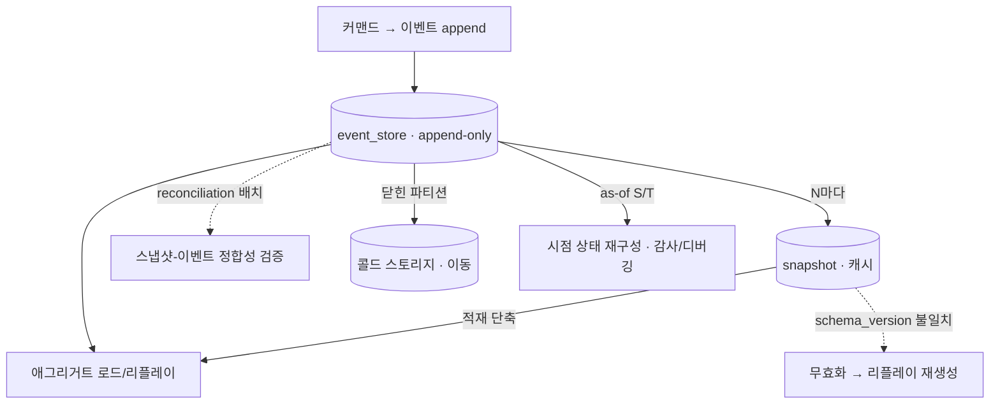

# V2 Design Doc — 08. Event Store Lifecycle

- **상위 결정**: [[05.event-store-mysql-table]] · [[02.selective-event-sourcing-scope]]
- **개요**: [[00-design-overview]] · **쓰기 모델**: [[02-write-model]]
- **계승**: [[07.reservation]] (Snapshot 패턴·Outbox)

> 이벤트 스토어는 "쓰고 잊는 로그"가 아니라 **살아있는 자산**이다. append-only라 영구히 자라고, 스키마는 진화하며, 감사·디버깅은 과거 시점을 다시 묻는다. 본 문서는 ES 컨텍스트(`reservation`·`timetable`·`restaurant`)의 이벤트 스토어를 *시간 축에서 어떻게 운영하는가*를 다룬다.

## 0. 출발점: append-only의 대가

[[05.event-store-mysql-table]]의 `event_store` 테이블은 한번 쓰면 수정·삭제하지 않는다. 이 불변성이 ES의 가치(완전한 이력·재구성)를 만들지만, 동시에 네 가지 운영 부담을 청구한다.

1. **리플레이 비용** — 애그리거트 하나를 복원하려고 수천 이벤트를 읽는다 → 스냅샷.
2. **영구 성장** — 테이블이 끝없이 커진다 → 파티셔닝·아카이빙.
3. **스키마 진화** — 페이로드 모양이 바뀐다 → 스냅샷 무효화·업캐스팅.
4. **시점 질의** — "그때 그 상태"를 묻는다 → temporal/as-of 조회.

본 문서는 이 넷을 *메커니즘 수준*에서 확정한다. 구체 수치(스냅샷 주기 N, 파티션 단위, 보존 기간)는 부하를 보고 구현 사이클에서 튜닝한다.

## 1. 스냅샷 전략

리플레이는 정확하지만 느리다. 스냅샷은 "여기까지의 상태"를 직렬화해 저장해, 리플레이의 시작점을 끌어올린다.

### 1.1 저장 모델

```
snapshot(
  aggregate_type, aggregate_id,
  sequence_no,            -- 이 스냅샷이 반영한 마지막 이벤트의 sequence_no
  schema_version,         -- 스냅샷 직렬화 스키마 버전
  state(JSON),            -- 애그리거트 상태 직렬화
  created_at
)
-- (aggregate_id) 당 최신 1개 유지가 기본. 디버깅 위해 N개 보관도 선택지.
```

> [[07.command-domain-jpa-separation]] 정합: 스냅샷은 **인프라 레코드이지 애그리거트의 필드 거울이 아니다**. 도메인은 `@Entity`를 모르며, 스냅샷 직렬화/역직렬화는 `adapter/out`의 책임이다.

### 1.2 적재(load) 경로



- 스냅샷의 `sequence_no` **이후** 이벤트만 읽어 `apply` 한다([[02-write-model]] §A).
- 스냅샷이 없거나 무효면 seq 0부터 전체 리플레이로 폴백 — **정합성의 진실은 언제나 이벤트 스트림**이고 스냅샷은 캐시일 뿐이다.

### 1.3 생성 트리거 — N 이벤트마다

- 애그리거트 커밋 후, `현재 sequence_no - 마지막 스냅샷 sequence_no >= N` 이면 새 스냅샷을 비동기로 갱신한다.
- **N은 TBD**(초안 50~100). 작으면 저장·쓰기 부담, 크면 리플레이 길이. 부하 측정 후 컨텍스트별로 조정.
- 스냅샷 생성 실패는 **치명적이지 않다** — 다음 적재가 더 긴 리플레이를 할 뿐, 정합성은 깨지지 않는다. 동기 경로에 넣지 않는다.

### 1.4 스키마 변경 시 무효화·재생성

스냅샷은 애그리거트 상태 모양에 묶인다. 도메인 상태 구조나 직렬화 포맷이 바뀌면 옛 스냅샷은 잘못 역직렬화될 수 있다.

- 스냅샷에 `schema_version` 을 박는다. 코드의 현재 버전과 다르면 **그 스냅샷을 무효 취급**하고 무시한다.
- 무효 스냅샷은 **이벤트 리플레이로 안전하게 재생성**된다 — 삭제·마이그레이션이 강제되지 않는다. 이벤트(진실) → 새 코드의 `apply` → 새 스키마 스냅샷.
- 이벤트 페이로드 자체의 진화는 별개 문제다. `event_version`([[05.event-store-mysql-table]])과 **업캐스팅**(낡은 버전 이벤트를 읽는 시점에 최신 모양으로 변환)으로 흡수한다. 카탈로그·업캐스터 목록은 TBD([[02-write-model]] §도메인 이벤트 카탈로그).

### 1.5 스냅샷-이벤트 정합성 검증

스냅샷은 캐시이므로 *틀릴 수 있다*는 전제로 운영한다.

- **재구성 검증(reconciliation)**: 주기적 배치가 표본 애그리거트를 두 경로로 복원한다 — ① 스냅샷+증분 리플레이, ② seq 0 전체 리플레이. 불일치면 스냅샷을 폐기·재생성하고 경보.
- **불변식**: `snapshot.sequence_no <= max(event_store.sequence_no)` 가 항상 성립해야 한다. 위반(이벤트보다 앞선 스냅샷)은 데이터 손상 신호.
- 검증 빈도·표본률은 TBD. 학습 목표상 "스냅샷은 신뢰하되 검증한다"는 패턴 확립이 핵심.

## 2. 보존·아카이빙 — 영구 성장 다루기

append-only는 영원히 자란다. 핫 데이터(최근·활성 애그리거트)와 콜드 데이터(종료·과거)를 분리해 핫 경로 성능을 지킨다.

### 2.1 파티셔닝

- `event_store`·`snapshot` 을 **시간 기준(`occurred_at` 월/분기)** 으로 파티셔닝하는 것을 1순위로 검토. 오래된 파티션은 통째로 콜드 이동/드롭 가능.
- 대안: `aggregate_type` 기준 분리(컨텍스트별 테이블/스키마) — 컨텍스트마다 성장 속도가 다르므로(`timetable` ≫ `restaurant`) 운영상 유리할 수 있다.
- 파티션 키 선정은 **리플레이 접근 패턴**을 깬다: 리플레이는 `aggregate_id` 단위 풀 스캔이므로 `(aggregate_id, sequence_no)` 인덱스([[05.event-store-mysql-table]])는 파티션 안에서 유지돼야 한다. 시간 파티셔닝과 aggregate 단위 조회의 궁합은 측정 후 확정. **TBD**.

### 2.2 콜드 스토리지·아카이빙



- 종료된 애그리거트(예: 오래전 완료/취소된 `reservation`)의 이벤트는 콜드 스토리지로 이관한다. **삭제가 아니라 이동** — append-only 불변성·감사성 유지.
- 이관 후에도 원칙적으로 리플레이는 가능해야 한다(감사·분쟁 대응). 단 콜드 경로는 느려도 된다.
- 활성 스냅샷이 있는 애그리거트는 이관 대상에서 제외(핫 유지). 종료 판정 기준은 컨텍스트 도메인이 정의 — **TBD**.

### 2.3 리플레이 성능 가드레일

- 일상 적재는 **스냅샷+증분**으로 리플레이 길이를 N 이하로 묶는다(§1.3).
- 전체 리플레이(스냅샷 폐기/검증/프로젝션 재구축)는 **배치·오프피크** 작업으로 분리. 핫 경로에서 seq 0 전체 리플레이가 일어나면 안 된다.
- 프로젝션 재구축([[03-read-model]])도 이벤트 스토어 전체 스캔이므로 같은 가드레일 적용 — 콜드 파티션 포함 여부를 재구축 목적에 따라 선택.

## 3. Temporal / As-of 조회

ES의 보상: 과거 어느 시점이든 상태를 되살릴 수 있다. 감사·디버깅·분쟁 대응의 핵심 능력이다.

### 3.1 메커니즘

- **as-of sequence**: `sequence_no <= S` 인 이벤트만 `apply` → "S번째 이벤트 직후" 상태.
- **as-of time**: `occurred_at <= T` 인 이벤트만 `apply` → "시점 T의 상태". (동률 `occurred_at`은 `sequence_no`로 결정적 정렬)
- 스냅샷 활용: `snapshot.sequence_no <= S` 인 최신 스냅샷에서 출발해 S까지 증분 리플레이 → 시점 질의도 단축.

```kotlin
// 개념 예시 — 실제 시그니처는 구현 사이클에서 확정
fun loadAsOf(aggregateId: AggregateId, atSequence: Long): Aggregate {
    val base = snapshotStore.latestBefore(aggregateId, atSequence) // 없으면 빈 상태
    val events = eventStore.read(aggregateId, after = base.sequenceNo, upTo = atSequence)
    return events.fold(base.state) { state, e -> state.apply(e) }
}
```

### 3.2 용도와 경계

- **감사·디버깅 전용**으로 둔다. 일상 조회는 [[03-read-model]]의 프로젝션이 담당하며, temporal 조회를 프로덕션 읽기 경로에 노출하지 않는다(YAGNI — 시점 이력 화면 요구가 실제로 생기면 그때 프로젝션화).
- 콜드로 이관된 구간의 as-of 조회는 느릴 수 있음을 허용(§2.2).
- 시점 질의 노출 범위(운영 도구 한정 vs API)는 **TBD**.

## 4. 종합: 수명주기 한 장



## TBD (구현 사이클로)

- 스냅샷 주기 `N`, 스냅샷 보관 개수(최신 1 vs N).
- 파티션 키(시간 vs `aggregate_type`)와 핫/콜드 경계, 종료 애그리거트 판정 기준.
- reconciliation 빈도·표본률.
- 이벤트 업캐스팅 카탈로그(페이로드 진화) — 이벤트 카탈로그 확정 의존([[02-write-model]]).
- temporal 조회 노출 범위.

> 본 문서는 [[05.event-store-mysql-table]]가 "무엇으로 저장하나"를 정한 데 이어, "그 저장소를 시간 축에서 어떻게 살리나"를 정한다. PII 삭제 불가 문제(GDPR)는 append-only의 또 다른 대가이며 [[11.es-pii-crypto-shredding]]에서 별도로 다룬다.

## 관련 문서
- [[00-design-overview]] · [[02-write-model]] · [[03-read-model]]
- ADR: [[05.event-store-mysql-table]] · [[02.selective-event-sourcing-scope]] · [[11.es-pii-crypto-shredding]]
- 계승: [[07.reservation]]
