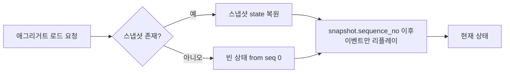
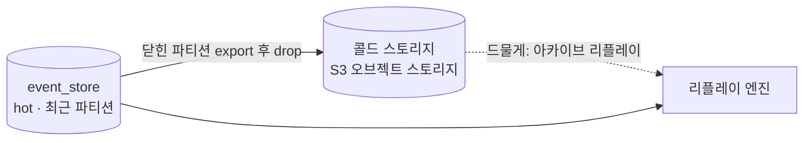
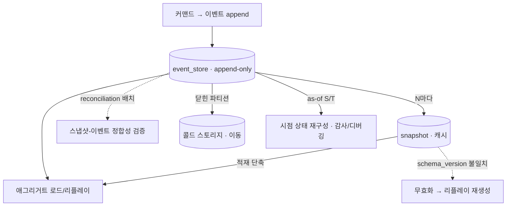

# V2 Design Doc — 08. Event Store Lifecycle

- **상위 결정**: [[05.event-store-mysql-table]] · [[02.selective-event-sourcing-scope]]
- **개요**: [[00-design-overview]] · **쓰기 모델**: [[02-write-model]]
- **계승**: [[07.reservation]] (Snapshot 패턴·Outbox)

> 이벤트 스토어는 "쓰고 잊는 로그"가 아니라 **살아있는 자산**이다. append-only라 영구히 자라고, 스키마는 진화하며, 감사·디버깅은 과거 시점을 다시 묻는다. 본 문서는 ES 컨텍스트(`reservation`·`timetable`·`restaurant`)의 이벤트 스토어를 *시간 축에서 어떻게 운영하는가*를 다룬다.

## 0. 출발점: append-only의 대가

[[05.event-store-mysql-table]]의 `event_store` 테이블은 한번 쓰면 수정·삭제하지 않는다. 이 불변성이 ES의 가치(완전한 이력·재구성)를 만들지만, 동시에 네 가지 운영 부담을 청구한다.

1. **리플레이 비용** — 애그리거트 하나를 복원하려고 수천 이벤트를 읽는다 → 스냅샷.
2. **영구 성장** — 테이블이 끝없이 커진다 → 파티셔닝·아카이빙.
3. **스키마 진화** — 페이로드 모양이 바뀐다 → 스냅샷 무효화·업캐스팅.
4. **시점 질의** — "그때 그 상태"를 묻는다 → temporal/as-of 조회.

본 문서는 이 넷을 *메커니즘 수준*에서 확정한다. 구체 수치(스냅샷 주기 N, 파티션 단위, 보존 기간)는 부하를 보고 구현 사이클에서 튜닝한다.

## 1. 스냅샷 전략

리플레이는 정확하지만 느리다. 스냅샷은 "여기까지의 상태"를 직렬화해 저장해, 리플레이의 시작점을 끌어올린다.

### 1.1 저장 모델

```
snapshot(
  aggregate_type, aggregate_id,
  sequence_no,            -- 이 스냅샷이 반영한 마지막 이벤트의 sequence_no
  schema_version,         -- 스냅샷 직렬화 스키마 버전
  state(JSON),            -- 애그리거트 상태 직렬화
  created_at
)
-- (aggregate_id) 당 핫 DB엔 최신 1개. 밀려난 직전본은 S3 Glacier로 이관(콜드). 진실은 이벤트, 스냅샷은 버릴 수 있는 캐시.
```

> **보관: 핫 DB엔 최신 1개, 밀려난 직전본은 S3 Glacier로 이관**([[RFC-004-event-store-schema-evolution]]). 핫에 최근 N개를 쌓는 선택지는 버린다 — 스냅샷은 진실 원천이 아니라 버릴 수 있는 최적화이고, 활성 경로가 여러 개를 들 이유가 없다(과거 시점이 필요하면 이벤트 리플레이, §3). 다만 덮어쓸 때 직전 스냅샷을 *버리지 않고* Glacier로 이관해 디버깅·롤백·감사용 콜드 아카이브로 둔다(콜드=S3와 같은 결, §2.2 — DB 용량·백업 부담은 지지 않는다). 안전 교체는 **현재+직전 2-슬롯 토글**로 원자화하고, 교체 확정 시 밀려난 슬롯을 Glacier로 export한다. 정합성 의존이 아니라 편의 — 진실은 여전히 이벤트다.

> [[07.command-domain-jpa-separation]] 정합: 스냅샷은 **인프라 레코드이지 애그리거트의 필드 거울이 아니다**. 도메인은 `@Entity`를 모르며, 스냅샷 직렬화/역직렬화는 `adapter/out`의 책임이다.

### 1.2 적재(load) 경로



- 스냅샷의 `sequence_no` **이후** 이벤트만 읽어 `apply` 한다([[02-write-model]] §A).
- 스냅샷이 없거나 무효면 seq 0부터 전체 리플레이로 폴백 — **정합성의 진실은 언제나 이벤트 스트림**이고 스냅샷은 캐시일 뿐이다.

### 1.3 생성 트리거 — N 이벤트마다

- 애그리거트 커밋 후, `현재 sequence_no - 마지막 스냅샷 sequence_no >= N` 이면 새 스냅샷을 비동기로 갱신한다.
- **N은 기본 100, `aggregate_type`별로 설정 가능**([[RFC-004-event-store-schema-evolution]]). 작으면 저장·쓰기 부담, 크면 리플레이 길이 — 트레이드오프 곡선이라 절대값은 책상에서 정하지 않는다. **재검토 트리거**: 재구성 p99 > 50ms이면 k6 스윕([[11-environments-and-testing]] §5.4)으로 N을 조정한다.
- 예약 애그리거트는 한 스트림이 짧아 `N=100`이면 스냅샷이 사실상 거의 안 찍힌다 — 단점이 아니라 의도다(짧은 스트림에 공격적으로 스냅샷을 찍는 건 과최적화). 장수 애그리거트가 섞이면 타입별 기본값을 더 잘게 나눌 수 있고, 그 비중은 측정으로 확인한다.
- 스냅샷 생성 실패는 **치명적이지 않다** — 다음 적재가 더 긴 리플레이를 할 뿐, 정합성은 깨지지 않는다. 동기 경로에 넣지 않는다.

### 1.4 스키마 변경 시 무효화·재생성

스냅샷은 애그리거트 상태 모양에 묶인다. 도메인 상태 구조나 직렬화 포맷이 바뀌면 옛 스냅샷은 잘못 역직렬화될 수 있다.

- 스냅샷에 `schema_version` 을 박는다. 코드의 현재 버전과 다르면 **그 스냅샷을 무효 취급**하고 무시한다.
- 무효 스냅샷은 **이벤트 리플레이로 안전하게 재생성**된다 — 삭제·마이그레이션이 강제되지 않는다. 이벤트(진실) → 새 코드의 `apply` → 새 스키마 스냅샷.
- **스냅샷은 업캐스팅하지 않는다 — 폐기 후 재생성으로 확정**([[RFC-004-event-store-schema-evolution]]). 스냅샷이 "버릴 수 있는 최적화"인 이상(§1.1), 포맷이 바뀌었을 때 굳이 업캐스팅 코드를 둘 이유가 없다. 배경에서 이벤트를 다시 재생해 새 포맷으로 찍으면 된다. **업캐스팅은 이벤트에만 둔다.**
- 이벤트 페이로드 자체의 진화는 별개 문제다. in-place 마이그레이션은 기각하고([[10.event-schema-evolution]]), `event_version`([[05.event-store-mysql-table]])과 **읽기 시 업캐스팅**(낡은 버전 이벤트를 읽는 시점에 최신 모양으로 변환)으로 흡수한다. (업캐스터·eventType 매핑·스키마 레지스트리의 결정 근거는 **[[RFC-023-event-schema-evolution]]**로 분리.)

#### 업캐스터·eventType 레지스트리 — 명시 등록

옛 이벤트를 새 코드로 읽는 장치는 **어노테이션 스캔이 아니라 명시 등록 레지스트리 빈**으로 잡는다([[RFC-023-event-schema-evolution]] · [[10.event-schema-evolution]]). 업캐스터는 데이터 정합성에 직결되는 코드라 "어디선가 스캔돼 등록됐겠지"보다 "여기 다 적혀 있다"가 안전하다.

- **업캐스터**: `(eventType, fromVersion)`을 키로 명시 등록하고, 애플리케이션 시작 시 키 충돌을 탐지해 **빠르게 실패**시킨다.
- **eventType↔클래스 매핑**: `@JsonTypeName` 스캔을 배제하고 명시 등록 빈으로 잡는다. 논리명을 클래스에 묶어두면 클래스명을 리팩터링하는 순간 저장된 이벤트의 디스크리미네이터가 흔들린다 — 명시 매핑이 "이 논리명은 이 클래스"라는 계약을 한곳에 박아 클래스명 변경으로부터 분리한다.
- **스키마 레지스트리(Avro/Protobuf)는 YAGNI 보류.** 외부·폴리글랏 컨슈머가 이 이벤트를 직접 역직렬화·구독한다는 게 증명되기 전까지는 스키마 계약을 우리 업캐스터가 들고 있는 게 더 싸고 통제 가능하다. 도입 시 별도 ADR.

### 1.5 스냅샷-이벤트 정합성 검증

스냅샷은 캐시이므로 *틀릴 수 있다*는 전제로 운영한다.

**2겹 검증으로 확정한다**([[RFC-004-event-store-schema-evolution]]).

- **① 인라인 검증** — 스냅샷을 만든 직후 한 번 검증한다. 저비용이고 항상 돈다.
- **② 배경 표본 검증(reconciliation)** — 주기적 배치가 표본 애그리거트를 두 경로로 복원해 맞춰 본다: ㉠ 스냅샷+증분 리플레이, ㉡ seq 0 전체 리플레이. 시간이 지나며 누적되는 드리프트를 조기에 잡는다.
- 불일치가 잡히면 그 스냅샷을 **폐기하고 이벤트 리플레이로 재생성**하며(§1.4 무효화와 같은 처방) 경보를 띄운다.
- **불변식**: `snapshot.sequence_no <= max(event_store.sequence_no)` 가 항상 성립해야 한다. 위반(이벤트보다 앞선 스냅샷)은 데이터 손상 신호.
- 표본률·주기의 구체 값은 운영 측정에 맡긴다. 학습 목표상 "스냅샷은 신뢰하되 검증한다"는 패턴 확립이 핵심.

## 2. 보존·아카이빙 — 영구 성장 다루기

append-only는 영원히 자란다. 핫 데이터(최근·활성 애그리거트)와 콜드 데이터(종료·과거)를 분리해 핫 경로 성능을 지킨다.

### 2.1 파티셔닝

- **시간(생성월) 파티셔닝으로 확정**([[RFC-004-event-store-schema-evolution]]). 오래된 파티션은 통째로 콜드 이동/드롭한다.
- 핵심 근거는 예약 애그리거트의 수명이 짧다는 것이다. 수명이 짧으면 한 스트림이 한두 파티션에 모이고, 따라서 핫패스 리플레이가 파티션 경계를 거의 넘지 않는다. 시간 축의 이득(옛 파티션을 통째로 drop·이관)은 그대로 가져가면서 핫패스 손해는 거의 없다. 스트림 조회는 `(aggregate_id, sequence_no)` 인덱스([[05.event-store-mysql-table]])로 커버하며, 이 인덱스는 파티션 안에서 유지돼야 한다.
- `aggregate_type` 기준 분리는 채택하지 않는다 — 보존·아카이빙의 자연스러운 축은 시간이고, 핫패스 조회는 위 인덱스로 충분히 덮인다. (이의 여지: 장수 애그리거트의 비중이 전제를 흔들 만큼 크면 다시 본다 — 측정으로 확인.)

### 2.2 콜드 스토리지·아카이빙



- **콜드 스토리지는 S3(오브젝트 스토리지)로 확정**([[RFC-004-event-store-schema-evolution]]). 흐름은 — 식은 시간 파티션을 S3로 export한 뒤 drop하고, 드물게 복원이 필요하면 로드해서 리플레이한다. **삭제가 아니라 이동** — append-only 불변성·감사성 유지. 같은 DB의 아카이브 테이블은 결국 같은 인스턴스의 용량·백업 부담을 계속 지므로 콜드에는 그럴 가치가 없어 배제한다. 검증은 localstack S3로 한다([[RFC-009-testing-quality-gates]]).
- 이관 후에도 원칙적으로 리플레이는 가능해야 한다(감사·분쟁 대응). 단 콜드 경로는 느려도 된다.
- **핫/콜드 경계는 도메인 종결 상태 + 유예 기간으로 판정**한다. 미종결이거나 유예 안에 있으면 핫, 종결됐고 유예가 지났으면 콜드(유예 = 감사·분쟁 윈도우, 예: 종결 +90일). "어떤 상태가 종결인가"는 RFC 단계에서 카탈로그를 확정할 필요 없이 경계 기준의 형태(상태+유예)만 합의하면 되고, 컨텍스트별 종결 상태 목록은 각 도메인 작업에서 채운다. 활성 스냅샷이 있는 애그리거트는 이관 대상에서 제외(핫 유지).
- **PII 셰딩과 콜드 경로**: 콜드로 빠진 이벤트도 키 삭제 *한 번*으로 같이 셰딩돼야 하므로([[RFC-005-pii-security]]), 정합 규칙은 — **콜드(S3) 본문은 이관하되 셰딩 키는 핫 키 저장소에 영속(콜드 이관 금지); 콜드 이벤트 재생 시 핫 키 저장소를 참조해 복호**([[RFC-004-event-store-schema-evolution]]·[[RFC-005-pii-security]] 공동, [[15-pii-security]] §4와 동일 문구). 콜드엔 풀 수 없는 암호문만 가고 키는 핫 경로 전용 키 저장소에 남으므로, 키 저장소에서 키를 지우는 한 번의 동작이 핫·콜드를 가리지 않고 셰딩을 성립시킨다(키/blind index 본체는 [[11.es-pii-crypto-shredding]]). 콜드 본문 복호가 핫 키 저장소를 참조하는 결합도와 S3 이관 설계 정합은 Design에서 검증 — **TBD**.

### 2.3 리플레이 성능 가드레일

- 일상 적재는 **스냅샷+증분**으로 리플레이 길이를 N 이하로 묶는다(§1.3).
- 전체 리플레이(스냅샷 폐기/검증/프로젝션 재구축)는 **배치·오프피크** 작업으로 분리. 핫 경로에서 seq 0 전체 리플레이가 일어나면 안 된다.
- 프로젝션 재구축([[03-read-model]])도 이벤트 스토어 전체 스캔이므로 같은 가드레일 적용 — 콜드 파티션 포함 여부를 재구축 목적에 따라 선택. 스캔은 `ORDER BY global_seq`로 **열거·재개**한다([[22.event-identity-and-global-ordering]]) — 이는 진행 커서이지 교차-애그리거트 순서 보장이 아니며, 프로젝터 정확성은 per-aggregate 순서+멱등+버전 가드가 진다([[RFC-011-projection-rebuild-catchup]]).

## 3. Temporal / As-of 조회

ES의 보상: 과거 어느 시점이든 상태를 되살릴 수 있다. 감사·디버깅·분쟁 대응의 핵심 능력이다.

### 3.1 메커니즘

- **as-of sequence**: `sequence_no <= S` 인 이벤트만 `apply` → "S번째 이벤트 직후" 상태.
- **as-of time**: `occurred_at <= T` 인 이벤트만 `apply` → "시점 T의 상태". (단일 애그리거트 내 동률 `occurred_at`은 `sequence_no`로 결정적 정렬. 교차-애그리거트 시점 스냅이 필요하면 `global_seq <= G`가 결정적 기준 — [[22.event-identity-and-global-ordering]].)
- 스냅샷 활용: `snapshot.sequence_no <= S` 인 최신 스냅샷에서 출발해 S까지 증분 리플레이 → 시점 질의도 단축.

```kotlin
// 개념 예시 — 실제 시그니처는 구현 사이클에서 확정
fun loadAsOf(aggregateId: AggregateId, atSequence: Long): Aggregate {
    val base = snapshotStore.latestBefore(aggregateId, atSequence) // 없으면 빈 상태
    val events = eventStore.read(aggregateId, after = base.sequenceNo, upTo = atSequence)
    return events.fold(base.state) { state, e -> state.apply(e) }
}
```

### 3.2 용도와 경계

- **운영·디버깅 한정을 기본으로 확정**([[RFC-004-event-store-schema-evolution]]). 일상 조회는 [[03-read-model]]의 프로젝션이 담당하며, temporal 조회를 프로덕션 읽기 경로(일반 API)에 노출하지 않는다 — 제품 화면이 정말 시점 이력을 요구한다는 증거가 나오기 전에 일반 API로 열면 인덱스·성능·권한 비용만 미리 진다. 화면 요구가 증명되면 그때 프로젝션화로 다시 본다(YAGNI).
- 콜드로 이관된 구간의 as-of 조회는 느릴 수 있음을 허용(§2.2).

## 4. 재해 복구 — append-only 위에서 복원이 무엇을 뜻하나

> 근거·기각된 대안은 [[RFC-017-disaster-recovery-event-store]]. RTO/RPO·백업 보존 주기·런북 같은 운영 수치는 이 문서 밖이다(T-18 운영 백로그). 여긴 *복구 의미론*과 불변식만 잠근다.

### 4.1 보호 대상은 이벤트 스토어 한 곳

V1은 상태가 테이블에 있어 DB 백업 복원이 곧 현재 상태 복원이었다. V2는 진실 원천이 append-only 이벤트 스토어고, query DB·Redis는 그 *손실성 파생*이다 — 이벤트만 있으면 [[03-read-model]] 재구축으로 다시 만든다. 그러니 **백업·복구의 1급 대상은 이벤트 스토어(command DB) 한 곳**이다. 파생물은 best-effort(재구축 시간 단축용 캐시일 뿐). 투영 100개가 멀쩡해도 이벤트 스토어가 사라지면 거기서 이벤트를 복원할 길은 없다 — **이벤트가 사라지면 전부 사라진다.**

append-only가 보호를 오히려 쉽게 한다 — 변형(update/delete) 없이 끝에 붙기만 하니 마지막 백업 이후 *추가된* 이벤트만 따라잡으면 된다. 증분/연속 백업과 궁합이 좋고, [[13.db-hosting-and-read-write-topology]]가 HA용으로 이미 켜둔 binlog가 그대로 연속 복제·PITR의 재료가 된다(새 인프라가 아니라 *용도 확장*).

### 4.2 "시점 복구"는 되감기가 아니다

전통 PITR은 "시점 T로 되감기"지만, 이벤트 스토어에서 T 이후를 없애는 건 append된 이벤트를 **절단(truncate)**하는 것이라 append-only 불변성과 정면으로 부딪친다. 게다가 T 이후 이벤트는 이미 발행돼 다운스트림이 *봤을* 수 있다(투영 갱신·사가 후속 커맨드). 진실 원천만 T로 되감아도 그걸 본 세상은 안 되감긴다 — **깨끗한 되감기는 없다.** 그래서 둘로 가른다.

| 사고 유형 | 복구 방식 |
|-----------|-----------|
| 물리 장애(디스크·리전·노드 유실) | "가장 최근 **일관된 시점**까지" 복원. 임의 시점 되감기가 목표가 아니다. 잃는 건 마지막 복제분 이후의 꼬리뿐. |
| 논리 사고(실수 truncate·잘못된 대량 주입) | **보상 이벤트**로 정정 — 과거를 지우지 않고 "그것을 무효화한다"는 새 이벤트를 앞으로 붙인다. |

절단형 PITR은 "아직 아무도 본 적 없는 꼬리"(복원 직후·발행 전)라는 좁은 경우로만 한정한다. 그 꼬리 경계 판정(Kafka 발행 오프셋·아웃박스 커밋 위치)은 [[07-messaging-topology]] 발행 보장과 맞물려 구현에서.

### 4.3 복원은 셰딩된 PII를 부활시키지 않는다

크립토 셰딩([[15-pii-security]])과 백업은 본질적으로 위험한 조합 — 옛 백업 복원이 *지운 PII를 부활*시켜 삭제 의무를 위반할 수 있다. 막는 불변식은 **이벤트 본문(암호문)과 셰딩 키를 같은 백업 단위에 두지 않는 것**이다.

- 이벤트 스토어 백업은 **암호문만** 담고 키를 포함하지 않는다.
- 키 저장소 백업은 셰딩 의미론을 깨지 않는다 — 셰딩된 키는 키 백업에서도 무효화되거나 애초에 백업 대상에서 빠진다.
- 따라서 "이벤트 스토어를 옛 시점으로 복원"과 "키는 현재 상태(이미 셰딩됨) 유지"가 독립적으로 성립한다. **복원은 이벤트의 시계를 되돌리지만 키의 시계는 되돌리지 않는다** — 이 비대칭이 셰딩을 지킨다. blind index([[15-pii-security]])도 주체 키 파생이라 키와 함께 무효화된다.

### 4.4 복구 순서 불변식 — 진실 원천 먼저, 파생 나중

이벤트 스토어가 복원돼 진실 원천이 회복되면, query DB·Redis 같은 파생 read model은 [[03-read-model]] 재구축·catch-up으로 따라잡는다(이 문서는 그 경로를 중복 정의하지 않고 참조만 한다). 고정 순서:

**① 이벤트 스토어 복원·검증 → ② [[03-read-model]] 재구축 트리거 → ③ readiness 회복.**

진실 원천이 일관된 시점으로 서기 전에 재구축을 시작하면 사라질 운명인 꼬리 이벤트를 투영하거나 빈 스토어 위에서 헛돈다. read model 백업이 이벤트 스토어보다 *최신*이라 시점이 어긋나면, read model을 신뢰하지 않고 버린 뒤 재구축으로 통일한다.

## 5. 종합: 수명주기 한 장



## TBD (구현 사이클로)

- 스냅샷 주기 `N`(기본 100, 타입별·k6 조정). 보관은 핫 1개 + 직전본 Glacier로 확정(§1.1).
- 파티션 키(시간 vs `aggregate_type`)와 핫/콜드 경계, 종료 애그리거트 판정 기준.
- reconciliation 빈도·표본률.
- 이벤트 업캐스팅 카탈로그(페이로드 진화)는 **[[RFC-023-event-schema-evolution]]**로 분리 — 이벤트 카탈로그 확정 의존([[02-write-model]]).
- temporal 조회 노출 범위.

> 본 문서는 [[05.event-store-mysql-table]]가 "무엇으로 저장하나"를 정한 데 이어, "그 저장소를 시간 축에서 어떻게 살리나"를 정한다. PII 삭제 의무 문제(불변 vs 진짜 삭제)는 append-only의 또 다른 대가이며 [[11.es-pii-crypto-shredding]]에서 별도로 다룬다.

## 관련 문서
- [[00-design-overview]] · [[02-write-model]] · [[03-read-model]]
- ADR: [[05.event-store-mysql-table]] · [[02.selective-event-sourcing-scope]] · [[11.es-pii-crypto-shredding]]
- 계승: [[07.reservation]]
