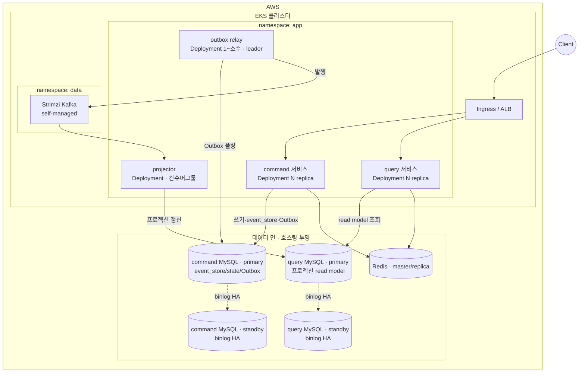
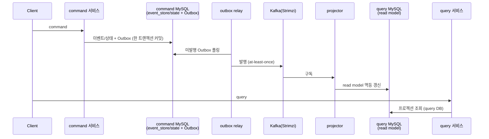

# V2 Design Doc — 09. Deployment / Runtime View (물리·배포 뷰)

- **상위 결정**: [[12.kafka-hosting-msk-vs-self-managed]] · [[13.db-hosting-and-read-write-topology]]
- **개요**: [[00-design-overview]] · **모듈**: [[01-module-structure]] · **읽기**: [[03-read-model]]

> 앞선 design_doc(00~05)이 *논리적으로 어떻게 짓는가*였다면, 본 문서는 그것이 *물리적으로 어디서 도는가*다. 모듈([[01-module-structure]])은 빌드·코드 경계이고, 여기서 다루는 워크로드는 그 모듈이 런타임에 어떤 프로세스·파드로 배치되는가다. 둘은 1:1이 아니다.

> ⚠️ 본 문서는 **목표 런타임 토폴로지**다. 현재(V1)는 단일 `adapter-module` 부트 앱 + docker-compose(MySQL·Redis)로 돈다([[01-current-state]]). 아래 EKS/Kafka(self-managed)/RDS 구성은 V2의 도착점이며, 전환은 [[06.strangler-migration]] 순서대로 단계적으로 깐다. 인프라부터 빅뱅으로 세우지 않는다(YAGNI).

## 배치 단위 (logical workload)

V2의 런타임 구성요소는 다섯이다. 모듈과의 대응 관계를 먼저 못 박는다.

| 워크로드 | 책임 | 출처 모듈 | 상태성 |
|----------|------|-----------|--------|
| **command 서비스** | 명령 수신·검증·쓰기(이벤트 스토어/상태+Outbox) | `command-module` | stateless (DB가 상태) |
| **query 서비스** | 조회 — query DB의 read model → DTO | `query-module` (web/service/repository) | stateless |
| **projector** | Kafka 구독 → read model 갱신 | `query-module` (projection) | stateless, **컨슈머 그룹 상태는 Kafka가 보관** |
| **outbox relay** | Outbox 테이블 → Kafka 발행 | `infrastructure-module` (Outbox 배관) | stateless, leader 단일성 필요 |
| **(데이터 면)** | Kafka(Strimzi) · command/query 분리 MySQL(각 binlog HA) · Redis(master/replica) | 호스팅 투명 | stateful |

핵심 결정 — **command/query는 코드(모듈)로는 분리하되, 초기 배포는 같이 갈 수 있다.** RFC 비목표에 "command/query의 물리적 서비스 분리(별도 배포)"가 명시돼 있다([[RFC-001-v2-cqrs-and-event-sourcing]]). 즉 모듈 분리가 곧 별도 파드를 강제하지 않는다. 물리 분리는 읽기 부하가 그것을 요구할 때 떼면 된다([[01-module-structure]] "향후 물리 분리 경로"). 단 **projector와 outbox relay는 처음부터 별 워크로드로 분리**한다 — 둘은 요청-응답 수명주기와 다른 동시성·스케일·장애 격리 특성을 갖기 때문이다(아래 §배치 근거).

## 목표 클러스터 토폴로지

> Kafka=**self-managed Strimzi**([[12.kafka-hosting-msk-vs-self-managed]]), DB=**command/query 분리 MySQL**(각각 binlog HA, [[13.db-hosting-and-read-write-topology]]). **command→query 다리는 Kafka/projector**(이벤트)이지 binlog가 아니다 — binlog는 각 DB의 이중화(HA)용. query DB엔 프로젝션만 있어 경계가 물리로 성립.

## 워크로드 배치 근거

### command 서비스 / query 서비스
- 둘 다 stateless HTTP. EKS `Deployment` + HPA(CPU/RPS). Ingress(ALB)로 라우팅.
- 초기엔 **한 배포에 합쳐도 무방**(RFC 비목표). 읽기 스케일이 쓰기와 독립적으로 커지면 `query-module`만 별 Deployment로 떼어 독립 스케일·독립 장애 격리를 얻는다. top-level 모듈 분리가 이 분리를 *값싸게* 만든다([[01-module-structure]]).

### projector — 왜 별 워크로드인가
- Kafka 컨슈머라 **요청-응답이 아니라 구독 루프**다. HTTP 트래픽과 스케일·재시작 특성이 다르다.
- read model 갱신은 **멱등**해야 한다(Zero Payload·재처리, [[03-read-model]]·[[07.reservation]]). 같은 이벤트를 두 번 받아도 안전.
- 스케일은 **파티션 수에 종속**된다 — 컨슈머 그룹 replica는 토픽 파티션 수를 넘어도 노는 인스턴스만 는다. 따라서 HPA 상한은 파티션 수에 맞춘다.
- 장애 격리: projector가 막혀도 command 쓰기는 계속된다(최종 일관성). 별 워크로드라 read 지연이 write 가용성을 끌어내리지 않는다.

### outbox relay — 왜 단일성(leader)이 필요한가
- Outbox 테이블을 폴링해 미발행분을 Kafka로 흘린다([[02-write-model]] 발행 경로). v1의 `AFTER_COMMIT REQUIRES_NEW` + 스케줄러 재처리를 워크로드로 격상한 것.
- 여러 replica가 같은 Outbox 행을 동시에 집으면 **중복 발행** 위험 → leader election(또는 `SELECT ... FOR UPDATE SKIP LOCKED` 기반 경합 회피, 구현 사이클 결정)으로 단일 처리자를 보장한다.
- Kafka는 어차피 **at-least-once**이므로 중복 발행 자체는 컨슈머 멱등(Zero Payload)으로 흡수되지만, relay는 불필요한 중복을 줄이는 게 책임이다.
- 따라서 relay는 `replicas: 1`(+ 무중단 위해 standby) 또는 분산 락 기반 소수 replica로 둔다. HPA 대상이 아니다.

> **대안 — 폴링 relay 대신 CDC(Debezium).** Outbox 테이블 변경을 CDC로 Kafka에 직결하면 relay 워크로드를 없앨 수 있다. v1 [[07.reservation]]의 CDC 후속 계획·[[05.event-store-mysql-table]]의 "CDC로의 전환 기준"과 정합한다. 다만 Kafka Connect/Debezium이라는 새 운영 표면이 생긴다 → **초기엔 폴링 relay, CDC는 트래픽·운영 성숙도가 정당화할 때**(YAGNI). TBD.

## 데이터 면 배치

| 구성요소 | 위치(권고) | 근거 |
|----------|-----------|------|
| Kafka | **EKS/k3s 위 Strimzi**(self-managed) | [[12.kafka-hosting-msk-vs-self-managed]] |
| **command MySQL** (event_store/state/Outbox) | 쓰기 모델 DB · binlog HA(primary+standby) | [[13.db-hosting-and-read-write-topology]] |
| **query MySQL** (프로젝션 read model) | 읽기 모델 DB · projector가 Kafka로 채움 · binlog HA | [[13.db-hosting-and-read-write-topology]] |
| Redis (read=replica, write=master) | 호스팅 투명(ElastiCache/자가) | 읽기/쓰기 엔드포인트 분리·failover — [[13.db-hosting-and-read-write-topology]] |

- **command MySQL**: event_store·상태·Outbox가 한 트랜잭션([[05.event-store-mysql-table]])이라 *같은 인스턴스*. binlog standby로 이중화(HA).
- **query MySQL**: projector가 Kafka 이벤트를 받아 프로젝션 read model을 여기에 쓰고, query가 읽는다. **command→query 다리는 Kafka/projector**(binlog 아님). query DB엔 프로젝션만 있어 "query가 command 테이블을 못 본다"가 *물리적으로* 성립. **앱 라우팅 코드 없음**(command-module→command DB, query-module→query DB 정적 바인딩). 상세 [[13.db-hosting-and-read-write-topology]].

## 이벤트·트래픽 흐름 (런타임)

쓰기 가용성과 읽기 신선도가 **분리**된다: relay/projector가 느려도 command는 계속 커밋되고, 읽기만 잠깐 뒤처진다(최종 일관성, [[03-read-model]]).

## 운영 관심사 (요약)

- **헬스/레디니스**: command·query는 HTTP probe. projector·relay는 컨슈머 lag / Outbox 적체를 readiness 신호로(상세 TBD).
- **확장 축**: query·projector는 읽기 부하로, command는 쓰기 부하로 독립 스케일. relay는 스케일하지 않음(단일성).
- **관측성**: Outbox 적체 깊이, 컨슈머 그룹 lag, 프로젝션 지연이 핵심 SLI(최종 일관성 건강도). 구체 대시보드·알람 임계는 TBD.
- **GitOps**: 매니페스트를 Git 단일 출처로 두고 ArgoCD/Flux로 동기화하는 방향을 **선호**한다. 다만 채택·도구 선정·파이프라인 설계는 본 사이클 범위 밖 — **별도 todo로 보류**한다(아키텍처 결정 아님).

## 미결정 (TBD)
- outbox relay의 단일성 구현(leader election vs `SKIP LOCKED`) — 구현 사이클.
- 폴링 relay → CDC(Debezium) 전환 기준 — [[05.event-store-mysql-table]]·[[07.reservation]]와 정합, 트래픽 의존.
- 프로젝션 read model의 물리 위치(primary 동거 vs 별 인스턴스) — [[13.db-hosting-and-read-write-topology]].
- command/query 물리 분리 시점 — 읽기 스케일 요구가 증명될 때([[01-module-structure]]).
- GitOps 도구·파이프라인 — 별도 todo.

## 관련 문서
- [[00-design-overview]] · [[01-module-structure]] · [[02-write-model]] · [[03-read-model]] · [[04-migration]]
- ADR: [[12.kafka-hosting-msk-vs-self-managed]] · [[13.db-hosting-and-read-write-topology]] · [[05.event-store-mysql-table]]
- 계승: [[07.reservation]]
