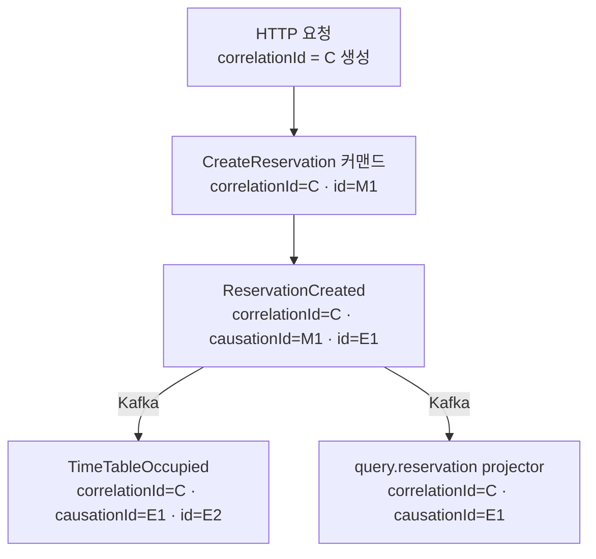
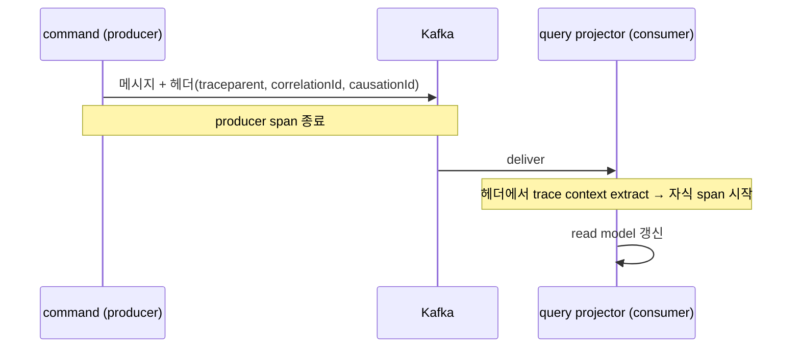

# V2 Design Doc — 10. Observability (관측성 횡단)

- **상위 결정**: [[RFC-001-v2-cqrs-and-event-sourcing]]
- **개요**: [[00-design-overview]]
- **인접**: [[07-messaging-topology]] (Kafka 경계) · [[06-consistency-and-sagas]] (이벤트 사슬·보상)
- **계승**: [[07.reservation]] (Outbox·Zero Payload)

> 이벤트 드리븐 + 비동기 경계로 가면 "한 요청이 어디까지 번졌나"가 한 트랜잭션·한 스레드 안에 안 남는다. 커맨드 하나가 이벤트를 낳고, 그 이벤트가 Kafka를 건너 다른 컨텍스트의 프로젝터·다음 커맨드를 깨운다([[06-consistency-and-sagas]]). 본 문서는 이 사슬을 추적 가능하게 만드는 **아키텍처 규약**만 확정한다. 도구 배포(Grafana/Tempo/Prometheus)는 **범위 밖, todo로 보류**.

## 범위

| 다룬다 (아키텍처 규약) | 보류 (todo · 별도 작업) |
|------------------------|--------------------------|
| correlation id / causation id 의 **정의와 전파 규약** | 추적 백엔드 배포 (Tempo/Jaeger) |
| 이벤트 메타데이터 스키마(`AbstractEvent` 확장) | 메트릭 수집기 배포 (Prometheus) |
| Kafka 비동기 경계의 span 연결 **개념**(OTel) | 대시보드·알림 (Grafana) |
| 구조적 로그의 필수 필드 | 로그 수집 파이프라인 (Loki 등) |

> 이번 사이클은 *어떤 id를 어디에 심고 어떻게 넘기는가*만 잠근다. 계측 라이브러리 선택·SDK 배선·인프라 배포는 구현 사이클 또는 별도 운영 작업으로 미룬다. **YAGNI** — 코드에 id 전파 자리만 만들어두면, 백엔드는 나중에 붙여도 추적이 성립한다.

## 1. 핵심 규약 — correlation id + causation id

분산·비동기에서 인과를 복원하는 두 식별자를 **이벤트 메타데이터에 의무화**한다.

| id | 의미 | 전파 규칙 |
|----|------|-----------|
| `correlationId` | 하나의 **최초 트리거**(사용자 요청·스케줄러 틱)가 낳은 사슬 전체의 공통 id | 사슬 내내 **불변 복사** — 첫 진입에서 생성, 이후 모든 이벤트·커맨드가 그대로 물려받음 |
| `causationId` | 이 이벤트를 **직접 유발한** 메시지(직전 커맨드 또는 직전 이벤트)의 id | 매 단계 **재설정** — "나를 낳은 것의 id" |

핵심 구분: `correlationId` 는 "어느 요청에서 시작됐나"(사슬 전체), `causationId` 는 "바로 직전 무엇이 나를 낳았나"(부모 한 칸). 둘이 있으면 평평한 이벤트 목록에서 **인과 트리**를 재구성할 수 있다.



- `correlationId = C` 는 요청부터 프로젝션까지 동일.
- `causationId` 는 한 칸씩 부모를 가리킨다(`E2` 의 부모는 `E1`).
- 이 그래프가 곧 "어느 커맨드가 어떤 이벤트 사슬을 낳았나"의 답이다.

### 전파가 끊기면 안 되는 두 경계

1. **command 내부** — 유스케이스가 커맨드의 `correlationId/messageId` 를 받아, 애그리거트가 낸 모든 도메인 이벤트의 메타데이터에 `correlationId=요청의 C`, `causationId=커맨드 messageId` 로 채운다. ([[02-write-model]] 의 `handle→event` 직후 단계.)
2. **이벤트 → 이벤트** — 사가/리액션이 이벤트를 받아 새 커맨드를 낼 때([[06-consistency-and-sagas]]), 들어온 이벤트의 `correlationId` 를 그대로 잇고 `causationId = 들어온 이벤트 id` 로 설정한다.

> 끊김 방지의 핵심은 **Outbox 기록 시점**이다. 이벤트가 event_store/Outbox로 들어갈 때 메타데이터가 이미 채워져 있어야 한다 — 발행 단계에서 뒤늦게 채우면 트랜잭션 경계 밖이라 유실 위험.

## 2. 이벤트 메타데이터 스키마 (`AbstractEvent` 확장)

기존 `AbstractEvent`(`eventType`/`eventVersion`/논리 타입명 다형성 — [[10.event-schema-evolution]])에 **추적 메타데이터**를 추가한다. 페이로드(비즈니스 데이터)와 메타데이터(추적)는 분리한다 — Zero Payload([[02-write-model]]) 원칙과 정합한다.

```kotlin
// 개념 예시 — 실제 필드/이름은 구현 사이클에서 확정
abstract class AbstractEvent(
    val eventType: OutboxEventType,
    val eventVersion: Double,
    // ── 추적 메타데이터 (신규) ──
    val eventId: String,          // 이 이벤트 고유 id (시간기반 UUID 재사용)
    val correlationId: String,    // 사슬 전체 공통 — 불변 전파
    val causationId: String,      // 직전 메시지 id — 매 단계 재설정
    val occurredAt: Instant,
)
```

- `eventId` 는 기존 **시간 기반 UUID**([[02-domain-limitations]] 재활용 자산)로 생성 — 별도 시퀀스 불필요.
- event_store 에 저장될 때 메타데이터도 함께 직렬화된다([[05.event-store-mysql-table]]) — 이벤트 스토어가 곧 **감사 추적 로그**가 된다(시점·인과 포함).
- Kafka 메시지는 메타데이터를 **헤더**로도 노출해, 컨슈머가 페이로드 역직렬화 전에 추적 컨텍스트를 잡게 한다([[07-messaging-topology]] 의 메시지 봉투).

> 메타데이터는 `contract-module` 의 `AbstractEvent` 에 둔다 — command/query 양측이 공유하는 계약이기 때문([[01-module-structure]]). 추적은 횡단이므로 컨텍스트별 이벤트가 아니라 공통 봉투에 싣는다.

## 3. Kafka 비동기 경계의 분산 추적 (OTel — 개념만)

동기 호출과 달리 Kafka는 producer 스레드와 consumer 스레드가 끊긴다. 분산 추적은 이 끊긴 지점을 **span으로 잇는다.**

- **개념**: producer 가 trace context(traceparent)를 Kafka **메시지 헤더**에 주입 → consumer 가 헤더에서 복원해 자식 span 으로 이어붙임. OTel 의 inject/extract 규약이 이를 표준화한다.
- **두 추적 축의 관계**:
  - `correlationId/causationId` = **비즈니스 인과**(이벤트 스토어에 영구 보존, 우리가 정의·소유).
  - OTel trace/span = **실행 추적**(레이턴시·홉, 백엔드가 단기 보존, 표준 도구가 소유).
  - 둘은 직교한다. `correlationId` 를 span attribute 로도 심어 **두 뷰를 교차 조회**할 수 있게 한다(권고).
- **자리만 확보**: 메시지 봉투에 헤더 슬롯(`traceparent`)을 비워두고, 계측 SDK 배선은 todo. 헤더가 있으면 백엔드를 나중에 붙여도 span 연결이 성립한다.



> **보류(todo)**: OTel SDK·Kafka 계측·Collector·백엔드(Tempo 등) 배포. 이번 결정은 "메시지 봉투에 trace 헤더를 싣는다 + correlationId 를 span 속성으로 심는다"는 **규약**까지다.

## 4. 구조적 로그

로그는 사슬 추적의 최소 안전망이다(추적 백엔드가 없어도 grep 가능해야 한다).

- **포맷**: JSON 구조적 로그. 자유 텍스트 금지.
- **필수 필드(모든 로그)**: `correlationId`, `causationId`(있으면), `context`(예약/식당…), `eventType` 또는 `commandType`.
- **전파 수단**: 동기 구간은 MDC(또는 코루틴 컨텍스트)에 `correlationId` 를 실어 자동 부착. Kafka 경계는 consumer 진입 시 헤더에서 MDC로 복원.
- **민감정보**: 페이로드 전체를 찍지 않는다(Zero Payload 와 정합) — 식별자·타입 중심.

> 백엔드 없이도 `correlationId` 한 값으로 한 사슬의 전 로그를 모을 수 있어야 한다 — 이것이 도구 배포를 미뤄도 추적이 성립하는 이유다.

## 5. 결정 요약

1. **모든 이벤트는 `correlationId` + `causationId` 를 메타데이터로 의무 보유.** `correlationId` 불변 전파, `causationId` 매 단계 재설정.
2. 추적 메타데이터는 `contract` 의 `AbstractEvent` 에 싣고 event_store·Kafka 헤더에 함께 보존.
3. Kafka 경계는 메시지 헤더로 trace context(traceparent)와 추적 id 를 운반 — **봉투 슬롯만 확보**, SDK 배선은 보류.
4. 구조적(JSON) 로그에 추적 id 필수 — 백엔드 없이도 사슬 복원 가능.
5. **백엔드 스택 = OSS(선택 고정, 배선은 보류)**: OTel 계측(vendor-neutral) → **Prometheus**(메트릭)·**Grafana**(대시보드)·**Tempo**(트레이스)·**Loki**(로그), 자가호스팅. exporter만 교체하면 Datadog 등 상용으로 전환 가능 — 계측은 코드, 백엔드는 설정이라 호스팅/Kafka와 **같은 투명성 원칙**([[12.kafka-hosting-msk-vs-self-managed]]·[[13.db-hosting-and-read-write-topology]]). 현업 DD ↔ 학습 OSS가 충돌하지 않는 이유.

## 미결정 사항 및 보류(todo)

- **도구 배포** (범위 밖, 스택은 OSS로 고정 — §5): OTel SDK/Collector, **Tempo·Prometheus·Grafana·Loki** 배선 — 운영 작업으로 별도 진행.
- 계측 라이브러리·MDC vs 코루틴 컨텍스트 전파 구현 방식 (구현 사이클).
- 스케줄러 재처리·Outbox 재발행 시 추적 id 보존 정책(원 correlationId 유지 vs 재처리 표식 추가) — [[07.reservation]] 재처리 경로와 정합 필요.
- 메트릭 카탈로그(프로젝션 지연, Outbox 적체, PoisonMessage 건수 등)의 구체 정의 (TBD).

## 관련 문서
- [[00-design-overview]] · [[02-write-model]] · [[07-messaging-topology]] · [[06-consistency-and-sagas]]
- ADR: [[05.event-store-mysql-table]]
- 계승: [[07.reservation]]
