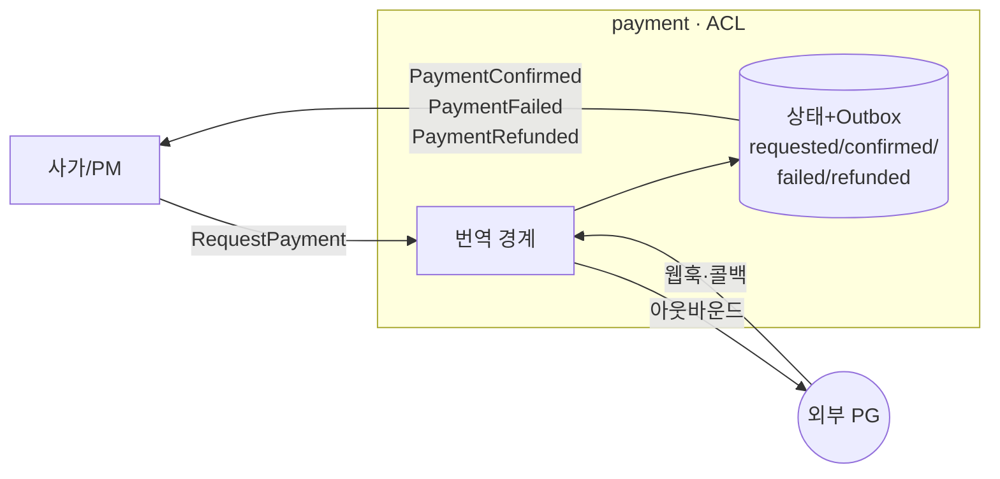
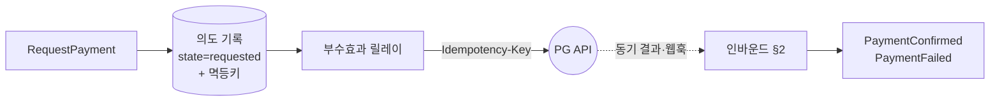

# V2 Design Doc — 14. Payment Integration (결제 연동 경계)

- **상위 결정**: [[RFC-016-payment-integration-boundary]]
- **사가 맥락**: [[06-consistency-and-sagas]] · **개요**: [[00-design-overview]]
- **인접**: [[07-messaging-topology]] (Outbox·전달 멱등) · **쓰기 모델**: [[02-write-model]]

> `payment`는 V2에서 새로 끌어들인 컨텍스트다([[RFC-006-saga-process-manager]] 사가의 결제 단계). 두 가지가 다른 컨텍스트와 다르다. 첫째, **계승할 V1이 없다** — V1 코드베이스에 결제 흔적(payment·refund `.kt`·마이그레이션)이 0건이라 "어떻게 옮기나"가 아니라 그린필드 경계 설계다. 둘째, **우리가 통제하지 못하는 외부 PG(결제 게이트웨이)와 말한다** — `PaymentConfirmed`는 우리가 마음대로 내는 이벤트가 아니라 외부 세계가 그렇다고 말해 줘야 비로소 낼 수 있는 이벤트다. 이 문서는 그 외부 진실을 우리 도메인 이벤트로 들이는 길, 우리 의도를 밖으로 내보내는 길, 둘이 어긋났을 때 맞추는 길을 *어떻게 짓는가*로 푼다.

> ⚠️ 본 문서는 **목표 경계 설계**다. 지금 붙일 실 PG가 없으므로 구현은 PG 포트 + 스텁/시뮬레이터로 시작하며(아래 §6), 실 PG 연동 시점·벤더는 별도 사이클이다. 단 *경계의 모양*은 실 PG 유무와 무관하게 동일하다.

## 1. payment = 부패방지층(ACL), ES도 단순 상태도 아니다

`payment`를 V2의 쓰기 모델 두 갈래([[02-write-model]]) 중 하나(ES냐 상태+Outbox냐)에 욱여넣으면 출발점이 틀린다. `payment`의 본질은 *데이터 모델*이 아니라 **외부 시스템과의 번역**이다.

PG는 자기 어휘로 말한다 — `transactionId`, `paid`/`failed`/`cancelled`/`partially_refunded`, 자기 타임스탬프·재시도 규약. 이걸 날것으로 도메인에 흘리면 벤더 모델이 사가 안으로 새어 들어온다(벤더를 바꾸면 사가가 깨진다). 그래서 `payment`는 **ACL(Anti-Corruption Layer)** 로 짓는다. 바깥으로는 PG의 언어를 받고, 안쪽으로는 우리 도메인 이벤트로 번역한다 — 이것이 이 컨텍스트의 유일한 책임이다.

**PG가 무엇이든(토스·아임포트·스트라이프·가짜 스텁) 사가가 보는 표면은 세 이벤트로 고정된다** — `PaymentConfirmed`/`PaymentFailed`/`PaymentRefunded`.

데이터는 **상태+Outbox 패턴**으로 둔다([[02-write-model]] §B). 결제 거래의 현재 상태를 테이블로 들고, 같은 트랜잭션에서 도메인 이벤트를 Outbox에 적어 사가로 흘린다. ES로 갈 이유는 약하다 — 결제 거래의 진실 원천은 우리가 아니라 PG의 원장이고, 우리 이력은 콜백을 받아 적은 *그림자*다.

> 이의 여지(Design): 분쟁·부분환불·재시도가 겹치면 내부 상태 전이가 풍부해져 ES가 다시 후보가 된다. 어느 쪽이든 사가가 보는 바깥 표면은 세 이벤트로 같으므로 ES↔상태 선택은 컨텍스트 내부 결정으로 미뤄도 사가 계약은 흔들리지 않는다.

## 2. 인바운드 — PG 알림을 도메인 이벤트로 들이는 세 겹

PG는 결과를 두 경로로 알린다. **리다이렉트 콜백**(브라우저 경유 — 비신뢰·유실 가능)과 **웹훅**(서버-투-서버)이다. 둘 다 비동기이고 둘 다 못 믿는다.

**결제 확정의 진실은 콜백이 아니라 웹훅 + 검증 조회(verify)로 받는다.** 콜백은 "사용자가 결제창을 마쳤다"는 UX 신호일 뿐 돈이 움직였다는 근거가 아니다. 콜백이 와도 곧장 `PaymentConfirmed`로 승격시키지 않고, **PG에 거래를 역조회해 금액·상태가 우리 기대와 일치하는지 확인한 뒤** 이벤트를 낸다.

들어오는 알림 자체가 비신뢰·순서 어긋남·중복·유실이 기본값이므로, ACL 인바운드 입구에 세 겹을 둔다.

| 겹 | 막는 것 | 방법 |
|----|---------|------|
| **진위 검증** | 위조 알림 | 웹훅 서명(HMAC/공개키) 검증, 통과 못 하면 도메인에 닿기 전 폐기 |
| **멱등 흡수** | 중복 통지(웹훅 2회, 콜백+웹훅 같은 사실 2경로) | PG 거래 ID를 멱등키로 한 **인바운드 디듀프 테이블** — 처리한 거래 ID면 no-op |
| **순서 무력화** | `refunded`가 `confirmed`보다 먼저 도착 | 도착 순서로 전이하지 않고, 알림이 실어 온 PG 측 상태/타임스탬프(또는 verify 결과)로 *수렴* — 늦게 온 옛 상태는 무시 |

멱등 흡수는 [[RFC-003-messaging-delivery]]의 전달 멱등(컨슈머 inbox)과 같은 발상을 ACL 입구에 적용한 것이고, [[12-api-contract]]의 요청-단 멱등과는 또 다른 층이다 — 셋 다 독립적으로 필요하다(우리 클라이언트 더블클릭 ↔ 전달 중복 ↔ 외부 PG 중복 통지).

한 줄 요약 — **외부의 비신뢰 입력 → (검증·디듀프·verify) → 신뢰할 수 있는 도메인 이벤트**.

## 3. 아웃바운드 — 의도를 먼저 기록한다 (dual-write 함정 회피)

사가가 `RequestPayment`를 보내면 ACL은 PG API를 호출해야 하는데, 이건 **부수효과이자 비-트랜잭션**이다. 순진하게 한 트랜잭션에서 (a) PG에 HTTP 결제 요청 + (b) 결과를 우리 상태/이벤트로 기록하면, 둘은 원자 단위가 아니다 — PG 호출은 성공했는데 커밋 직전 죽으면 **돈은 빠져나갔는데 우리는 모른다.** at-least-once 재처리 아래선 곧장 **이중 청구**다.

[[RFC-003-messaging-delivery]]의 부수효과-Outbox 노선을 그대로 적용한다 — **의도를 먼저 로컬 트랜잭션으로 기록하고, 별도 릴레이가 그 의도를 보고 PG를 호출하며, 결과를 다시 이벤트로 적는다.**

1. `RequestPayment` 수신 → *PG를 부르지 않고* "결제 요청 의도"를 로컬 트랜잭션으로 기록(state=requested, **멱등키 생성**).
2. 부수효과 릴레이가 의도를 집어 PG API 호출 — **PG의 Idempotency-Key에 그 멱등키를 넘긴다.** 릴레이가 재시도해 같은 호출이 두 번 나가도 PG 쪽 멱등으로 *돈은 한 번만* 움직인다. (우리 클라이언트에는 멱등키 계약을 안 지웠지만 — [[12-api-contract]] — *우리가 PG의 클라이언트일 때*는 정확히 그 패턴을 우리가 쓴다.)
3. PG 응답(동기 또는 웹훅)은 인바운드(§2)로 들어와 `PaymentConfirmed`/`PaymentFailed`로 번역된다.

요지 — PG 호출과 이벤트 append를 원자적으로 묶으려는 시도 자체를 포기하고, "기록된 의도 + 멱등키 + 재시도 가능한 릴레이"로 **at-least-once 호출을 effectively-once 청구로** 만든다([[07-messaging-topology]]와 같은 결).

> 이의 여지(Design): Idempotency-Key 미지원 PG에선 호출 전 verify로 "이미 청구됐나"를 확인하는 보수 경로가 필요하다. 부수효과 릴레이를 결제 전용으로 둘지 공용 릴레이에 태울지도 Design.

## 4. 보상 — 환불은 새 정방향이지 롤백이 아니다

결제까지 됐는데 예약 확정이 깨지면 사가는 환불로 되감는다([[06-consistency-and-sagas]] 보상: `PaymentConfirmed` ↔ `PaymentRefunded`). 두 가지를 못 박는다.

- **환불도 아웃바운드 호출**이라 §3의 dual-write 함정을 똑같이 탄다 → "의도 기록 → 멱등키 단 릴레이 호출 → 결과 이벤트"의 같은 경로를 쓴다. 보상이라고 특별 취급하지 않는다.
- **환불은 반드시 멱등**이다([[06-consistency-and-sagas]]). 사가가 타임아웃에 보상을 두 번 트리거하거나 환불 웹훅이 중복으로 와도 *이중 환불*이 나면 안 된다. 정방향 청구와 같은 멱등키 공간을 쓰되, "이미 환불된 거래면 무시"를 PG verify로 판별한다 — 외부 상태를 진실로 삼는 인바운드 규율을 보상에도 적용한다.

## 5. 정합성 조정(reconciliation) — 외부 진실과 주기적으로 맞춘다

모든 장치(멱등·verify·릴레이)에도 외부 경계엔 **항상 잔여 불일치가 남는다** — 웹훅이 끝내 유실되고, verify가 타임아웃 나고, PG 비동기 처리가 우리 추정보다 늦는다. ACL은 "우리가 받은 알림으로 만든 상태"가 곧 진실이라고 가정하지 않는다. 진실은 PG 원장이고 우리 상태는 사본이다.

이를 메우는 게 **주기적 대사(reconciliation)** 다. 주기적으로 PG 원장(정산 파일 또는 거래 조회 API)과 우리 상태를 대조한다.

- 우리는 requested인데 PG는 paid → 누락된 `PaymentConfirmed`를 *늦게라도* 낸다(웹훅 유실 복구).
- 우리는 confirmed인데 PG에 거래가 없음 → 경보(우리 쪽 유령 상태).

원칙 — **대사를 안전망으로 상시 두되, 자동 보정은 "PG가 진실"이라는 단방향으로만.** 우리 상태를 PG에 맞추지, PG를 우리에 맞추려 들지 않는다. 자동으로 못 푸는 어긋남(금액 불일치·정체불명 거래)은 [[RFC-003-messaging-delivery]]의 DLQ 수동 루프처럼 **운영 보정 큐**로 올린다.

> 이의 여지(Design): 대사 주기·소스(정산 파일 vs 조회 API)는 벤더에 달렸고, 미스매치를 도메인 이벤트로 표현할지 운영 알람으로만 둘지는 Design.

## 6. 실 PG 없이 학습하기 — 포트 + 스텁

지금 붙일 실 PG가 없다. "가짜 인라인 호출"로 때우면 ACL·웹훅·멱등·대사라는 *배울 가치가 있는 구조*가 통째로 증발한다. 그래서 **PG 인터페이스(포트)는 실제처럼 정의하고, 그 뒤에 비동기·실패·중복을 흉내 내는 PG 스텁/시뮬레이터를 꽂는다** — 스텁이 지연 후 웹훅을 콜백으로 쏘고, 가끔 중복·유실·순서뒤집기를 일으켜 우리 인바운드 방어(§2)가 진짜로 동작하는지 검증한다. 핵심은 *경계의 모양*(ACL 포트 + 웹훅 인바운드 + 부수효과 릴레이 + 대사)이 실 PG 유무와 무관하게 동일하다는 것이다.

## 사가 계약 동결

`payment`가 사가에 노출하는 이벤트는 **`PaymentConfirmed`·`PaymentFailed`·`PaymentRefunded` 셋으로 동결**한다([[06-consistency-and-sagas]] 보강). 컨텍스트 내부가 ES든 상태든, PG가 무엇이든 이 표면은 바뀌지 않는다.

## 구현 사이클에 넘기는 것

- 결제 거래 상태 모델 — 상태+Outbox 테이블 스키마, 전이(requested/confirmed/failed/refunded/partially_refunded), 부분환불 표현, ES 재검토 트리거.
- 인바운드 ACL 상세 — 웹훅 엔드포인트·서명 검증 알고리즘, 디듀프 테이블 키·GC, verify 조회 정책.
- 아웃바운드 릴레이 — 전용 vs 공용, 멱등키 생성·전달 규약, Idempotency-Key 미지원 시 verify-before-call 보수 경로.
- 보상·멱등키 공간 — 청구·환불 멱등키 공유 모델, 이중 환불 가드.
- 대사 — 주기·소스·미스매치 처리(자동 보정 범위 vs 운영 큐).
- PG 스텁/시뮬레이터 — 충실도, 결함 주입(지연·중복·유실·순서뒤집기) 시나리오.

## 관련 문서

- [[RFC-016-payment-integration-boundary]] · [[RFC-006-saga-process-manager]] · [[RFC-003-messaging-delivery]] · [[12-api-contract]]
- [[06-consistency-and-sagas]] · [[02-write-model]] · [[07-messaging-topology]]
- ADR: [[08.saga-orchestration-vs-choreography]] · [[09.event-ordering-and-delivery-guarantee]]
- 계승: [[07.reservation]] (Outbox·PoisonMessage 규율; `payment`는 계승할 V1 없음 = 그린필드)
