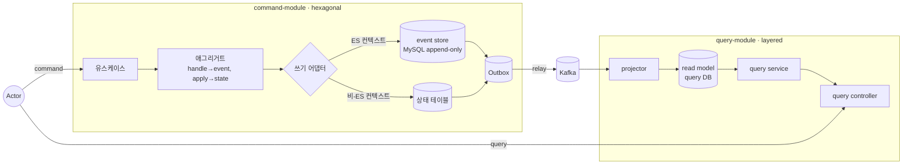

# DESIGN-001: V2 목표 아키텍처 Overview

- **상태**: Accepted
- **작성자**: Team
- **작성일**: 2026-06-30
- **최종 수정일**: 2026-06-30
- **관련 RFC**: [[RFC-001-v2-cqrs-and-event-sourcing]]
- **관련 ADR**: [[01.cqrs-command-query-module-split]] · [[03.command-hexagonal-query-layered]] · [[02.selective-event-sourcing-scope]]
- **관련 Design Doc**: [[DESIGN-002]] · [[DESIGN-003]] · [[DESIGN-004]] · [[DESIGN-005]]

---

## 1. Background

[[RFC-001-v2-cqrs-and-event-sourcing]]에서 V1→V2 전환을 결정하였다. V1의 단일 모듈 구조는 read/write 혼재, 빈약 도메인 모델, 확장성 한계라는 문제를 드러냈다 ([[01-current-state]] · [[02-domain-limitations]] 참조). RFC-001은 CQRS + Event Sourcing(선택적)을 V2의 핵심 아키텍처 전략으로 채택하였으며, 본 design_doc 묶음은 그 결정을 **어떻게 구현하는가**로 풀어쓴다. *왜* 그 결정인지의 근거는 각 ADR에 있다.

## 2. Goal

- CQRS+ES 목표 아키텍처를 확립하고, command/query 모듈 분리 구조를 정의한다.
- 설계 불변식을 전 문서 공통 기준으로 명문화한다.
- 컨텍스트별 쓰기 모델 분류(ES / 비-ES / 현행)를 확정한다.
- 후속 DESIGN 문서들의 범위와 상호 관계를 인덱스로 제공한다.

## 3. Non-Goal

- 각 컨텍스트의 구체 구현 디테일 — 이는 각 DESIGN 문서에서 다룬다.
- 이벤트 스토어 테이블 스키마 설계 ([[DESIGN-003]] 참조).
- 물리 배포 분리 시점 ([[DESIGN-010]] 참조).
- 도메인 이벤트 카탈로그 — 이벤트 스토밍 재실시 후 확정.

## 4. Proposed Solution

### 4.1 목표 아키텍처 다이어그램

### 4.2 문서 인덱스

| 문서 | 내용 | 근거 ADR |
|------|------|----------|
| [[DESIGN-002]] | command/query 모듈·패키지 트리, hexagonal/layered, 의존성 규칙, 경계 강제 | [[01.cqrs-command-query-module-split]] · [[03.command-hexagonal-query-layered]] |
| [[DESIGN-003]] | ES 쓰기(이벤트 스토어·애그리거트·동시성·스냅샷) / 비-ES 쓰기(상태+Outbox) / 발행 경로 | [[02.selective-event-sourcing-scope]] · [[05.event-store-mysql-table]] · [[07.command-domain-jpa-separation]] |
| [[DESIGN-004]] | query layered, projector, 프로젝션 read model, replica, 일관성 | [[04.read-model-projection-and-replica]] |
| [[DESIGN-005]] | 점진 전환 순서 (한 번에 하나씩 이전) | [[06.strangler-migration]] |
| [[DESIGN-006]] | 애그리거트 설계·도메인 로직 배치 (취약점 W-1 대응) | [[03.command-hexagonal-query-layered]] |

### 4.3 설계 불변식 (전 문서 공통)

1. **command는 리치 도메인, query는 얇은 조회.** 아키텍처 비대칭(hexagonal vs layered)은 의도된 경제성.
2. **command ↔ query 유일 접점은 이벤트(`contract`).** query는 command의 스키마/도메인을 모른다.
3. **ES/비-ES 차이는 command의 쓰기 어댑터에만.** 대외 이벤트 발행(Outbox→Kafka)과 query 측은 둘을 구분하지 않는다.
4. **YAGNI.** 프로젝션·물리 분리·전용 이벤트 스토어 제품은 필요가 증명될 때 도입.

### 4.4 컨텍스트 분류 (요약)

| 분류 | 컨텍스트 | 쓰기 모델 |
|------|----------|-----------|
| 진짜 ES | `reservation` · `timetable` · `restaurant` | event store + 리플레이 |
| 상태 + Outbox (CQRS) | `schedule` · `user` · `authenticate` | 상태 테이블 + 통합 이벤트 |
| 현행/lookup | `menu` · `category` · `company` | 상태 테이블 (구독 필요 시 Outbox) |

> 분류 경계(특히 `schedule`·`menu`)는 이벤트 스토밍 재실시 후 재검토 가능. 상세 [[DESIGN-003]].

## 5. Alternatives Considered

RFC-001 단계에서 검토한 대안들(단순 CQRS only, 전면 ES, 외부 이벤트 스토어 제품 도입)은 [[RFC-001-v2-cqrs-and-event-sourcing]] 및 각 ADR에 근거와 함께 기록되어 있다.

## 6. Details

본 문서는 Overview이며, 구현 디테일은 개별 DESIGN 문서([[DESIGN-002]] ~ [[DESIGN-006]])에서 다룬다.

## 7. Risks & Mitigations

| 리스크 | 완화 방안 |
|--------|-----------|
| 컨텍스트 분류 경계 모호 (특히 `schedule`·`menu`) | 이벤트 스토밍 재실시 후 재검토. 현행 분류는 잠정값 |
| 불변식 위반 — query가 command 도메인을 참조 | 모듈 경계(컴파일 의존성) + ArchUnit/Konsist 규칙으로 강제 ([[DESIGN-002]]) |
| YAGNI 원칙 위반으로 과도한 조기 최적화 | 설계 불변식 §4번을 리뷰 체크리스트에 포함 |

## 8. Appendix

### 8.1 Glossary

| 용어 | 설명 |
|------|------|
| ES | Event Sourcing — 상태가 아닌 이벤트 스트림을 진실의 원천으로 삼는 패턴 |
| CQRS | Command Query Responsibility Segregation — 쓰기/읽기 모델 분리 |
| Outbox | 트랜잭션 내에 이벤트를 기록해 최소 1회 발행을 보장하는 패턴 |
| contract-module | command·query 간 유일 접점인 이벤트 계약 모듈 |

### 8.2 Reference

- RFC: [[RFC-001-v2-cqrs-and-event-sourcing]]
- ADR: [[01.cqrs-command-query-module-split]] · [[02.selective-event-sourcing-scope]] · [[03.command-hexagonal-query-layered]] · [[04.read-model-projection-and-replica]] · [[05.event-store-mysql-table]] · [[06.strangler-migration]]
- 근거 분석: [[01-current-state]] · [[02-domain-limitations]]
- 후속 Design Doc: [[DESIGN-002]] · [[DESIGN-003]] · [[DESIGN-004]] · [[DESIGN-005]] · [[DESIGN-006]]

## Changelog

| 날짜 | 내용 |
|------|------|
| 2026-06-30 | DESIGN-001 템플릿으로 재작성 (원본: `00-design-overview.md`) |

---

## Weakness (Devil's Advocate 반박 포인트)

- **불변식 §2 "command↔query 유일 접점은 이벤트" — Zero Payload와 결합 시 query가 command DB를 역참조** — DESIGN-003 §4.4가 Zero Payload(식별자만 발행, 컨슈머가 최신 상태 조회)를 채택했는데, 이벤트에 상태가 없으면 projector는 최신 상태를 *어딘가*에서 조회해야 한다. contract 이벤트만으로는 read model을 채울 수 없어, 결국 query가 command 측 조회 API/DB를 두드리게 되면 "유일 접점=이벤트" 불변식이 런타임에서 무너진다. 이 문서는 그 조회 경로를 정의하지 않는다.
- **불변식 §3 "ES/비-ES 차이는 쓰기 어댑터에만" — 리플레이 지연·정합성 특성이 어댑터 밖으로 샌다** — ES 컨텍스트는 상태를 리플레이로 재구성하므로 로드 지연·스냅샷 신선도·동시성 락(DESIGN-003 L1 Redisson) 특성이 비-ES와 근본적으로 다르다. 이를 "어댑터 세부"로 격리했다고 선언하지만, 유스케이스 타임아웃·SLA·장애 모드는 컨텍스트 종류에 따라 갈린다. 추상화가 새는 지점을 "동일하게 취급"으로 덮었다.
- **컨텍스트 분류가 "잠정값"인데 §4.2 문서 인덱스·후속 DESIGN이 이미 그 분류에 묶여 있다** — §4.4와 Risk 표 모두 `schedule`·`menu` 경계를 "이벤트 스토밍 재실시 후 재검토"로 남겼다. 그런데 DESIGN-003은 이미 세 그룹으로 나눠 각각 다른 쓰기 메커니즘을 확정했다. 스토밍 후 `schedule`이 ES로 넘어가면 상태 테이블→이벤트 스토어 재작성이라는 값비싼 되돌림이 발생하는데, "잠정"이라는 라벨이 이 전환 비용을 회계 처리하지 않는다.
- **§4.1 다이어그램: Outbox가 event store와 상태 테이블 양쪽에서 relay되는데 순서·중복 보장 주체 불명** — `EVST → OB`와 `ST → OB` 두 경로가 하나의 Kafka로 합류한다. 그러나 ES 경로는 이벤트가 이미 append-only 순서를 갖고 비-ES는 상태 변경 시점에 이벤트를 만든다. 두 소스가 같은 토픽/컨슈머로 흘러들 때 컨텍스트 간 순서·at-least-once 중복을 누가 정규화하는지 Overview가 침묵한다(DESIGN-003의 UUIDv7 커서는 "순서 정확성 아님"을 스스로 명시).
- **불변식 §4 YAGNI가 자기 부정 — 선택적 ES 자체가 증명되지 않은 선제 투자** — "프로젝션·물리 분리·전용 스토어는 필요 증명 시 도입"이라면서, 정작 real traffic이 없는 프로토타입에 MySQL 이벤트 스토어+리플레이+스냅샷+분산 락이라는 최고난도 스택을 세 컨텍스트에 선제 도입한다. YAGNI를 인프라에는 엄격히 적용하면서 핵심 쓰기 모델에는 면제한 비대칭이 리뷰 체크리스트(Risk 표 3행)로 방어되지 않는다.
- **hexagonal(command) vs layered(query) 비대칭을 "의도된 경제성"으로 규정 — read model 진화 시 비용 역전** — query를 layered로 얇게 둔 근거는 "DB→DTO"다. 그러나 projector가 여러 contract 이벤트를 조합해 비정규 read model을 구성하기 시작하면(조인·집계·멱등 병합), layered의 얇음이 오히려 projector 로직의 테스트·격리를 어렵게 한다. "얇은 조회"라는 전제가 CQRS read side의 실제 복잡도(프로젝션 재구축·백필)를 과소평가한다.

> 본 절은 리뷰용 반박 정리이며, 문서의 결정을 뒤집지 않는다. 각 항목은 후속 검토 대상.
