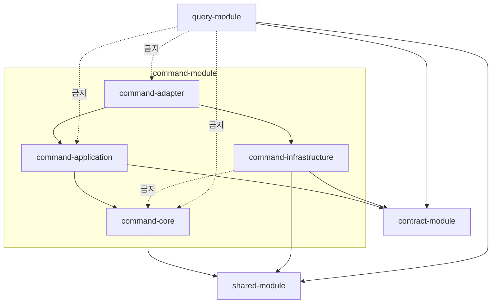

# DESIGN-002: Module Structure

- **상태**: Accepted
- **작성자**: Team
- **작성일**: 2026-06-30
- **최종 수정일**: 2026-07-01
- **관련 RFC**: [[RFC-010-module-structure-migration]]
- **관련 ADR**: [[01.cqrs-command-query-module-split]] · [[03.command-hexagonal-query-layered]] · [[07.command-domain-jpa-separation]] · [[02.hexagonal]]
- **관련 Design Doc**: [[DESIGN-001]] · [[DESIGN-003]] · [[DESIGN-004]] · [[DESIGN-005]] · [[DESIGN-010]]

---

## 1. Background

V1은 `core-module` / `application-module` / `adapter-module` 의 단일 계층 구조로 read/write 코드가 혼재되어 있었다. CQRS 도입([[DESIGN-001]])에 따라 command(쓰기)와 query(읽기) 경로를 **모듈 레벨**에서 명확히 분리할 필요가 생겼다. 단순 패키지 분리만으로는 컴파일 타임 경계를 보장할 수 없으므로, 물리 모듈로 경계를 강제하는 구조를 확정한다.

V1의 계층별 top-level 모듈 구조(`core-module`, `infrastructure-module` 등)는 hexagonal을 표방하면서도 도메인·인프라가 모듈 바깥에 흩어져 **hexagonal이 한 경계 안에서 완결되지 않는** 문제가 있었다. V2는 command-module 안에서 서브모듈로 hexagonal 4층을 완결하되, 서브모듈 경계로 도메인 순수성을 컴파일 타임에 보장한다.

## 2. Goal

- command/query 분리 모듈 구조를 확정한다.
- command-module 내부의 서브모듈 구조(command-core / command-application / command-adapter / command-infrastructure)와 hexagonal 계층 배치를 정의한다.
- 각 서브모듈의 패키지 트리, 의존성 규칙, 경계 강제 방법을 명시한다.
- query-module의 layered 구조를 정의한다.

## 3. Non-Goal

- command/query의 물리 배포 분리(별도 프로세스·서버 분리) — [[DESIGN-010]]에서 다룬다.
- 신규 도메인(리뷰·포인트·신고)의 상세 도메인 설계 — 후속 사이클에서 별도 처리.
- Strangler 전환의 단계별 순서 — [[DESIGN-005]]에서 다룬다.

## 4. Proposed Solution

### 4.1 모듈 트리

```
prototype-reservation-system
├── shared-module                          # enum, 추상예외, 유틸 (현행 유지)
├── contract-module               (신규)   # 이벤트 계약: AbstractEvent + 구체 이벤트, 공유 ID/타입
│
├── command-module                (신규)   # ── hexagonal, 서브모듈로 4층 완결
│   ├── command-core/                      # 순수 도메인 (JPA·Spring 의존성 없음)
│   │   └── com.reservation.command.core
│   │       ├── reservation/               # 애그리거트, 도메인 이벤트, 도메인 서비스
│   │       ├── restaurant/
│   │       ├── timetable/
│   │       ├── schedule/
│   │       ├── user/
│   │       ├── authenticate/
│   │       ├── menu/
│   │       ├── category/
│   │       └── company/
│   │
│   ├── command-application/               # 유스케이스, 포트 in/out
│   │   └── com.reservation.command.application
│   │       ├── reservation/
│   │       │   ├── port/in/               # command 유스케이스 인터페이스
│   │       │   ├── port/out/              # 이벤트 스토어/상태/Outbox 저장 포트
│   │       │   └── service/               # 유스케이스 구현 (command-core 애그리거트 조립·실행)
│   │       ├── restaurant/
│   │       └── ...
│   │
│   ├── command-adapter/                   # 컨트롤러, persistence 어댑터
│   │   └── com.reservation.command.adapter
│   │       ├── reservation/
│   │       │   ├── in/web/                # command 컨트롤러
│   │       │   └── out/                   # event-store writer · state writer · outbox publisher
│   │       ├── restaurant/
│   │       └── ...
│   │
│   └── command-infrastructure/            # 횡단 기술 배관
│       └── com.reservation.command.infrastructure
│           ├── eventstore/                # ES 엔진 (append, replay, snapshot)
│           ├── outbox/                    # Outbox relay
│           ├── kafka/                     # Kafka producer 설정
│           ├── persistence/               # JPA 설정, DB 연결
│           └── idgen/                     # ID 생성기
│
└── query-module                  (신규)   # ── layered, 도메인 = 패키지
    └── com.reservation.query
        ├── reservation/   web/ · service/ · repository/ · projection/ · model/
        ├── restaurant/    …
        └── …
```

> 기존 V1의 `core-module` 도메인 코드는 `command-core`로, `application-module` 은 `command-application`으로, `adapter-module`의 쓰기 측은 `command-adapter`로, 조회 측은 `query-module`로 이전한다. 이전은 [[DESIGN-005]]의 Strangler 순서를 따른다.

### 4.2 command-module — 서브모듈 hexagonal

command-module은 4개의 Gradle 서브모듈로 구성되며, hexagonal 4층이 하나의 command 경계 안에서 완결된다.

#### command-core (순수 도메인)

- **build.gradle에 JPA·Spring 의존성 없음** → 도메인 순수성이 컴파일 타임에 보장된다.
- 애그리거트는 `handle(command) → List<DomainEvent>` + `apply(event) → newState` 책임을 스스로 진다 (빈약 도메인 탈피, 상세 [[DESIGN-006]]).
- 도메인 서비스는 단일 애그리거트로 해결 불가능한 도메인 로직에만 사용한다.
- 컨텍스트별 패키지로 분리하되, 컨텍스트 간 직접 참조는 ArchUnit/Konsist로 금지한다.

#### command-application (유스케이스·포트)

- port/in: command 유스케이스 인터페이스 (CreateReservation, CancelReservation 등)
- port/out: 저장 포트 (이벤트 스토어, 상태 테이블, Outbox)
- service: 유스케이스 구현 — command-core의 애그리거트를 조립·실행한다.
- `command-application → command-core` 의존.

#### command-adapter (인바운드·아웃바운드 어댑터)

- in/web: command 컨트롤러 (REST)
- out: event-store writer, state writer, outbox publisher — command-infrastructure의 배관을 사용해 port/out을 구현한다.
- `command-adapter → command-application → command-core` 의존.

#### command-infrastructure (횡단 기술 배관)

- ES 엔진(append, replay, snapshot), Outbox relay, Kafka producer, JPA 설정, ID 생성기 등 기술 관심사.
- **도메인 비의존** — command-core를 import하지 않는다. contract-module의 이벤트 타입만 알면 된다.
- `command-adapter`가 이 모듈의 컴포넌트를 가져다 port/out 구현체를 만든다.

### 4.3 query-module — layered (비대칭 의도적)

```
com.reservation.query.reservation
├── web/             # query 컨트롤러
├── service/         # 조회 서비스 (read model → 응답 DTO)
├── repository/      # QueryDSL / read model 저장소 조회
├── projection/      # 이벤트 구독 projector → read model 갱신
└── model/           # read model 엔티티 / 응답 DTO
```

- **포트/어댑터 없음** — 읽기는 "DB→DTO"라 layered가 경제적 ([[03.command-hexagonal-query-layered]]).
- `projection/`이 `contract` 이벤트를 구독해 `model/`을 채운다. query는 command 도메인을 import하지 않는다.

### 4.4 의존성 규칙 (핵심)

#### 서브모듈 간 의존성



#### 의존성 매트릭스

| 모듈 | 허용 의존 | 금지 |
|------|-----------|------|
| `command-core` | `shared` | JPA·Spring·`contract`·`command-application`·`command-adapter`·`command-infrastructure`·`query` |
| `command-application` | `command-core`, `contract`, `shared` | `command-adapter`·`command-infrastructure`·`query` |
| `command-adapter` | `command-application`, `command-infrastructure`, `contract`, `shared` | `query` |
| `command-infrastructure` | `contract`, `shared` | **`command-core`**·`command-application`·`query` |
| `query` | `contract`, `shared` | **`command-*` 전체** |
| `contract` | `shared` | `command-*`·`query` |

- **command-core의 순수성**: build.gradle에 JPA·Spring 의존성이 없으므로 **컴파일 타임에 물리적으로 불가능**. ArchUnit이 아니라 Gradle 의존성 그래프가 강제한다.
- **command-infrastructure → command-core 금지**: 인프라가 도메인을 모르게 한다. 어댑터가 둘을 조합한다.
- **query → command-* 전체 금지**: query는 contract 이벤트만 안다.

### 4.5 경계 강제 (ArchUnit / Konsist)

서브모듈 경계로 강제할 수 없는 **패키지 레벨 규칙**:

- `command-core` 내 컨텍스트 간 직접 의존 금지 (reservation → restaurant 직접 import 금지, contract 이벤트로만).
- `command-application` 내 컨텍스트 간 직접 의존 금지 (동일).
- `query.*` 내 컨텍스트 간은 허용 (읽기 조인은 자연스러움).
- 위반 시 빌드 실패 — `detekt`/테스트 단계에 편입.

### 4.6 신규 기능 컨텍스트 (리뷰·포인트·신고)

리뷰/별점·포인트·신고는 V1에 없던 신규 도메인이라 Strangler *전환 대상*이 아니다 — **각각 command-core/application/adapter에 새 컨텍스트 패키지로, 처음부터 신구조 네이티브로** 짓는다(기존 컨텍스트에 욱여넣지 않는다). 다만 투입 시점은 **레퍼런스 컨텍스트 한두 개의 전환이 끝나 패턴(서브모듈 구조·매핑 규약·검증 규칙)이 검증된 뒤**다. 아직 흔들리는 규약 위에 새 코드를 쌓으면 패턴이 바뀔 때 신규 기능도 함께 흔들린다([[RFC-010-module-structure-migration]]). 사업 우선순위가 전환보다 높아 순서가 뒤집히면 패턴 미확정 리스크를 명시한다. 각 신규 기능의 상세 도메인 설계는 후속 사이클.

### 4.7 비-ES 컨텍스트 도메인↔JPA 매핑

비-ES 컨텍스트의 도메인↔JPA 매핑은 **V1식 엄격한 hexagonal 수동 매핑을 유지**한다 — 컨텍스트별로 손으로 쓴 매핑 함수가 `command-adapter/out` 안쪽에 명시적으로 남는다. 코드 생성 도구(MapStruct류)·공통 매퍼 추상은 비채택([[07.command-domain-jpa-separation]] · [[RFC-010-module-structure-migration]]). 반복이 과해지면 공통 추상이 아니라 경계를 흐리지 않는 국소 컨벤션(같은 자리·같은 시그니처)으로 대응한다.

### 4.8 향후 물리 분리 경로

- **"읽기 전체를 query 서비스로"** 분리: `query-module`을 별도 배포로 떼면 된다.
- **"도메인별 마이크로서비스 분할"**: command 서브모듈 4개에서 해당 컨텍스트 패키지를 함께 들어내 독립 모듈로 만든다. 서브모듈 경계 + 패키지 경계가 깨끗하면 수용 가능하다.
- 물리 배포 분리 시점 자체는 [[DESIGN-010]]이 다룬다.

## 5. Alternatives Considered

### 5.1 A안: top-level core-module + infrastructure-module 분리 (V1 계승, 비채택)

- **설명**: V1처럼 `core-module`과 `infrastructure-module`을 command 바깥 top-level 모듈로 유지하고, `command-module`에는 application/adapter만 둔다.
- **장점**: V1에서 전환 비용 최소. 도메인 순수성은 core-module 경계로 보장.
- **단점**: hexagonal이 모듈 3개에 흩어져 **한 경계 안에서 완결되지 않는다**. "hexagonal"이라 부르면서 도메인과 인프라가 밖에 있는 모순. 또한 `core-module` 안에서 컨텍스트 간 격리는 ArchUnit에 의존 — §5 논리("컴파일 의존성이 검증 규칙보다 낫다")와 모순.
- **기각 사유**: 구조의 솔직함(hexagonal 완결)과 논리 일관성.

### 5.2 B안: command-module 안 패키지 분리 (서브모듈 없음, 비채택)

- **설명**: command-module 하나에 core/application/adapter/infrastructure를 패키지로만 분리. 서브모듈 없음.
- **장점**: 모듈 수 최소. 빌드 단순.
- **단점**: **도메인 순수성(JPA·Spring 금지)을 컴파일 타임에 보장할 수 없다.** command-module 자체가 Spring/JPA를 의존하므로, core 패키지 안 코드가 JPA import 하는 것을 ArchUnit으로만 막아야 한다. 컴파일 의존성 보장이라는 핵심 원칙이 정적분석 규칙으로 내려간다.
- **기각 사유**: 도메인 순수성의 컴파일 타임 보장 포기.

### 5.3 C안: 컨텍스트별 독립 모듈 (비채택)

- **설명**: `command-reservation-module`, `command-restaurant-module` 등 컨텍스트마다 독립 모듈, 각각 내부에 core/application/adapter/infrastructure.
- **장점**: 컨텍스트 간 격리까지 모두 컴파일 타임 보장. 물리 분리 시 모듈 통째로 떼면 끝.
- **단점**: **모듈 수 폭발** (컨텍스트 × 4). 빌드 복잡도 증가. 단일 프로세스로 부팅하더라도 Gradle 멀티모듈 설정·의존성 관리 부담이 크다. 현재 규모(9개 컨텍스트)에서는 과도한 엔지니어링.
- **기각 사유**: YAGNI. 컨텍스트 간 격리는 ArchUnit으로 충분. 필요가 증명되면 그때 분할.

## 6. Details

### 6.1 Gradle 서브모듈 설정

```kotlin
// settings.gradle.kts
include(
    "shared-module",
    "contract-module",
    "command-module:command-core",
    "command-module:command-application",
    "command-module:command-adapter",
    "command-module:command-infrastructure",
    "query-module",
)
```

`command-core`의 `build.gradle.kts`에는 JPA·Spring 의존성을 **명시적으로 배제**한다:

```kotlin
// command-module/command-core/build.gradle.kts
dependencies {
    implementation(project(":shared-module"))
    // JPA, Spring 의존성 없음 — 도메인 순수성 컴파일 타임 보장
}
```

### 6.2 비-ES 컨텍스트의 도메인↔JPA 분리 방식(수동 매핑 유지)은 [[DESIGN-003]] §B에서 상세히 다룬다.

### 6.3 이벤트 계약(`contract-module`)의 구조 및 버전 정책은 [[DESIGN-003]] §C 및 [[DESIGN-007]]에서 다룬다.

## 7. Risks & Mitigations

| 리스크 | 완화 방안 |
|--------|-----------|
| `command-core` 내 컨텍스트 간 패키지 경계 위반 | ArchUnit/Konsist 규칙으로 빌드 시 강제. 위반 시 빌드 실패 |
| 서브모듈 4개 추가로 빌드 복잡도 증가 | Gradle composite build 활용. C안(컨텍스트별 모듈) 대비 관리 가능한 수준 |
| 신규 기능(리뷰 등)을 패턴 확정 전에 투입 | 레퍼런스 컨텍스트 전환 완료 후 투입. 순서 뒤집힐 시 리스크 명시 |
| 수동 JPA 매핑 반복으로 생산성 저하 | 공통 추상 대신 국소 컨벤션(같은 자리·같은 시그니처)으로 대응 |
| V1→V2 전환 시 core-module 해체 비용 | Strangler 순서([[DESIGN-005]])에 따라 컨텍스트 단위 점진 이전 |

## 8. Appendix

### 8.1 Glossary

| 용어 | 설명 |
|------|------|
| hexagonal | 포트/어댑터 패턴. command-module 서브모듈 구조에 적용 |
| layered | 전통적 계층형 패턴. query-module에 적용 (경제성) |
| 서브모듈 | Gradle 멀티모듈 프로젝트의 하위 모듈. 별도 build.gradle을 가지며 의존성 그래프로 경계 강제 |
| Strangler | 기존 코드를 점진적으로 새 구조로 이전하는 패턴 |
| contract-module | command·query 간 유일 공유 접점인 이벤트 계약 모듈 |

### 8.2 Reference

- 개요: [[DESIGN-001]]
- 관련 Design Doc: [[DESIGN-003]] · [[DESIGN-004]] · [[DESIGN-005]] · [[DESIGN-010]]
- RFC: [[RFC-010-module-structure-migration]]
- ADR: [[01.cqrs-command-query-module-split]] · [[03.command-hexagonal-query-layered]] · [[07.command-domain-jpa-separation]]
- 계승: [[02.hexagonal]]

## Changelog

| 날짜 | 내용 |
|------|------|
| 2026-07-01 | command-module 서브모듈 구조로 개정 (command-core/application/adapter/infrastructure). top-level core-module·infrastructure-module 폐지. Alternatives에 3안 비교 추가 |
| 2026-06-30 | DESIGN-002 템플릿으로 재작성 (원본: `01-module-structure.md`) |
