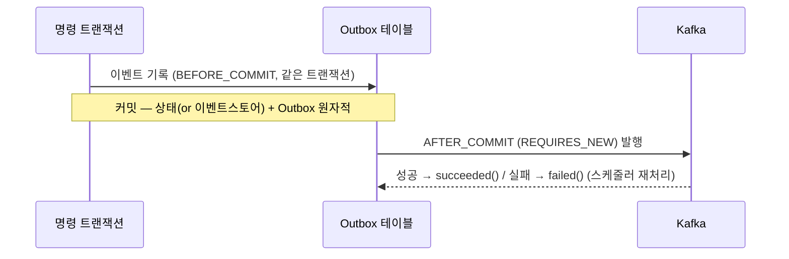

# DESIGN-003: Write Model

- **상태**: Accepted
- **작성자**: Team
- **작성일**: 2026-06-30
- **최종 수정일**: 2026-06-30
- **관련 RFC**: [[RFC-021-event-identity-and-global-ordering]] · [[RFC-008-observability]]
- **관련 ADR**: [[02.selective-event-sourcing-scope]] · [[05.event-store-mysql-table]] · [[07.command-domain-jpa-separation]] · [[16.optimistic-concurrency-control]] · [[19.caching-redis-role]] · [[22.event-identity-and-global-ordering]] · [[10.event-schema-evolution]]
- **관련 Design Doc**: [[DESIGN-001]] · [[DESIGN-002]] · [[DESIGN-004]] · [[DESIGN-005]]

---

## 1. Background

V1 쓰기 모델은 빈약 도메인(anemic domain model)으로 비즈니스 로직이 도메인 서비스에 분산되어 있었다 ([[02-domain-limitations]] #1). 또한 read/write 코드가 혼재되어 있어 CQRS 도입 시 명확한 쓰기 경계가 필요하다. V2에서는 컨텍스트별 특성에 따라 Event Sourcing 적용 여부를 **선택적**으로 결정하되([[02.selective-event-sourcing-scope]]), 대외 이벤트 발행 경로는 모든 컨텍스트가 동일한 Outbox 패턴을 사용한다.

## 2. Goal

- ES 컨텍스트(`reservation` · `timetable` · `restaurant`)의 쓰기 모델 메커니즘을 확정한다.
- 비-ES 컨텍스트(`schedule` · `user` · `authenticate`)의 쓰기 모델 메커니즘을 확정한다.
- 현행/lookup 컨텍스트(`menu` · `category` · `company`)의 처리 방침을 정한다.
- 모든 컨텍스트가 공유하는 대외 이벤트 발행 경로(Outbox→Kafka)를 확정한다.

## 3. Non-Goal

- 도메인 이벤트 카탈로그(컨텍스트별 구체 이벤트 목록·페이로드·버전 정책) — **이벤트 스토밍 재실시 후 확정**한다. 본 문서는 *메커니즘*만 확정한다.
- 읽기 모델(프로젝션, read model) — [[DESIGN-004]]에서 다룬다.
- 사가(Saga) 및 교차 애그리거트 일관성 — [[DESIGN-007]]에서 다룬다.
- 이벤트 스키마 진화 세부 전략 — [[10.event-schema-evolution]]에서 다룬다.

## 4. Proposed Solution

### 4.1 ES 컨텍스트 — `reservation` · `timetable` · `restaurant`

진실의 원천 = **append-only 이벤트 스트림**. 현재 상태는 이벤트 리플레이로 재구성한다.

#### 애그리거트 책임 (빈약 도메인 탈피)

```kotlin
// 개념 예시 — 실제 시그니처는 구현 사이클에서 확정
class Reservation private constructor(/* state */) {
    fun handle(command: CancelReservation): List<DomainEvent> {
        // 불변식 검증은 애그리거트 안에서 (방문 3일 전까지만 등)
        require(canCancel(command.now)) { "취소 가능 기한 초과" }
        return listOf(ReservationCancelled(id, command.reason, command.now))
    }
    fun apply(event: ReservationCancelled): Reservation { /* 불변 전이 */ }
}
```

- `handle(command) → List<DomainEvent>`: 불변식 검증 후 발생할 이벤트를 반환.
- `apply(event) → newState`: 이벤트를 상태에 적용(불변 복사). 리플레이·신규 발생에 공용.
- V1의 도메인 서비스 검증 로직([[02-domain-limitations]] #1)은 애그리거트로 이전한다.

#### 이벤트 스토어 (MySQL 직접 구현 — [[05.event-store-mysql-table]])

```
event_store(
  event_id     BINARY(16),                      -- UUIDv7. 전역 유일 정체성 + 재구축 keyset 커서: inbox/dedup·causation 앵커·Kafka messageId
  aggregate_type, aggregate_id, sequence_no,    -- (aggregate_id, sequence_no) UNIQUE
  event_type, event_version, payload(JSON),
  occurred_at,
  -- 봉투 추적메타: correlation_id, causation_id, traceparent (§공통)
  PRIMARY KEY (event_id), UNIQUE (aggregate_id, sequence_no)   -- UUIDv7 PK: 삽입 지역성 양호, 재구축 keyset = PK 스캔
)
```

- **정체성·열거**: `event_id`(UUIDv7, 전 컨텍스트 공통 dedup/causation 앵커 + 재구축 *keyset* 열거 커서 겸용 — 순서 정확성 아님)는 [[22.event-identity-and-global-ordering]]에서 확정. 비-ES Outbox 이벤트도 `event_id` 보유. (전용 `global_seq`는 [[RFC-021-event-identity-and-global-ordering]] 닫힘으로 불채택 — UUIDv7이 커서를 겸한다.)

#### 동시성 제어

[[16.optimistic-concurrency-control]] 2026-06-17 개정: 한 자리에 대한 결정을 한 줄로 세운다.

```
lock(aggregate_id)            # L1: Redisson 분산 락 (Redis 불가 시 L1′: DB lock-row FOR UPDATE 폴백)
  load(replay) → version N
  handle(cmd) → events
  append (aggregate_id, N+1)  # L0: (aggregate_id, sequence_no) UNIQUE = 정확성 백스톱(불변)
release(lock)
```

- **L0 UNIQUE는 절대 제거하지 않는다** — 분산 락은 liveness지 safety가 아니다([[19.caching-redis-role]] 단일 인스턴스·`allkeys-lru`·페일오버로 락 유실 가능). 락이 풀려도 UNIQUE가 이중 점유를 최종 거절. (V1의 부재 #6 해소)
- 락 범위 = **단일 `aggregate_id`만**(전역 락 금지). 교차 애그리거트는 사가([[DESIGN-007]]). ES 쓰기 경로 한정 — 비-ES는 DB 행 락 그대로.

#### 스냅샷 최적화

기존 `*Snapshot` 패턴을 재활용해 N개 이벤트마다 스냅샷 저장 → 리플레이 단축. 스냅샷 낀 로드의 expected `sequence_no` = 스냅샷 버전 + 이후 이벤트 수([[DESIGN-009]]).

#### 전용 제품 미도입

현 규모에서 EventStoreDB/Axon은 과함. 근거 [[05.event-store-mysql-table]].

### 4.2 비-ES 컨텍스트 — 상태 + Outbox (`schedule` · `user` · `authenticate`)

진실의 원천 = **현재 상태 테이블**(V1 방식 유지). 변경 시 통합 이벤트를 Outbox로 발행한다.

1. 커맨드 → 애그리거트가 상태 변경(행위 중심으로 개선) → 상태 테이블 저장.
2. **같은 트랜잭션**에서 Outbox에 통합 이벤트 기록 (timetable `BEFORE_COMMIT` 패턴).
3. 커밋 후 Kafka 발행.

> **도메인/JPA 분리 유지** ([[07.command-domain-jpa-separation]]): 1번의 애그리거트는 순수 도메인(`domain`)이고, 상태 테이블은 별도 JPA 엔티티(`adapter/out`)로 매핑한다. 애그리거트에 `@Entity` 를 붙이지 않는다(도메인 JPA 오염 금지). V1 방식 그대로.

> ES냐 비-ES냐의 차이는 1번(이벤트 스토어 vs 상태 테이블)뿐이다. 2~3번(Outbox 발행)은 동일하다.

### 4.3 현행/lookup — `menu` · `category` · `company`

저빈도·lookup 성격. 상태 테이블만 유지하며, **다른 컨텍스트가 구독해야 할 때만** Outbox 이벤트를 추가한다. 그 외 변경 없음.

### 4.4 공통: 대외 이벤트 발행 경로 (Outbox → Kafka)

ES·비-ES 무관하게 동일하다. [[07.reservation]]에서 검증된 패턴을 일반화한다.



- **Zero Payload** 원칙 계승([[07.reservation]]): 메시지는 식별자 중심, 컨슈머가 최신 상태/이벤트 조회. 스키마 진화·DLQ 재처리 안전.
- **eventVersion** 보유(`AbstractEvent`)로 이벤트 진화 대응. 호환성 규칙·읽기 시 업캐스팅 전략은 [[10.event-schema-evolution]].
- **재처리**: 스케줄러 기반 미발행 Outbox 재시도, Consumer 실패는 PoisonMessage 별도 관리([[07.reservation]] 계승).
- **추적 메타 공통 충전**: `AbstractEvent`의 추적 메타(`correlationId`·`causationId`·`traceparent` — [[DESIGN-011]], [[RFC-008-observability]])는 바로 이 공통 발행 경로에서 채운다. `correlationId`는 사슬 루트를 묶어 무변경 전파하고(필수), `causationId`는 **직전 원인 메시지의 `event_id`**(원인이 커맨드면 `commandId`)를 가리키며([[22.event-identity-and-global-ordering]]), `traceparent`는 W3C Trace Context로 OTel 추적을 봉투에 직렬화한다. 발행 경로가 ES·비-ES 무관하게 동일하므로, 추적 메타도 발행자가 일일이 신경 쓰지 않고 이 한 경로에서 일관 충전된다 — 채움 시점은 **Outbox 기록(트랜잭션 내)**이라 발행 단계에서 뒤늦게 채우는 유실을 피한다.

## 5. Alternatives Considered

- **전용 이벤트 스토어 제품(EventStoreDB/Axon) 도입**: 현 규모에서 과잉. MySQL 직접 구현으로 충분하며, 필요가 증명될 때 도입([[05.event-store-mysql-table]]).
- **전역 순서 보장용 `global_seq` 컬럼 추가**: [[RFC-021-event-identity-and-global-ordering]] 닫힘으로 불채택. UUIDv7이 keyset 커서를 겸한다.
- **낙관적 락(Optimistic Lock)만 사용**: [[16.optimistic-concurrency-control]] 개정에서 비관 락 + UNIQUE 백스톱으로 변경. 낙관적 락은 충돌 시 재시도 부담이 예약 컨텍스트에서 과함.
- **코드 생성 도구(MapStruct) 기반 도메인↔JPA 매핑**: 비채택. 경계를 흐리는 추상이 이득보다 해가 크다([[07.command-domain-jpa-separation]]).

## 6. Details

- 스냅샷 로드 순서 및 생명주기 관리는 [[DESIGN-009]]에서 상세히 다룬다.
- 이벤트 스키마 진화(호환성 규칙, 업캐스팅) 세부 전략은 [[10.event-schema-evolution]]에서 다룬다.
- 사가 패턴을 통한 교차 애그리거트 일관성은 [[DESIGN-007]]에서 다룬다.
- 컨텍스트별 구체 이벤트 목록·페이로드·버전 정책은 이벤트 스토밍 재실시 후 후속 문서로 확정한다.

## 7. Risks & Mitigations

| 리스크 | 완화 방안 |
|--------|-----------|
| Redis 장애로 분산 락(L1) 유실 | L0 UNIQUE 백스톱이 최종 안전망. L1 불가 시 L1′(DB FOR UPDATE) 폴백 |
| 이벤트 스토어 무한 증가로 리플레이 지연 | 스냅샷 최적화로 리플레이 단축 ([[DESIGN-009]]) |
| 추적 메타 누락 (correlationId 등) | Outbox 기록(트랜잭션 내) 시점에 공통 충전 — 발행 단계 유실 없음 |
| 도메인 이벤트 카탈로그 미확정으로 구현 지연 | 메커니즘 먼저 확정(본 문서). 카탈로그는 이벤트 스토밍 재실시 후 |
| 비-ES 컨텍스트에서 도메인 JPA 오염 | 애그리거트에 `@Entity` 금지 규칙을 ArchUnit/Konsist로 강제 |

## 8. Appendix

### 8.1 Glossary

| 용어 | 설명 |
|------|------|
| event store | append-only 이벤트 기록 테이블. ES 컨텍스트의 진실의 원천 |
| Outbox | 트랜잭션 내 이벤트 기록 → 커밋 후 Kafka 발행. 최소 1회 보장 |
| Zero Payload | 메시지 본문은 식별자만. 컨슈머가 최신 상태를 직접 조회 |
| UUIDv7 | 시간 기반 정렬 가능 UUID. keyset 커서·causation 앵커 겸용 |
| correlationId | 이벤트 사슬의 루트를 묶는 추적 ID (무변경 전파) |
| causationId | 직전 원인 메시지의 event_id (또는 commandId) |
| traceparent | W3C Trace Context 형식의 OTel 분산 추적 ID |

### 8.2 Reference

- 개요: [[DESIGN-001]]
- 관련 Design Doc: [[DESIGN-002]] · [[DESIGN-004]] · [[DESIGN-005]] · [[DESIGN-007]] · [[DESIGN-009]] · [[DESIGN-011]]
- ADR: [[02.selective-event-sourcing-scope]] · [[05.event-store-mysql-table]] · [[07.command-domain-jpa-separation]] · [[16.optimistic-concurrency-control]] · [[19.caching-redis-role]] · [[22.event-identity-and-global-ordering]] · [[10.event-schema-evolution]]
- 계승: [[07.reservation]] (Outbox·Zero Payload·PoisonMessage)
- RFC: [[RFC-021-event-identity-and-global-ordering]] · [[RFC-008-observability]]

## Changelog

| 날짜 | 내용 |
|------|------|
| 2026-06-30 | DESIGN-003 템플릿으로 재작성 (원본: `02-write-model.md`) |
