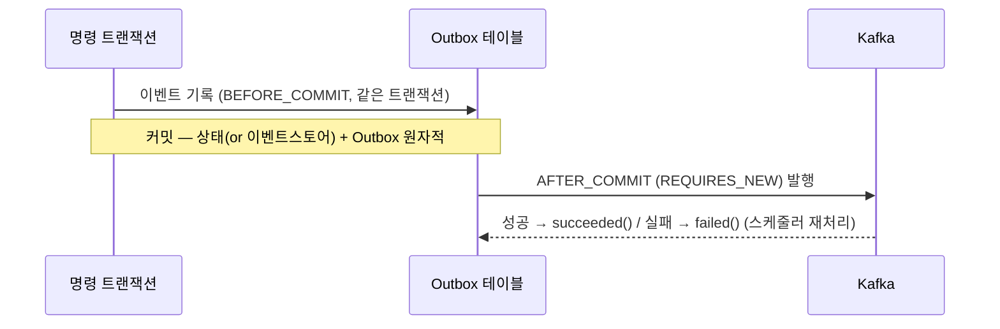

# DESIGN-003: Write Model

- **상태**: Accepted
- **작성자**: Team
- **작성일**: 2026-06-30
- **최종 수정일**: 2026-06-30
- **관련 RFC**: [[RFC-021-event-identity-and-global-ordering]] · [[RFC-008-observability]]
- **관련 ADR**: [[02.selective-event-sourcing-scope]] · [[05.event-store-mysql-table]] · [[07.command-domain-jpa-separation]] · [[16.optimistic-concurrency-control]] · [[19.caching-redis-role]] · [[22.event-identity-and-global-ordering]] · [[10.event-schema-evolution]]
- **관련 Design Doc**: [[DESIGN-001]] · [[DESIGN-002]] · [[DESIGN-004]] · [[DESIGN-005]]

---

## 1. Background

V1 쓰기 모델은 빈약 도메인(anemic domain model)으로 비즈니스 로직이 도메인 서비스에 분산되어 있었다 ([[02-domain-limitations]] #1). 또한 read/write 코드가 혼재되어 있어 CQRS 도입 시 명확한 쓰기 경계가 필요하다. V2에서는 컨텍스트별 특성에 따라 Event Sourcing 적용 여부를 **선택적**으로 결정하되([[02.selective-event-sourcing-scope]]), 대외 이벤트 발행 경로는 모든 컨텍스트가 동일한 Outbox 패턴을 사용한다.

## 2. Goal

- ES 컨텍스트(`reservation` · `timetable` · `restaurant`)의 쓰기 모델 메커니즘을 확정한다.
- 비-ES 컨텍스트(`schedule` · `user` · `authenticate`)의 쓰기 모델 메커니즘을 확정한다.
- 현행/lookup 컨텍스트(`menu` · `category` · `company`)의 처리 방침을 정한다.
- 모든 컨텍스트가 공유하는 대외 이벤트 발행 경로(Outbox→Kafka)를 확정한다.

## 3. Non-Goal

- 도메인 이벤트 카탈로그(컨텍스트별 구체 이벤트 목록·페이로드·버전 정책) — **이벤트 스토밍 재실시 후 확정**한다. 본 문서는 *메커니즘*만 확정한다.
- 읽기 모델(프로젝션, read model) — [[DESIGN-004]]에서 다룬다.
- 사가(Saga, 코레오그래피 조율) 및 교차 애그리거트 일관성 — [[DESIGN-007]]에서 다룬다.
- 이벤트 스키마 진화 세부 전략 — [[10.event-schema-evolution]]에서 다룬다.

## 4. Proposed Solution

### 4.1 ES 컨텍스트 — `reservation` · `timetable` · `restaurant`

진실의 원천 = **append-only 이벤트 스트림**. 현재 상태는 이벤트 리플레이로 재구성한다.

#### 애그리거트 책임 (빈약 도메인 탈피)

```kotlin
// 개념 예시 — 실제 시그니처는 구현 사이클에서 확정
class Reservation private constructor(/* state */) {
    fun handle(command: CancelReservation): List<DomainEvent> {
        // 불변식 검증은 애그리거트 안에서 (방문 3일 전까지만 등)
        require(canCancel(command.now)) { "취소 가능 기한 초과" }
        return listOf(ReservationCancelled(id, command.reason, command.now))
    }
    fun apply(event: ReservationCancelled): Reservation { /* 불변 전이 */ }
}
```

- `handle(command) → List<DomainEvent>`: 불변식 검증 후 발생할 이벤트를 반환.
- `apply(event) → newState`: 이벤트를 상태에 적용(불변 복사). 리플레이·신규 발생에 공용.
- V1의 도메인 서비스 검증 로직([[02-domain-limitations]] #1)은 애그리거트로 이전한다.

#### 이벤트 스토어 (MySQL 직접 구현 — [[05.event-store-mysql-table]])

```
event_store(
  event_id     BINARY(16),                      -- UUIDv7. 전역 유일 정체성 + 재구축 keyset 커서: inbox/dedup·causation 앵커·Kafka messageId
  aggregate_type, aggregate_id, sequence_no,    -- (aggregate_id, sequence_no) UNIQUE
  event_type, event_version, payload(JSON),      -- payload = 도메인 데이터만(업캐스팅 대상)
  occurred_at,
  correlation_id BINARY(16), causation_id BINARY(16),   -- 봉투 추적메타: 타입 컬럼(계보 조회 키). traceparent는 비보존(Kafka 헤더 전용)
  PRIMARY KEY (event_id), UNIQUE (aggregate_id, sequence_no),  -- UUIDv7 PK: 삽입 지역성 양호, 재구축 keyset = PK 스캔
  INDEX (correlation_id), INDEX (causation_id)
)
```

- **정체성·열거**: `event_id`(UUIDv7, 전 컨텍스트 공통 dedup/causation 앵커 + 재구축 *keyset* 열거 커서 겸용 — 순서 정확성 아님)는 [[22.event-identity-and-global-ordering]]에서 확정. 비-ES Outbox 이벤트도 `event_id` 보유. (전용 `global_seq`는 [[RFC-021-event-identity-and-global-ordering]] 닫힘으로 불채택 — UUIDv7이 커서를 겸한다.)

- **봉투 추적메타 배치**(트리아지 C32 스키마 축 종결): 추적 메타 셋의 성격이 갈린다.
  - `correlation_id`·`causation_id` = 도메인 **계보**(어느 트랜잭션 묶음 / 직전 원인). event_store에 **영구 보존**하되 JSON 블롭이 아니라 **`BINARY(16)` 타입 컬럼 + 인덱스**로 둔다 — "이 correlation 묶음 이벤트 전부", "X가 일으킨 것들"처럼 **조회·계보 traverse 키**라 인덱싱이 필요하고 모양이 고정이라서다(`event_id`와 같은 가족). JSON에 묻으면 MySQL에서 인덱싱 손해.
  - `traceparent` = **휘발성 관측 전송**(W3C Trace Context; Tempo 보존기간 지나면 가리키는 trace 소멸). **event_store에 저장하지 않고 Kafka 메시지 헤더로만** 실어 보낸다([[DESIGN-011]] §4.3). 이로써 "`traceparent`를 봉투 헤더/페이로드 어디 둘지" 미결이 영구 스키마 인질이 되던 문제([[DESIGN-011]] Weakness)가 애초에 사라진다 — 영구 스키마에서 뺐으니 나중에 위치를 바꿔도 저장된 과거 이벤트 재직렬화가 없다.
  - `payload`는 도메인 데이터만 담고 진화(업캐스팅) 대상이며, 개방형 가변 횡단 필드용 `metadata JSON` 칸은 필요가 생길 때 추가한다(현재 미도입 — YAGNI).

#### 동시성 제어

[[16.optimistic-concurrency-control]] 2026-06-17 개정: 한 자리에 대한 결정을 한 줄로 세운다.

```
lock(aggregate_id)            # L1: Redisson 분산 락 (Redis 불가 시 L1′: DB lock-row FOR UPDATE 폴백)
  load(replay) → version N
  handle(cmd) → events
  append (aggregate_id, N+1)  # L0: (aggregate_id, sequence_no) UNIQUE = 정확성 백스톱(불변)
release(lock)
```

- **L0 UNIQUE는 절대 제거하지 않는다** — 분산 락은 liveness지 safety가 아니다([[19.caching-redis-role]] 단일 인스턴스·`allkeys-lru`·페일오버로 락 유실 가능). 락이 풀려도 UNIQUE가 이중 점유를 최종 거절. (V1의 부재 #6 해소)
- 락 범위 = **단일 `aggregate_id`만**(전역 락 금지). 교차 애그리거트는 사가(코레오그래피 — [[DESIGN-007]]). ES 쓰기 경로 한정 — 비-ES는 DB 행 락 그대로.

#### 스냅샷 최적화

기존 `*Snapshot` 패턴을 재활용해 N개 이벤트마다 스냅샷 저장 → 리플레이 단축. 스냅샷 낀 로드의 expected `sequence_no` = 스냅샷 버전 + 이후 이벤트 수([[DESIGN-009]]).

#### 전용 제품 미도입

현 규모에서 EventStoreDB/Axon은 과함. 근거 [[05.event-store-mysql-table]].

### 4.2 비-ES 컨텍스트 — 상태 + Outbox (`schedule` · `user` · `authenticate`)

진실의 원천 = **현재 상태 테이블**(V1 방식 유지). 변경 시 통합 이벤트를 Outbox로 발행한다.

1. 커맨드 → 애그리거트가 상태 변경(행위 중심으로 개선) → 상태 테이블 저장.
2. **같은 트랜잭션**에서 Outbox에 통합 이벤트 기록 (timetable `BEFORE_COMMIT` 패턴).
3. 커밋 후 Kafka 발행.

> **도메인/JPA 분리 유지** ([[07.command-domain-jpa-separation]]): 1번의 애그리거트는 순수 도메인(`domain`)이고, 상태 테이블은 별도 JPA 엔티티(`adapter/out`)로 매핑한다. 애그리거트에 `@Entity` 를 붙이지 않는다(도메인 JPA 오염 금지). V1 방식 그대로.

> ES냐 비-ES냐의 차이는 1번(이벤트 스토어 vs 상태 테이블)뿐이다. 2~3번(Outbox 발행)은 동일하다.

### 4.3 현행/lookup — `menu` · `category` · `company`

저빈도·lookup 성격. 상태 테이블만 유지하며, **다른 컨텍스트가 구독해야 할 때만** Outbox 이벤트를 추가한다. 그 외 변경 없음.

### 4.4 공통: 대외 이벤트 발행 경로 (Outbox → Kafka)

ES·비-ES 무관하게 동일하다. [[07.reservation]]에서 검증된 패턴을 일반화한다.



- **event-carried 페이로드**([[RFC-029-event-carried-payload-uniform]], 트리아지 C02): 모든 내부 도메인 이벤트는 **자기 시점의 사실(값 또는 불변 참조)을 페이로드에 싣는다.** V1 계승 Zero Payload(소비 측 최신 조회)는 폐기 — 조회가 재생(replay) 시 미래 값을 박는 time-travel 오염을 낳기 때문. 이벤트는 append-only·불변이라 실어도 stale이 되지 않는다. 규칙: *소비 측은 가변 최신 상태를 조회해 재생 이벤트를 채우지 않는다*(큰 blob은 불변 ID 참조 허용 — time-travel 없음). [[RFC-021-event-identity-and-global-ordering]] #4 생산-시점 박제의 전 이벤트 일반화. — **이 규칙이 곧 페이로드 리치니스 정책의 착지점**(트리아지 C01): [[RFC-003-messaging-delivery]]가 "thin/fat·ES/비-ES 분기는 별도 RFC로 미룸"이라 남긴 숙제를, 별도 RFC 없이 여기서 확정한다. 판단 기준은 단순하다 — *그 시점 사실은 전량 fat 탑재, 큰 blob만 불변 ID 참조*. "얼마나 담을까"를 이벤트마다 재지 않는다.
- **eventVersion** 보유(`AbstractEvent`)로 이벤트 진화 대응. 호환성 규칙·읽기 시 업캐스팅 전략은 [[10.event-schema-evolution]].
- **재처리**: 스케줄러 기반 미발행 Outbox 재시도, Consumer 실패는 PoisonMessage 별도 관리([[07.reservation]] 계승).
- **추적 메타 공통 충전**: `AbstractEvent`의 추적 메타(`correlationId`·`causationId`·`traceparent` — [[DESIGN-011]], [[RFC-008-observability]])는 바로 이 공통 발행 경로에서 채운다. `correlationId`는 사슬 루트를 묶어 무변경 전파하고(필수), `causationId`는 **직전 원인 메시지의 `event_id`**(원인이 커맨드면 `commandId`)를 가리키며([[22.event-identity-and-global-ordering]]), `traceparent`는 W3C Trace Context로 OTel 추적을 **Kafka 메시지 헤더**에 직렬화한다(event_store 비보존 — §이벤트 스토어 봉투 추적메타 배치). 발행 경로가 ES·비-ES 무관하게 동일하므로, 추적 메타도 발행자가 일일이 신경 쓰지 않고 이 한 경로에서 일관 충전된다 — 채움 시점은 **Outbox 기록(트랜잭션 내)**이라 발행 단계에서 뒤늦게 채우는 유실을 피한다.

## 5. Alternatives Considered

- **전용 이벤트 스토어 제품(EventStoreDB/Axon) 도입**: 현 규모에서 과잉. MySQL 직접 구현으로 충분하며, 필요가 증명될 때 도입([[05.event-store-mysql-table]]).
- **전역 순서 보장용 `global_seq` 컬럼 추가**: [[RFC-021-event-identity-and-global-ordering]] 닫힘으로 불채택. UUIDv7이 keyset 커서를 겸한다.
- **낙관적 락(Optimistic Lock)만 사용**: [[16.optimistic-concurrency-control]] 개정에서 비관 락 + UNIQUE 백스톱으로 변경. 낙관적 락은 충돌 시 재시도 부담이 예약 컨텍스트에서 과함.
- **코드 생성 도구(MapStruct) 기반 도메인↔JPA 매핑**: 비채택. 경계를 흐리는 추상이 이득보다 해가 크다([[07.command-domain-jpa-separation]]).

## 6. Details

- 스냅샷 로드 순서 및 생명주기 관리는 [[DESIGN-009]]에서 상세히 다룬다.
- 이벤트 스키마 진화(호환성 규칙, 업캐스팅) 세부 전략은 [[10.event-schema-evolution]]에서 다룬다.
- 사가(코레오그래피 기본) 패턴을 통한 교차 애그리거트 일관성은 [[DESIGN-007]]에서 다룬다.
- 컨텍스트별 구체 이벤트 목록·페이로드·버전 정책은 이벤트 스토밍 재실시 후 후속 문서로 확정한다.

## 7. Risks & Mitigations

| 리스크 | 완화 방안 |
|--------|-----------|
| Redis 장애로 분산 락(L1) 유실 | L0 UNIQUE 백스톱이 최종 안전망. L1 불가 시 L1′(DB FOR UPDATE) 폴백 |
| 이벤트 스토어 무한 증가로 리플레이 지연 | 스냅샷 최적화로 리플레이 단축 ([[DESIGN-009]]) |
| 추적 메타 누락 (correlationId 등) | Outbox 기록(트랜잭션 내) 시점에 공통 충전 — 발행 단계 유실 없음 |
| 도메인 이벤트 카탈로그 미확정으로 구현 지연 | 메커니즘 먼저 확정(본 문서). 카탈로그는 이벤트 스토밍 재실시 후 |
| 비-ES 컨텍스트에서 도메인 JPA 오염 | 애그리거트에 `@Entity` 금지 규칙을 ArchUnit/Konsist로 강제 |

## 8. Appendix

### 8.1 Glossary

| 용어 | 설명 |
|------|------|
| event store | append-only 이벤트 기록 테이블. ES 컨텍스트의 진실의 원천 |
| Outbox | 트랜잭션 내 이벤트 기록 → 커밋 후 Kafka 발행. 최소 1회 보장 |
| event-carried | 이벤트가 자기 시점의 값(또는 불변 참조)을 페이로드에 실음 — 불변이라 stale 없음. Zero Payload 대체([[RFC-029-event-carried-payload-uniform]]) |
| UUIDv7 | 시간 기반 정렬 가능 UUID. keyset 커서·causation 앵커 겸용 |
| correlationId | 이벤트 사슬의 루트를 묶는 추적 ID (무변경 전파) |
| causationId | 직전 원인 메시지의 event_id (또는 commandId) |
| traceparent | W3C Trace Context 형식의 OTel 분산 추적 ID |

### 8.2 Reference

- 개요: [[DESIGN-001]]
- 관련 Design Doc: [[DESIGN-002]] · [[DESIGN-004]] · [[DESIGN-005]] · [[DESIGN-007]] · [[DESIGN-009]] · [[DESIGN-011]]
- ADR: [[02.selective-event-sourcing-scope]] · [[05.event-store-mysql-table]] · [[07.command-domain-jpa-separation]] · [[16.optimistic-concurrency-control]] · [[19.caching-redis-role]] · [[22.event-identity-and-global-ordering]] · [[10.event-schema-evolution]]
- 계승: [[07.reservation]] (Outbox·PoisonMessage) — Zero Payload는 [[RFC-029-event-carried-payload-uniform]]로 폐기, event-carried로 대체
- RFC: [[RFC-021-event-identity-and-global-ordering]] · [[RFC-008-observability]]

## Changelog

| 날짜 | 내용 |
|------|------|
| 2026-07-05 | line 124 리치니스 정책 착지 명시 — [[RFC-003-messaging-delivery]]가 "별도 RFC로" 미룬 thin/fat·ES/비-ES 분기 숙제를 새 RFC 없이 event-carried 규칙으로 확정(트리아지 C01 종결). 기준: 그 시점 사실 전량 fat, 큰 blob만 불변 참조. |
| 2026-07-05 | §4.4 페이로드 정책 정정 — Zero Payload 폐기, **event-carried 일원화**([[RFC-029-event-carried-payload-uniform]], 트리아지 C02). 본문 line 124·용어집·계승 참조 갱신, Weakness §4.4 항목 종결. time-travel 오염 원천 봉쇄. |
| 2026-06-30 | DESIGN-003 템플릿으로 재작성 (원본: `02-write-model.md`) |

---

## Weakness (Devil's Advocate 반박 포인트)

- **§4.1 event_store append-only 무한 성장 — 스냅샷은 리플레이만 줄이지 저장 성장은 안 줄인다** — 스냅샷 최적화(§스냅샷)는 로드 시 재생할 이벤트 수를 줄일 뿐, event_store 테이블 자체는 계속 커진다. 파티셔닝·아카이빙·콜드 스토리지 이관 전략이 부재하다. Risk 표는 "리플레이 지연"만 완화 대상으로 적었고, 인덱스 비대·백업 시간·`(aggregate_id, sequence_no)` UNIQUE 인덱스의 물리 성장 같은 저장 측면은 다루지 않는다.
  - 답변 해당 내용 사이즈가 커지면 파티셔닝 예정 현재 적용 불필요, 해당 UNIQUE는 RedissonLock, 비관락 잡으면 필요 없을 수도 있음
    - **검토**: 파티셔닝 지연은 YAGNI로 타당 — 다만 파티션 키(occurred_at 레인지 또는 aggregate_id 해시)만 미리 못박아 두면 append-only 특성상 이후 이관이 쉬움. **UNIQUE는 유지 권장**: 락은 liveness, UNIQUE는 safety(§4.1). Redisson(L1)이 정상 경로인 한 락 유실 시 이중 append를 최종 거절하는 건 UNIQUE뿐이라 "락 잡으면 불필요"는 성립 안 함. DB 비관락 *단독*으로 완전히 갈 게 아니면 제거 금지(비용도 인덱스 하나라 저렴). 
- **§동시성 제어: Redisson 분산 락(L1)이 정상 경로 — 모든 ES 쓰기에 Redis 왕복 지연이 상시 추가** — L1이 정상 경로이므로 예약 취소 한 건마다 Redis lock 획득/해제 왕복이 크리티컬 패스에 들어간다. 그런데 §L0은 UNIQUE가 "정확성 백스톱"임을 명시한다 — 정확성이 UNIQUE로 이미 보장된다면, 락 없이 낙관적 append + UNIQUE 충돌 시 리플레이-재시도로 갈 수 있는지(락 프리 경로) 검토가 없다. §5 Alternatives는 낙관 락을 "재시도 부담"으로 기각했지만, 그 부담과 상시 Redis 왕복 비용을 정량 비교하지 않았다.
  - Redis가 HotSpot이 되는 것에 동의 해당 내용에 대한 뾰족한 대안이 없음, 만약 낙관락을 도입하는 경우 실패 처리에 대해서 고려해야 함
    - **검토**: 동의. 방향 — 예약 취소처럼 aggregate당 동시 쓰기가 드문 흐름은 **락프리(낙관 append + UNIQUE 위반 시 리플레이 후 bounded 재시도)**가 상시 Redis 왕복보다 쌀 수 있음. 경합 높은 aggregate(인기 timetable 좌석)만 선택적 비관락 → 도메인별 낙관/비관 혼용이 현실적. 실패 처리 = 재시도 상한·지수 백오프·초과 시 409 매핑을 문서에 명시. 결정 전 k6([[DESIGN-012]])로 충돌률 실측 후 확정 권장.
- **§4.4 Zero Payload + Kafka 컨슈머 조회 — ES 컨텍스트에서 컨슈머가 "최신 상태"를 조회하려면 다시 리플레이** — Zero Payload는 "컨슈머가 최신 상태/이벤트를 직접 조회"를 전제한다. 비-ES는 상태 테이블을 읽으면 되지만, ES 컨텍스트는 진실의 원천이 이벤트 스트림이라 "최신 상태 조회" = 리플레이(또는 스냅샷+델타)다. 즉 발행 경로를 "ES·비-ES 동일"이라 선언했지만 컨슈머 측 조회 비용이 근본적으로 다르며, ES 이벤트가 폭주할 때 조회 리플레이가 컨슈머 병목이 된다.
  - ZeroPayload 포기하는 것이 합리적, EVENT APPEN_ONLY라 수정 가능성이 없음 ES 폭주 시 리플레이는 SnapShot 주기를 조정해야 할 것으로 보임
    - **검토**: "포기"보다 **ES=이벤트-carried(내용 실음) / 비-ES=Zero Payload 분기**가 더 정확. Zero Payload의 목적은 stale 방지인데 ES 이벤트는 불변이라 실어도 안 stale → 오히려 컨슈머 리플레이/조회를 제거. 비-ES(가변 상태)는 Zero Payload 유지가 맞음. 스냅샷 주기는 command 측 로드 최적화라 *컨슈머* 조회 병목과는 다른 축 — 컨슈머 병목은 페이로드 정책으로 직접 해결. → §4.4에 페이로드 정책 ES/비-ES 분기 명시 필요.
    - **결정 (2026-07-05, [[RFC-029-event-carried-payload-uniform]])**: 분기 대신 **event-carried 일원화**로 확정 — 매 이벤트마다 "ES냐"를 판단하는 부담·오적용 위험을 없애고 time-travel 버그 클래스를 원천 봉쇄. 무트래픽이라 이벤트 크기 비용도 실질 0. Zero Payload 폐기, §4.4 본문·용어집·계승 정정 완료. 이 항목 **종결**.
- **§4.2 비-ES `BEFORE_COMMIT` Outbox 기록 + §4.4 `AFTER_COMMIT` 발행 — event store와 Outbox가 별 테이블이면 "원자적" 주장에 조건이 붙는다** — 다이어그램 Note는 "상태(or 이벤트스토어) + Outbox 원자적"이라 하지만, 이는 event_store와 outbox가 *같은 트랜잭션·같은 DB 커넥션*에 있을 때만 성립한다. ES 엔진이 command-infrastructure에서 독립 트랜잭션으로 append하면 원자성이 깨진다(이벤트는 저장됐는데 Outbox 기록 실패 = 발행 유실). 이 트랜잭션 경계 공유 요구가 명시되지 않았다.
  - 당연히 Outbox는 ES의 행위와 같은 TRX에 있어야 함. 이를 누락한 것으로 보이며, 추가 필요
    - **검토**: 동의 — 확정 사항이니 명문화. event_store append + outbox insert = **동일 트랜잭션·동일 datasource**(2PC 회피). 이는 event store를 별도 저장소/제품으로 분리하지 못한다는 제약과 직결되며, [[05.event-store-mysql-table]](MySQL 직접구현) 선택의 또 다른 근거. §4.4 다이어그램 Note를 "동일 커넥션 전제"로 못박고, §7 Risk에 "ES/Outbox 저장소 분리 시 원자성 상실" 행 추가.
- **§4.1 UUIDv7 커서가 "순서 정확성 아님"임을 자인 — 그러면서 재구축 keyset 열거를 UUIDv7 PK 스캔에 의존** — §4.1은 UUIDv7이 "재구축 keyset 열거 커서"이자 PK라 하면서 각주로 "순서 정확성 아님"을 붙였다. UUIDv7은 밀리초 해상도라 동일 밀리초 내 다중 삽입은 시간순 보장이 없다. aggregate 단위 재구축은 `sequence_no`로 정렬하니 안전하지만, "재구축 keyset = PK 스캔"이라 적은 *전역* 재구축(projection 재빌드 등)은 이 부정확성에 노출된다. keyset 커서와 순서 정확성을 한 컬럼에 겸하게 한 설계의 경계 조건이 흐리다.
  - UUIDv7의 순차에 대한 한계점 지적이므로 이 부분은 관련 DESIGN_DOC에서 다뤄야만 한다.
    - **검토**: 동의. 귀속처 = [[DESIGN-009]](재구축)·[[DESIGN-004]](projection 재빌드)·[[22.event-identity-and-global-ordering]]. 정정 포인트: 전역 재구축 keyset은 `(occurred_at, event_id)` 또는 aggregate별 `sequence_no` 정렬로 잡아야 안전 — 순수 UUIDv7 PK 스캔은 동일 ms 타이에 순서 부정확. 단 대부분 프로젝션은 aggregate 단위 순서만 필요해 실제 영향 범위는 좁음; 그 경계를 009에 적시. 003은 "정체성"만 다루고 순서 의미론은 링크 위임으로 충분.
- **§4.1 "전용 제품 미도입" — MySQL 직접 구현 시 리플레이·스냅샷·업캐스팅·동시성을 전부 자체 코드로 재발명** — EventStoreDB/Axon 기각의 대가는 append 최적화·스냅샷 생명주기(DESIGN-009)·스키마 업캐스팅(§10.adr)·낙관/비관 동시성을 모두 손으로 짜고 테스트하는 것이다. 프로토타입 규모에서 "과잉"이라지만, 이 자체 구현이야말로 가장 버그가 잦고(멱등성·경합·리플레이 정합성) 검증이 어려운 코드다. "MySQL로 충분"의 충분 기준이 규모(현재 낮음)로만 논증되고 구현 정확성 리스크로는 논증되지 않았다.
  - EventStoreDB -> 보통 MySQL에서 이후 이행하므로 기각, Axon 사용 문제 없긴하나 ES로 초기 이행하는 현업과 유사한 환경을 구성하고자 함
    - **검토**: 논거 타당(학습 목적 = 현업 유사환경). 보강 제안: 그렇다면 자체 구현 리스크(멱등·경합·리플레이 정합성)를 *회피 대상*이 아니라 **감수하는 학습 대상**으로 §5 Alternatives에 한 줄 명시 → devil's advocate가 지적한 "정확성 리스크 미논증"이 해소됨. 결정은 유지, 근거 문장만 보강. 
- **§4.1/§4.2 세 ES 컨텍스트만 이벤트 소싱 — 교차 애그리거트 일관성(사가)이 ES/비-ES 혼합에서 발생** — reservation(ES)이 schedule(비-ES)·restaurant(ES)와 얽히면 사가(§DESIGN-007 위임)는 진실의 원천이 이벤트 스트림인 쪽과 상태 테이블인 쪽을 동시에 조율해야 한다. 보상 트랜잭션의 원자성·순서가 두 저장 패러다임 경계에서 훨씬 어려워지는데, 본 문서는 "사가는 DESIGN-007"로 넘기며 *혼합 패러다임 사가*가 단일 패러다임보다 어렵다는 점 자체를 표시하지 않는다.
  - 상태 테이블과 해당 도메인들이 얼마나 깊은 연관성이 있는가가 중요할 것으로 보인다. 추가로 Payment 도메인도 log만 찍지만 ES로 처리해야할 것으로 보인다. (누락)
    - **검토**: 둘 다 타당. (a) [[DESIGN-007]] 사가 흐름을 목록화할 때 각 참여 컨텍스트에 저장 패러다임(ES/비-ES) 태깅 → 혼합 사가가 몇 개인지 드러나 리스크를 실측. (b) **Payment의 ES 승격은 유효한 미결** — 결제는 감사·분쟁·부분환불 이력이 append-only 이벤트에 가장 적합. 현재 [[DESIGN-015]]는 payment=ACL(상태+Outbox)로 두는데, §4.1 ES 목록 편입을 015와 교차로 재검토하고 컨텍스트 분류([[DESIGN-001]] §4.4) 재검토 항목으로 올릴 것.

> 본 절은 리뷰용 반박 정리이며, 문서의 결정을 뒤집지 않는다. 각 항목은 후속 검토 대상.
