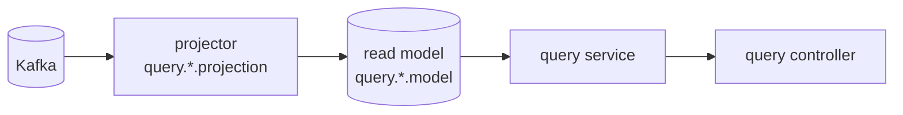

# DESIGN-004: Read Model

- **상태**: Accepted
- **작성자**: Team
- **작성일**: 2026-06-30
- **최종 수정일**: 2026-06-30
- **관련 RFC**: [[RFC-002-read-model-consistency]] · [[RFC-003-messaging-delivery]] · [[RFC-007-deployment-infra-ops]] · [[RFC-018-caching-redis-role]]
- **관련 ADR**: [[04.read-model-projection-and-replica]] · [[03.command-hexagonal-query-layered]]
- **관련 Design Doc**: [[DESIGN-001-design-overview]] · [[DESIGN-002-module-structure]] · [[DESIGN-003-write-model]] · [[DESIGN-010-deployment-runtime]]

---

## 1. Background

V1은 별도 read model 없이 쓰기 테이블을 공유 조회한다([[DESIGN-002-current-state]] §4). 이 방식은 command와 query 사이의 스키마 결합을 만들어, 읽기 트래픽이 쓰기 경로에 부담을 주고 교차 컨텍스트 조인이 필요한 화면에서 강결합이 발생한다. CQRS를 제대로 실현하려면 query 측을 command 테이블로부터 물리적으로 분리하고, 읽기 전용 모델을 독립적으로 운영해야 한다.

> ⚠️ 본 문서는 **목표 아키텍처**다. 현재(V1) 구현은 별도 read model 없이 쓰기 테이블을 공유 조회한다([[DESIGN-002-current-state]] §4). 프로젝션 전환은 [[DESIGN-005-migration]] 순서대로 단계적으로 도입한다.

## 2. Goal

query 측 읽기 모델 전략을 확정한다. 구체적으로:

- 읽기 소스의 두 갈래(이벤트 프로젝션 / 저빈도 lookup)를 정의하고 적용 기준을 못 박는다.
- 비-ES 컨텍스트의 읽기 방침을 확정한다.
- 일관성 모델(최종 일관성 기본, 예외 열기 정책)을 확정한다.
- Redis·캐싱의 역할과 경계를 확정한다.

## 3. Non-Goal

- 컨텍스트별 구체 프로젝션 스키마 설계 (구현 사이클에서 확정)
- read-your-writes 구현 상세 (화면별 증명 후 별도 ADR로 승격)
- 쿼리 성능 튜닝 수치 (측정 후 결정)

## 4. Proposed Solution

### 4.1 원칙: 읽기는 항상 query 측, command는 읽기를 서빙하지 않는다

CQRS에서 command의 책임은 검증+쓰기뿐이다. 조회는 전부 query 측이 처리한다. top-level 모듈 분리([[DESIGN-002-module-structure]])의 귀결로, **query는 command 테이블을 직접 조회하지 않는다**(스키마 결합 = 안티패턴).

### 4.2 읽기 소스 두 갈래

#### (가) 이벤트 프로젝션 read model — 기본

- `projection/` 컴포넌트가 `contract` 이벤트를 구독해 비정규화 `model/` 을 갱신.
- 교차 컨텍스트 조인·고읽기·다른 모양의 조회에 사용.
- **ES 컨텍스트는 최소 1개의 현재상태 프로젝션을 반드시 가진다** — 이벤트 스트림은 임의 조회에 못 쓰므로. ("프로젝션 미적용"은 *추가* 프로젝션을 안 만든다는 뜻이지 읽기 뷰가 0개라는 뜻이 아니다.)
- **조직: 도메인별 스키마 분리.** read model은 화면·조회 용도마다 여럿 생기는데, 이를 한 query 인스턴스 안에서 **도메인별 스키마로 나눠** 담는다 — 도메인 경계가 스키마 경계와 맞아 어느 read model이 어느 도메인 소속인지 분명해지고(`query.{domain}.model`), command 측 컨텍스트 분리와 대칭을 이룬다. 읽기 확장은 인스턴스 분할이 아니라 query 인스턴스의 HA 레플리카로 분산한다([[RFC-007-deployment-infra-ops]] · [[DESIGN-014-db-hosting-and-read-write-topology]]).

#### (나) 저빈도 lookup — projection이냐 published-subscription이냐, 소유자로 가른다

거의 안 변하는 참조 데이터(`category`·`company`·`menu`)도 읽기 소스는 (가)와 같은 종류다 — **남이 흘리는 걸 비동기로 받아 query DB의 로컬 테이블을 갱신**한다. 수단은 둘뿐이고, *그 데이터의 소유자가 누구냐*로만 갈린다([[RFC-002-read-model-consistency]]).

| 수단 | 언제 | 소스 |
|------|------|------|
| projection | 그 lookup을 **내 컨텍스트가 소유**할 때 | 내 도메인 이벤트를 구독해 경량 read model 갱신 |
| published-subscription | 그 lookup을 **다른 컨텍스트가 소유**하고 그쪽이 변경을 발행할 때 | 소유 컨텍스트의 published 변경을 구독해 로컬 테이블 갱신 |

- 둘 다 **async-fed 로컬 카피**다 — 읽기 지연이 당연한 것도 (가)와 같은 이유. **조회 시점에 원본을 동기 호출(cross-context fetch)하는 것은 금지** — 읽기 경로에 런타임 결합을 다시 들여 CQRS를 깬다([[RFC-002-read-model-consistency]]). published는 구독해 로컬에 적재하는 비동기 카피이지 동기 조회가 아니다.
- **seed는 수단이 아니다.** "static해서 seed"는 분해하면 사라진다 — 진짜 불변이면 *코드 상수*라 읽기 테이블이 없고, 가끔이라도 바뀌면 소유자가 있어 published-subscription이며, 테이블형이지만 배포로만 바뀌면 flyway로 초기 적재한 로컬 테이블일 뿐(적재는 초기화 디테일이지 읽기 전략이 아니다).
- 어느 수단이든 **command 테이블 직접 조회는 금지** — query DB는 command DB와 물리 분리라([[DESIGN-014-db-hosting-and-read-write-topology]]) 이 경계가 *물리적으로* 성립한다. (이전 "read replica 경유" 안은 query가 쓰기 스키마에 결합해 폐기.)
- 항목별 projection/published 귀속 표의 확정은 company·menu의 실제 소유권이 드러나는 구현 사이클에서. 여기서는 *원칙*만 못 박는다.

#### (다) 비-ES 컨텍스트는 기존 QueryDSL 조회를 유지

"query는 projection만 읽는다"는 규칙은 **ES로 전환된 컨텍스트에 적용되는 규칙**이지, 시스템 전체를 강제로 ES화하라는 요구가 아니다([[RFC-002-read-model-consistency]]). 발생시킬 이벤트도 없는 비-ES 컨텍스트에 projection 파이프라인을 억지로 얹는 건 비용 대비 이득이 의심스럽다. 따라서 비-ES 컨텍스트는 기존 QueryDSL 조회를 그대로 둔다. (단, 비-ES 컨텍스트가 ES 컨텍스트의 데이터를 조인해 읽어야 하는 경우가 생기면 통일 압력이 생긴다 — 그 필요성은 구현 사이클에서 검증.)

### 4.3 컨텍스트별 초기 읽기 전략

| 컨텍스트 | 초기 읽기 | 비고 |
|----------|-----------|------|
| `reservation` | 프로젝션 (예약 목록·상세, 식당명 비정규화) | ES — 현재상태 프로젝션 필수 |
| `restaurant` | 프로젝션 (검색·상세) | ES |
| `timetable` | 프로젝션 (가용 시간) | ES |
| `schedule` | 프로젝션 (또는 경량 lookup) | 변화 빈도 보고 결정 |
| `user`/`authenticate` | 경량 프로젝션 (단순 조회) + 일부 프로젝션 | |
| `menu` | (나) lookup — projection/published | 소유자 보고 확정 |
| `category`·`company` | (나) lookup — projection/published | 소유자 보고 확정 |

> 위 표는 선제적 깔기가 아니라 **아래 '읽기 요구 입증' 기준을 통과한 결과**다. (`schedule`만 변화 빈도 측정에 달려 미결 — 측정 후 프로젝션/경량 lookup 중 확정.)

### 4.4 프로젝션을 만들 자격 — '읽기 요구 입증' 기준

프로젝션은 공짜가 아니다(파이프라인·재구축·일관성 지연을 지고 온다). 그래서 "프로젝션을 가진다"는 **읽기 요구가 입증된 컨텍스트에 한한다**([[RFC-002-read-model-consistency]]). '입증' 기준이 느슨하면 결국 모든 컨텍스트가 프로젝션을 갖게 돼 YAGNI가 무너지므로, 기준을 명시한다 — 아래 중 **하나라도** 해당하면 입증된 것으로 본다.

1. **교차 컨텍스트 조인 회피** — 다른 컨텍스트의 데이터를 함께 보여줘야 하는 화면이 있고(예: 예약 목록의 식당명), 그것을 런타임 조인 대신 비정규화로 풀어야 할 때.
2. **ES 컨텍스트의 현재상태 조회** — 이벤트 스트림은 임의 조회에 못 쓰므로 ES 컨텍스트는 최소 1개 현재상태 프로젝션이 *무조건* 필요(위 (가)).
3. **읽기 모양이 쓰기 모델과 다름** — 검색·집계·정렬 등 쓰기 정규화 모델로는 비싼 조회 형태가 실제 화면에 있을 때.
4. **읽기 부하 격리** — 조회 트래픽이 쓰기 경로에 부담을 주어 분리가 측정으로 정당화될 때.

위 어디에도 안 닿으면 프로젝션을 만들지 않고 (나)의 lookup(projection/published) 또는 비-ES QueryDSL((다))로 간다. "있으면 편하다"는 입증이 아니다 — 실재하는 화면/부하 요구만 입증으로 친다.

### 4.5 교차 컨텍스트 예시

예약 목록이 "식당 이름"을 보여줘야 할 때:
1. `restaurant`(ES) 가 이름 변경 → `RestaurantRenamed` 이벤트 발행(Outbox→Kafka).
2. `query.reservation.projection` 이 구독 → 자기 read model의 식당명 칼럼 갱신.
3. 예약 조회는 **조인 없이** 빠르게 읽고, 컨텍스트 결합은 이벤트로만.

### 4.6 query layered — projection은 갱신, service는 조회

query 측은 layered(web/service/repository/projection/model)다([[03.command-hexagonal-query-layered]]). 두 경로의 책임과 트랜잭션 경계를 가른다([[RFC-002-read-model-consistency]]).

- **projection = 쓰기 경로.** 이벤트를 받아 read model을 *갱신*한다. 트랜잭션 경계는 **메시징 소비 단위**에 맞춰 닫는다(한 이벤트(배치) 처리 = 한 트랜잭션 + 오프셋 커밋).
- **service = 읽기 경로.** 그 모델을 *조회*해 DTO로 돌려준다. 단순 읽기이므로 트랜잭션 경계는 **service에서** 닫는다(읽기 전용).
- 두 경로는 같은 read model 테이블을 공유하되 방향이 반대다 — projection은 들어오는 이벤트로 쓰고, service는 화면 질의로 읽는다. 둘을 한 트랜잭션으로 묶지 않는다.

### 4.7 일관성

#### 기본은 최종 일관성 — read-your-writes는 증명된 화면만 예외

- **기본 비동기(최종 일관성)** — 프로젝션은 이벤트 구독으로 갱신되어 본질적으로 *뒤처진다*. 그래서 **"쓰고 바로 읽으면 아직 없을 수 있다"를 버그가 아니라 기본 사양으로 못 박는다**([[RFC-002-read-model-consistency]]). 이걸 받아들이지 않으면 일관성 예외가 시스템 전체로 번져 CQRS의 이점이 사라진다.
- **예외는 정책으로만 연다.** 동기 프로젝션·버전 토큰 read-your-writes·command DB 직접 읽기 같은 예외 수단은 전부 분리를 깨는 비용이 있으므로 기본값으로 깔지 않는다. "이 화면이 즉시 반영을 요구한다"가 *증명된* 경우에만 승인하고, 어떤 수단을 쓸지는 그 화면 성격을 보고 그때 고른다. 화면 목록을 미리 못 박지 않는 이유는, 증거 없이 예외를 여는 게 바로 막으려는 것이기 때문이다. (예약 확정 직후 "내 예약 목록"처럼 명백한 후보가 나오면 신규 ADR "읽기 신선도 예외 정책"으로 승격.)
- Zero Payload([[DESIGN-003-write-model]])라 projector는 필요한 최신 상태를 조회해 채울 수 있어 재처리 안전.

#### 프로젝션 지연 — 방향은 여기, 숫자는 측정 후

- 지연을 정상으로 받아들이기로 했으니 남는 건 "얼마까지"다. 절대 수치(p99 몇 ms)는 실제 메시징 lag을 재기 전엔 근거 없는 숫자가 된다. 그래서 **정책 형태만 지금 확정**한다 — p99 지연 목표를 두고 초과 시 알람을 건다는 골격. 목표의 절대값은 [[RFC-003-messaging-delivery]]의 lag 측정과 함께 운영 단계에서 튜닝한다.

### 4.8 Redis·캐싱의 자리 — 프로젝션 위에 캐시를 얹지 않는다

> 근거·기각된 대안은 [[RFC-018-caching-redis-role]].

프로젝션 read model은 이미 조회 모양으로 비정규화해 디스크에 영속된 **머티리얼라이즈드 캐시**다. 그 앞에 Redis를 한 겹 더 두면 *캐시 위의 캐시*다. **기본적으로 read model 앞에 캐시 층을 얹지 않는다.**

- 핫 쿼리가 느리면 1차 대응은 Redis 한 겹이 아니라 **그 화면 전용 프로젝션을 추가**하는 것이다(위 "프로젝션을 만들 자격"). read model은 용도마다 여럿 둘 수 있으니 이미 가진 메커니즘의 재사용이다.
- 읽기 확장은 캐시가 아니라 query 인스턴스 **HA 레플리카**로 분산한다([[DESIGN-010-deployment-runtime]]).
- 최종 일관 세계에서 TTL 캐시는 staleness를 **두 겹**으로 쌓는다(이벤트→프로젝션 지연 + 프로젝션→캐시 TTL). 그 2차 staleness를 기본으로 사들이지 않는다.
- 캐시를 정말 둘 패턴(프로젝션으로도 비싼 진짜 핫 패턴)은 읽기 분포 **측정 후** 그 패턴에 한해 결정한다 — 전역 캐시 정책을 먼저 세우지 않는다(위 "프로젝션 지연 — 숫자는 측정 후"와 같은 결).

**그래서 V2에서 Redis는 읽기 캐시가 아니다.** 역할은 "여러 인스턴스가 공유해야 하는 휘발성·짧은 TTL **조정 상태**" 전용 — 레이트리밋 카운터, 일시적 분산 락(도메인 동시성은 애그리거트+낙관적 락이 먼저 흡수하므로 사용 면적 축소, [[DESIGN-006-aggregate-design]]), 요청-단 멱등 디듀프([[DESIGN-013-api-contract]] 잔여 케이스). 인증 부산물(refresh·폐기)은 [[DESIGN-017-auth-token]]이 Redis 밖으로 들어냈으므로, 남는 워크로드는 손실 허용 **단일 durability 등급**뿐 → `allkeys-lru` 하나로 충분(호스팅·토폴로지는 [[DESIGN-010-deployment-runtime]]).

## 5. Alternatives Considered

- **read replica 경유 조회** — query가 command DB의 read replica를 직접 읽는 방안. query가 쓰기 스키마에 결합해 CQRS를 깨므로 폐기.
- **Redis를 read model 앞에 캐시로** — 프로젝션이 이미 비정규화된 머티리얼라이즈드 캐시이므로 캐시 위의 캐시가 된다. staleness를 두 겹으로 쌓는 비용도 있어 기각. 근거는 [[RFC-018-caching-redis-role]].
- **command DB 직접 읽기(query 측에서)** — 스키마 결합·읽기 부하 공유로 CQRS의 이점을 소거. 금지.

## 6. Details

해당 없음 (구체 프로젝션 스키마는 구현 사이클에서, 일관성 예외 수단은 화면별 증명 후 ADR로).

## 7. Risks & Mitigations

| 위험 | 완화 |
|------|------|
| 프로젝션 지연으로 인한 사용자 혼란 | "최종 일관성"을 기본 사양으로 명시. 즉시 반영 필요 화면은 증명 후 예외 정책으로 열기 |
| 프로젝션 재구축 비용 | Zero Payload 이벤트라 projector가 최신 상태를 조회해 채울 수 있어 재처리 안전. [[RFC-011-projection-rebuild-catchup]] 재구축 메커니즘 재사용 |
| 비-ES 컨텍스트가 ES 컨텍스트 데이터를 조인해야 하는 경우 | 구현 사이클에서 필요성 검증 후 통일 압력이 생기면 그때 결정 |
| Redis 사용 면적 확장 | Redis 역할을 "조정 상태 전용"으로 명시적으로 제한. 읽기 캐시 역할 금지 |

## 8. Appendix

### 8.1 Glossary

- **프로젝션(projection)**: 이벤트를 구독해 read model을 갱신하는 컴포넌트. query 측의 쓰기 경로.
- **머티리얼라이즈드 캐시**: 조회 모양으로 비정규화해 디스크에 영속된 read model. 프로젝션이 이미 이 역할을 한다.
- **published-subscription**: 소유 컨텍스트가 발행한 변경을 다른 컨텍스트가 구독해 로컬 테이블을 갱신하는 패턴.
- **Zero Payload**: 이벤트 본문에 상태를 직접 담지 않고 ID만 실어 컨슈머가 필요 시 조회하는 패턴([[DESIGN-003-write-model]]).
- **최종 일관성(eventual consistency)**: 이벤트 구독 기반 갱신 특성상 쓰기 직후 읽기에서 아직 반영이 안 될 수 있는 상태. 버그가 아니라 기본 사양.

### 8.2 Reference

- [[DESIGN-001-design-overview]] · [[DESIGN-002-module-structure]] · [[DESIGN-003-write-model]] · [[DESIGN-010-deployment-runtime]]
- RFC: [[RFC-002-read-model-consistency]] · [[RFC-003-messaging-delivery]] · [[RFC-007-deployment-infra-ops]] · [[RFC-018-caching-redis-role]]
- ADR: [[04.read-model-projection-and-replica]] · [[03.command-hexagonal-query-layered]]

## Changelog

| 날짜 | 변경 내용 |
|------|-----------|
| 2026-06-30 | DESIGN-004 템플릿으로 재작성. 원본 03-read-model.md 내용 전체 보존. 교차 참조 업데이트. |

---

## Weakness (Devil's Advocate 반박 포인트)

- **read-your-writes를 Non-Goal로 밀어낸 결과가 §4.7과 충돌** — §3은 read-your-writes 상세를 "화면별 증명 후 별도 ADR"로 미루는데, §4.7은 "예약 확정 직후 내 예약 목록"을 이미 명백한 후보로 지목한다. 예약 시스템에서 "방금 예약한 걸 바로 못 본다"는 부수적 엣지가 아니라 핵심 플로우다 — 가장 흔한 사용자 여정의 신선도 정책을 설계 문서가 열어두고 구현 사이클에 떠넘기면, 정작 그 예외 수단(동기 프로젝션/버전 토큰/command 직접 읽기) 선택이 프로젝션 파이프라인·트랜잭션 경계 설계를 거꾸로 제약한다. 나중에 고를 수 없는 걸 나중에 고르겠다고 선언한 셈.
- **§4.6 "projection 트랜잭션 = 메시징 소비 단위"가 교차 컨텍스트 비정규화를 깬다** — §4.5에서 `query.reservation.projection`은 `RestaurantRenamed`를 구독해 식당명 칼럼을 갱신한다. 그런데 한 예약 read model 행은 예약 이벤트 스트림과 식당 이벤트 스트림 **두 소스**에서 갱신된다. 한 이벤트=한 트랜잭션+오프셋 커밋 규칙 아래서, 식당명이 바뀐 뒤 아직 리네임 이벤트를 처리 못 한 예약 행과 이미 처리한 행이 공존하는 부분 갱신 상태가 정상 동작이 된다. 문서는 이 다중 소스 프로젝션의 갱신 순서·원자성·"어느 시점 스냅샷을 보여주나"를 다루지 않는다.
- **Zero Payload가 프로젝션 재처리를 "안전"하게 만든다는 주장의 사각** — §4.7·§7은 "projector가 최신 상태를 조회해 채우므로 재처리 안전"이라 한다. 그러나 최신 상태 조회는 command 측 최신값을 읽는 것이라, 과거 이벤트를 재생하는데 **미래 상태로 채워지는** time-travel 오염이 생긴다. 예: `PriceChanged(v3)` 재처리 시 조회하면 이미 `v5` 가격이 와서, v3 시점 프로젝션에 v5 값이 박힌다. Zero Payload는 재처리를 단순화하는 게 아니라 "이벤트가 시점 상태를 안 들고 있다"는 근본 제약을 프로젝션으로 떠넘긴 것 — 문서는 이 재구축 정합성을 [[RFC-011]]에 위임만 하고 검증하지 않는다.
- **"핫 쿼리엔 Redis 대신 전용 프로젝션 추가"(§4.8·§4.4)의 비용을 과소평가** — 화면 하나가 느릴 때마다 새 프로젝션을 만들면, 그 프로젝션은 (a) 백필 재구축, (b) 최종 일관성 지연, (c) 다중 소스 갱신 로직을 새로 지고 온다. Redis 한 겹은 배포로 롤백되지만, 새 프로젝션은 스키마·파이프라인·재구축 코드가 영구 자산으로 남는다. "이미 가진 메커니즘 재사용"이라지만 각 프로젝션은 독립 운영 부담이다 — 캐시의 staleness 두 겹을 피하려고 프로젝션 N개의 운영·정합성 부담 N배를 사는 트레이드오프를 문서는 저울질하지 않는다.
- **읽기 확장을 "HA 레플리카"로만 푼다는 게 쓰기(프로젝션) 병목을 못 가린다** — §4.2·§4.8은 읽기 확장을 인스턴스 분할이 아닌 HA 레플리카로 분산한다. 그러나 레플리카는 읽기만 나눈다. 도메인별 스키마를 한 query 인스턴스에 몰아넣은 구조(§4.2)에서, 프로젝션 쓰기(이벤트 소비→갱신)는 프라이머리 하나에 집중된다. 핫 스트림의 프로젝션 lag이 커질 때 레플리카를 늘려도 소비 처리량은 안 늘어 §4.7의 p99 지연 목표를 못 지킨다. "인스턴스 분할 안 함"을 원칙으로 못 박아 이 탈출구를 미리 닫았다.
- **비-ES 컨텍스트 조인 문제(§4.2 다)를 리스크 표로만 처리** — 비-ES가 ES 데이터를 조인해야 하면 "통일 압력이 생기면 그때 결정"이라 미룬다. 그런데 예약(ES)이 메뉴/카테고리(비-ES lookup)를 함께 보여주는 화면은 예약 상세에서 거의 확실히 발생한다. 이 경우 비-ES 컨텍스트는 QueryDSL로 자기 테이블을 읽지만 ES 데이터는 읽을 수 없으니, 결국 예약 프로젝션이 메뉴까지 비정규화하거나 비-ES를 강제 ES화하는 두 나쁜 선택으로 수렴한다 — "필요하면 그때"가 아니라 첫 레퍼런스 컨텍스트에서 바로 터질 결정.

> 본 절은 리뷰용 반박 정리이며, 문서의 결정을 뒤집지 않는다. 각 항목은 후속 검토 대상.
