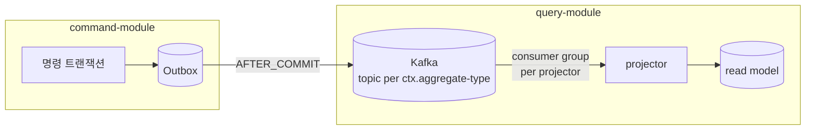
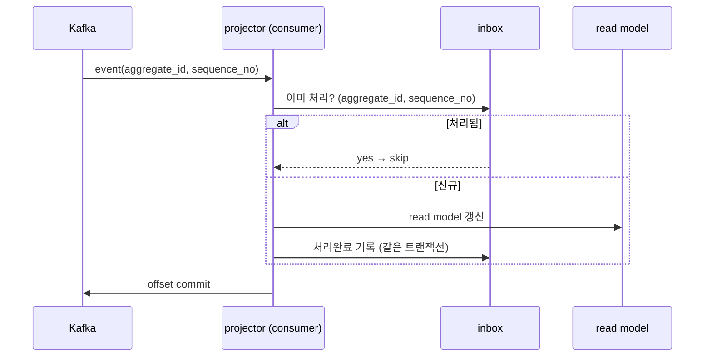

# DESIGN-008: Messaging Topology & Delivery Guarantee

- **상태**: Accepted
- **작성자**: Team
- **작성일**: 2026-06-30
- **최종 수정일**: 2026-06-30
- **관련 RFC**: RFC-003-messaging-delivery · RFC-008-observability · RFC-007-deployment-infra-ops · RFC-011-projection-rebuild-catchup
- **관련 ADR**: 09.event-ordering-and-delivery-guarantee · 05.event-store-mysql-table · 03.command-hexagonal-query-layered · 12.kafka-hosting-msk-vs-self-managed
- **관련 Design Doc**: DESIGN-001-overview · DESIGN-003-write-model · DESIGN-004-read-model · DESIGN-007-consistency-and-sagas · DESIGN-010-deployment-runtime

---

## 1. Background

command↔query 의 유일한 접점은 **이벤트(contract)** 다(ADR-03.command-hexagonal-query-layered). 그 이벤트가 흐르는 길이 Kafka다. 쓰기 트랜잭션과 발행의 원자성은 Outbox 가 책임지며(DESIGN-003-write-model §공통), Kafka 는 그 다음 단계 — **발행된 이벤트를 query 측 프로젝터에게 나르는 전달 채널**이다.

V1(`07.reservation`)에서 Kafka·Outbox·Zero Payload·PoisonMessage 자산이 이미 확립됐다. 본 문서는 그 위에서 토픽을 어떻게 자르고, 순서를 어디까지 보장하며, 무엇을 전달 보장하는지를 *메커니즘 수준*에서 확정한다.

> 본 문서는 **목표 아키텍처**다. 현재(V1) `timetable`은 단일 Outbox→Kafka 경로만 운영한다. 토픽 분할·프로젝터 컨슈머 그룹은 06.strangler-migration 순서대로 도입한다.

## 2. Goal

- Kafka 토픽 분할 축(컨텍스트/aggregate-type) 확정
- 파티션 키와 순서 보장 범위 확정
- 컨슈머 그룹 구성·리밸런싱 전략 확정
- 전달 보장 메커니즘(at-least-once + 멱등 → effectively-once) 확정
- 발행 relay 방식(폴링 vs CDC) 및 DLQ 운영 루프 확정

## 3. Non-Goal

- 구체 토픽 목록 (도메인 이벤트 카탈로그 TBD 의존)
- retention 절대값 (운영/구현 사이클에서 확정)
- 통합 이벤트 페이로드 모양·직렬화 규약·스키마 버저닝 (별도 RFC로 분리)
- lag 임계·SLI 절대값 (RFC-008-observability로 모아 확정)
- 동기 프로젝션 예외 (운영/구현 사이클에서 정의)

## 4. Proposed Solution

### 4.1 전제: Outbox가 발행 경계, Kafka는 전달 경계

### 4.2 토픽 구성 — 컨텍스트/aggregate-type 단위

토픽은 **`<context>.<aggregate-type>` 단위**로 자른다. 예: `reservation.reservation`, `restaurant.restaurant`, `timetable.timetable`, `schedule.schedule`.

- **왜 컨텍스트/aggregate-type 단위인가**: 토픽이 곧 "스트림의 의미 경계"다. 한 aggregate-type 의 모든 이벤트가 한 토픽에 모이면, 그 토픽을 구독하는 쪽은 "그 애그리거트의 생애"를 순서대로 읽는다. event_store 의 `aggregate_type` 축(ADR-05.event-store-mysql-table)과 자연 정렬된다.
- **왜 이벤트-타입별 토픽이 아닌가**: `ReservationCreated`·`ReservationCancelled` 를 각각 토픽으로 자르면 한 애그리거트의 사건이 여러 토픽에 흩어져 **순서 보장이 깨진다**(§4.3). 이벤트 타입은 토픽이 아니라 메시지의 `eventType`(`AbstractEvent`) 으로 구분한다.
- **너무 잘게 자르지 않는다(YAGNI)**: 컨텍스트당 애그리거트가 하나면 토픽도 하나다. 컨슈머가 필요 없는 타입은 무시(filter)하면 되고, 분리 비용(파티션·관리) 대비 이득이 없다.

> 토픽 목록의 확정은 도메인 이벤트 카탈로그(TBD)에 의존한다. 본 문서는 **분할 축(컨텍스트/aggregate-type)** 만 확정한다.

### 4.3 파티션 키 = aggregate_id → 애그리거트별 순서 보장

메시지의 **파티션 키는 `aggregate_id`** 로 고정한다.

- Kafka 의 순서 보장은 **파티션 내부**에서만 성립한다. 같은 키는 항상 같은 파티션으로 가므로, **한 애그리거트의 이벤트들은 발행 순서대로 소비**된다(`ReservationCreated` → `ReservationConfirmed` → `ReservationCancelled` 가 뒤집히지 않음).
- 서로 다른 애그리거트 간에는 순서를 보장하지 않는다 — 그리고 **보장할 필요도 없다**. 불변식은 애그리거트 경계 안에서만 성립(DESIGN-006-aggregate-design)하므로, 교차 애그리거트 전역 순서는 도메인 요구가 아니다.

#### 한계: 파티션 수 변경 = 재해싱

키→파티션 매핑은 기본적으로 `hash(key) % partitionCount` 다. **파티션 수를 늘리면 매핑이 바뀌어**, 같은 `aggregate_id` 가 이전과 다른 파티션으로 갈 수 있다. 그 순간 "예전 파티션의 미소비 이벤트"와 "새 파티션의 신규 이벤트" 사이에 순서 보장이 깨진다.

- **대응 원칙**: 파티션 수는 **고정 지향**으로 가고 보수적 초기값(일반 토픽 3, 고처리량 토픽 6~12 수준)을 둔다. 증설이 정말 필요하면 in-place 로 파티션을 늘려 재해싱하지 말고, **새 토픽으로 마이그레이션**한다(구 토픽 드레인 → 신 토픽으로 컷오버, RFC-003-messaging-delivery).
- 절대 초기값은 처리량 추정으로 잡고 증설 절차는 운영 사이클에서 확정(TBD). 본 문서는 **"파티션 수는 순서 보장의 계약 일부"** 라는 점을 못 박는다.

### 4.4 프로젝터용 컨슈머 그룹과 리밸런싱

각 프로젝터(`query.<ctx>.projection`, DESIGN-004-read-model)는 **자기 전용 컨슈머 그룹**을 가진다.

- 컨슈머 그룹이 다르면 같은 토픽을 **독립적으로** 읽는다. 즉 `reservation.reservation` 토픽을 `reservation` 프로젝터와 (식당명 비정규화가 필요한) 다른 프로젝터가 각자 자기 오프셋으로 소비한다 — pub/sub 팬아웃.
- **리밸런싱 영향**: 그룹 내 컨슈머가 추가/제거되면 파티션이 재배정된다. 재배정 중에는 짧게 소비가 멈추고, 인플라이트 메시지가 재처리될 수 있다 → **멱등 컨슈머(§4.5)가 전제**다. 리밸런싱을 빈번하게 만들지 않도록 컨슈머 수를 안정적으로 운영한다.
- **리밸런싱 전략 = cooperative-sticky 기본.** 기본(eager) 리밸런싱은 재배정 때 모든 컨슈머가 전 파티션을 한 번에 놓았다 다시 잡아 그룹 전체가 잠깐 멎는다("stop-the-world"). **cooperative-sticky(incremental)** 는 영향받는 파티션만 점진 이양해 정지 구간을 최소화하므로 이를 기본 전략으로 둔다(RFC-003-messaging-delivery). 멱등이 안전망이라 어느 전략이든 정확성은 같지만, cooperative-sticky 는 그 안전망이 부담할 재처리량과 정지 시간을 줄인다.

#### Competing consumers (그룹 내 병렬)

한 프로젝터를 수평 확장하려면 **같은 컨슈머 그룹에 인스턴스를 늘린다**. 파티션이 인스턴스들에 나뉘어 배정되어 병렬 소비(competing consumers)가 된다.

- **병렬 상한 = 파티션 수.** 인스턴스가 파티션보다 많으면 초과분은 놀고만 있는다. 이것이 §4.3 에서 "파티션 수를 넉넉히"의 또 다른 이유다.
- 순서 보장은 여전히 파티션 단위 → **같은 `aggregate_id` 는 한 인스턴스가 순서대로** 처리한다. 병렬화해도 애그리거트별 순서는 안전하다.

### 4.5 전달 보장 — at-least-once + 멱등 → effectively-once

#### 우리가 택하는 보장: at-least-once

- Outbox 의 AFTER_COMMIT 발행과 스케줄러 재시도(DESIGN-003-write-model)는 **누락보다 중복을 허용**하는 설계다. 즉 같은 이벤트가 1회 이상 도착할 수 있다.
- Kafka 소비 측도 "처리 후 오프셋 커밋" 순서라, 처리 성공·오프셋 커밋 실패 시 재소비가 일어난다 → 역시 중복 가능.

#### 중복을 멱등 컨슈머/inbox 로 흡수 → effectively-once

at-least-once 의 중복은 **컨슈머가 멱등**이면 결과적으로 1회 효과(effectively-once)가 된다.

- **inbox 패턴**: 컨슈머는 처리한 이벤트의 식별자(`aggregate_id` + `sequence_no`, 또는 이벤트 ID)를 inbox(처리완료 기록)에 남기고, **이미 처리한 것은 스킵**한다. read model 갱신과 inbox 기록을 **한 트랜잭션**으로 묶어 원자화한다.
- **자연 멱등 가능 케이스**: Zero Payload(DESIGN-003-write-model)라 프로젝터가 "최신 상태를 조회해 덮어쓰기(upsert)"하는 경우, 같은 이벤트를 두 번 처리해도 결과가 같다. 이때는 inbox 없이도 멱등이 성립할 수 있다 — 단, 순서 역전(같은 애그리거트는 §4.3으로 막힘) 가정 아래에서만.
- **inbox 생략의 자격 조건**: inbox 생략은 "순서 역전 없음 **+** 자연 멱등 upsert"를 **동시에** 만족하는 컨슈머에만 허용한다. 둘 중 하나라도 깨지면 inbox를 유지한다. 어떤 프로젝터가 실제로 순서 역전 무풍지대인지는 컨슈머별로 검증한다(귀속은 운영/구현 사이클, RFC-003-messaging-delivery).
- **유지하는 inbox의 수명**: inbox는 무한히 쌓지 않는다. 보존 기간을 짧게(재처리 윈도를 덮을 만큼) 두고 주기적으로 GC 한다.

### 4.6 보장 성립 조건 — 그레이스풀 셧다운과 인플라이트 드레인

위 보장은 **종료가 깔끔할 때만** 성립한다. 막무가내 종료(SIGKILL·OOM)는 인플라이트 메시지를 어중간한 상태로 남긴다.

- **command 측**: 셧다운 시 진행 중 트랜잭션을 마치고, Outbox 발행 스케줄러를 멈춘다. 미발행분은 다음 기동 때 재발행(at-least-once 보존).
- **query 측(프로젝터)**: 셧다운 시 **현재 폴링한 배치를 끝까지 처리하고 오프셋을 커밋한 뒤** 종료한다(인플라이트 드레인). 드레인 없이 죽으면 미커밋 오프셋이 재소비되는데, 이는 멱등(§4.5)으로 흡수되므로 **안전하되 비효율** — 그래서 드레인으로 재처리량을 줄인다.
- **리밸런싱 직전**도 동일 — 파티션을 내놓기 전에 진행분을 커밋(또는 멱등에 위임)한다.

> 한 줄: **멱등은 안전망, 드레인은 효율.** 둘 다 있어야 effectively-once 가 비용 없이 성립한다.

### 4.7 백프레셔와 consumer lag

- **consumer lag** = 토픽의 최신 오프셋과 컨슈머 커밋 오프셋의 차 = read model 의 **최종 일관성 지연**(DESIGN-004-read-model §일관성)의 직접 지표다. lag 모니터링이 곧 "읽기 신선도" 모니터링이다.
- **백프레셔**: 프로젝터가 못 따라가면 lag 가 쌓인다. 대응은 (1) competing consumers 로 병렬 확장(§4.4, 상한=파티션 수), (2) 프로젝션 갱신 자체를 가볍게(Zero Payload upsert), (3) 그래도 모자라면 파티션 증설(§4.3 한계 감수, 정지 후).
- Kafka 는 디스크에 보존하므로 컨슈머가 느려도 producer 를 막지 않는다(브로커가 버퍼). 즉 백프레셔는 "command 가 느려지는" 문제가 아니라 "읽기가 늦어지는" 문제다 — CQRS 의 의도된 비대칭과 정합.
- **lag 임계·SLI 단일화는 별도 관측 RFC로 분리.** lag 을 핵심 SLI 로 본다는 *전제*(메커니즘)는 여기서 깔되, warn/crit 임계 절대값과 RFC-008-observability·RFC-007-deployment-infra-ops SLI 체계와의 단일화는 DESIGN-004-read-model 프로젝션 지연과 한 지표라 함께 다뤄야 한다 — 그래서 메시징 문서가 독립적으로 닫지 않고 **관측 RFC로 모아 확정**한다(RFC-003-messaging-delivery §별도 RFC로 분리).

### 4.8 멱등으로 못 막는 것 — 외부 부수효과

§4.5 의 멱등은 **상태 수렴**에 대한 보장이다. 문제는 upsert 처럼 흡수되지 않는 **부수효과**다 — 알림 발송, 외부 결제 연동(DESIGN-007-consistency-and-sagas) 같은 건 at-least-once 재처리에서 **두 번 발사**된다.

기본값은 **"모든 비-멱등 부수효과는 inbox나 outbox로 감싼다"**이고, 수동 보정은 예외다.

- **inbox(기본)**: Kafka에서 받은 이벤트를 `event_id` + 페이로드 + 상태(PENDING/DONE/FAILED)로 inbox 테이블에 기록. 이미 처리한 `event_id`면 스킵. 프로젝터(§4.5)와 동일 패턴 — Outbox(발신) ↔ Inbox(수신) 대칭. 페이로드를 보존하므로 DLQ 수동 재생(§4.10) 시 inbox에서 꺼내 재처리할 수 있다.
- **부수효과 outbox**: 외부 시스템 연동처럼 자기 트랜잭션에 묶을 수 없는 건 별도 outbox 로 빼서 발행 자체를 한 번만 보장한다. relay 를 하나 더 늘리는 비용이 있으므로(§4.9), 부수효과 유형별 귀속은 운영/구현 사이클에서 가른다(RFC-003-messaging-delivery).
- **수동 보정**: 자동 보정이 불가능한 잔여만 운영 절차로 남긴다.

### 4.9 발행 relay — 단일성과 폴링/CDC

#### relay의 단일성 (중복 발행 방지)

command DB 의 Outbox 를 Kafka 로 잇는 relay 는 가용성을 위해 여러 인스턴스로 뜬다(DESIGN-010-deployment-runtime). 같은 outbox 행을 두 인스턴스가 동시에 집어 **중복 발행**할 수 있다. 막는 길은 둘 — leader election 으로 하나만 일하게 하거나, `SELECT … FOR UPDATE SKIP LOCKED` 로 행을 잠그며 경쟁 소비하거나.

- **택: `SKIP LOCKED`.** relay 가 이미 DB 에 붙어 있으니, **DB 가 직렬화를 대신 해주게** 한다. 여러 relay 인스턴스가 서로 잠기지 않은 행만 집어가니 중복 없이 경쟁 소비가 된다.
- leader election 은 코디네이터(주키퍼/etcd 류)와 리더 교체 로직이라는 운영 짐을 새로 진다. **별도 코디네이터가 필요 없다**는 게 `SKIP LOCKED` 의 결정적 이점이다.
- 단, 중복 발행을 완전히 0 으로 만드는 건 아니다(발행 후 커밋 전 장애). 그래서 §4.5 의 소비 측 멱등이 여전히 최종 안전망이다.

#### 폴링으로 시작, CDC는 트리거로

relay 가 outbox 를 읽는 방식은 폴링과 CDC(Debezium) 두 갈래다. CDC 는 듀얼 라이트를 없애고 지연도 줄지만, Kafka Connect 클러스터를 운영하는 성숙도 비용이 든다(ADR-12.kafka-hosting-msk-vs-self-managed).

- **택: 폴링 relay 로 시작.** 초기 트래픽에서 Connect 운영비를 먼저 무는 건 과투자다(YAGNI).
- CDC 전환은 명시적 **전환 트리거**로 못 박는다 — (1) 폴링 지연이 SLI 를 위협하거나, (2) 듀얼 라이트 제거가 정합성 요구로 올라오거나, (3) Connect 운영 성숙도가 충분해질 때. 트리거를 명시하지 않으면 폴링이 영구 부채로 굳는다(RFC-003-messaging-delivery).

### 4.10 실패 메시지의 운영 루프 — DLQ

처리에 실패하는 poison message 는 무한 재시도로 파티션을 막거나, 조용히 버려져선 안 된다. V1 의 PoisonMessage·스케줄러 재처리(`07.reservation`)를 계승해 단계를 둔다.

- **즉시 3회 재시도 → 지수 백오프 → DLQ 격리.** 재시도로 풀리는 일시 장애는 즉시 흡수하고, 안 풀리면 백오프로 파티션 점유를 풀어준 뒤 DLQ 로 옮긴다.
- **DLQ 격리 후엔 메시지 채널(예: Slack)로 알람 발송 + 기본 수동 재생.** DLQ가 조용히 쌓이면 의미가 없으므로 사람이 즉시 인지할 채널로 밀어낸다. 자동 재생은 원인이 일시적임을 확신할 수 있을 때만이라 기본값으로 두지 않는다.
- 재시도 횟수·백오프 곡선·자동 재생 조건의 구체 값은 운영/구현 사이클에서 튜닝(TBD).

### 4.11 토픽 retention과 재구축의 진실 원천

토픽을 얼마나 오래 보관할지는 **재구축을 어디서 하느냐**와 묶여 있다.

- read model 을 토픽 처음부터 다시 흘려 재구축하려면 retention 이 그만큼 길어야 한다. 하지만 V2 에서 진실 원천은 **이벤트 스토어**다(DESIGN-003-write-model) — 토픽은 전달 채널일 뿐 영속 기록이 아니다.
- 그러니 **토픽 retention 은 짧게** 두고, 재구축은 **스토어 리플레이**로 한다(RFC-011-projection-rebuild-catchup 재구축 소스와 정합). 토픽이 재구축의 소스가 아니므로 길게 보관할 이유가 없다.
- 예외: 상태성 lookup 토픽처럼 **"최신 상태"가 의미를 갖는 것**만 `log compaction` 을 쓴다(키별 최신값만 보존).
- 짧은 retention 의 구체 기간·compaction 대상 토픽 식별은 운영/구현 사이클에서(TBD, RFC-003-messaging-delivery).

### 4.12 무엇을 Kafka로 내보내는가 — 통합 이벤트

§4.2 의 토픽으로 나가는 것은 내부 도메인 이벤트가 아니라 **통합 이벤트(published language)**다.

- **내부 도메인 이벤트와 분리한다.** 내부 모델을 그대로 흘리면 내부 변경이 외부 컨슈머를 깨뜨린다(DESIGN-003-write-model). Kafka 경계로 나가는 건 외부 계약으로 안정화한 통합 이벤트뿐이다.
- **페이로드 모양(thin/fat)·직렬화 규약·스키마 버저닝은 별도 RFC로 분리.** 통합 이벤트라는 *경계*는 여기서 확정하되, 그 *모양*은 결합도·스키마 진화가 얽혀 단독 결론이 어렵다 — ADR-10.event-schema-evolution·소비자 계약 테스트(DESIGN-012-environments-and-testing)와 묶어 전용 RFC에서 다룬다(RFC-003-messaging-delivery §별도 RFC로 분리). thin 지향(id+핵심 필드, Zero Payload 계열 `07.reservation`)이라는 방향성만 잠정 전제로 깐다.

## 5. Alternatives Considered

### 진짜 exactly-once (Kafka EOS)

Kafka 의 트랜잭셔널 producer/consumer(EOS)로 이론상 exactly-once 를 만들 수 있으나 — **채택하지 않는다.**

기각 이유:
1. Outbox→Kafka 단계가 이미 트랜잭션 밖(AFTER_COMMIT)이라 producer 측 EOS 만으로 끝나지 않는다.
2. 소비 측 read model 은 외부 시스템(MySQL)이라 Kafka 트랜잭션 경계 밖이다.
3. 진짜 EOS 는 전 구간을 Kafka 트랜잭션으로 묶어야 해 **비용·복잡도가 학습 목표 대비 과하다**(YAGNI).

결론: at-least-once + 멱등으로 **effectively-once**를 만든다. "정확히 한 번 전달"이 아니라 "정확히 한 번의 효과"가 목표다.

### leader election 기반 relay 단일성

별도 코디네이터(주키퍼/etcd 류)와 리더 교체 로직 도입. 기각 이유: 운영 짐 증가, `SKIP LOCKED` 로 같은 목적 달성 가능.

### CDC (Debezium) 즉시 도입

Kafka Connect 클러스터 운영 성숙도 비용이 초기 트래픽 대비 과투자. 명시적 트리거 기준 충족 시 전환하는 방식으로 대체.

## 6. Details

### 보장 체계 요약

| 계층 | 보장 | 메커니즘 |
|------|------|---------|
| Outbox→Kafka | at-least-once | AFTER_COMMIT + 스케줄러 재시도 |
| Kafka→프로젝터 | at-least-once | 오프셋 커밋 순서 |
| 프로젝터 처리 | effectively-once | inbox 패턴 또는 자연 멱등 upsert |
| 부수효과 | effectively-once | inbox(수신) 또는 outbox(발신) 래핑 |

## 7. Risks & Mitigations

| 위험 | 완화 |
|------|------|
| 파티션 수 변경으로 순서 보장 붕괴 | 파티션 수 고정 지향, 증설 시 신규 토픽 마이그레이션 |
| relay 중복 발행 | `SKIP LOCKED` 경쟁 소비 + 소비 측 멱등 최종 안전망 |
| 리밸런싱 중 재처리 | cooperative-sticky 전략 + 멱등 컨슈머 |
| DLQ 묵묵 누적 | 알람 채널 연동, 수동 재생 기본 |
| 비-멱등 부수효과 중복 실행 | 모든 비-멱등 부수효과를 inbox/outbox로 래핑 |

## 8. Appendix

### 8.1 Glossary

- **통합 이벤트(Integration Event)**: Kafka 경계로 나가는 외부 계약 이벤트. 내부 도메인 이벤트와 별도 안정화
- **inbox 패턴**: 수신한 이벤트 ID를 처리완료 기록으로 남겨 중복 처리를 방지하는 패턴
- **effectively-once**: "정확히 한 번의 효과" — at-least-once 전달 + 멱등 처리의 결합
- **consumer lag**: 토픽 최신 오프셋과 컨슈머 커밋 오프셋의 차. read model 최종 일관성 지연의 직접 지표
- **cooperative-sticky**: 리밸런싱 시 영향받는 파티션만 점진 이양하는 전략. stop-the-world 방지

### 8.2 Reference

- DESIGN-001-overview · DESIGN-003-write-model · DESIGN-004-read-model · DESIGN-007-consistency-and-sagas · RFC-011-projection-rebuild-catchup
- RFC: RFC-003-messaging-delivery
- ADR: 09.event-ordering-and-delivery-guarantee · 05.event-store-mysql-table · 03.command-hexagonal-query-layered · 12.kafka-hosting-msk-vs-self-managed
- 계승: 07.reservation

## Changelog

| 날짜 | 변경 내용 |
|------|-----------|
| 2026-06-30 | 초안 작성. 07-messaging-topology.md에서 DESIGN-008 템플릿으로 재구성 |

---

## Weakness (Devil's Advocate 반박 포인트)

- **inbox 생략 자격 조건이 검증 불가능한 전역 가정에 의존** — §4.5는 "순서 역전 없음 + 자연 멱등 upsert"를 동시에 만족하면 inbox를 생략해도 된다고 한다. 그런데 "순서 역전 없음"은 §4.3의 파티션 키=aggregate_id에만 기댄 가정이고, 파티션 증설(§4.3 한계)·리밸런싱(§4.4)·relay 재시도(§4.9)가 모두 이 가정을 국소적으로 깰 수 있다. 컨슈머 개발자가 "내 프로젝터는 순서 무풍지대"라고 판단해 inbox를 생략한 시점의 전제가 나중 운영 변경으로 조용히 무너지면, 코드는 그대로인데 read model이 오염된다. 생략 판단은 컴파일러가 강제할 수 없는 사회적 규약이라 시간이 지나면 반드시 깨진다 — "귀속은 운영 사이클"이라는 위임이 이 취약성을 방치한다.

- **`SKIP LOCKED`는 순서를 직렬화하지 않는다** — §4.9는 relay 단일성을 `SELECT … FOR UPDATE SKIP LOCKED`로 푼다. 그러나 여러 relay 인스턴스가 서로 다른 outbox 행을 경쟁 소비하면, 같은 aggregate_id의 두 이벤트를 서로 다른 relay가 집어 서로 다른 시점에 Kafka로 publish할 수 있다. Kafka 파티션 순서는 producer가 보내는 순서를 보존할 뿐이므로, relay 병렬성이 outbox의 sequence_no 순서를 Kafka 도착 순서에서 뒤집을 수 있다. §4.3의 "발행 순서대로 소비"가 성립하려면 relay가 aggregate별로 직렬화하거나 outbox가 순서를 강제해야 하는데, `SKIP LOCKED`는 정확히 그 직렬화를 포기하는 선택이다 — 이 상호작용이 문서에 없다.

- **effectively-once는 read model에만 성립, §4.8이 스스로 반증** — §4.5는 "effectively-once"를 목표로 내세우지만 §4.8은 즉시 "멱등으로 못 막는 것 — 외부 부수효과"를 인정하며 알림·결제가 두 번 발사된다고 한다. 즉 effectively-once는 upsert 가능한 상태 수렴에만 성립하는 부분 보장인데, §6의 요약 표는 "부수효과: effectively-once"라 적어 마치 전 계층이 같은 보장을 받는 것처럼 보이게 한다. 부수효과의 effectively-once는 inbox/outbox 래핑이라는 *추가 상태와 트랜잭션*을 지불해야 얻는 것으로, 전달 보장이 아니라 애플리케이션이 매번 구현해야 하는 부채다.

- **파티션 수 = 계약이면 초기 추정 실패의 대가가 토픽 마이그레이션** — §4.3은 파티션 증설을 in-place로 금지하고 "새 토픽으로 마이그레이션(드레인→컷오버)"을 강제한다. 이는 파티션 초기값 추정이 틀리는 순간(트래픽 추정이 빗나가는 건 프로토타입에서 상수) 병렬성 상한(§4.4 병렬 상한=파티션 수)에 막힌 프로젝터가 lag을 쌓는데, 유일한 해법이 무중단 토픽 마이그레이션이라는 고비용 운영이 된다는 뜻이다. §7은 이를 "완화"로 적었지만 실제로는 초기 실수의 벌칙을 최대치로 키운 설계다 — 보수적 초기값(3/6~12)의 근거도 처리량 추정 TBD에 걸려 있어 순환이다.

- **CDC 전환 트리거가 폴링 부채를 못 막는다** — §4.9는 "폴링으로 시작, 트리거 충족 시 CDC 전환"으로 폴링 영구 부채를 막겠다고 하지만, 세 트리거((1) 폴링 지연이 SLI 위협 (2) 듀얼 라이트 제거가 정합성 요구 (3) Connect 성숙도 충분)가 모두 *주관적 판단*이고 측정 임계가 TBD다. 트리거 (1)의 SLI 절대값은 RFC-008로 위임(§4.7), (3)은 자기 성숙도의 자기 평가라 영원히 "아직 아니다"로 미룰 수 있다. "트리거를 명시하지 않으면 부채로 굳는다"는 경고를 스스로 인용하면서 정작 발화 가능한 임계를 하나도 못 박지 않았다.

- **DLQ 수동 재생이 순서 보장을 파괴** — §4.10은 poison message를 3회 재시도 후 DLQ로 격리하고 "기본 수동 재생"한다. 그런데 aggregate A의 seq 5가 DLQ로 빠지고 seq 6·7이 정상 처리된 뒤 나중에 seq 5를 수동 재생하면, §4.3이 보장한다는 애그리거트별 순서가 정면으로 깨진다. §4.5의 멱등/inbox가 이 순서 역전(중복이 아니라 역전)을 흡수한다는 보장은 없다 — inbox는 "이미 처리했는가"만 보지 "앞 순서를 건너뛰었는가"는 못 본다. DLQ 격리는 사실상 파티션 순서 계약에 구멍을 뚫는데, 이 상호작용이 §4.3과 §4.10 어디에도 연결되지 않았다.

- **통합 이벤트 경계만 확정하고 모양을 전부 위임한 위험** — §4.12는 "통합 이벤트라는 경계는 확정하되 모양(thin/fat)·직렬화·스키마 버저닝은 별도 RFC"로 미룬다. 그런데 thin(Zero Payload) 지향을 "잠정 전제"로 깔면 컨슈머는 이벤트 수신 후 command DB를 역조회해야 하고, 이는 CQRS가 없애려던 읽기-쓰기 결합을 뒷문으로 되살린다. 프로젝터가 read model을 갱신하려고 command 측을 조회하면 command 부하가 read 팬아웃에 비례해 늘어난다. "모양은 나중"이라지만 thin/fat 선택은 이 결합도를 결정하는 아키텍처 축이라 경계와 분리해 미룰 수 있는 성질이 아니다.

> 본 절은 리뷰용 반박 정리이며, 문서의 결정을 뒤집지 않는다. 각 항목은 후속 검토 대상.
